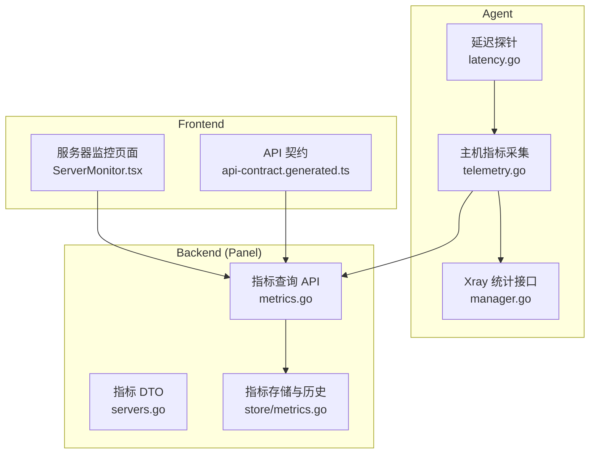
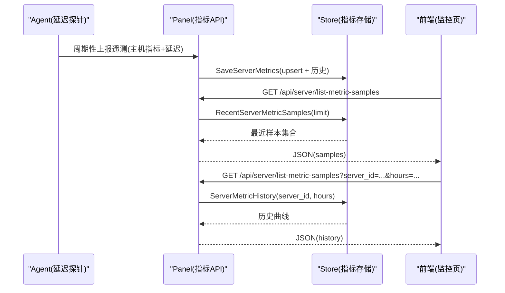
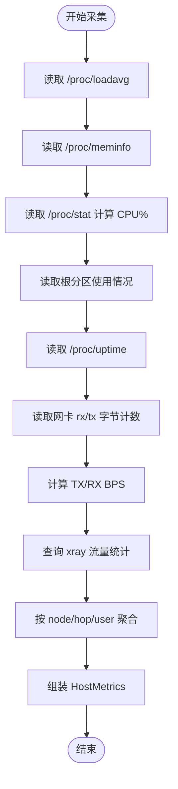
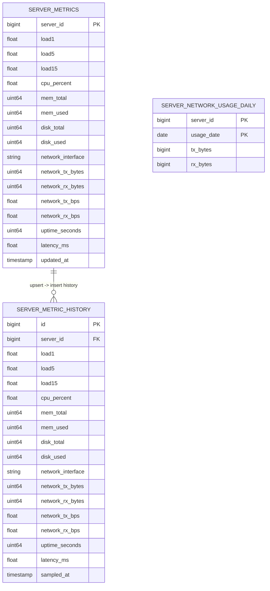
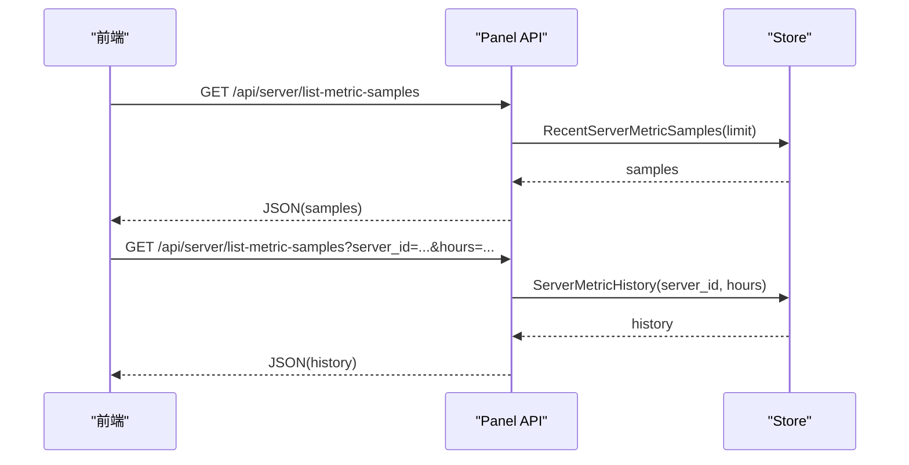
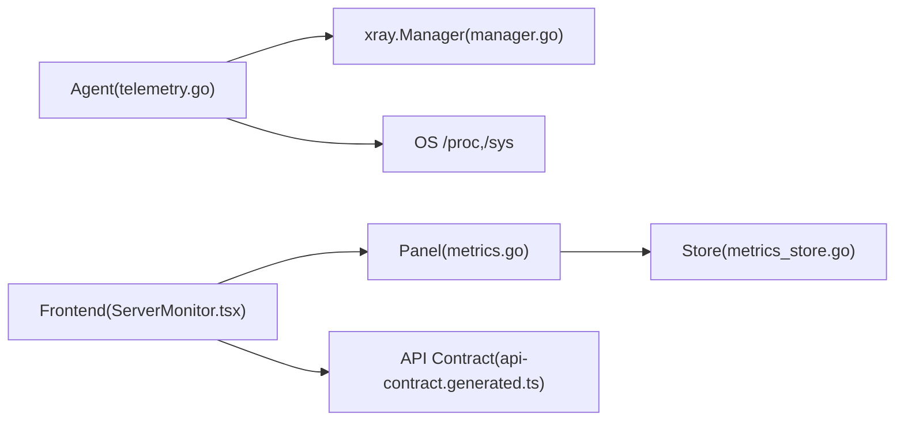

# 性能测试

<cite>
**本文引用的文件**   
- [latency.go](file://src/agent/cmd/agent/latency.go)
- [latency_test.go](file://src/agent/cmd/agent/latency_test.go)
- [telemetry.go](file://src/agent/cmd/agent/telemetry.go)
- [telemetry_test.go](file://src/agent/cmd/agent/telemetry_test.go)
- [metrics.go](file://src/backend/internal/panel/metrics.go)
- [servers.go](file://src/backend/internal/panel/servers.go)
- [metrics_store.go](file://src/backend/internal/store/metrics.go)
- [ServerMonitor.tsx](file://src/frontend/src/components/ServerMonitor.tsx)
- [api-contract.generated.ts](file://src/frontend/src/lib/api-contract.generated.ts)
- [manager.go](file://src/agent/internal/xray/manager.go)
- [agent_settings.go](file://src/shared/agent_settings.go)
</cite>

## 目录
1. [简介](#简介)
2. [项目结构](#项目结构)
3. [核心组件](#核心组件)
4. [架构总览](#架构总览)
5. [详细组件分析](#详细组件分析)
6. [依赖关系分析](#依赖关系分析)
7. [性能考量](#性能考量)
8. [故障排查指南](#故障排查指南)
9. [结论](#结论)
10. [附录](#附录)

## 简介
本文件面向 Lattix-codex 项目的性能测试与监控，覆盖负载测试、压力测试、基准测试的方法与工具选择；阐述延迟测量原理与使用方式（网络延迟、API 响应时间、数据库查询性能）；说明系统资源指标采集与展示（CPU、内存、磁盘、网络吞吐、时延等）；提供执行流程、结果分析方法、基线建立与回归自动化建议；并给出连接池、缓存策略、数据库查询优化等实践建议。

## 项目结构
本项目由 Agent、Backend（Panel）、Frontend 三部分组成：
- Agent：负责主机指标采集、网络延迟探针、遥测上报。
- Backend：接收遥测数据，持久化历史样本，暴露指标查询 API。
- Frontend：可视化展示实时与历史指标，支持趋势图与详情面板。



**图表来源** 
- [latency.go:1-114](file://src/agent/cmd/agent/latency.go#L1-L114)
- [telemetry.go:1-326](file://src/agent/cmd/agent/telemetry.go#L1-L326)
- [manager.go:369-415](file://src/agent/internal/xray/manager.go#L369-L415)
- [metrics.go:1-105](file://src/backend/internal/panel/metrics.go#L1-L105)
- [servers.go:1-37](file://src/backend/internal/panel/servers.go#L1-L37)
- [metrics_store.go:1-276](file://src/backend/internal/store/metrics.go#L1-L276)
- [ServerMonitor.tsx:396-710](file://src/frontend/src/components/ServerMonitor.tsx#L396-L710)
- [api-contract.generated.ts:76-87](file://src/frontend/src/lib/api-contract.generated.ts#L76-L87)

**章节来源**
- [latency.go:1-114](file://src/agent/cmd/agent/latency.go#L1-L114)
- [telemetry.go:1-326](file://src/agent/cmd/agent/telemetry.go#L1-L326)
- [metrics.go:1-105](file://src/backend/internal/panel/metrics.go#L1-L105)
- [metrics_store.go:1-276](file://src/backend/internal/store/metrics.go#L1-L276)
- [ServerMonitor.tsx:396-710](file://src/frontend/src/components/ServerMonitor.tsx#L396-L710)
- [api-contract.generated.ts:76-87](file://src/frontend/src/lib/api-contract.generated.ts#L76-L87)

## 核心组件
- 延迟探针（Agent）：通过 WebSocket Ping/Pong 控制帧发送序列号，计算往返时延，维护最近样本中位数。
- 主机指标采集（Agent）：从 /proc 读取负载、内存、CPU、磁盘、网络计数器，计算瞬时速率，聚合 xray 流量统计。
- 指标存储与查询（Backend）：原子 upsert 最新值并插入历史样本，提供最近样本与历史曲线查询，清理过期数据。
- 前端展示（Frontend）：拉取最近样本与历史曲线，渲染 CPU、内存、磁盘、网络、延迟趋势图。

**章节来源**
- [latency.go:18-106](file://src/agent/cmd/agent/latency.go#L18-L106)
- [telemetry.go:103-184](file://src/agent/cmd/agent/telemetry.go#L103-L184)
- [metrics_store.go:47-107](file://src/backend/internal/store/metrics.go#L47-L107)
- [metrics.go:34-99](file://src/backend/internal/panel/metrics.go#L34-L99)
- [ServerMonitor.tsx:396-710](file://src/frontend/src/components/ServerMonitor.tsx#L396-L710)

## 架构总览
下图展示了从 Agent 到 Panel 再到前端的完整指标流，以及延迟探针的交互时序。



**图表来源** 
- [telemetry.go:35-45](file://src/agent/cmd/agent/telemetry.go#L35-L45)
- [metrics_store.go:47-107](file://src/backend/internal/store/metrics.go#L47-L107)
- [metrics.go:34-99](file://src/backend/internal/panel/metrics.go#L34-L99)
- [ServerMonitor.tsx:698-710](file://src/frontend/src/components/ServerMonitor.tsx#L698-L710)

## 详细组件分析

### 延迟测量（网络延迟）
- 实现要点
  - 使用 WebSocket 控制帧 Ping/Pong，携带 probeKindLatency 与序列号。
  - 记录发送时间，收到 Pong 后计算毫秒级时延，保留最近 3 个样本。
  - 首次有效 Pong 初始化 ready 通道，medianMS 返回中位数。
- 使用方法
  - 在 Agent 启动时创建 latencyTracker，周期发送探针。
  - telemetry 层注入 latency() 回调，将延迟值写入 HostMetrics.LatencyMS。
- 测试覆盖
  - 验证中位数计算、Pong 初始化、暂停与恢复行为。

```mermaid
classDiagram
class LatencyTracker {
+sendProbe(conn) error
+handlePong(payload) error
+medianMS() *float64
+setEnabled(enabled bool) void
-pending map[uint64]time.Time
-samples []float64
-next uint64
-ready chan struct{}
-once sync.Once
-enabled bool
}
```

**图表来源** 
- [latency.go:18-106](file://src/agent/cmd/agent/latency.go#L18-L106)

**章节来源**
- [latency.go:1-114](file://src/agent/cmd/agent/latency.go#L1-L114)
- [latency_test.go:1-60](file://src/agent/cmd/agent/latency_test.go#L1-L60)
- [telemetry.go:151-153](file://src/agent/cmd/agent/telemetry.go#L151-L153)

### 主机指标采集（CPU、内存、磁盘、网络、负载）
- 实现要点
  - 从 /proc/loadavg、/proc/meminfo、/proc/stat、/proc/uptime 读取系统指标。
  - 计算 CPU 使用率（两次采样差值），网络速率基于 /sys/class/net/*/statistics 累计值差分。
  - 聚合 xray 流量计数器，按节点、跳数、用户维度汇总。
- 输出字段
  - Load1/5/15、CPUPercent、MemTotal/MemUsed、DiskTotal/DiskUsed、NetworkInterface/TX/RX/BPS、UptimeSeconds、LatencyMS。



**图表来源** 
- [telemetry.go:103-184](file://src/agent/cmd/agent/telemetry.go#L103-L184)
- [telemetry.go:284-320](file://src/agent/cmd/agent/telemetry.go#L284-L320)
- [manager.go:399-402](file://src/agent/internal/xray/manager.go#L399-L402)

**章节来源**
- [telemetry.go:103-184](file://src/agent/cmd/agent/telemetry.go#L103-L184)
- [telemetry_test.go:1-31](file://src/agent/cmd/agent/telemetry_test.go#L1-L31)
- [manager.go:399-402](file://src/agent/internal/xray/manager.go#L399-L402)

### 指标存储与查询（后端）
- 存储模型
  - server_metrics：最新值 upsert。
  - server_metric_history：历史样本按 sampled_at 记录。
  - server_network_usage_daily：按日累计网络用量。
- 查询接口
  - list-metric-samples：返回每台服务器最近 limit 个样本。
  - list-metric-samples?server_id=...&hours=...：返回指定服务器最近 hours 小时的历史。
- 数据清理
  - 定期删除超过 retention（默认 24h）的历史样本。



**图表来源** 
- [metrics_store.go:12-31](file://src/backend/internal/store/metrics.go#L12-L31)
- [metrics_store.go:47-107](file://src/backend/internal/store/metrics.go#L47-L107)
- [metrics_store.go:141-200](file://src/backend/internal/store/metrics.go#L141-L200)

**章节来源**
- [metrics_store.go:47-107](file://src/backend/internal/store/metrics.go#L47-L107)
- [metrics.go:34-99](file://src/backend/internal/panel/metrics.go#L34-L99)

### 前端展示（监控与趋势）
- 功能点
  - 拉取最近样本与历史曲线，渲染 CPU、内存、磁盘、网络、延迟趋势。
  - 打开详情面板定时刷新历史数据（默认每分钟）。
- 关键调用
  - api.serverMetricHistory(server.id) 获取历史。
  - list-metric-samples 获取多机最近样本。



**图表来源** 
- [ServerMonitor.tsx:698-710](file://src/frontend/src/components/ServerMonitor.tsx#L698-L710)
- [metrics.go:34-99](file://src/backend/internal/panel/metrics.go#L34-L99)
- [api-contract.generated.ts:76-87](file://src/frontend/src/lib/api-contract.generated.ts#L76-L87)

**章节来源**
- [ServerMonitor.tsx:396-710](file://src/frontend/src/components/ServerMonitor.tsx#L396-L710)
- [api-contract.generated.ts:76-87](file://src/frontend/src/lib/api-contract.generated.ts#L76-L87)

## 依赖关系分析
- Agent 依赖
  - xray.Manager.QueryStats：获取流量统计。
  - OS 文件系统：/proc、/sys 读取系统指标。
- Backend 依赖
  - store.Store：读写指标与历史数据。
  - HTTP 路由：暴露 metrics 查询接口。
- Frontend 依赖
  - 生成的 API 类型定义，确保前后端契约一致。



**图表来源** 
- [telemetry.go:1-326](file://src/agent/cmd/agent/telemetry.go#L1-L326)
- [manager.go:399-402](file://src/agent/internal/xray/manager.go#L399-L402)
- [metrics.go:1-105](file://src/backend/internal/panel/metrics.go#L1-L105)
- [metrics_store.go:1-276](file://src/backend/internal/store/metrics.go#L1-L276)
- [ServerMonitor.tsx:396-710](file://src/frontend/src/components/ServerMonitor.tsx#L396-L710)
- [api-contract.generated.ts:76-87](file://src/frontend/src/lib/api-contract.generated.ts#L76-L87)

**章节来源**
- [telemetry.go:1-326](file://src/agent/cmd/agent/telemetry.go#L1-L326)
- [metrics.go:1-105](file://src/backend/internal/panel/metrics.go#L1-L105)
- [metrics_store.go:1-276](file://src/backend/internal/store/metrics.go#L1-L276)
- [ServerMonitor.tsx:396-710](file://src/frontend/src/components/ServerMonitor.tsx#L396-L710)
- [api-contract.generated.ts:76-87](file://src/frontend/src/lib/api-contract.generated.ts#L76-L87)

## 性能考量
- 延迟测量
  - 使用 WS Ping/Pong 控制帧，开销极低；样本窗口限制为 3，避免内存增长。
  - 中位数对异常值鲁棒，适合快速评估链路质量。
- 指标采集频率
  - Agent 侧 telemetry 间隔可通过 AgentSettings.telemetry.interval_seconds 配置（默认 60s，范围 10-3600）。
  - 高频采集会增加 /proc 与 xray 查询开销，需权衡精度与成本。
- 存储与查询
  - 使用 upsert 保证最新值一致性；历史表按 sampled_at 索引，查询高效。
  - 定期清理历史数据（默认 24h），防止表膨胀。
- 前端刷新
  - 详情面板每分钟刷新一次，避免频繁请求造成后端压力。
- 网络与 CPU
  - 网络速率基于累计值差分，避免重复解析；CPU 使用率采用两次采样差值计算，首帧为 0。

**章节来源**
- [agent_settings.go:1-111](file://src/shared/agent_settings.go#L1-L111)
- [telemetry.go:103-184](file://src/agent/cmd/agent/telemetry.go#L103-L184)
- [metrics_store.go:192-200](file://src/backend/internal/store/metrics.go#L192-L200)
- [ServerMonitor.tsx:707-712](file://src/frontend/src/components/ServerMonitor.tsx#L707-L712)

## 故障排查指南
- 延迟探针无数据
  - 检查 Agent 是否启用 latencyTracker；确认 WS 连接正常；查看 handlePong 是否匹配 probeKindLatency。
- 主机指标缺失或异常
  - 确认 /proc 与 /sys 路径可读；检查网卡名称过滤逻辑；核对 CPU 采样间隔是否足够。
- 历史数据不更新
  - 检查 SaveServerMetrics 事务是否提交；确认 cleaned 任务是否运行；验证查询参数 limit/hours 是否合法。
- 前端无法显示趋势
  - 确认 API 契约与服务端返回字段一致；检查错误处理与空数据处理。

**章节来源**
- [latency.go:64-85](file://src/agent/cmd/agent/latency.go#L64-L85)
- [telemetry.go:157-184](file://src/agent/cmd/agent/telemetry.go#L157-L184)
- [metrics_store.go:47-107](file://src/backend/internal/store/metrics.go#L47-L107)
- [metrics.go:34-99](file://src/backend/internal/panel/metrics.go#L34-L99)

## 结论
Lattix-codex 已具备完善的性能观测基础：Agent 侧低开销延迟探针与主机指标采集，Backend 侧高效存储与查询，Frontend 侧直观展示。结合合理的采集频率、数据清理与前端刷新策略，可在生产环境稳定运行。建议在 CI/CD 中集成回归测试与告警，持续保障性能基线与稳定性。

## 附录
- 性能测试方法与工具建议
  - 负载测试：使用 wrk、vegeta、k6 对 /api/server/list-metric-samples 与 /api/server/list-metric-samples?server_id=...&hours=... 进行并发压测，观察 QPS、延迟分布与错误率。
  - 压力测试：逐步提升并发与采样频率，观察 CPU、内存、磁盘 I/O、网络带宽与数据库锁竞争情况。
  - 基准测试：针对 SaveServerMetrics 与查询接口编写 go test 基准用例，对比不同 limit/hours 下的耗时与内存分配。
- 延迟测量实践
  - 网络延迟：利用现有 WS Ping/Pong 探针，统计中位数与 P95/P99（可扩展样本窗口与分位计算）。
  - API 响应时间：在后端中间件埋点记录请求耗时，导出至日志或指标系统。
  - 数据库查询性能：对 RecentServerMetricSamples 与 ServerMetricHistory 添加慢查询日志与 EXPLAIN 分析。
- 监控指标收集与展示
  - 系统资源：CPU、内存、磁盘、网络、负载、时延已在 HostMetrics 中体现，前端可直接展示。
  - 扩展指标：可引入进程级指标（goroutine、GC、连接池）与业务指标（命令下发成功率、重试次数）。
- 执行流程与结果分析
  - 场景设计：单节点直连、多跳转发、高并发订阅、长连接稳定性。
  - 数据准备：构造不同规模的数据集（服务器数量、历史样本量、流量基数）。
  - 基线建立：在稳定环境下运行基准测试，记录 P50/P95/P99、QPS、错误率、资源使用率。
  - 回归检测：CI 中自动执行基准与负载用例，阈值告警（如 P95 延迟上升 > 20%、错误率 > 1%）。
- 优化建议
  - 连接池调优：根据并发与延迟目标调整 HTTP/WS 连接池大小与超时。
  - 缓存策略：对热点查询（如最近样本）增加短期缓存，降低数据库压力。
  - 数据库查询优化：为 sampled_at、server_id 建立合适索引；分页与限流保护查询接口。
  - 采集频率与窗口：在高负载场景适当降低采集频率或缩短样本窗口，平衡精度与开销。