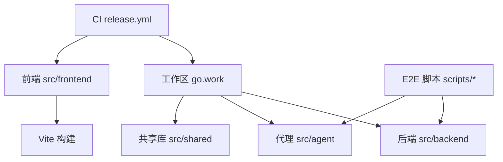
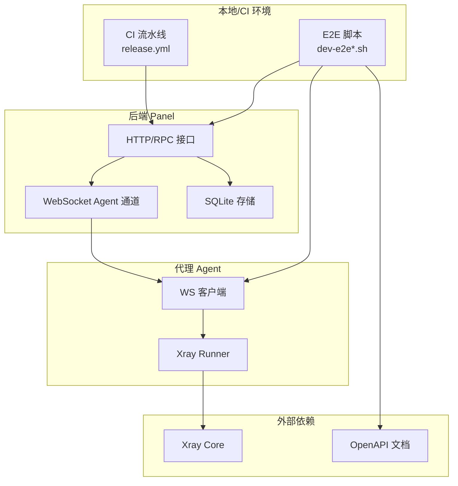
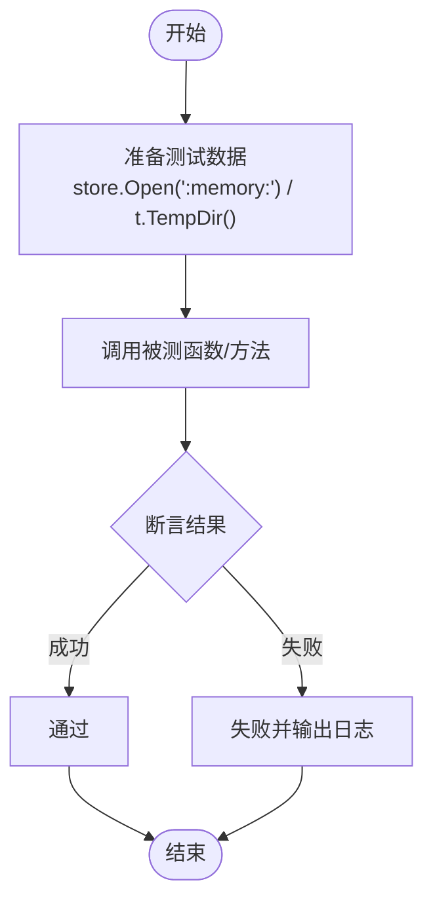
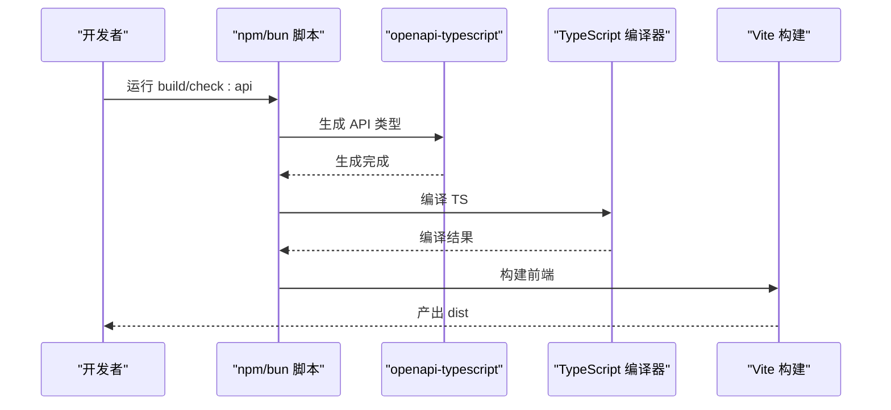
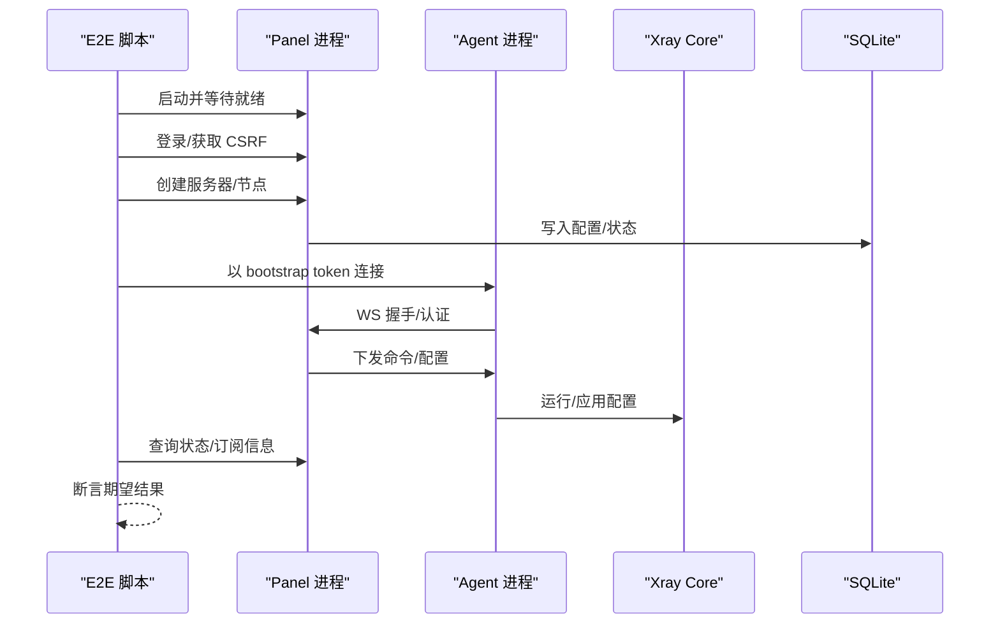
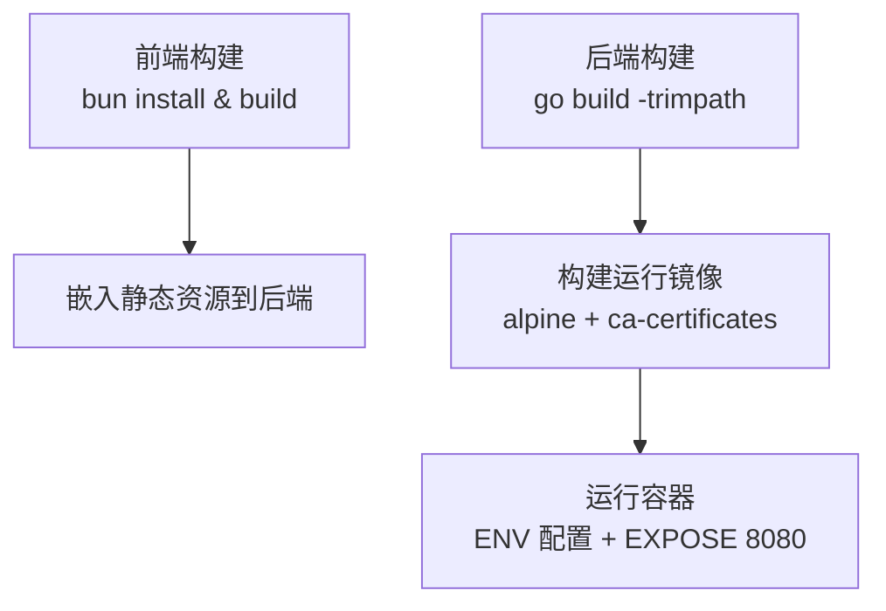
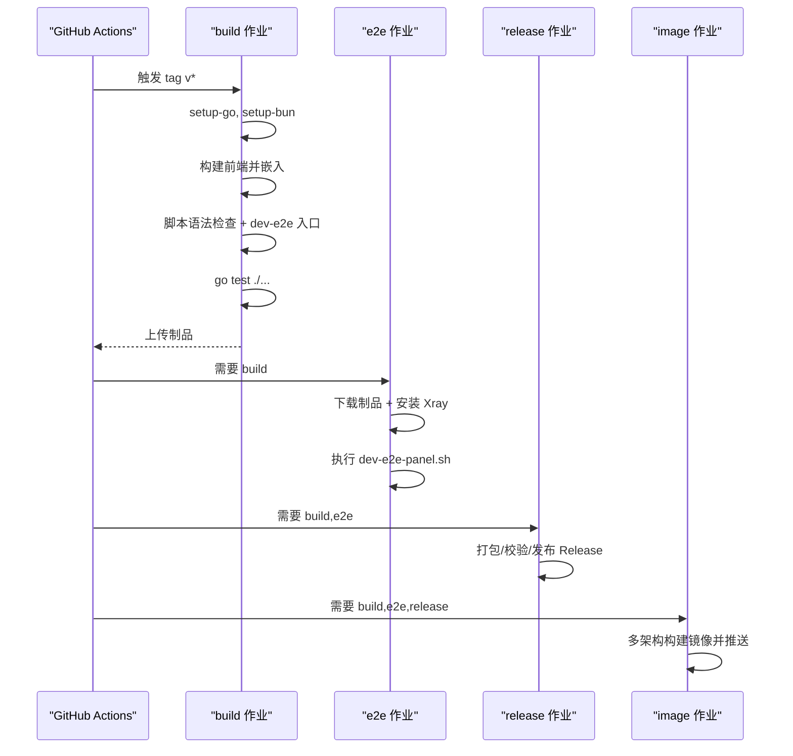
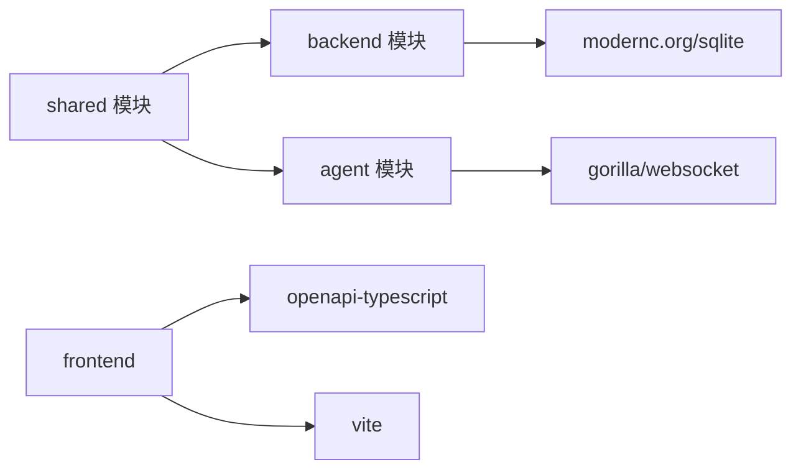

# 测试工具和环境

<cite>
**本文引用的文件**   
- [Dockerfile](file://Dockerfile)
- [go.work](file://go.work)
- [src/backend/go.mod](file://src/backend/go.mod)
- [src/agent/go.mod](file://src/agent/go.mod)
- [src/frontend/package.json](file://src/frontend/package.json)
- [.github/workflows/release.yml](file://.github/workflows/release.yml)
- [scripts/dev-e2e.sh](file://scripts/dev-e2e.sh)
- [scripts/dev-e2e-panel.sh](file://scripts/dev-e2e-panel.sh)
- [scripts/dev-e2e-install-agent.sh](file://scripts/dev-e2e-install-agent.sh)
- [scripts/dev-e2e-vlessenc.sh](file://scripts/dev-e2e-vlessenc.sh)
- [scripts/dev-e2e-settings.sh](file://scripts/dev-e2e-settings.sh)
- [scripts/dev-e2e-install-panel.sh](file://scripts/dev-e2e-install-panel.sh)
- [src/backend/internal/panel/servers_install_test.go](file://src/backend/internal/panel/servers_install_test.go)
- [src/backend/internal/panel/auth_test.go](file://src/backend/internal/panel/auth_test.go)
- [src/backend/internal/panel/exchange_test.go](file://src/backend/internal/panel/exchange_test.go)
- [src/backend/internal/panel/contract_test.go](file://src/backend/internal/panel/contract_test.go)
- [src/backend/internal/dispatch/chain_test.go](file://src/backend/internal/dispatch/chain_test.go)
- [src/backend/cmd/backend/main_test.go](file://src/backend/cmd/backend/main_test.go)
- [src/agent/cmd/agent/telemetry_test.go](file://src/agent/cmd/agent/telemetry_test.go)
</cite>

## 目录
1. [简介](#简介)
2. [项目结构](#项目结构)
3. [核心组件](#核心组件)
4. [架构总览](#架构总览)
5. [详细组件分析](#详细组件分析)
6. [依赖分析](#依赖分析)
7. [性能考虑](#性能考虑)
8. [故障排查指南](#故障排查指南)
9. [结论](#结论)
10. [附录](#附录)

## 简介
本文件面向 Lattix-codex 项目的测试工具与环境配置，覆盖以下方面：
- 测试框架与工具选择：Go 原生测试、前端构建与类型契约校验、端到端（E2E）脚本。
- 环境搭建步骤：开发环境准备、测试数据库初始化、模拟服务启动。
- Docker 容器化测试：镜像构建、环境变量、运行方式。
- 测试数据管理：安装脚本与 E2E 用例中的种子数据、Mock 思路与临时目录隔离。
- 持续集成（CI/CD）：GitHub Actions 流水线、并行测试、产物与报告。
- 常见问题排查：端口冲突、依赖缺失、环境问题等。

## 项目结构
仓库采用多模块 Go 工作区与前端独立工程组织：
- Go 工作区根 go.work 聚合 agent、backend、shared 三个模块，便于统一构建与测试。
- 前端使用 Vite + TypeScript，通过 OpenAPI 生成类型并参与构建检查。
- E2E 脚本位于 scripts 目录，按功能拆分，便于按需执行。
- CI 定义在 .github/workflows/release.yml，包含构建、测试、打包、发布与镜像构建。

图表来源
- [go.work:1-10](file://go.work#L1-L10)
- [src/frontend/package.json:1-53](file://src/frontend/package.json#L1-L53)
- [.github/workflows/release.yml:1-216](file://.github/workflows/release.yml#L1-L216)

章节来源
- [go.work:1-10](file://go.work#L1-L10)
- [src/frontend/package.json:1-53](file://src/frontend/package.json#L1-L53)

## 核心组件
- Go 测试框架：标准 testing 包，配合内存 SQLite 与临时目录进行隔离。
- 前端测试：无专用测试框架，通过构建阶段校验 API 类型一致性（openapi-typescript）。
- E2E 测试：Bash 脚本驱动 Panel、Agent、Xray 的端到端验证，覆盖认证、命令下发、链路状态、TLS、设置页等场景。
- 容器化测试：Dockerfile 构建多阶段镜像，前端静态资源嵌入后端，提供可运行的面板镜像。

章节来源
- [src/backend/internal/panel/auth_test.go:14-30](file://src/backend/internal/panel/auth_test.go#L14-L30)
- [src/backend/internal/dispatch/chain_test.go:1-149](file://src/backend/internal/dispatch/chain_test.go#L1-L149)
- [src/frontend/package.json:1-53](file://src/frontend/package.json#L1-L53)
- [scripts/dev-e2e.sh:1-91](file://scripts/dev-e2e.sh#L1-L91)
- [Dockerfile:1-44](file://Dockerfile#L1-L44)

## 架构总览
下图展示本地与 CI 环境下，Panel、Agent、Xray 与测试脚本的交互关系。

图表来源
- [scripts/dev-e2e-panel.sh:1-134](file://scripts/dev-e2e-panel.sh#L1-L134)
- [scripts/dev-e2e.sh:1-91](file://scripts/dev-e2e.sh#L1-L91)
- [src/backend/internal/dispatch/chain_test.go:1-149](file://src/backend/internal/dispatch/chain_test.go#L1-L149)

## 详细组件分析

### Go 单元测试与集成测试
- 使用标准 testing 包，结合 store.Open(":memory:") 或 t.TempDir() 创建隔离存储。
- 常见模式：构造 Server/Store，注入依赖，调用业务方法，断言结果与错误码。
- 典型用例：
  - 安装命令生成逻辑校验（是否使用统一入口、dev 版本不固定 xray 版本）。
  - 认证失败路径与回退策略（设置不可用时不应静默降级）。
  - 汇率换算与公开交叉汇率使用。
  - OpenAPI 路由与注册 RPC 的一致性校验。
  - 分发器链式编排与 ack 回执推进状态机。

图表来源
- [src/backend/internal/panel/servers_install_test.go:1-32](file://src/backend/internal/panel/servers_install_test.go#L1-L32)
- [src/backend/internal/panel/auth_test.go:14-30](file://src/backend/internal/panel/auth_test.go#L14-L30)
- [src/backend/internal/panel/exchange_test.go:1-46](file://src/backend/internal/panel/exchange_test.go#L1-L46)
- [src/backend/internal/panel/contract_test.go:1-100](file://src/backend/internal/panel/contract_test.go#L1-L100)
- [src/backend/internal/dispatch/chain_test.go:1-149](file://src/backend/internal/dispatch/chain_test.go#L1-L149)

章节来源
- [src/backend/internal/panel/servers_install_test.go:1-32](file://src/backend/internal/panel/servers_install_test.go#L1-L32)
- [src/backend/internal/panel/auth_test.go:14-30](file://src/backend/internal/panel/auth_test.go#L14-L30)
- [src/backend/internal/panel/exchange_test.go:1-46](file://src/backend/internal/panel/exchange_test.go#L1-L46)
- [src/backend/internal/panel/contract_test.go:1-100](file://src/backend/internal/panel/contract_test.go#L1-L100)
- [src/backend/internal/dispatch/chain_test.go:1-149](file://src/backend/internal/dispatch/chain_test.go#L1-L149)

### 前端构建与类型契约校验
- 使用 openapi-typescript 从 docs/openapi.yaml 生成类型，并在构建时进行 --check 校验，确保前后端契约一致。
- 构建流程：生成类型 → TypeScript 编译 → Vite 构建。

图表来源
- [src/frontend/package.json:1-53](file://src/frontend/package.json#L1-L53)
- [Dockerfile:1-44](file://Dockerfile#L1-L44)

章节来源
- [src/frontend/package.json:1-53](file://src/frontend/package.json#L1-L53)

### 端到端（E2E）测试套件
- dev-e2e.sh：控制通道验收，验证 bootstrap 换发长期凭证、离线命令滞留与重连补发、命令状态回写。
- dev-e2e-panel.sh：Panel RPC + 当前 Agent 协议 smoke 测试，覆盖认证、幂等键、节点创建与状态推进。
- dev-e2e-install-agent.sh：安装流程与校验和篡改检测。
- dev-e2e-vlessenc.sh：VLESS Encryption + vision 组合的数据通路验证与订阅字段校验。
- dev-e2e-settings.sh：设置页场景（public-url、时区、管理员改密、TLS path 模式、证书热加载）。
- dev-e2e-install-panel.sh：面板安装流程与静态资源注入。

图表来源
- [scripts/dev-e2e.sh:1-91](file://scripts/dev-e2e.sh#L1-L91)
- [scripts/dev-e2e-panel.sh:1-134](file://scripts/dev-e2e-panel.sh#L1-L134)
- [scripts/dev-e2e-install-agent.sh:89-114](file://scripts/dev-e2e-install-agent.sh#L89-L114)
- [scripts/dev-e2e-vlessenc.sh:1-141](file://scripts/dev-e2e-vlessenc.sh#L1-L141)
- [scripts/dev-e2e-settings.sh:1-24](file://scripts/dev-e2e-settings.sh#L1-L24)
- [scripts/dev-e2e-install-panel.sh:31-58](file://scripts/dev-e2e-install-panel.sh#L31-L58)

章节来源
- [scripts/dev-e2e.sh:1-91](file://scripts/dev-e2e.sh#L1-L91)
- [scripts/dev-e2e-panel.sh:1-134](file://scripts/dev-e2e-panel.sh#L1-L134)
- [scripts/dev-e2e-install-agent.sh:89-114](file://scripts/dev-e2e-install-agent.sh#L89-L114)
- [scripts/dev-e2e-vlessenc.sh:1-141](file://scripts/dev-e2e-vlessenc.sh#L1-L141)
- [scripts/dev-e2e-settings.sh:1-24](file://scripts/dev-e2e-settings.sh#L1-L24)
- [scripts/dev-e2e-install-panel.sh:31-58](file://scripts/dev-e2e-install-panel.sh#L31-L58)

### Docker 容器化测试环境
- 多阶段构建：前端使用 bun 构建静态资源；后端使用 golang 编译二进制；最终镜像基于 alpine 运行。
- 环境变量：LATTIX_DEPLOY_MODE=docker、LATTIX_DB=/data/lattix.db、LATTIX_TLS_DIR=/data/certs、LATTIX_ACME_CACHE=/data/acme-cache。
- 暴露端口：8080，ENTRYPOINT 为后端二进制，CMD 默认监听 :8080。

图表来源
- [Dockerfile:1-44](file://Dockerfile#L1-L44)

章节来源
- [Dockerfile:1-44](file://Dockerfile#L1-L44)

### 持续集成（CI/CD）测试配置
- 构建任务：设置 Go/Bun 环境，构建前端嵌入后端，执行脚本语法检查与 E2E 入口，运行 Go 测试。
- E2E 任务：下载构建产物，安装 Xray-core，执行当前协议 e2e 测试。
- 发布任务：打包 panel/agent 二进制与 tar.gz 包，生成 checksums，上传制品。
- 镜像任务：多架构构建并推送 ghcr.io，缓存加速。

图表来源
- [.github/workflows/release.yml:1-216](file://.github/workflows/release.yml#L1-L216)

章节来源
- [.github/workflows/release.yml:1-216](file://.github/workflows/release.yml#L1-L216)

## 依赖分析
- Go 模块：
  - backend 依赖 modernc.org/sqlite（纯 Go 实现），便于在测试中使用内存数据库。
  - agent 依赖 gorilla/websocket、grpc 等，用于与 Panel 通信及遥测上报。
  - shared 被 backend 与 agent 共同引用，保证数据结构一致。
- 前端依赖：
  - openapi-typescript 用于类型生成与契约校验。
  - Vite 作为构建工具。

图表来源
- [src/backend/go.mod:1-33](file://src/backend/go.mod#L1-L33)
- [src/agent/go.mod:1-59](file://src/agent/go.mod#L1-L59)
- [src/frontend/package.json:1-53](file://src/frontend/package.json#L1-L53)

章节来源
- [src/backend/go.mod:1-33](file://src/backend/go.mod#L1-L33)
- [src/agent/go.mod:1-59](file://src/agent/go.mod#L1-L59)
- [src/frontend/package.json:1-53](file://src/frontend/package.json#L1-L53)

## 性能考虑
- 使用内存 SQLite（:memory:）与 t.TempDir() 提升测试隔离性与速度。
- 前端构建阶段进行类型检查，避免运行时契约不一致导致的调试成本。
- E2E 脚本尽量最小化外部依赖，必要时通过 XRAY_BIN 指定本地二进制，减少网络开销。
- CI 中启用 Docker 缓存与 Go 依赖缓存，缩短构建时间。

## 故障排查指南
- 端口冲突：
  - 现象：Panel/Agent/Xray 启动失败或无法访问。
  - 处理：确认各脚本使用的端口（如 18096、18099、18100、18109、14201、14202 等），修改或释放占用端口。
- 依赖缺失：
  - 现象：E2E 脚本报错找不到 python3、curl、openssl、xray 等。
  - 处理：安装必要工具，或通过环境变量覆盖二进制路径（如 XRAY_BIN）。
- 环境问题：
  - 现象：权限不足、证书目录不可写、SQLite 文件无法创建。
  - 处理：确保运行用户具备读写权限，使用临时目录或正确挂载卷。
- 依赖问题：
  - 现象：Go 模块替换或版本冲突。
  - 处理：检查 go.work 与模块 go.mod 中的 replace 指向，清理缓存后重试。
- 前端类型不一致：
  - 现象：构建阶段 openapi-typescript 校验失败。
  - 处理：更新 docs/openapi.yaml 并重新生成类型，确保契约一致。

章节来源
- [scripts/dev-e2e-panel.sh:1-134](file://scripts/dev-e2e-panel.sh#L1-L134)
- [scripts/dev-e2e.sh:1-91](file://scripts/dev-e2e.sh#L1-L91)
- [scripts/dev-e2e-vlessenc.sh:1-141](file://scripts/dev-e2e-vlessenc.sh#L1-L141)
- [scripts/dev-e2e-settings.sh:1-24](file://scripts/dev-e2e-settings.sh#L1-L24)
- [src/frontend/package.json:1-53](file://src/frontend/package.json#L1-L53)

## 结论
本项目采用 Go 原生测试、前端类型契约校验与丰富的 Bash E2E 脚本，形成从单元到端到端的完整测试体系。通过 go.work 统一管理多模块，借助 Docker 与 GitHub Actions 实现可重复的构建与发布流程。建议在本地与 CI 中优先运行 E2E 关键路径用例，并结合内存数据库与临时目录保障测试稳定性与隔离性。

## 附录
- 常用命令参考（根据脚本与 package.json 脚本归纳）：
  - 前端构建与类型检查：参见 [src/frontend/package.json:1-53](file://src/frontend/package.json#L1-L53)
  - 运行 E2E 控制通道：参见 [scripts/dev-e2e.sh:1-91](file://scripts/dev-e2e.sh#L1-L91)
  - 运行 E2E Panel 协议：参见 [scripts/dev-e2e-panel.sh:1-134](file://scripts/dev-e2e-panel.sh#L1-L134)
  - 运行 E2E 安装 Agent：参见 [scripts/dev-e2e-install-agent.sh:89-114](file://scripts/dev-e2e-install-agent.sh#L89-L114)
  - 运行 E2E VLESS Encryption：参见 [scripts/dev-e2e-vlessenc.sh:1-141](file://scripts/dev-e2e-vlessenc.sh#L1-L141)
  - 运行 E2E 设置页：参见 [scripts/dev-e2e-settings.sh:1-24](file://scripts/dev-e2e-settings.sh#L1-L24)
  - 运行 E2E 安装 Panel：参见 [scripts/dev-e2e-install-panel.sh:31-58](file://scripts/dev-e2e-install-panel.sh#L31-L58)
  - 构建与运行容器镜像：参见 [Dockerfile:1-44](file://Dockerfile#L1-L44)
  - 运行 Go 测试：参见 [.github/workflows/release.yml:35-40](file://.github/workflows/release.yml#L35-L40)