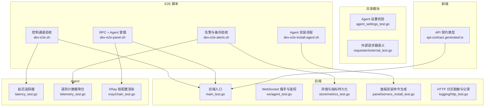
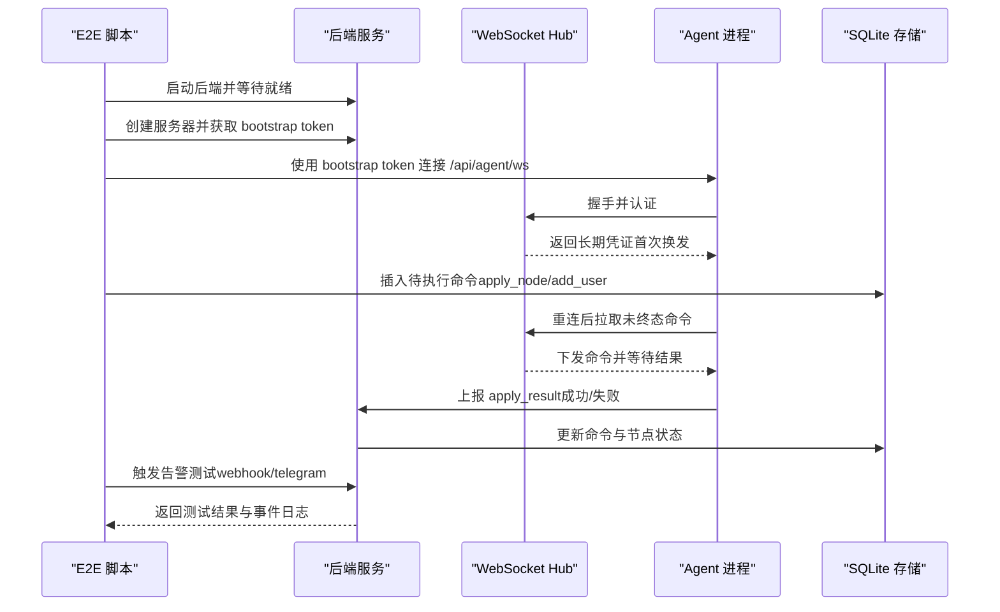
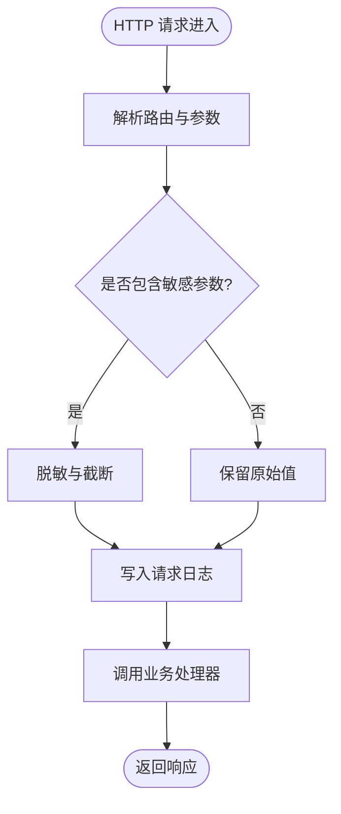
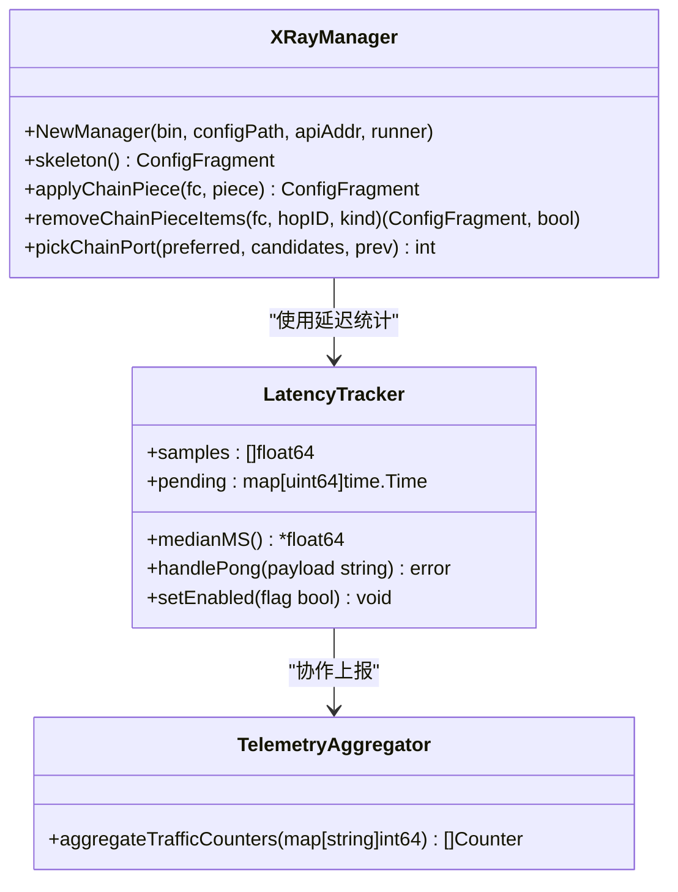
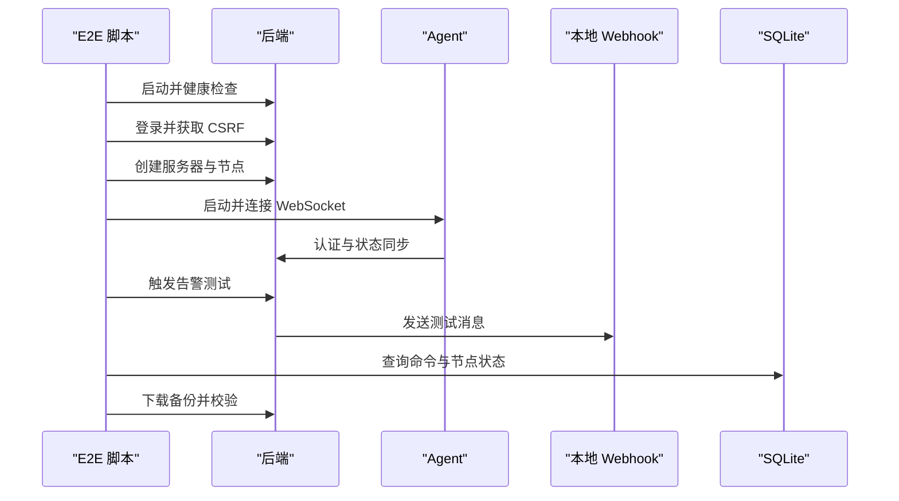
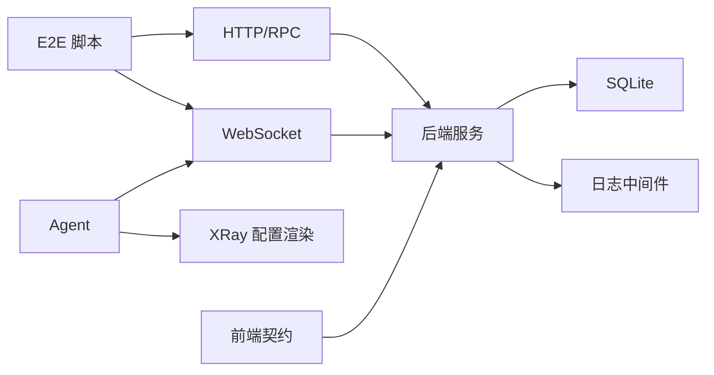

# 测试策略

<cite>
**本文引用的文件**   
- [scripts/dev-e2e.sh](file://scripts/dev-e2e.sh)
- [scripts/dev-e2e-panel.sh](file://scripts/dev-e2e-panel.sh)
- [scripts/dev-e2e-alerts.sh](file://scripts/dev-e2e-alerts.sh)
- [scripts/dev-e2e-install-agent.sh](file://scripts/dev-e2e-install-agent.sh)
- [src/backend/cmd/backend/main_test.go](file://src/backend/cmd/backend/main_test.go)
- [src/backend/internal/ws/agent_test.go](file://src/backend/internal/ws/agent_test.go)
- [src/backend/internal/store/metrics_test.go](file://src/backend/internal/store/metrics_test.go)
- [src/backend/internal/panel/servers_install_test.go](file://src/backend/internal/panel/servers_install_test.go)
- [src/backend/internal/logging/http_test.go](file://src/backend/internal/logging/http_test.go)
- [src/agent/cmd/agent/latency_test.go](file://src/agent/cmd/agent/latency_test.go)
- [src/agent/cmd/agent/telemetry_test.go](file://src/agent/cmd/agent/telemetry_test.go)
- [src/agent/internal/xray/chain_test.go](file://src/agent/internal/xray/chain_test.go)
- [src/shared/agent_settings_test.go](file://src/shared/agent_settings_test.go)
- [src/shared/requester/external_test.go](file://src/shared/requester/external_test.go)
- [src/frontend/src/lib/api-contract.generated.ts](file://src/frontend/src/lib/api-contract.generated.ts)
</cite>

## 目录
1. [简介](#简介)
2. [项目结构](#项目结构)
3. [核心组件](#核心组件)
4. [架构总览](#架构总览)
5. [详细组件分析](#详细组件分析)
6. [依赖关系分析](#依赖关系分析)
7. [性能考虑](#性能考虑)
8. [故障排查指南](#故障排查指南)
9. [结论](#结论)
10. [附录](#附录)

## 简介
本测试策略文档面向 Lattix-codex 项目的测试体系建设，覆盖单元测试、集成测试、端到端（E2E）测试与性能测试四大层面。目标是为后端服务、Agent 程序、共享模块以及前端 API 契约提供可执行的测试方法、覆盖范围与最佳实践，确保系统在高可用、高安全与可扩展方面的质量基线。

## 项目结构
仓库采用多模块 Go 工程（backend、agent、shared）与前端 TypeScript 应用并存的结构。测试主要分布在：
- 后端：Go 标准 testing 包，按功能域划分测试文件（如 ws、store、panel、logging）。
- Agent：Go 标准 testing 包，针对延迟统计、遥测聚合、XRay 配置渲染等关键逻辑。
- 共享库：Go 标准 testing 包，校验设置项、外部请求器等通用能力。
- E2E：Bash 脚本驱动，构建并启动后端与 Agent，通过 HTTP/RPC/WebSocket 验证端到端流程。
- 前端：API 契约类型生成文件用于前后端一致性校验。

图表来源 
- [src/backend/cmd/backend/main_test.go:1-44](file://src/backend/cmd/backend/main_test.go#L1-L44)
- [src/backend/internal/ws/agent_test.go:1-65](file://src/backend/internal/ws/agent_test.go#L1-L65)
- [src/backend/internal/store/metrics_test.go:1-83](file://src/backend/internal/store/metrics_test.go#L1-L83)
- [src/backend/internal/panel/servers_install_test.go:1-32](file://src/backend/internal/panel/servers_install_test.go#L1-L32)
- [src/backend/internal/logging/http_test.go:1-87](file://src/backend/internal/logging/http_test.go#L1-L87)
- [src/agent/cmd/agent/latency_test.go:1-60](file://src/agent/cmd/agent/latency_test.go#L1-L60)
- [src/agent/cmd/agent/telemetry_test.go:1-31](file://src/agent/cmd/agent/telemetry_test.go#L1-L31)
- [src/agent/internal/xray/chain_test.go:1-262](file://src/agent/internal/xray/chain_test.go#L1-L262)
- [src/shared/agent_settings_test.go:1-27](file://src/shared/agent_settings_test.go#L1-L27)
- [src/shared/requester/external_test.go:1-58](file://src/shared/requester/external_test.go#L1-L58)
- [scripts/dev-e2e.sh:1-91](file://scripts/dev-e2e.sh#L1-L91)
- [scripts/dev-e2e-panel.sh:1-134](file://scripts/dev-e2e-panel.sh#L1-L134)
- [scripts/dev-e2e-alerts.sh:1-204](file://scripts/dev-e2e-alerts.sh#L1-L204)
- [scripts/dev-e2e-install-agent.sh:89-138](file://scripts/dev-e2e-install-agent.sh#L89-L138)
- [src/frontend/src/lib/api-contract.generated.ts:76-87](file://src/frontend/src/lib/api-contract.generated.ts#L76-L87)

章节来源
- [src/backend/cmd/backend/main_test.go:1-44](file://src/backend/cmd/backend/main_test.go#L1-L44)
- [scripts/dev-e2e.sh:1-91](file://scripts/dev-e2e.sh#L1-L91)

## 核心组件
- 后端服务测试
  - SPA 静态资源与默认 TLS 目录行为验证，确保前端资源回退与证书路径正确。
  - WebSocket 握手错误响应结构与协议头校验，保障鉴权失败时的结构化返回。
  - 存储层指标写入与历史清理，保证最新指标与过期数据管理符合预期。
  - 安装命令生成逻辑断言，避免意外固定版本或参数错误。
  - HTTP 日志中间件对敏感参数脱敏与截断，防止泄露与日志膨胀。

- Agent 程序测试
  - 延迟追踪器的中位数计算、Pong 初始化与暂停恢复行为，确保网络探测准确性。
  - 遥测流量计数器聚合规则，按节点/跃迁/用户维度汇总上行下行字节数。
  - XRay 链配置渲染的幂等性与移除逻辑，确保 inbound/reverse/routing 片段一致且骨架 outbound 不受影响。

- 共享模块测试
  - Agent 设置项默认值与边界校验，防止非法配置进入运行期。
  - 外部请求器遵循上游 HTTP 语义，JSON/Webhook/文件下载均按状态码与内容处理。

章节来源
- [src/backend/cmd/backend/main_test.go:1-44](file://src/backend/cmd/backend/main_test.go#L1-L44)
- [src/backend/internal/ws/agent_test.go:1-65](file://src/backend/internal/ws/agent_test.go#L1-L65)
- [src/backend/internal/store/metrics_test.go:1-83](file://src/backend/internal/store/metrics_test.go#L1-L83)
- [src/backend/internal/panel/servers_install_test.go:1-32](file://src/backend/internal/panel/servers_install_test.go#L1-L32)
- [src/backend/internal/logging/http_test.go:1-87](file://src/backend/internal/logging/http_test.go#L1-L87)
- [src/agent/cmd/agent/latency_test.go:1-60](file://src/agent/cmd/agent/latency_test.go#L1-L60)
- [src/agent/cmd/agent/telemetry_test.go:1-31](file://src/agent/cmd/agent/telemetry_test.go#L1-L31)
- [src/agent/internal/xray/chain_test.go:1-262](file://src/agent/internal/xray/chain_test.go#L1-L262)
- [src/shared/agent_settings_test.go:1-27](file://src/shared/agent_settings_test.go#L1-L27)
- [src/shared/requester/external_test.go:1-58](file://src/shared/requester/external_test.go#L1-L58)

## 架构总览
下图展示从 E2E 脚本到后端与 Agent 的交互流程，包括认证换发、离线命令补发、状态机推进与告警事件触发。

图表来源 
- [scripts/dev-e2e.sh:1-91](file://scripts/dev-e2e.sh#L1-L91)
- [scripts/dev-e2e-panel.sh:1-134](file://scripts/dev-e2e-panel.sh#L1-L134)
- [scripts/dev-e2e-alerts.sh:1-204](file://scripts/dev-e2e-alerts.sh#L1-L204)
- [src/backend/internal/ws/agent_test.go:1-65](file://src/backend/internal/ws/agent_test.go#L1-L65)
- [src/backend/internal/store/metrics_test.go:1-83](file://src/backend/internal/store/metrics_test.go#L1-L83)

## 详细组件分析

### 后端服务测试
- 入口与静态资源
  - 验证默认 TLS 目录基于 HOME 环境变量的推导。
  - SPA 处理器在资源缺失时回退至 index.html，确保前端路由正常工作。

- WebSocket 握手与鉴权
  - 客户端 IP 提取策略：直连取 RemoteAddr host；受信回环代理取 XFF 首个 IP；非回环对端不信任 XFF。
  - 握手错误以结构化 RPC 响应返回，包含协议头与 Envelope 字段校验。

- 存储与指标
  - 写入服务器指标并读取最新样本与历史样本，验证时间窗口与数据完整性。
  - 清理过期历史样本，确保存储占用可控。

- 面板安装命令
  - 统一 GitHub 入口与版本参数注入，避免意外固定 xray 版本。
  - dev 模式默认不指定版本，便于快速迭代。

- HTTP 日志中间件
  - 参数脱敏与截断，路径订阅令牌哈希化，避免敏感信息泄露。
  - 记录请求元数据并按策略排除日志读取接口。

图表来源 
- [src/backend/internal/logging/http_test.go:1-87](file://src/backend/internal/logging/http_test.go#L1-L87)

章节来源
- [src/backend/cmd/backend/main_test.go:1-44](file://src/backend/cmd/backend/main_test.go#L1-L44)
- [src/backend/internal/ws/agent_test.go:1-65](file://src/backend/internal/ws/agent_test.go#L1-L65)
- [src/backend/internal/store/metrics_test.go:1-83](file://src/backend/internal/store/metrics_test.go#L1-L83)
- [src/backend/internal/panel/servers_install_test.go:1-32](file://src/backend/internal/panel/servers_install_test.go#L1-L32)
- [src/backend/internal/logging/http_test.go:1-87](file://src/backend/internal/logging/http_test.go#L1-L87)

### Agent 程序测试
- 延迟追踪器
  - 中位数计算与 Pong 初始化，确保首次有效 Pong 建立基准延迟。
  - 暂停期间清除 pending 探针，恢复后保留已有样本。

- 遥测计数器聚合
  - 按 inbound/node/hop/user 维度聚合 uplink/downlink 计数，输出结构化计数器集合。

- XRay 链配置渲染
  - Portal/Bridge/Forward 三类 piece 渲染关键字段断言。
  - 合并幂等性验证：重复 apply 不产生重复 inbound/reverse/routing。
  - 移除 piece 后干净删除相关片段，保留骨架 outbound。
  - 端口挑选策略：优先复用已记录端口，候选全占用时报错。

图表来源 
- [src/agent/cmd/agent/latency_test.go:1-60](file://src/agent/cmd/agent/latency_test.go#L1-L60)
- [src/agent/cmd/agent/telemetry_test.go:1-31](file://src/agent/cmd/agent/telemetry_test.go#L1-L31)
- [src/agent/internal/xray/chain_test.go:1-262](file://src/agent/internal/xray/chain_test.go#L1-L262)

章节来源
- [src/agent/cmd/agent/latency_test.go:1-60](file://src/agent/cmd/agent/latency_test.go#L1-L60)
- [src/agent/cmd/agent/telemetry_test.go:1-31](file://src/agent/cmd/agent/telemetry_test.go#L1-L31)
- [src/agent/internal/xray/chain_test.go:1-262](file://src/agent/internal/xray/chain_test.go#L1-L262)

### 共享模块测试
- Agent 设置校验
  - 默认设置项合法，边界值（最大重试次数、遥测间隔）被拒绝。

- 外部请求器
  - JSON 获取、Webhook 推送、文件下载均遵循上游 HTTP 语义。
  - 非 2xx 状态码应报错，避免静默失败。

章节来源
- [src/shared/agent_settings_test.go:1-27](file://src/shared/agent_settings_test.go#L1-L27)
- [src/shared/requester/external_test.go:1-58](file://src/shared/requester/external_test.go#L1-L58)

### 端到端测试策略
- 控制通道验收（dev-e2e.sh）
  - 构建并启动后端与 Agent，使用 bootstrap token 完成认证与长期凭证换发。
  - 模拟 Agent 离线后重连，验证 queued 命令补发与 apply_result 状态回写。
  - 检查 sent 命令重连重置重发机制。

- RPC + Agent 冒烟（dev-e2e-panel.sh）
  - 启动后端与可选 xray，登录获取 CSRF，校验未授权与错误凭据响应。
  - 幂等键验证 server/create 接口，确保重复请求返回相同结果。
  - 拉起 Agent 并轮询在线状态，创建节点并等待 active。

- 告警与备份验收（dev-e2e-alerts.sh）
  - 保存告警三键（webhook/telegram），测试两通道结果。
  - 杀 Agent 触发 server_offline 告警，验证防抖抑制重复发送。
  - 篡改 xray 配置触发 config_drift，端口占用导致 node_failed。
  - 备份下载校验 Content-Disposition、SQLite 头部与完整性。

- Agent 安装流程（dev-e2e-install-agent.sh）
  - 校验 checksum 篡改拦截与正常安装流程。
  - 验证预置坏 state 与新 bootstrap 优先级。
  - 确认二进制与帮助提示块输出。

图表来源 
- [scripts/dev-e2e.sh:1-91](file://scripts/dev-e2e.sh#L1-L91)
- [scripts/dev-e2e-panel.sh:1-134](file://scripts/dev-e2e-panel.sh#L1-L134)
- [scripts/dev-e2e-alerts.sh:1-204](file://scripts/dev-e2e-alerts.sh#L1-L204)
- [scripts/dev-e2e-install-agent.sh:89-138](file://scripts/dev-e2e-install-agent.sh#L89-L138)

章节来源
- [scripts/dev-e2e.sh:1-91](file://scripts/dev-e2e.sh#L1-L91)
- [scripts/dev-e2e-panel.sh:1-134](file://scripts/dev-e2e-panel.sh#L1-L134)
- [scripts/dev-e2e-alerts.sh:1-204](file://scripts/dev-e2e-alerts.sh#L1-L204)
- [scripts/dev-e2e-install-agent.sh:89-138](file://scripts/dev-e2e-install-agent.sh#L89-L138)

## 依赖关系分析
- 后端与 Agent 通过 WebSocket 通信，使用结构化 Envelope 与协议头进行握手与鉴权。
- 存储层使用 SQLite，测试通过内存数据库与临时目录隔离，确保无副作用。
- E2E 脚本依赖 Python 操作 SQLite 与 curl 进行 HTTP 调用，必要时启动本地 Webhook 接收器。
- 前端 API 契约类型由后端 OpenAPI 生成，确保前后端接口一致性。

图表来源 
- [src/backend/internal/store/metrics_test.go:1-83](file://src/backend/internal/store/metrics_test.go#L1-L83)
- [src/backend/internal/logging/http_test.go:1-87](file://src/backend/internal/logging/http_test.go#L1-L87)
- [src/agent/internal/xray/chain_test.go:1-262](file://src/agent/internal/xray/chain_test.go#L1-L262)
- [src/frontend/src/lib/api-contract.generated.ts:76-87](file://src/frontend/src/lib/api-contract.generated.ts#L76-L87)

章节来源
- [src/backend/internal/store/metrics_test.go:1-83](file://src/backend/internal/store/metrics_test.go#L1-L83)
- [src/backend/internal/logging/http_test.go:1-87](file://src/backend/internal/logging/http_test.go#L1-L87)
- [src/agent/internal/xray/chain_test.go:1-262](file://src/agent/internal/xray/chain_test.go#L1-L262)
- [src/frontend/src/lib/api-contract.generated.ts:76-87](file://src/frontend/src/lib/api-contract.generated.ts#L76-L87)

## 性能考虑
- 单元测试
  - 使用内存数据库与临时目录，避免 I/O 瓶颈，提升测试速度。
  - 针对中位数计算与计数器聚合等热点路径，设计最小输入集验证算法复杂度。

- 集成测试
  - 通过轮询健康检查与状态位判断，避免硬编码等待时间。
  - 限制历史样本数量与清理周期，防止存储膨胀影响读写性能。

- 端到端测试
  - 使用轻量级本地 Webhook 接收器与占位监听器，减少外部依赖开销。
  - 并行启动必要服务（后端、Agent、Webhook），缩短整体执行时间。

- 建议
  - 引入基准测试（go test -bench）对关键函数进行性能回归检测。
  - 使用火焰图或 pprof 定位 CPU/内存热点，优化慢路径。

## 故障排查指南
- 常见问题
  - WebSocket 握手失败：检查协议头与 Envelope 字段，确认鉴权错误结构化返回。
  - 命令未补发：验证 sent 状态与重连逻辑，确保状态机推进。
  - 告警未触发：检查 webhook/telegram 配置与网络可达性，查看本地接收日志。
  - 备份校验失败：确认 SQLite 头部与 integrity_check 结果，检查临时文件清理。

- 调试技巧
  - 启用详细日志与请求跟踪，关注 request_id 与 trace_id。
  - 使用临时目录隔离测试数据，避免污染生产环境。
  - 通过 curl 与 python3 脚本快速验证 API 响应与数据库状态。

章节来源
- [src/backend/internal/ws/agent_test.go:1-65](file://src/backend/internal/ws/agent_test.go#L1-L65)
- [scripts/dev-e2e.sh:1-91](file://scripts/dev-e2e.sh#L1-L91)
- [scripts/dev-e2e-alerts.sh:1-204](file://scripts/dev-e2e-alerts.sh#L1-L204)

## 结论
本测试策略围绕后端、Agent、共享模块与 E2E 脚本构建了完整的测试体系，覆盖单元、集成与端到端场景。通过严格的断言与隔离环境，确保系统在功能、性能与安全方面达到高质量基线。建议持续完善基准测试与性能监控，结合 CI/CD 实现自动化质量门禁。

## 附录
- 测试工具与环境配置
  - 框架选择：Go 标准 testing、Bash 脚本、Python 辅助工具。
  - 数据准备：内存数据库、临时目录、本地 Webhook 接收器。
  - 持续集成：建议在 GitHub Actions 中集成单元测试与 E2E 脚本，设置超时与重试策略。

- 最佳实践
  - 每个功能域独立测试文件，保持高内聚低耦合。
  - 使用表驱动测试覆盖边界条件与异常路径。
  - 对外部依赖进行 Mock 或 Stub，确保测试稳定性。
  - 定期审查测试覆盖率与失败用例，及时修复回归问题。