# 端到端测试

<cite>
**本文引用的文件**   
- [scripts/dev-e2e.sh](file://scripts/dev-e2e.sh)
- [scripts/dev-e2e-install-panel.sh](file://scripts/dev-e2e-install-panel.sh)
- [scripts/dev-e2e-install-agent.sh](file://scripts/dev-e2e-install-agent.sh)
- [scripts/dev-e2e-protocols.sh](file://scripts/dev-e2e-protocols.sh)
- [scripts/dev-e2e-links.sh](file://scripts/dev-e2e-links.sh)
- [scripts/dev-e2e-settings.sh](file://scripts/dev-e2e-settings.sh)
- [scripts/dev-e2e-telemetry.sh](file://scripts/dev-e2e-telemetry.sh)
- [scripts/dev-e2e-tls.sh](file://scripts/dev-e2e-tls.sh)
- [scripts/dev-e2e-upgrade.sh](file://scripts/dev-e2e-upgrade.sh)
- [scripts/dev-e2e-usernodes.sh](file://scripts/dev-e2e-usernodes.sh)
- [scripts/dev-e2e-vlessenc.sh](file://scripts/dev-e2e-vlessenc.sh)
- [scripts/dev-e2e-xray.sh](file://scripts/dev-e2e-xray.sh)
- [docs/framework-design.md](file://docs/framework-design.md)
</cite>

## 目录
1. [简介](#简介)
2. [项目结构](#项目结构)
3. [核心组件](#核心组件)
4. [架构总览](#架构总览)
5. [详细组件分析](#详细组件分析)
6. [依赖关系分析](#依赖关系分析)
7. [性能考量](#性能考量)
8. [故障排查指南](#故障排查指南)
9. [结论](#结论)
10. [附录](#附录)

## 简介
本文件面向 Lattix-codex 项目的端到端（E2E）测试，系统性说明测试整体架构、设计思路与执行流程。内容覆盖：
- 测试环境搭建与管理（本地构建、假 release、SQLite 数据、xray 二进制、证书生成等）
- 测试数据管理（服务器/用户/节点/命令状态机、订阅 token、遥测指标等）
- 测试执行流程（脚本编排、断言策略、失败快速定位）
- 各 E2E 脚本功能与用途（安装、协议、链路、设置、遥测、TLS、升级、用户节点、VLESS 加密、Xray 流水线等）
- 测试结果收集与分析（日志、截图、指标记录）
- 持续集成中的 E2E 配置与执行策略建议
- 常见失败场景的故障排查与调试技巧

## 项目结构
E2E 测试以 Bash 脚本为主，位于 scripts 目录下，每个脚本聚焦一个或一组特性，独立可运行。测试通过本地 go build 产出 backend/agent 二进制，配合 SQLite、可选 xray 二进制与自签 CA 证书，构造最小可用环境完成端到端验证。

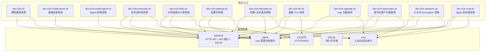

**图表来源** 
- [scripts/dev-e2e.sh:1-91](file://scripts/dev-e2e.sh#L1-L91)
- [scripts/dev-e2e-install-panel.sh:1-150](file://scripts/dev-e2e-install-panel.sh#L1-L150)
- [scripts/dev-e2e-install-agent.sh:1-224](file://scripts/dev-e2e-install-agent.sh#L1-L224)
- [scripts/dev-e2e-protocols.sh:1-166](file://scripts/dev-e2e-protocols.sh#L1-L166)
- [scripts/dev-e2e-links.sh:1-265](file://scripts/dev-e2e-links.sh#L1-L265)
- [scripts/dev-e2e-settings.sh:1-193](file://scripts/dev-e2e-settings.sh#L1-L193)
- [scripts/dev-e2e-telemetry.sh:1-138](file://scripts/dev-e2e-telemetry.sh#L1-L138)
- [scripts/dev-e2e-tls.sh:1-112](file://scripts/dev-e2e-tls.sh#L1-L112)
- [scripts/dev-e2e-upgrade.sh:1-133](file://scripts/dev-e2e-upgrade.sh#L1-L133)
- [scripts/dev-e2e-usernodes.sh:1-151](file://scripts/dev-e2e-usernodes.sh#L1-L151)
- [scripts/dev-e2e-vlessenc.sh:1-142](file://scripts/dev-e2e-vlessenc.sh#L1-L142)
- [scripts/dev-e2e-xray.sh:1-208](file://scripts/dev-e2e-xray.sh#L1-L208)

**章节来源**
- [docs/framework-design.md:23-60](file://docs/framework-design.md#L23-L60)

## 核心组件
- 测试编排器：各 dev-e2e-*.sh 脚本负责“构建 → 启动 → 数据准备 → 调用 API/WS → 断言”的完整闭环。
- 被测服务：backend（HTTP/WS）、agent（xray 管理）、xray（数据面）。
- 数据层：SQLite（内存或临时文件），用于持久化服务器、用户、节点、命令队列、遥测与流量。
- 安全与网络：自签 CA、HTTPS/WSS、端口监听检查、curl/openssl/python3 工具链。
- 外部依赖：xray 二进制（可通过 XRAY_BIN 指定路径），部分用例需外网可达（如示例站点）。

关键实现要点：
- 所有脚本均使用 mktemp -d 创建临时工作目录，并在 EXIT 钩子中清理进程与文件，保证隔离性。
- 通过 python3 内联 SQL 直接读写 SQLite，避免引入额外依赖。
- 通过 curl 与 cookie jar 模拟登录与会话，结合 CSRF Token 进行鉴权。
- 通过 pgrep/pkill 管理进程生命周期，确保测试结束后无残留进程。

**章节来源**
- [scripts/dev-e2e.sh:1-91](file://scripts/dev-e2e.sh#L1-L91)
- [scripts/dev-e2e-install-panel.sh:1-150](file://scripts/dev-e2e-install-panel.sh#L1-L150)
- [scripts/dev-e2e-install-agent.sh:1-224](file://scripts/dev-e2e-install-agent.sh#L1-L224)

## 架构总览
E2E 测试围绕“面板-代理-数据面”三要素展开，采用“单通道 WS”作为控制面，离线命令队列保障可靠性，遥测与订阅提供观测能力。

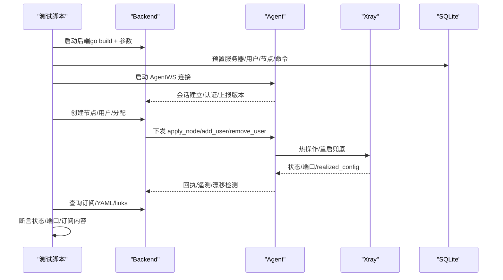

**图表来源** 
- [scripts/dev-e2e-xray.sh:97-128](file://scripts/dev-e2e-xray.sh#L97-L128)
- [scripts/dev-e2e-protocols.sh:79-100](file://scripts/dev-e2e-protocols.sh#L79-L100)
- [scripts/dev-e2e-links.sh:81-101](file://scripts/dev-e2e-links.sh#L81-L101)
- [scripts/dev-e2e-telemetry.sh:48-70](file://scripts/dev-e2e-telemetry.sh#L48-L70)

**章节来源**
- [docs/framework-design.md:98-128](file://docs/framework-design.md#L98-L128)

## 详细组件分析

### 控制通道验收（dev-e2e.sh）
- 目标：验证 bootstrap 换发长期凭证、离线命令滞留与重连补发、apply_result 回写状态机。
- 关键点：
  - 首次连接使用 bootstrap token，成功后换发长期凭证并持久化到 state.json。
  - 模拟 Agent 离线，插入 apply_node 命令；重连后补发并执行。
  - 校验命令状态回写 failed 及错误详情。
  - 未终态 sent 命令重连重置为 queued 并重发。

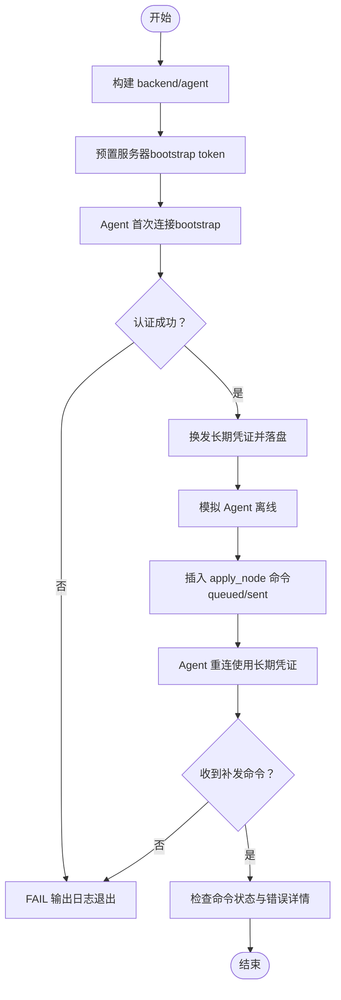

**图表来源** 
- [scripts/dev-e2e.sh:26-78](file://scripts/dev-e2e.sh#L26-L78)

**章节来源**
- [scripts/dev-e2e.sh:1-91](file://scripts/dev-e2e.sh#L1-L91)

### 面板安装验收（dev-e2e-install-panel.sh）
- 目标：验证 install-panel.sh 在 LATX_DEV=1 下的安装流程、checksum 校验、默认凭据、latx status/version/reset-admin 等功能。
- 关键点：
  - 伪造 release（tarball + checksums.txt），篡改包应被拦截。
  - 安装成功输出面板地址与管理员账号提示。
  - 访问 /api/login 返回 200，TLS 目录统一为 data/certs。
  - 重装保留管理员密码；reset-admin 拒绝短密码、改密后旧会话失效。

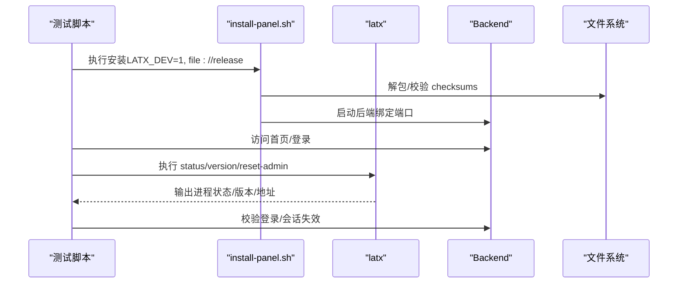

**图表来源** 
- [scripts/dev-e2e-install-panel.sh:44-100](file://scripts/dev-e2e-install-panel.sh#L44-L100)
- [scripts/dev-e2e-install-panel.sh:105-149](file://scripts/dev-e2e-install-panel.sh#L105-L149)

**章节来源**
- [scripts/dev-e2e-install-panel.sh:1-150](file://scripts/dev-e2e-install-panel.sh#L1-L150)

### Agent 安装验收（dev-e2e-install-agent.sh）
- 目标：验证 install-agent.sh 在 DEV 与 user 模式下的安装、checksum 校验、state 处理、latx-ag 运维、用户态守护脚本。
- 关键点：
  - 预置坏 state 仍可使用新 bootstrap 上线。
  - 安装输出包含面板地址、Agent 状态、xray 版本与 latx-ag 提示块。
  - user 模式：守护脚本常驻，start/stop 生效，crontab 行清理。

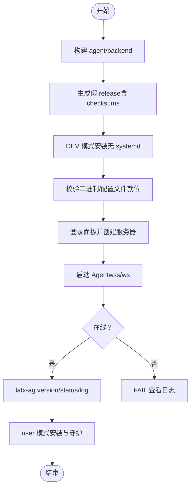

**图表来源** 
- [scripts/dev-e2e-install-agent.sh:95-139](file://scripts/dev-e2e-install-agent.sh#L95-L139)
- [scripts/dev-e2e-install-agent.sh:167-221](file://scripts/dev-e2e-install-agent.sh#L167-L221)

**章节来源**
- [scripts/dev-e2e-install-agent.sh:1-224](file://scripts/dev-e2e-install-agent.sh#L1-L224)

### 全协议向导验收（dev-e2e-protocols.sh）
- 目标：验证 vless/vmess/trojan/shadowsocks/socks/http/dokodemo-door 等协议的节点创建、active 状态、realized_config 正确性与订阅 YAML 字段。
- 关键点：
  - 多协议节点创建后端口监听正常。
  - 订阅 YAML 包含各协议字段，dokodemo-door 不进入订阅。
  - 新建用户并分配 socks/http 节点，触发 add_user 扇出。

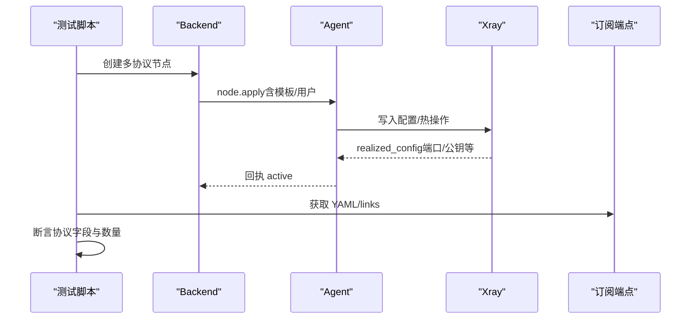

**图表来源** 
- [scripts/dev-e2e-protocols.sh:95-131](file://scripts/dev-e2e-protocols.sh#L95-L131)
- [scripts/dev-e2e-protocols.sh:136-163](file://scripts/dev-e2e-protocols.sh#L136-L163)

**章节来源**
- [scripts/dev-e2e-protocols.sh:1-166](file://scripts/dev-e2e-protocols.sh#L1-L166)

### 分享链接与订阅验收（dev-e2e-links.sh）
- 目标：验证 /sub/{token}/links 的 base64 解码、vless 普通/加密链接参数齐全、YAML 订阅、响应头 subscription-userinfo/profile-update-interval、Accept 分流、有效期与停用开关。
- 关键点：
  - links 端点不分流，YAML 落地页按 Accept 返回 HTML。
  - 过期用户 proxies 为空，userinfo 头保留 expire。
  - 显式停用/启用触发 remove_user/add_user 扇出。

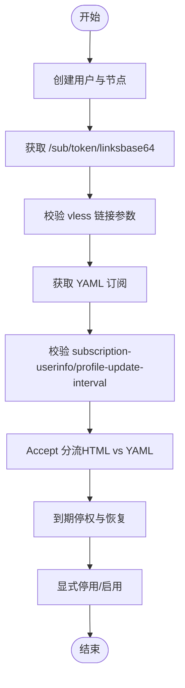

**图表来源** 
- [scripts/dev-e2e-links.sh:103-144](file://scripts/dev-e2e-links.sh#L103-L144)
- [scripts/dev-e2e-links.sh:151-216](file://scripts/dev-e2e-links.sh#L151-L216)

**章节来源**
- [scripts/dev-e2e-links.sh:1-265](file://scripts/dev-e2e-links.sh#L1-L265)

### 设置页验收（dev-e2e-settings.sh）
- 目标：验证 GET/PUT /api/settings（时区/对外地址/TLS 域名路径模式）、管理员改密、自重启与 HTTPS 生效、证书热加载。
- 关键点：
  - public_url 影响安装命令与订阅链接。
  - tls_mode=path 保存后 restart 生效，同端口 HTTPS。
  - 替换证书文件后下一次握手即生效，无需重启。

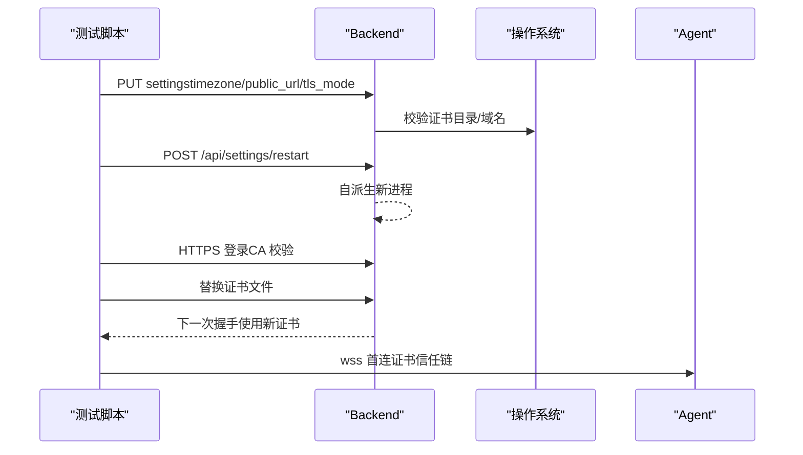

**图表来源** 
- [scripts/dev-e2e-settings.sh:89-141](file://scripts/dev-e2e-settings.sh#L89-L141)
- [scripts/dev-e2e-settings.sh:143-188](file://scripts/dev-e2e-settings.sh#L143-L188)

**章节来源**
- [scripts/dev-e2e-settings.sh:1-193](file://scripts/dev-e2e-settings.sh#L1-L193)

### 遥测验收（dev-e2e-telemetry.sh）
- 目标：验证 agent 周期上报 telemetry，真实流量经节点转发后面板 traffic/server_metrics 落库，API DTO 携带 metrics/traffic。
- 关键点：
  - 客户端 xray 经 socks 代理访问外网，产生上行/下行流量。
  - 节点维度与用户维度流量分别落库。
  - server_metrics 包含内存总量等主机指标。

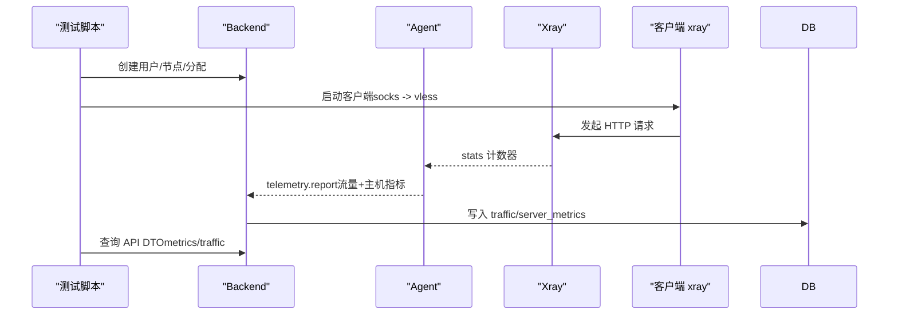

**图表来源** 
- [scripts/dev-e2e-telemetry.sh:73-115](file://scripts/dev-e2e-telemetry.sh#L73-L115)

**章节来源**
- [scripts/dev-e2e-telemetry.sh:1-138](file://scripts/dev-e2e-telemetry.sh#L1-L138)

### TLS 验收（dev-e2e-tls.sh）
- 目标：验证面板 HTTPS 启动、agent 经 wss 首连、cookie Secure 标记、反代场景 X-Forwarded-Proto 推断。
- 关键点：
  - 自签 CA 签发服务器证书，agent 通过 SSL_CERT_FILE 信任。
  - 登录 cookie 带 Secure。
  - 反代下面板根据 X-Forwarded-Proto 推断 https。

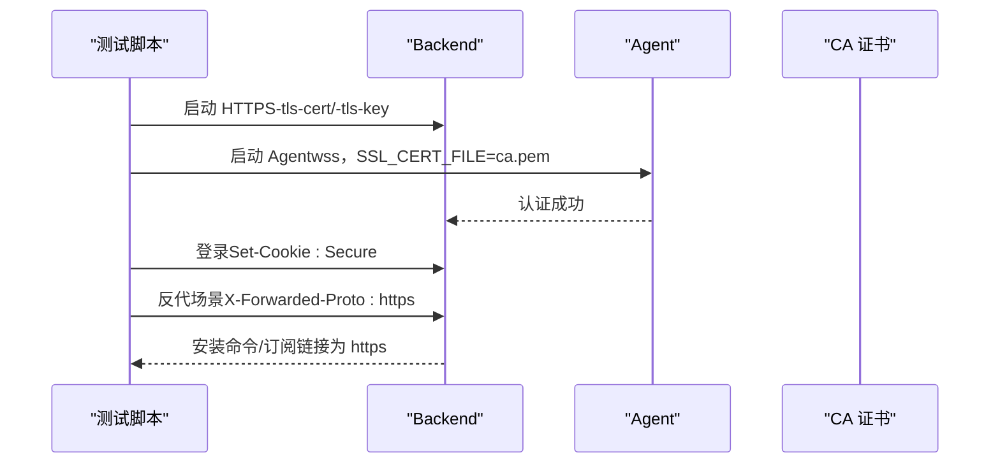

**图表来源** 
- [scripts/dev-e2e-tls.sh:53-109](file://scripts/dev-e2e-tls.sh#L53-L109)

**章节来源**
- [scripts/dev-e2e-tls.sh:1-112](file://scripts/dev-e2e-tls.sh#L1-L112)

### xray 升级验收（dev-e2e-upgrade.sh）
- 目标：验证 xray 版本升级流程（非法版本 failed、指定版本升级 acked、latest 走镜像、telemetry 刷新面板版本号）。
- 关键点：
  - 本地 release 镜像提供 zip + .dgst 校验。
  - 升级失败不破坏原二进制，成功清理备份。
  - latest 升级不经 GitHub API，直接走镜像布局。

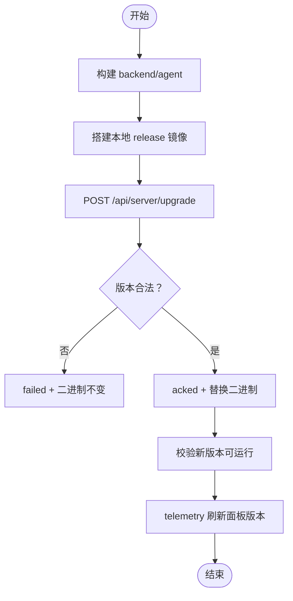

**图表来源** 
- [scripts/dev-e2e-upgrade.sh:100-130](file://scripts/dev-e2e-upgrade.sh#L100-L130)

**章节来源**
- [scripts/dev-e2e-upgrade.sh:1-133](file://scripts/dev-e2e-upgrade.sh#L1-L133)

### 逐节点用户分配验收（dev-e2e-usernodes.sh）
- 目标：验证默认全关策略、增量 add_user/remove_user、订阅仅含分配节点、存量库迁移补全关联。
- 关键点：
  - 新建用户/节点默认无关联，订阅为空。
  - 分配后增量下发，取消分配后移除。
  - 存量库迁移将隐含全对全补全为显式关联。

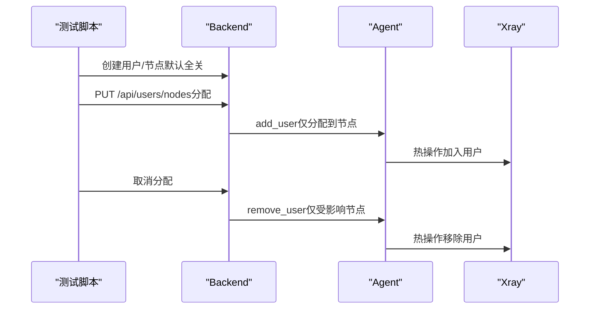

**图表来源** 
- [scripts/dev-e2e-usernodes.sh:104-121](file://scripts/dev-e2e-usernodes.sh#L104-L121)

**章节来源**
- [scripts/dev-e2e-usernodes.sh:1-151](file://scripts/dev-e2e-usernodes.sh#L1-L151)

### VLESS Encryption 验收（dev-e2e-vlessenc.sh）
- 目标：验证 vless + VLESS Encryption（mlkem768）与普通 vless vision 的数据通路、订阅 YAML 中 encryption 字段。
- 关键点：
  - realized_config 包含 encryption 客户端字符串。
  - 组合 flow vision 时客户端字符串为 1-RTT。
  - 客户端 xray 经 socks 代理访问外网验证连通性。

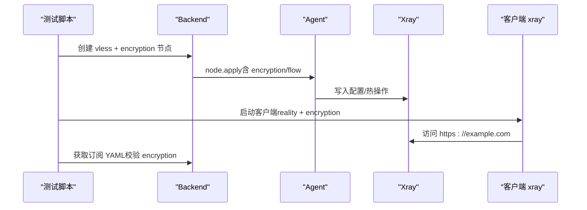

**图表来源** 
- [scripts/dev-e2e-vlessenc.sh:108-141](file://scripts/dev-e2e-vlessenc.sh#L108-L141)

**章节来源**
- [scripts/dev-e2e-vlessenc.sh:1-142](file://scripts/dev-e2e-vlessenc.sh#L1-L142)

### Xray 流水线验收（dev-e2e-xray.sh）
- 目标：验证 apply_node（含热操作失败的重启兜底）、add_user/remove_user 零重启、remove_node 端口释放、非法模板 failed、retry 重试、dest 不可达 fallback。
- 关键点：
  - 节点 active 后 realized_config 包含端口与公钥。
  - 用户增删不重启 xray（PID 不变）。
  - 非法模板报错并上报 error 详情。
  - dest 不可达时自动 fallback 到白名单候选。

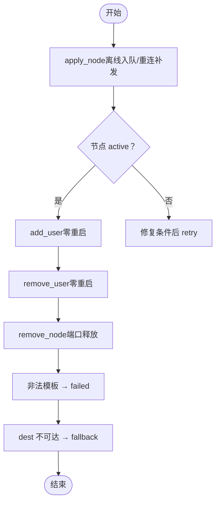

**图表来源** 
- [scripts/dev-e2e-xray.sh:109-167](file://scripts/dev-e2e-xray.sh#L109-L167)
- [scripts/dev-e2e-xray.sh:190-205](file://scripts/dev-e2e-xray.sh#L190-L205)

**章节来源**
- [scripts/dev-e2e-xray.sh:1-208](file://scripts/dev-e2e-xray.sh#L1-L208)

## 依赖关系分析
- 脚本间无耦合，各自独立运行，便于并行执行与 CI 分片。
- 共同依赖：python3、curl、openssl（TLS 相关）、xray 二进制（可通过 XRAY_BIN 覆盖）。
- 被测系统依赖：backend（Go 构建）、agent（Go 构建）、SQLite（临时文件）、xray（数据面）。

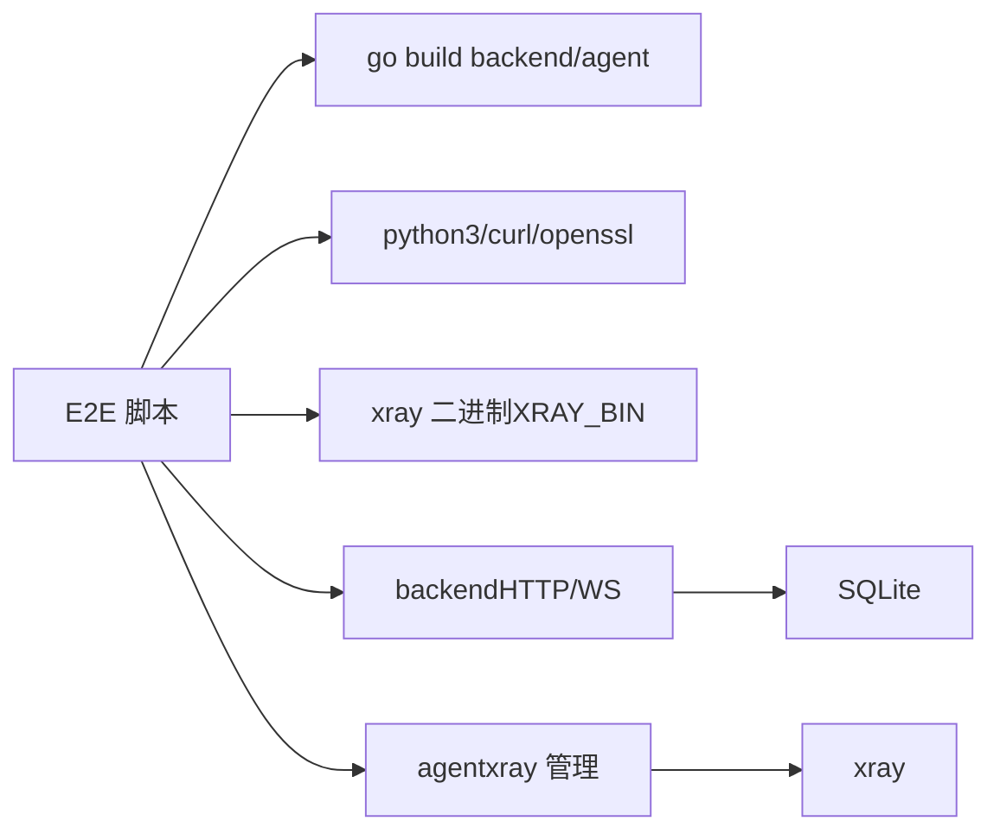

**图表来源** 
- [scripts/dev-e2e-protocols.sh:27-37](file://scripts/dev-e2e-protocols.sh#L27-L37)
- [scripts/dev-e2e-install-panel.sh:26-42](file://scripts/dev-e2e-install-panel.sh#L26-L42)
- [scripts/dev-e2e-install-agent.sh:51-69](file://scripts/dev-e2e-install-agent.sh#L51-L69)

**章节来源**
- [docs/framework-design.md:45-61](file://docs/framework-design.md#L45-L61)

## 性能考量
- 测试环境尽量轻量：SQLite 文件 IO 开销小，适合单机 E2E。
- 遥测间隔可调（如 -telemetry-interval 2s），加速指标落库。
- 端口监听检查与轮询超时策略避免长时间阻塞。
- 建议并行执行各脚本以提升整体通过率（CI 分片）。

[本节为通用指导，不直接分析具体文件]

## 故障排查指南
- 日志收集：
  - 各脚本将 backend.log、agent.log、client.log 输出到临时目录，失败时 tail -n 查看最近日志。
  - 使用 grep 搜索关键字（如 “authenticated as server”、“failed”、“error”）。
- 常见问题：
  - xray 二进制缺失：确认 XRAY_BIN 指向有效路径。
  - 端口占用：检查 port_open 断言失败原因，释放端口后重试。
  - 证书问题：确认证书链与 SAN 配置，使用 openssl s_client 验证指纹。
  - 订阅为空：检查用户是否分配节点、disabled/expired 状态。
- 调试技巧：
  - 降低遥测间隔与 sweeper 周期（如 LATTIX_EXPIRY_SWEEP_INTERVAL=1s）加快状态收敛。
  - 使用 LATX_DEV=1/LATX_USER_MODE=1 切换安装模式，避免 systemd 干扰。
  - 手动 curl 调用 API 并打印响应体，定位 JSON 结构差异。

**章节来源**
- [scripts/dev-e2e-install-panel.sh:60-85](file://scripts/dev-e2e-install-panel.sh#L60-L85)
- [scripts/dev-e2e-install-agent.sh:140-165](file://scripts/dev-e2e-install-agent.sh#L140-L165)
- [scripts/dev-e2e-settings.sh:173-188](file://scripts/dev-e2e-settings.sh#L173-L188)

## 结论
本 E2E 测试体系以 Bash 脚本为核心，覆盖安装、协议、链路、设置、遥测、TLS、升级、用户节点、VLESS 加密、Xray 流水线等关键特性。通过本地构建、假 release、SQLite 与自签证书，构建了最小可用环境，确保端到端验证的可重复性与可维护性。建议在 CI 中按特性分片并行执行，结合日志与指标收集提升问题定位效率。

[本节为总结，不直接分析具体文件]

## 附录
- 环境变量与参数：
  - XRAY_BIN：指定 xray 二进制路径。
  - LATX_DEV=1：DEV 模式安装（无 systemd）。
  - LATX_USER_MODE=1：用户态模式安装。
  - LATTIX_EXPIRY_SWEEP_INTERVAL：到期扫频间隔（秒）。
  - SSL_CERT_FILE：CA 证书路径（wss 首连）。
- 常用命令：
  - 运行单个脚本：bash scripts/dev-e2e-*.sh
  - 查看日志：tail -f $WORK/*.log
  - 检查进程：pgrep -af "backend|agent|xray"

[本节为补充信息，不直接分析具体文件]