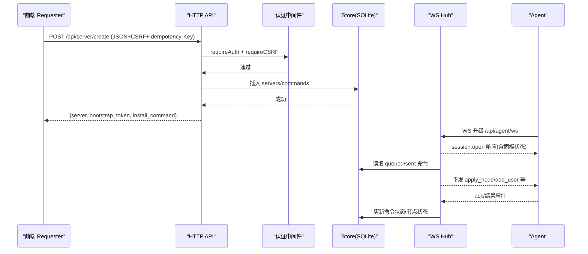
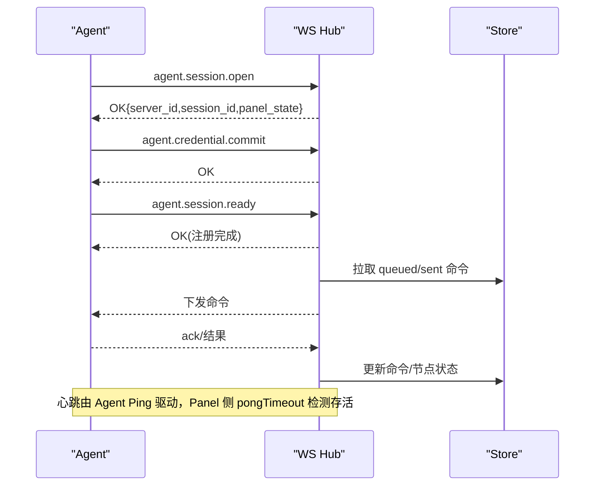
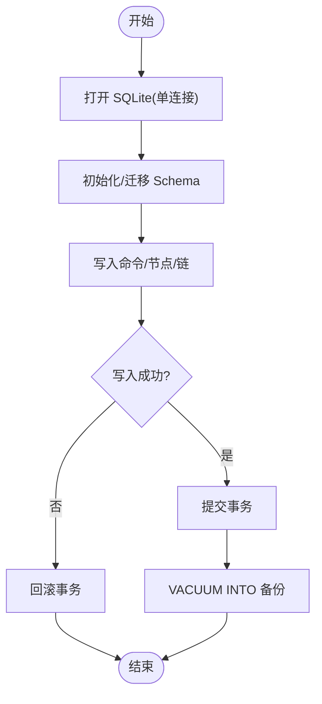
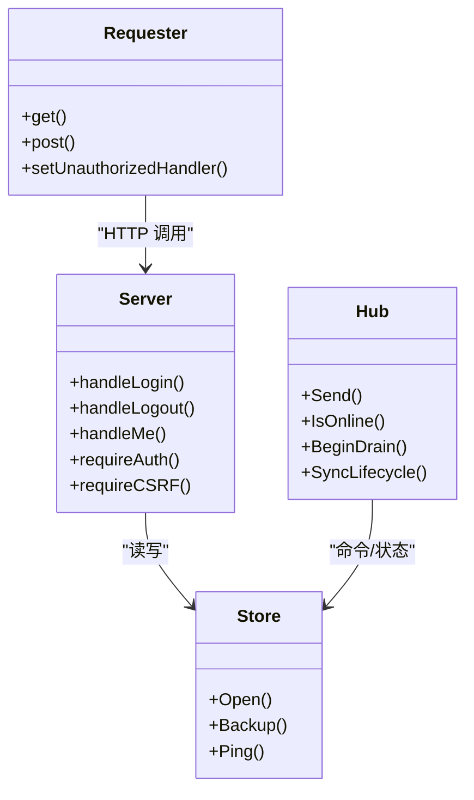

# API 集成测试

<cite>
**本文引用的文件**   
- [openapi.yaml](file://docs/openapi.yaml)
- [ws-protocol.schema.json](file://docs/ws-protocol.schema.json)
- [hub.go](file://src/backend/internal/ws/hub.go)
- [agent.go](file://src/backend/internal/ws/agent.go)
- [store.go](file://src/backend/internal/store/store.go)
- [auth.go](file://src/backend/internal/panel/auth.go)
- [auth_test.go](file://src/backend/internal/panel/auth_test.go)
- [dev-e2e.sh](file://scripts/dev-e2e.sh)
- [dev-e2e-usernodes.sh](file://scripts/dev-e2e-usernodes.sh)
- [dev-e2e-install-agent.sh](file://scripts/dev-e2e-install-agent.sh)
- [dev-e2e-settings.sh](file://scripts/dev-e2e-settings.sh)
- [requester.test.ts](file://src/frontend/src/lib/requester.test.ts)
</cite>

## 目录
1. [简介](#简介)
2. [项目结构](#项目结构)
3. [核心组件](#核心组件)
4. [架构总览](#架构总览)
5. [详细组件分析](#详细组件分析)
6. [依赖关系分析](#依赖关系分析)
7. [性能考量](#性能考量)
8. [故障排查指南](#故障排查指南)
9. [结论](#结论)
10. [附录](#附录)

## 简介
本文件为 Lattix-codex 项目的 API 集成测试文档，覆盖以下范围：
- HTTP REST API 的集成测试策略：认证流程、数据 CRUD、错误处理与幂等性。
- WebSocket 实时通信测试：连接建立、消息收发、断线重连、心跳与生命周期同步。
- 数据库事务与一致性测试：SQLite 单写并发、备份导出、状态机回滚与补偿。
- 具体用例示例：用户管理、服务器配置、节点管理、链式拓扑（chain）相关操作。
- 测试环境搭建、Mock 服务配置、测试数据准备与端到端脚本使用。

## 项目结构
本项目采用多模块 Go 工程，后端在 src/backend，Agent 在 src/agent，前端在 src/frontend，OpenAPI 与协议 Schema 在 docs，E2E 脚本在 scripts。

```mermaid
graph TB
subgraph "后端"
A["HTTP API<br/>/api/*"]
B["WebSocket Hub<br/>/api/agent/ws"]
C["Store(SQLite)<br/>schema + 事务"]
end
subgraph "Agent"
D["WS 客户端<br/>会话/命令/遥测"]
end
subgraph "前端"
E["请求封装器<br/>Requester"]
end
E --> A
D < --> B
A --> C
B --> C
```

图表来源
- [openapi.yaml:1-120](file://docs/openapi.yaml#L1-L120)
- [hub.go:1-120](file://src/backend/internal/ws/hub.go#L1-L120)
- [store.go:16-120](file://src/backend/internal/store/store.go#L16-L120)
- [requester.test.ts:51-122](file://src/frontend/src/lib/requester.test.ts#L51-L122)

章节来源
- [openapi.yaml:1-120](file://docs/openapi.yaml#L1-L120)
- [store.go:16-120](file://src/backend/internal/store/store.go#L16-L120)

## 核心组件
- HTTP API 契约：统一 RPC 信封、CSRF、幂等键、业务码定义。
- 认证与会话：Cookie 签名、CSRF Token、同源校验、登录限流。
- WebSocket Hub：连接注册表、发送队列、心跳超时、优雅排空、生命周期同步。
- Store：SQLite 单连接、busy_timeout、VACUUM INTO 备份、Schema 初始化。
- 前端 Requester：请求封装、错误分类、Trace/RequestID 透传。

章节来源
- [openapi.yaml:449-712](file://docs/openapi.yaml#L449-L712)
- [auth.go:81-181](file://src/backend/internal/panel/auth.go#L81-L181)
- [hub.go:26-139](file://src/backend/internal/ws/hub.go#L26-L139)
- [store.go:358-494](file://src/backend/internal/store/store.go#L358-L494)
- [requester.test.ts:51-122](file://src/frontend/src/lib/requester.test.ts#L51-L122)

## 架构总览
下图展示一次“创建服务器”的完整调用链：前端发起带 CSRF 和幂等键的请求，后端鉴权后写入 Store，返回 bootstrap token 与安装命令；Agent 通过 WS 握手并接收离线命令补发。



图表来源
- [openapi.yaml:69-104](file://docs/openapi.yaml#L69-L104)
- [auth.go:197-249](file://src/backend/internal/panel/auth.go#L197-L249)
- [store.go:140-163](file://src/backend/internal/store/store.go#L140-L163)
- [agent.go:157-197](file://src/backend/internal/ws/agent.go#L157-L197)
- [hub.go:111-139](file://src/backend/internal/ws/hub.go#L111-L139)

## 详细组件分析

### HTTP REST API 集成测试策略
- 认证流程测试
  - 登录/登出/当前用户探活：验证 Cookie 签发、CSRF Token 生成与校验、同源校验、失败限流。
  - 更新中保护：面板更新期间拒绝非进度轮询接口。
- 数据 CRUD 测试
  - 服务器/节点/用户/链：创建、更新、删除、重试、强制发布、流量统计等。
  - 幂等性：Idempotency-Key 去重与响应缓存。
- 错误处理测试
  - 协议层错误（400/404/405/413/415）与业务错误码（AUTH_REQUIRED、INTERNAL_ERROR 等）。
  - Trace/RequestID 透传与日志关联。

章节来源
- [auth.go:81-181](file://src/backend/internal/panel/auth.go#L81-L181)
- [auth.go:197-249](file://src/backend/internal/panel/auth.go#L197-L249)
- [openapi.yaml:449-712](file://docs/openapi.yaml#L449-L712)
- [requester.test.ts:51-122](file://src/frontend/src/lib/requester.test.ts#L51-L122)

### WebSocket 实时通信测试
- 连接建立
  - agent.session.open：校验凭据、返回 server_id/session_id/panel_state。
  - agent.credential.commit：凭证交换提交。
  - agent.session.ready：完成注册，进入业务通道。
- 消息收发
  - 命令下发（apply_node/add_user/remove_user 等），ack/failed 回写。
  - telemetry.report 上报流量计数。
- 断线重连与心跳
  - Agent 主动 Ping，Panel 未收到字节则 pongTimeout 判定死亡。
  - Hub 维护 sendBuffer，满则断开并重连后补发。
- 生命周期同步
  - panel.lifecycle.changed：面板状态变更广播，Agent 确认。



图表来源
- [ws-protocol.schema.json:136-214](file://docs/ws-protocol.schema.json#L136-L214)
- [agent.go:157-197](file://src/backend/internal/ws/agent.go#L157-L197)
- [hub.go:17-24](file://src/backend/internal/ws/hub.go#L17-L24)
- [hub.go:111-139](file://src/backend/internal/ws/hub.go#L111-L139)

章节来源
- [ws-protocol.schema.json:1-356](file://docs/ws-protocol.schema.json#L1-L356)
- [agent.go:157-197](file://src/backend/internal/ws/agent.go#L157-L197)
- [hub.go:17-24](file://src/backend/internal/ws/hub.go#L17-L24)
- [hub.go:111-139](file://src/backend/internal/ws/hub.go#L111-L139)

### 数据库事务与一致性测试
- SQLite 单写模型
  - MaxOpenConns=1，busy_timeout 避免锁冲突。
- 一致性验证
  - VACUUM INTO 备份导出一致性快照。
  - commands/nodes/chains 状态机推进与回滚路径验证。
- 并发访问测试
  - 模拟高并发写场景，验证 database is locked 处理与重试。
- 事务回滚测试
  - 失败命令状态回写 failed，节点状态回退到 pending/failed。



图表来源
- [store.go:368-389](file://src/backend/internal/store/store.go#L368-L389)
- [store.go:448-494](file://src/backend/internal/store/store.go#L448-L494)
- [store.go:140-163](file://src/backend/internal/store/store.go#L140-L163)

章节来源
- [store.go:358-494](file://src/backend/internal/store/store.go#L358-L494)

### 认证与会话测试要点
- 密码校验与限流：失败次数限制、阻塞时间、IP 追踪上限。
- 会话安全：HMAC 签名、过期时间、CSRF Token 绑定会话。
- 并发改密：旧会话在新密码下失效。

章节来源
- [auth_test.go:1-96](file://src/backend/internal/panel/auth_test.go#L1-L96)
- [auth.go:81-181](file://src/backend/internal/panel/auth.go#L81-L181)

### 端到端脚本与用例
- 控制通道 E2E：bootstrap 换长期凭证、离线命令滞留与补发、状态机推进。
- 用户-节点分配 E2E：默认全关、增量 add/remove、订阅与 inbounds 校验、存量库迁移。
- 安装 Agent E2E：checksum 校验、安装流程、失败中止。
- 设置与 TLS E2E：证书热加载、WSS 连通性。

章节来源
- [dev-e2e.sh:1-91](file://scripts/dev-e2e.sh#L1-L91)
- [dev-e2e-usernodes.sh:1-151](file://scripts/dev-e2e-usernodes.sh#L1-L151)
- [dev-e2e-install-agent.sh:57-114](file://scripts/dev-e2e-install-agent.sh#L57-L114)
- [dev-e2e-settings.sh:163-192](file://scripts/dev-e2e-settings.sh#L163-L192)

## 依赖关系分析
- API 层依赖认证中间件与 Store。
- WS Hub 依赖 Auth/LifecycleProvider 回调与 Store 读写。
- 前端 Requester 依赖 OpenAPI 契约与错误分类逻辑。



图表来源
- [auth.go:81-181](file://src/backend/internal/panel/auth.go#L81-L181)
- [hub.go:111-139](file://src/backend/internal/ws/hub.go#L111-L139)
- [store.go:358-494](file://src/backend/internal/store/store.go#L358-L494)
- [requester.test.ts:51-122](file://src/frontend/src/lib/requester.test.ts#L51-L122)

章节来源
- [auth.go:81-181](file://src/backend/internal/panel/auth.go#L81-L181)
- [hub.go:111-139](file://src/backend/internal/ws/hub.go#L111-L139)
- [store.go:358-494](file://src/backend/internal/store/store.go#L358-L494)
- [requester.test.ts:51-122](file://src/frontend/src/lib/requester.test.ts#L51-L122)

## 性能考量
- WS 发送队列长度有限，慢连接会被断开以保护整体吞吐。
- SQLite 单连接 + busy_timeout 降低锁争用，适合读多写少场景。
- 备份使用 VACUUM INTO，避免额外锁竞争。
- 建议对高频查询增加索引（如 metrics/history、commands）。

[本节为通用指导，不直接分析具体文件]

## 故障排查指南
- 认证失败
  - 检查 CSRF Token 是否匹配、同源头是否正确、登录限流是否触发。
- WS 连接异常
  - 查看 pongTimeout 与 writeTimeout 日志，确认 Agent Ping 是否正常。
- 命令未下发或状态未更新
  - 核查 commands 表 status 流转（queued→sent→acked/failed），检查 Hub Send 是否因 draining/offline 拒绝。
- 数据库锁定
  - 观察 busy_timeout 与并发写热点，必要时拆分写入路径或引入批处理。

章节来源
- [auth.go:197-249](file://src/backend/internal/panel/auth.go#L197-L249)
- [hub.go:17-24](file://src/backend/internal/ws/hub.go#L17-L24)
- [store.go:368-389](file://src/backend/internal/store/store.go#L368-L389)

## 结论
通过统一的 RPC 信封、严格的认证与 CSRF、健壮的 WS Hub 与 SQLite 单写模型，Lattix-codex 提供了可测试、可观测、可扩展的 API 体系。结合 E2E 脚本与单元测试，可有效覆盖认证、CRUD、WS 实时通信与数据一致性的关键路径。建议在 CI 中常态化运行这些集成测试，确保版本迭代质量。

[本节为总结，不直接分析具体文件]

## 附录

### 测试环境搭建
- 构建后端与 Agent 二进制。
- 初始化 SQLite 数据库（内存或文件）。
- 启动后端服务，注入必要种子数据（servers/users/nodes）。
- 可选：Mock 外部依赖（xray、第三方 API）。

章节来源
- [dev-e2e.sh:1-91](file://scripts/dev-e2e.sh#L1-L91)
- [dev-e2e-usernodes.sh:1-151](file://scripts/dev-e2e-usernodes.sh#L1-L151)

### Mock 服务配置
- 使用 fakeRequester 捕获 WS 下发信封，控制在线状态与延迟。
- 使用内存 SQLite 隔离测试数据。
- 前端 Requester 使用 fetch mock 验证请求头与错误分类。

章节来源
- [dispatch/chain_test.go:1-149](file://src/backend/internal/dispatch/chain_test.go#L1-L149)
- [requester.test.ts:51-122](file://src/frontend/src/lib/requester.test.ts#L51-L122)

### 测试数据准备
- 服务器：alias/token/machine_type/address/tags/country_code/location。
- 用户：name/uuid/sub_token/expires_at/expired/disabled。
- 节点：server_id/protocol/port/config_template/status/error。
- 链：chains/chain_hops/traffic 基线与增量。

章节来源
- [store.go:19-125](file://src/backend/internal/store/store.go#L19-L125)
- [store.go:116-171](file://src/backend/internal/store/store.go#L116-L171)
- [store.go:233-356](file://src/backend/internal/store/store.go#L233-L356)

### 具体用例示例（路径参考）
- 用户管理 API 测试
  - 创建/更新/删除用户、设置节点分配、订阅生成与校验。
  - 参考：[dev-e2e-usernodes.sh:1-151](file://scripts/dev-e2e-usernodes.sh#L1-L151)
- 服务器配置 API 测试
  - 创建服务器、获取 bootstrap token、安装命令生成。
  - 参考：[openapi.yaml:69-104](file://docs/openapi.yaml#L69-L104)
- 节点管理 API 测试
  - 节点创建、状态推进、重试、删除。
  - 参考：[openapi.yaml:206-233](file://docs/openapi.yaml#L206-L233)
- 认证流程测试
  - 登录/登出/当前用户、CSRF、限流、并发改密。
  - 参考：[auth_test.go:1-96](file://src/backend/internal/panel/auth_test.go#L1-L96)