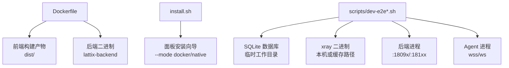
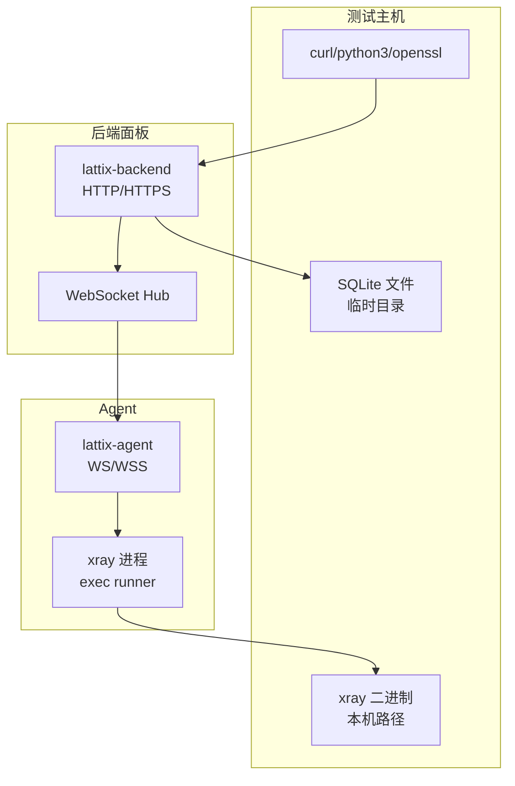
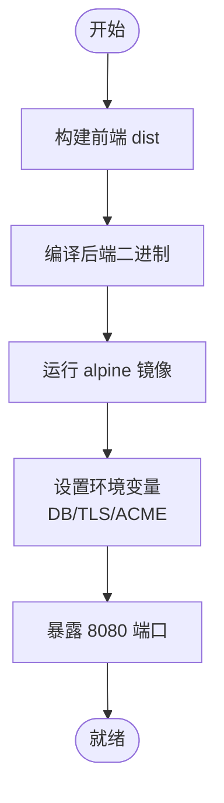
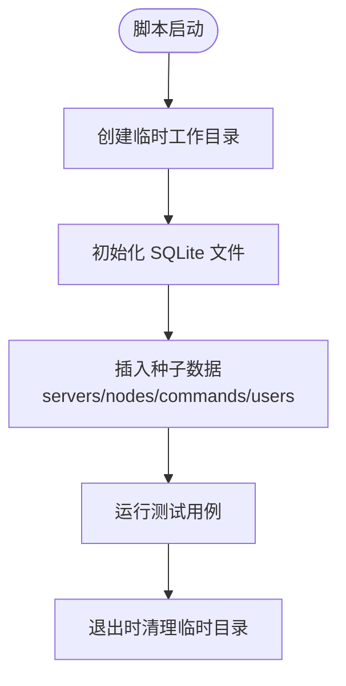
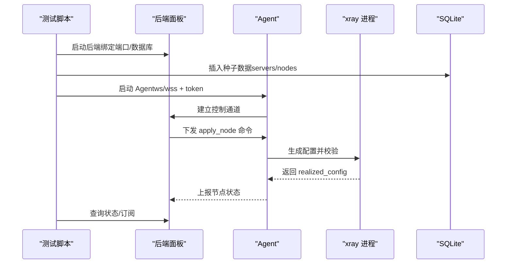
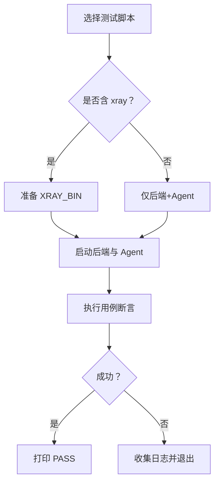
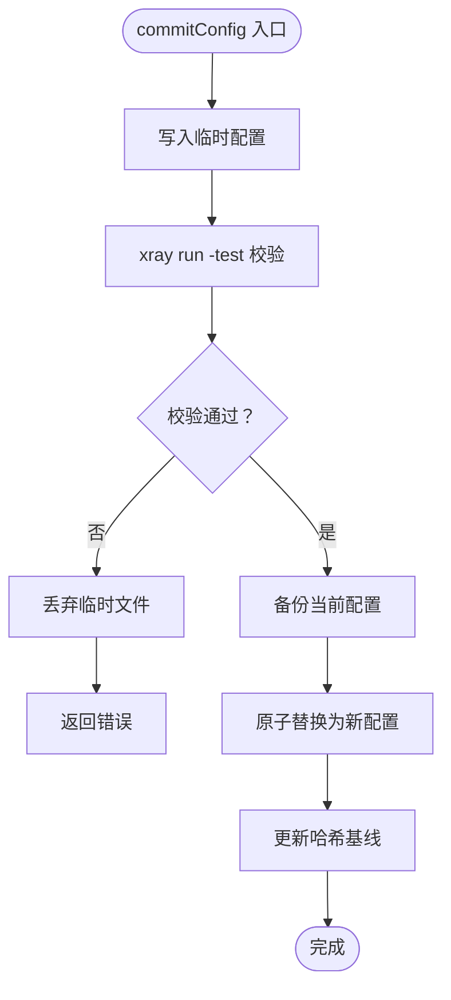
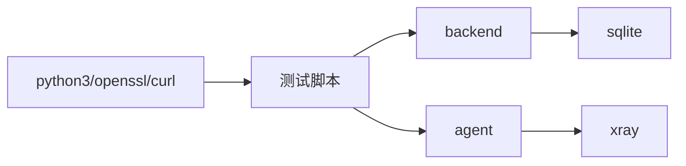

# 测试环境搭建

<cite>
**本文引用的文件**
- [Dockerfile](file://Dockerfile)
- [install.sh](file://install.sh)
- [scripts/dev-e2e.sh](file://scripts/dev-e2e.sh)
- [scripts/dev-e2e-xray.sh](file://scripts/dev-e2e-xray.sh)
- [scripts/dev-e2e-panel.sh](file://scripts/dev-e2e-panel.sh)
- [scripts/dev-e2e-tls.sh](file://scripts/dev-e2e-tls.sh)
- [scripts/dev-e2e-install-panel.sh](file://scripts/dev-e2e-install-panel.sh)
- [scripts/dev-e2e-install-agent.sh](file://scripts/dev-e2e-install-agent.sh)
- [src/backend/cmd/backend/main.go](file://src/backend/cmd/backend/main.go)
- [src/agent/internal/xray/manager.go](file://src/agent/internal/xray/manager.go)
</cite>

## 目录
1. [简介](#简介)
2. [项目结构](#项目结构)
3. [核心组件](#核心组件)
4. [架构总览](#架构总览)
5. [详细组件分析](#详细组件分析)
6. [依赖关系分析](#依赖关系分析)
7. [性能考虑](#性能考虑)
8. [故障排查指南](#故障排查指南)
9. [结论](#结论)
10. [附录](#附录)

## 简介
本文件面向 Lattix-codex 项目的测试与验证场景，提供一套可复现的“容器化 + 脚本驱动”的端到端测试环境搭建指南。内容覆盖：
- Docker 镜像构建与运行（后端面板）
- 测试数据库初始化（SQLite、表结构与种子数据）
- 模拟服务配置（本地 xray、自签证书、HTTP/HTTPS/WSS）
- 一键启动与清理脚本使用方式
- 常见问题定位与解决（端口冲突、权限、依赖缺失等）

## 项目结构
仓库包含前端、后端、Agent 以及大量端到端测试脚本。测试环境主要围绕以下关键文件组织：
- Dockerfile：多阶段构建前端静态资源与后端二进制，生成最小运行镜像
- install.sh：统一安装入口，支持面板/代理两种模式与交互式向导
- scripts/*：各 E2E 脚本分别覆盖控制通道、xray 应用流水线、TLS、安装流程等

**图表来源**
- [Dockerfile:1-44](file://Dockerfile#L1-L44)
- [install.sh:1-146](file://install.sh#L1-L146)
- [scripts/dev-e2e.sh:1-91](file://scripts/dev-e2e.sh#L1-L91)
- [scripts/dev-e2e-xray.sh:1-208](file://scripts/dev-e2e-xray.sh#L1-L208)

**章节来源**
- [Dockerfile:1-44](file://Dockerfile#L1-L44)
- [install.sh:1-146](file://install.sh#L1-L146)

## 核心组件
- 后端面板（backend）
  - 通过命令行参数暴露监听地址、数据库路径、管理员密码、静态资源目录、TLS 证书等
  - 支持 HTTP/HTTPS/WSS（由 Agent 连接）
- Agent（agent）
  - 负责与面板建立控制通道，接收并执行节点配置下发、用户热操作、状态回写
  - 管理 xray 进程生命周期（exec runner），实现零重启热更新与失败回滚
- SQLite 数据库
  - 用于存储服务器、节点、命令、用户等元数据；测试中通常以内存或临时文件形式存在
- xray 运行时
  - 作为数据面代理，由 Agent 根据模板生成配置并校验后生效

**章节来源**
- [src/backend/cmd/backend/main.go:215-250](file://src/backend/cmd/backend/main.go#L215-L250)
- [src/agent/internal/xray/manager.go:221-304](file://src/agent/internal/xray/manager.go#L221-L304)

## 架构总览
下图展示测试环境的典型交互：后端面板提供 REST API 与 WebSocket；Agent 通过 WS/WSS 接入；xray 作为数据面被 Agent 管理；SQLite 持久化状态。

**图表来源**
- [scripts/dev-e2e-panel.sh:1-134](file://scripts/dev-e2e-panel.sh#L1-L134)
- [scripts/dev-e2e-xray.sh:1-208](file://scripts/dev-e2e-xray.sh#L1-L208)
- [scripts/dev-e2e-tls.sh:1-112](file://scripts/dev-e2e-tls.sh#L1-L112)

## 详细组件分析

### Docker 镜像构建与运行
- 多阶段构建
  - 前端阶段：基于 bun 安装依赖并构建 dist
  - 后端阶段：基于 golang 编译后端二进制，嵌入前端 dist
  - 运行阶段：alpine 基础镜像，创建非 root 用户，暴露 8080 端口
- 环境变量
  - LATTIX_DEPLOY_MODE=docker
  - LATTIX_DB=/data/lattix.db
  - LATTIX_TLS_DIR=/data/certs
  - LATTIX_ACME_CACHE=/data/acme-cache
- 运行方式
  - 默认 ENTRYPOINT 为后端二进制，CMD 监听 :8080

**图表来源**
- [Dockerfile:1-44](file://Dockerfile#L1-L44)

**章节来源**
- [Dockerfile:1-44](file://Dockerfile#L1-L44)

### 测试数据库初始化与隔离
- 初始化策略
  - 每个测试脚本在临时目录创建独立 SQLite 文件，避免污染
  - 通过 python3 直接执行 SQL 完成建表与种子数据插入
- 常见表与字段
  - servers：alias、token、address_mode 等
  - nodes：server_id、config_template、status、realized_config、error
  - commands：server_id、type、payload、status
  - users：name、uuid、sub_token
- 隔离机制
  - 临时目录 + 独立 .db 文件
  - 脚本退出时自动清理工作目录

**图表来源**
- [scripts/dev-e2e.sh:1-91](file://scripts/dev-e2e.sh#L1-L91)
- [scripts/dev-e2e-xray.sh:1-208](file://scripts/dev-e2e-xray.sh#L1-L208)

**章节来源**
- [scripts/dev-e2e.sh:1-91](file://scripts/dev-e2e.sh#L1-L91)
- [scripts/dev-e2e-xray.sh:1-208](file://scripts/dev-e2e-xray.sh#L1-L208)

### 模拟服务配置
- 本地 xray 服务
  - 通过 XRAY_BIN 指定本机 xray 二进制路径
  - Agent 使用 exec runner 管理 xray 进程，支持热更新与失败回滚
- Mock API 服务
  - 测试脚本通过 curl/python3 调用后端 REST API，构造请求体与 CSRF/Idempotency-Key
- 模拟证书服务
  - 使用 openssl 生成 CA 与服务器证书，启用 HTTPS/WSS
  - 面板支持 TLS 模式（证书文件或 ACME），支持 X-Forwarded-Proto 推断

**图表来源**
- [scripts/dev-e2e-xray.sh:1-208](file://scripts/dev-e2e-xray.sh#L1-L208)
- [scripts/dev-e2e-tls.sh:1-112](file://scripts/dev-e2e-tls.sh#L1-L112)

**章节来源**
- [scripts/dev-e2e-xray.sh:1-208](file://scripts/dev-e2e-xray.sh#L1-L208)
- [scripts/dev-e2e-tls.sh:1-112](file://scripts/dev-e2e-tls.sh#L1-L112)

### 一键部署与清理脚本
- dev-e2e.sh：控制通道端到端（认证换发、离线补发、状态回写）
- dev-e2e-xray.sh：xray 应用流水线（apply/add/remove 用户、热操作、非法模板处理、重试）
- dev-e2e-panel.sh：RPC/Requester/Agent 协议 smoke 测试
- dev-e2e-tls.sh：HTTPS/WSS、Secure Cookie、反代 X-Forwarded-Proto
- dev-e2e-install-panel.sh：面板安装器与 latx 管理程序验收（checksum 校验、版本输出、会话失效）
- dev-e2e-install-agent.sh：Agent 引导安装与 latx-ag 验收（DEV/user 模式、状态检查、日志查看）

**图表来源**
- [scripts/dev-e2e.sh:1-91](file://scripts/dev-e2e.sh#L1-L91)
- [scripts/dev-e2e-xray.sh:1-208](file://scripts/dev-e2e-xray.sh#L1-L208)
- [scripts/dev-e2e-panel.sh:1-134](file://scripts/dev-e2e-panel.sh#L1-L134)
- [scripts/dev-e2e-tls.sh:1-112](file://scripts/dev-e2e-tls.sh#L1-L112)
- [scripts/dev-e2e-install-panel.sh:1-150](file://scripts/dev-e2e-install-panel.sh#L1-L150)
- [scripts/dev-e2e-install-agent.sh:1-224](file://scripts/dev-e2e-install-agent.sh#L1-L224)

**章节来源**
- [scripts/dev-e2e.sh:1-91](file://scripts/dev-e2e.sh#L1-L91)
- [scripts/dev-e2e-xray.sh:1-208](file://scripts/dev-e2e-xray.sh#L1-L208)
- [scripts/dev-e2e-panel.sh:1-134](file://scripts/dev-e2e-panel.sh#L1-L134)
- [scripts/dev-e2e-tls.sh:1-112](file://scripts/dev-e2e-tls.sh#L1-L112)
- [scripts/dev-e2e-install-panel.sh:1-150](file://scripts/dev-e2e-install-panel.sh#L1-L150)
- [scripts/dev-e2e-install-agent.sh:1-224](file://scripts/dev-e2e-install-agent.sh#L1-L224)

### Agent xray 管理器关键逻辑
- commitConfig：写入临时文件 → xray run -test 校验 → 备份旧配置 → 原子替换
- ConfigDrift：检测配置文件漂移，首次以当前文件为基线，删除视为漂移
- 热操作失败回滚：热更新失败则尝试重启，仍失败则回滚到上一份可用配置

**图表来源**
- [src/agent/internal/xray/manager.go:221-304](file://src/agent/internal/xray/manager.go#L221-L304)

**章节来源**
- [src/agent/internal/xray/manager.go:221-304](file://src/agent/internal/xray/manager.go#L221-L304)

## 依赖关系分析
- 外部依赖
  - python3：SQL 执行与 JSON 处理
  - openssl：证书签发与 SAN 配置
  - curl：HTTP/HTTPS/WSS 调用
  - xray 二进制：数据面代理
- 内部依赖
  - backend ↔ sqlite：元数据存储
  - agent ↔ backend：控制通道（ws/wss）
  - agent ↔ xray：进程管理与配置热更新

**图表来源**
- [scripts/dev-e2e-xray.sh:1-208](file://scripts/dev-e2e-xray.sh#L1-L208)
- [scripts/dev-e2e-tls.sh:1-112](file://scripts/dev-e2e-tls.sh#L1-L112)

**章节来源**
- [scripts/dev-e2e-xray.sh:1-208](file://scripts/dev-e2e-xray.sh#L1-L208)
- [scripts/dev-e2e-tls.sh:1-112](file://scripts/dev-e2e-tls.sh#L1-L112)

## 性能考虑
- 数据库：SQLite 适合轻量测试，避免并发写入瓶颈；必要时切换内存库
- 进程管理：Agent 对 xray 的热更新减少重启开销，提升测试吞吐
- 网络：WSS 增加握手开销，测试中建议优先使用 ws 以提升速度

[本节为通用指导，不直接分析具体文件]

## 故障排查指南
- 端口冲突
  - 现象：后端/Agent/xray 启动失败或无法监听
  - 处理：更换端口或释放占用端口；检查脚本中的 ADDR/API 端口分配
- 权限问题
  - 现象：无法写入 /data 或证书目录
  - 处理：确保运行用户具备读写权限；Docker 镜像已创建非 root 用户
- 依赖缺失
  - 现象：python3/openssl/curl/xray 未找到
  - 处理：安装对应依赖；通过 XRAY_BIN 指定 xray 路径
- 证书相关
  - 现象：WSS 握手失败或浏览器拒绝
  - 处理：确认 CA 与服务器证书匹配；SAN 包含 localhost/IP；客户端信任 CA
- 安装校验失败
  - 现象：checksum 校验失败导致安装中止
  - 处理：检查 checksums.txt 与 tarball 一致性；避免篡改

**章节来源**
- [scripts/dev-e2e-install-panel.sh:1-150](file://scripts/dev-e2e-install-panel.sh#L1-L150)
- [scripts/dev-e2e-install-agent.sh:1-224](file://scripts/dev-e2e-install-agent.sh#L1-L224)
- [scripts/dev-e2e-tls.sh:1-112](file://scripts/dev-e2e-tls.sh#L1-L112)

## 结论
通过 Docker 镜像与脚本协同，Lattix-codex 的测试环境可在本地快速搭建与销毁。SQLite 提供轻量持久化，Agent 与 xray 协作实现数据面热更新，配合自签证书与 Mock API 覆盖完整链路。遵循本指南可高效复现实验与回归测试。

[本节为总结性内容，不直接分析具体文件]

## 附录
- 常用环境变量
  - XRAY_BIN：xray 二进制路径
  - LATX_DEV/LATX_PREFIX：Agent 安装与运行模式
  - LATTIX_STATIC：静态资源目录
- 常用命令
  - 启动后端：go build 后运行 -addr/-db/-admin-pass
  - 启动 Agent：-panel/-token/-state/-xray-bin/-xray-config/-xray-api/-xray-runner
  - 证书生成：openssl req/x509 生成 CA 与服务器证书

[本节为补充信息，不直接分析具体文件]