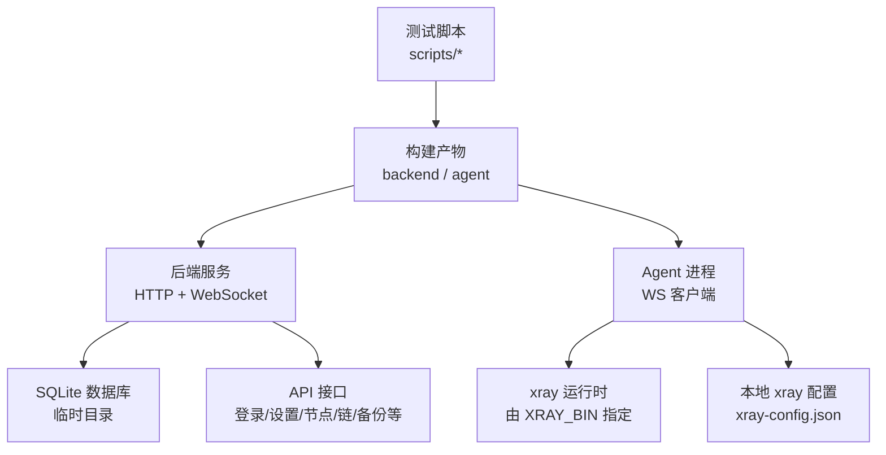
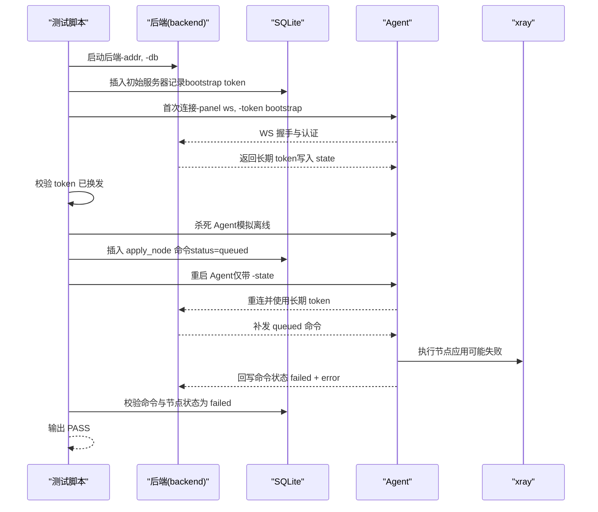
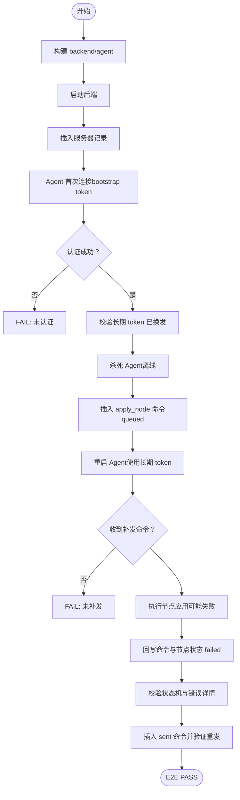
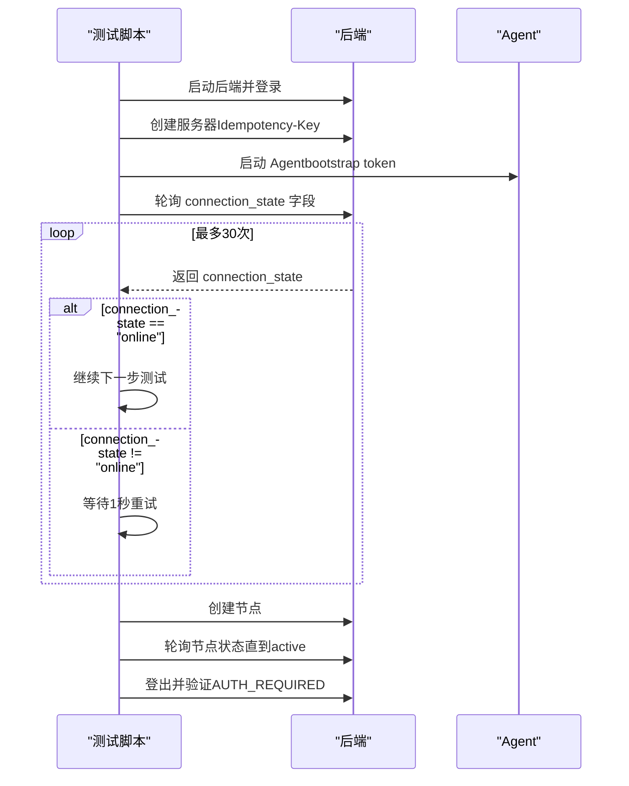
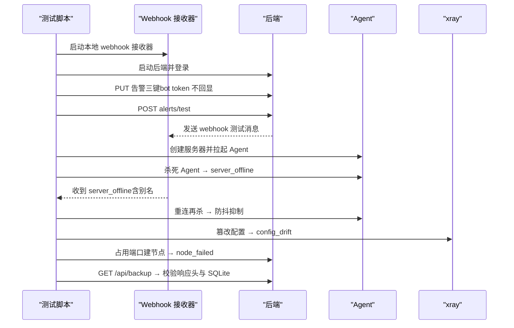
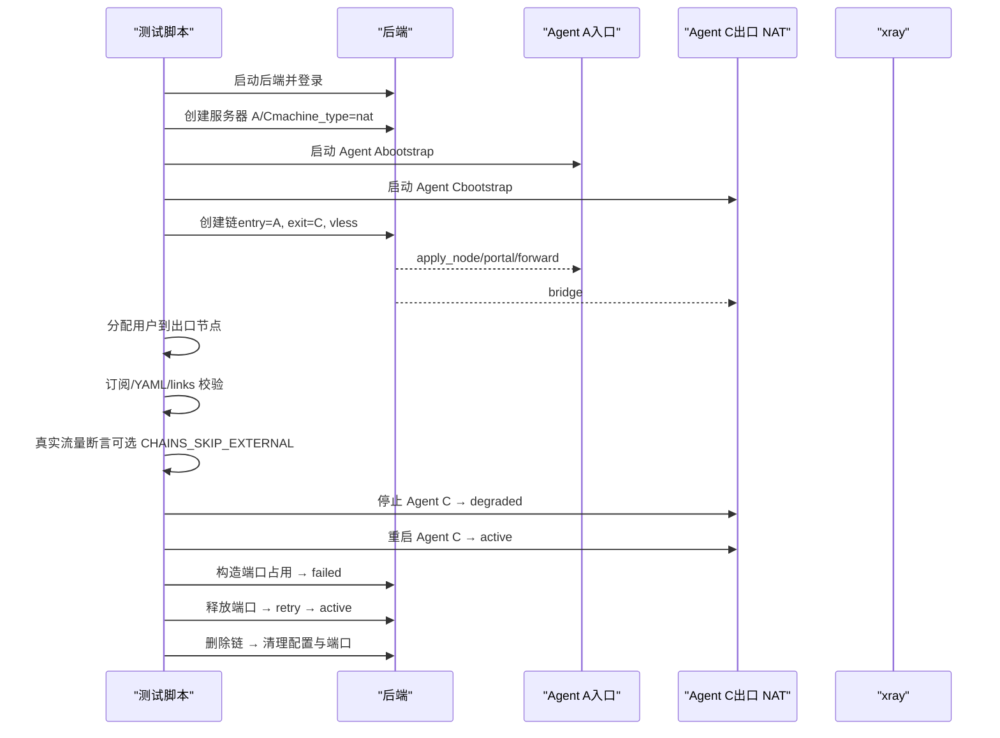
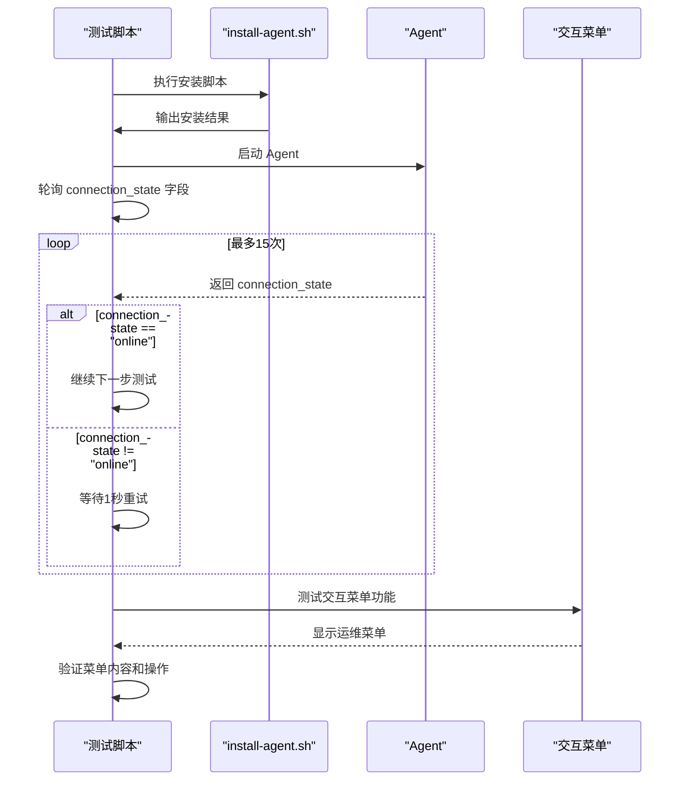
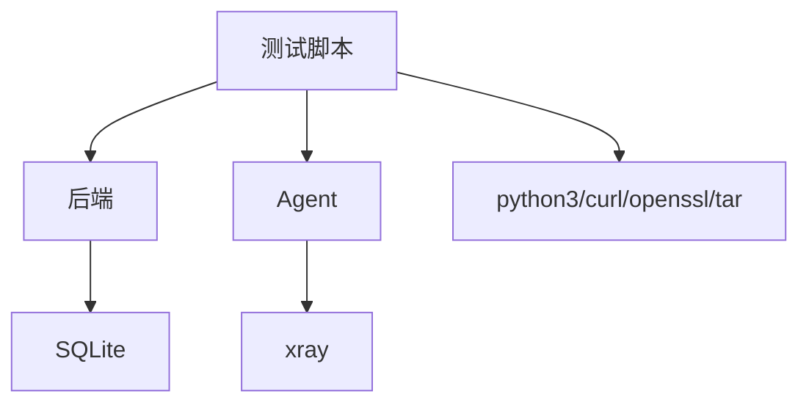

# 端到端测试脚本

<cite>
**本文引用的文件**   
- [scripts/dev-e2e.sh](file://scripts/dev-e2e.sh)
- [scripts/dev-e2e-alerts.sh](file://scripts/dev-e2e-alerts.sh)
- [scripts/dev-e2e-chains.sh](file://scripts/dev-e2e-chains.sh)
- [scripts/dev-e2e-event-log.sh](file://scripts/dev-e2e-event-log.sh)
- [scripts/dev-e2e-install-agent.sh](file://scripts/dev-e2e-install-agent.sh)
- [scripts/dev-e2e-install-entry.sh](file://scripts/dev-e2e-install-entry.sh)
- [scripts/dev-e2e-install-panel.sh](file://scripts/dev-e2e-install-panel.sh)
- [scripts/dev-e2e-links.sh](file://scripts/dev-e2e-links.sh)
- [scripts/dev-e2e-panel-update.sh](file://scripts/dev-e2e-panel-update.sh)
- [scripts/dev-e2e-panel.sh](file://scripts/dev-e2e-panel.sh)
- [scripts/dev-e2e-protocols.sh](file://scripts/dev-e2e-protocols.sh)
- [scripts/dev-e2e-reconcile.sh](file://scripts/dev-e2e-reconcile.sh)
- [scripts/dev-e2e-settings.sh](file://scripts/dev-e2e-settings.sh)
- [scripts/dev-e2e-telemetry.sh](file://scripts/dev-e2e-telemetry.sh)
- [scripts/dev-e2e-tls.sh](file://scripts/dev-e2e-tls.sh)
- [src/shared/lifecycle.go](file://src/shared/lifecycle.go)
</cite>

## 更新摘要
**变更内容**   
- 更新了Panel RPC + current Agent冒烟测试章节，反映连接状态检查机制的改进
- 新增连接状态字段说明，从简单的online布尔值升级为更精确的connection_state字符串
- 更新了相关断言逻辑和测试稳定性说明
- 增强了Agent安装测试中的交互菜单功能测试

## 目录
1. [简介](#简介)
2. [项目结构](#项目结构)
3. [核心组件](#核心组件)
4. [架构总览](#架构总览)
5. [详细组件分析](#详细组件分析)
6. [依赖关系分析](#依赖关系分析)
7. [性能与稳定性考量](#性能与稳定性考量)
8. [故障排查指南](#故障排查指南)
9. [结论](#结论)
10. [附录：参数与环境变量速查](#附录参数与环境变量速查)

## 简介
本文件面向 Lattix-codex 项目的端到端（E2E）测试脚本，提供从主入口脚本到各专项脚本的完整使用指南。内容涵盖：
- 主 E2E 测试脚本的执行流程：后端启动、Agent 连接、认证换发长期凭证、离线命令滞留与补发、状态机回写等
- 专项测试脚本使用方法：告警、代理链、事件日志、安装面板/Agent、链接订阅、协议、配置漂移、设置页、遥测、TLS、面板自更新等
- 参数与环境变量配置：地址、Token、超时、XRAY_BIN、镜像源、是否跳过外网断言等
- 测试结果解读：成功标志、失败原因定位、日志查看技巧
- 自定义测试脚本开发指南：用例编写规范、断言方法、测试数据管理最佳实践

## 项目结构
E2E 测试脚本集中于 scripts 目录，每个脚本独立构建并运行 backend 与 agent 二进制，通过临时工作目录隔离环境，确保可重复性与幂等性。典型流程包括：
- 构建产物：go build 生成 backend 与 agent
- 启动后端：监听 HTTP/WebSocket 端口，初始化 SQLite 数据库
- 启动 Agent：以 bootstrap token 或长期 token 连接后端，执行节点下发、遥测上报、漂移检测等
- 验证断言：通过 curl/python3/sqlite3 对 API、数据库、进程、端口、配置文件进行校验
- 清理资源：退出时终止进程、删除临时目录

**图示来源** 
- [scripts/dev-e2e.sh:14-37](file://scripts/dev-e2e.sh#L14-L37)
- [scripts/dev-e2e-chains.sh:42-104](file://scripts/dev-e2e-chains.sh#L42-L104)
- [scripts/dev-e2e-alerts.sh:34-104](file://scripts/dev-e2e-alerts.sh#L34-L104)

**章节来源**
- [scripts/dev-e2e.sh:1-91](file://scripts/dev-e2e.sh#L1-L91)
- [scripts/dev-e2e-chains.sh:1-271](file://scripts/dev-e2e-chains.sh#L1-L271)
- [scripts/dev-e2e-alerts.sh:1-204](file://scripts/dev-e2e-alerts.sh#L1-L204)

## 核心组件
- 后端（backend）：提供 REST API、WebSocket 通道、设置与鉴权、备份下载、面板自更新等能力
- Agent：作为 WS 客户端连接后端，负责节点生命周期管理、遥测上报、漂移检测、命令执行与状态回写
- xray：实际转发与隧道实现，由脚本通过 -xray-bin 指定路径
- 数据库：SQLite，用于持久化服务器、用户、节点、命令、指标等
- 辅助工具：python3（SQL 操作、JSON 解析）、curl（HTTP 请求）、openssl（证书）、tar/sha256sum（安装包校验）

**章节来源**
- [scripts/dev-e2e-panel.sh:21-41](file://scripts/dev-e2e-panel.sh#L21-L41)
- [scripts/dev-e2e-protocols.sh:27-88](file://scripts/dev-e2e-protocols.sh#L27-88)
- [scripts/dev-e2e-telemetry.sh:30-56](file://scripts/dev-e2e-telemetry.sh#L30-56)

## 架构总览
下图展示主 E2E 测试脚本的核心交互流程：后端启动、Agent 首次连接与认证换发、离线命令滞留与重连补发、状态机推进与错误回写。

**图示来源** 
- [scripts/dev-e2e.sh:26-78](file://scripts/dev-e2e.sh#L26-78)

**章节来源**
- [scripts/dev-e2e.sh:1-91](file://scripts/dev-e2e.sh#L1-L91)

## 详细组件分析

### 主 E2E 测试脚本（控制通道验收）
- 功能要点
  - 构建并启动后端与 Agent
  - 使用 bootstrap token 完成首次认证，换发长期 token
  - 模拟 Agent 离线，插入 apply_node 命令进入 queued 状态
  - 重连后补发命令，执行失败并回写 failed 状态与错误详情
  - 校验 sent 状态命令在重连后重置并重发
- 关键断言
  - 日志中出现"authenticated as server"
  - agent.state.json 中的 token 与数据库一致且不同于 bootstrap
  - 命令与节点状态机推进至 failed，并包含错误信息
  - sent 命令重发成功

**图示来源** 
- [scripts/dev-e2e.sh:26-91](file://scripts/dev-e2e.sh#L26-91)

**章节来源**
- [scripts/dev-e2e.sh:1-91](file://scripts/dev-e2e.sh#L1-L91)

### Panel RPC + current Agent 冒烟测试
- 功能要点
  - 健康检查（readyz/healthz）
  - 认证流程（AUTH_REQUIRED/AUTH_INVALID_CREDENTIALS）
  - Idempotency-Key 幂等创建服务器
  - Agent 上线与节点 active
  - **连接状态检查机制改进**：使用更精确的 `connection_state` 字段替代简单的 `online` 布尔值
- 关键断言
  - 未认证返回 AUTH_REQUIRED
  - 错误凭证返回 AUTH_INVALID_CREDENTIALS
  - 相同 Idempotency-Key 返回相同 server id
  - **连接状态为 "online"**：通过轮询 `/api/server/list` 获取 `connection_state` 字段，等待值为 "online"

**更新** 连接状态检查机制已从简单的布尔值判断升级为更精确的状态字符串检查，提高了测试的稳定性和准确性。

**图示来源** 
- [scripts/dev-e2e-panel.sh:110-115](file://scripts/dev-e2e-panel.sh#L110-115)

**章节来源**
- [scripts/dev-e2e-panel.sh:1-134](file://scripts/dev-e2e-panel.sh#L1-L134)

### 告警测试脚本（事件告警与备份）
- 功能要点
  - 启动本地 webhook 接收器与后端，保存告警三键（webhook URL、Telegram bot token、chat ID）
  - 调用 alerts/test 接口，验证 webhook 成功与 Telegram 假 token 失败
  - 杀死 Agent 触发 server_offline 告警，并在 5 分钟内防抖不重发
  - 外部篡改 xray 配置触发 config_drift 告警
  - 占用端口导致节点 apply 失败触发 node_failed 告警
  - 下载备份文件，校验 Content-Disposition、SQLite 头与完整性检查
- 关键断言
  - hooks.log 出现 test/server_offline/config_drift/node_failed 事件
  - 备份文件为合法 SQLite，integrity_check ok，包含必要表与设置项

**图示来源** 
- [scripts/dev-e2e-alerts.sh:99-196](file://scripts/dev-e2e-alerts.sh#L99-196)

**章节来源**
- [scripts/dev-e2e-alerts.sh:1-204](file://scripts/dev-e2e-alerts.sh#L1-L204)

### 代理链测试脚本（NAT 支持与链路编排）
- 功能要点
  - 同机双 Agent（A=入口 direct，C=NAT 仅出口）
  - 创建链（A 入口、C 出口，vless+reality），五阶段编排（apply_node→portal→bridge→forward）
  - 真实流量断言（socks→入口→reverse 隧道→出口→外网 200）
  - 订阅与 links 端点校验（YAML/links 内容一致性）
  - degraded 场景（停 C 的 Agent）与恢复 active
  - 失败重试（入口端口占用构造 forward 失败，释放后 retry 幂等）
  - 删链（remove_chain_hop acked、节点删除、端口释放、配置清空）
- 关键断言
  - 链状态 active，跳状态全部 active，端口回执正确
  - 订阅 YAML 与 links 内容符合预期
  - 链路 200 连通，degraded→active 恢复
  - retry 幂等拒绝非 failed 状态

**图示来源** 
- [scripts/dev-e2e-chains.sh:97-269](file://scripts/dev-e2e-chains.sh#L97-269)

**章节来源**
- [scripts/dev-e2e-chains.sh:1-271](file://scripts/dev-e2e-chains.sh#L1-L271)

### 事件日志测试脚本（操作与请求日志）
- 功能要点
  - 登录失败与成功均留痕（auth.login_failed/auth.login）
  - 建服务器/用户/节点与命令成功留痕（server.create/user.create/node.create/command.succeeded）
  - 删除服务器保留 alias 快照
  - 关键字过滤、server_id 过滤、分页、请求日志尾窗
- 关键断言
  - 操作日志类别与字段正确（operator/ip/detail）
  - 历史事件可按 server_id 查询（对象已删仍可查）
  - 分页 limit/offset 与 total 正确

**章节来源**
- [scripts/dev-e2e-event-log.sh:1-134](file://scripts/dev-e2e-event-log.sh#L1-L134)

### 安装 Agent 测试脚本（install-agent.sh 与 latx-ag）
- 功能要点
  - 伪造 release（file://），支持 LATX_DEV=1 无 systemd 降级安装
  - checksum 篡改中止安装；成功输出面板地址、Agent 状态、latx-ag 提示块
  - 重装清旧 state，预置坏 state 仍能上线
  - user 模式（LATX_USER_MODE=1）守护脚本常驻与 start/stop
  - **连接状态检查**：使用 `connection_state` 字段验证 Agent 上线状态
  - **交互菜单测试**：验证 latx-ag 无参数进入交互菜单功能
- 关键断言
  - 安装产物就位（lattix-agent/latx-ag/xray）
  - 版本信息与运维提示块正确
  - user 模式进程管理与日志读取正常
  - **Agent 连接状态为 "online"**：通过轮询 API 获取 connection_state 字段
  - **交互菜单功能正常**：验证菜单显示和操作功能

**更新** 新增了交互菜单功能测试，确保 latx-ag 在无参数模式下能够正确显示中文/英文菜单界面。

**图示来源** 
- [scripts/dev-e2e-install-agent.sh:140-173](file://scripts/dev-e2e-install-agent.sh#L140-173)

**章节来源**
- [scripts/dev-e2e-install-agent.sh:1-234](file://scripts/dev-e2e-install-agent.sh#L1-L234)

### 安装入口测试脚本（install.sh 向导）
- 功能要点
  - 校验 installer placeholders 不被嵌入默认参数
  - 模拟 curl 行为与交互式向导输入
  - 验证 panel-only 向导不推荐 Agent 安装
  - 密码提示掩码显示
- 关键断言
  - 命令行参数解析正确
  - 向导交互输出符合预期

**章节来源**
- [scripts/dev-e2e-install-entry.sh:1-79](file://scripts/dev-e2e-install-entry.sh#L1-L79)

### 安装面板测试脚本（install-panel.sh 与 latx）
- 功能要点
  - 伪造 release（file://），LATX_DEV=1 无 systemd 降级安装
  - checksum 篡改中止安装；成功输出面板地址与凭据
  - 面板 200；latx status/version；reset-admin 改密与会话失效
- 关键断言
  - 面板二进制与 latx 工具就位
  - 语言菜单中英文切换与菜单项执行
  - 改密后旧会话失效、短密码被拒

**章节来源**
- [scripts/dev-e2e-install-panel.sh:1-150](file://scripts/dev-e2e-install-panel.sh#L1-L150)

### 链接订阅测试脚本（/sub/{token} 与 /sub/{token}/links）
- 功能要点
  - vless 普通/加密节点链接参数齐全（reality/flow/encryption）
  - mihomo YAML 订阅回归
  - subscription-userinfo/profile-update-interval 响应头
  - 落地页 Accept 分流与无效 token 404
  - 有效期到期停权（sweeper 置 expired，扇出 remove_user）
  - 延长有效期与清除有效期（长期）
  - 显式停用/启用（disabled）与复合场景（disabled+expired）
- 关键断言
  - 订阅内容与 links 解码一致
  - 过期/停用用户订阅为空，userinfo 头含 expire
  - 启用后恢复下发 add_user

**章节来源**
- [scripts/dev-e2e-links.sh:1-265](file://scripts/dev-e2e-links.sh#L1-L265)

### 全协议测试脚本（多协议节点与订阅）
- 功能要点
  - 创建 7 种协议节点（vless/tcp/grpc/xhttp、vmess、trojan、shadowsocks、socks/http/dokodemo）
  - realized_config 字段正确，端口监听
  - 订阅 YAML 各协议字段正确（dokodemo 不进订阅）
  - 新建用户触发多协议 add_user 扇出
- 关键断言
  - 节点状态 active，realized_config 字段满足协议要求
  - 订阅包含对应协议类型与选项

**章节来源**
- [scripts/dev-e2e-protocols.sh:1-166](file://scripts/dev-e2e-protocols.sh#L1-L166)

### 配置漂移 reconcile 测试脚本
- 功能要点
  - 外部篡改 xray 配置 → agent 检测并上报 → 面板 config_drift 置位
  - 修复按钮（重放 active 节点）→ agent 重建配置 → 漂移自动清除
- 关键断言
  - config_drift=true 与 API DTO 一致
  - 修复后配置覆盖篡改内容

**章节来源**
- [scripts/dev-e2e-reconcile.sh:1-104](file://scripts/dev-e2e-reconcile.sh#L1-L104)

### 设置页测试脚本（public-url、时区、TLS、改密）
- 功能要点
  - GET/PUT /api/settings：对外地址与时区保存/读取/清除后回退启动参数
  - 管理员改密（bcrypt 落库、旧 session 失效、新密码可登录）
  - TLS 域名路径模式（tls_mode=path）+ 自重启生效，agent 经 wss 首连
  - 证书文件替换后热加载（下一次握手用新证书，免重启）
- 关键断言
  - 设置项保存与回退正确
  - 改密后旧会话失效与新密码可用
  - HTTPS 生效与证书指纹一致

**章节来源**
- [scripts/dev-e2e-settings.sh:1-193](file://scripts/dev-e2e-settings.sh#L1-L193)

### 遥测测试脚本（流量统计与主机指标）
- 功能要点
  - Agent 周期上报 telemetry → 面板 traffic/server_metrics 落库
  - 真实流量经节点转发 → API DTO 携带 traffic/metrics 字段
- 关键断言
  - 节点与用户流量记录 > 0
  - 主机指标 mem_total > 0
  - /api/servers/nodes/users 携带 metrics/traffic

**章节来源**
- [scripts/dev-e2e-telemetry.sh:1-138](file://scripts/dev-e2e-telemetry.sh#L1-L138)

### TLS 测试脚本（HTTPS 与 wss）
- 功能要点
  - 本地 CA 签发服务器证书启动 HTTPS 面板
  - Agent 以 SSL_CERT_FILE 信任该 CA 经 wss 首连
  - 建节点 active → HTTPS 取订阅；登录 cookie 带 Secure
  - HTTP 面板认 X-Forwarded-Proto 推断 https
- 关键断言
  - wss 认证成功，cookie Secure 标记存在
  - HTTPS 订阅可取，反代场景安装命令推断为 https

**章节来源**
- [scripts/dev-e2e-tls.sh:1-112](file://scripts/dev-e2e-tls.sh#L1-L112)

### 面板自更新测试脚本
- 功能要点
  - 本地 release 镜像（模拟 GitHub release 布局）
  - GET /api/panel/version 检出更新 → POST /api/panel/update 异步更新
  - 下载/校验/解压/替换进度轮询 → 更新中其余 API 被 423 锁定
  - 自重启后面板单二进制切换为新版
- 关键断言
  - current/latest 版本正确，update_available 布尔值正确
  - 下载阶段与进度百分比可见
  - 重启后版本切换与幂等 done

**章节来源**
- [scripts/dev-e2e-panel-update.sh:1-128](file://scripts/dev-e2e-panel-update.sh#L1-L128)

## 依赖关系分析
- 外部依赖
  - python3：SQLite 操作、JSON 解析、HTTP 服务器（webhook/busy_listener）
  - curl：HTTP 请求与 Cookie 管理
  - openssl：证书生成与指纹校验
  - tar/sha256sum：安装包打包与校验
  - xray：转发与隧道实现（XRAY_BIN 指定路径）
- 内部依赖
  - backend：REST API、WebSocket、设置与鉴权、备份、自更新
  - agent：WS 客户端、节点生命周期、遥测、漂移检测
  - SQLite：持久化存储

**图示来源** 
- [scripts/dev-e2e.sh:14-37](file://scripts/dev-e2e.sh#L14-L37)
- [scripts/dev-e2e-alerts.sh:38-62](file://scripts/dev-e2e-alerts.sh#L38-62)

**章节来源**
- [scripts/dev-e2e.sh:1-91](file://scripts/dev-e2e.sh#L1-L91)
- [scripts/dev-e2e-alerts.sh:1-204](file://scripts/dev-e2e-alerts.sh#L1-L204)

## 性能与稳定性考量
- 超时与重试
  - 多数脚本使用循环轮询等待状态变化（如节点 active、链 active、漂移检测）
  - **连接状态检查优化**：使用 connection_state 字段提供更精确的连接状态判断，避免简单的 online/offline 布尔值导致的误判
  - 建议根据环境调整轮询次数与间隔，避免过短导致误判
- 资源隔离
  - 每个脚本使用 mktemp 创建临时目录，避免污染系统环境
  - 退出时统一清理进程与临时文件，确保幂等性
- 外部依赖可用性
  - XRAY_BIN 必须存在且可执行，否则脚本直接退出
  - 外网可达性可通过环境变量跳过（如 CHAINS_SKIP_EXTERNAL=1）

## 故障排查指南
- 常见失败原因
  - Agent 未认证：检查 bootstrap token 是否正确、WS 连接是否成功
  - 节点未 active：查看 agent.log 与 backend.log，确认 xray 配置与端口占用
  - 订阅为空：检查用户是否分配到节点、有效期与停用状态
  - 备份下载失败：确认登录状态与权限，检查 Content-Disposition 与 SQLite 完整性
  - **连接状态异常**：检查 connection_state 字段值（never_connected/connecting/reconnecting/online/offline/auth_rejected）
- 日志查看技巧
  - 后端日志：backend.log（HTTP/WSS/设置/更新等）
  - Agent 日志：agent.log（认证、命令执行、遥测、漂移）
  - xray 日志：由 -xray-runner exec 输出到 agent.log
  - Webhook 日志：hooks.log（告警事件）
- 数据库诊断
  - 使用 sql() 函数查询 nodes/commands/servers/settings 等表
  - 关注 status、error、config_drift、expired、disabled 等关键字段
  - **连接状态监控**：检查 servers 表的 last_connected_at、last_disconnected_at、reconnect_count 等字段

**章节来源**
- [scripts/dev-e2e.sh:39-78](file://scripts/dev-e2e.sh#L39-78)
- [scripts/dev-e2e-alerts.sh:124-196](file://scripts/dev-e2e-alerts.sh#L124-196)
- [scripts/dev-e2e-chains.sh:130-269](file://scripts/dev-e2e-chains.sh#L130-L269)

## 结论
Lattix-codex 的 E2E 测试脚本覆盖了后端与 Agent 的核心功能，包括认证、命令处理、告警、链编排、订阅、协议、漂移、设置、遥测、TLS 与自更新等。通过统一的构建与临时环境管理，脚本具备良好的可重复性与可扩展性。**最新的连接状态检查机制改进**使用更精确的 `connection_state` 字段替代简单的布尔值，显著提高了测试的稳定性和准确性。同时，**新增的交互菜单测试**确保了 Agent 管理工具的易用性和国际化支持。建议在实际使用中根据环境调整超时与依赖路径，并结合日志与数据库进行问题定位。

## 附录：参数与环境变量速查
- 通用参数
  - ADDR：后端监听地址（如 127.0.0.1:18099）
  - API_ADDR：xray API 地址（如 127.0.0.1:14201）
  - ADMIN_PASS：管理员密码（部分脚本使用）
  - JAR：Cookie 文件路径（用于会话保持）
- 环境变量
  - XRAY_BIN：xray 二进制路径（必需）
  - CHAINS_SKIP_EXTERNAL：是否跳过外网流量断言（1=跳过）
  - LATX_RELEASE_BASE：release 镜像基址（file:// 或 http://）
  - LATX_DEV：开发模式（无 systemd 降级安装）
  - LATX_USER_MODE：用户态模式（无 root）
  - UPDATE_ADDR/MIRROR_PORT：面板自更新测试地址与镜像端口
  - LATX_LANG：菜单语言设置（zh/en）
- 脚本参数
  - -panel：Agent WS 连接地址
  - -token：bootstrap 或长期 token
  - -state：Agent 状态文件路径
  - -xray-bin/-xray-config/-xray-api/-xray-runner：xray 相关配置
  - -drift-interval：漂移检测间隔
  - -telemetry-interval：遥测上报间隔
- **连接状态字段说明**
  - never_connected：从未连接过
  - connecting：正在连接中
  - reconnecting：正在重连中
  - online：在线状态
  - offline：离线状态
  - auth_rejected：认证被拒绝

**章节来源**
- [scripts/dev-e2e.sh:11-37](file://scripts/dev-e2e.sh#L11-L37)
- [scripts/dev-e2e-chains.sh:17-31](file://scripts/dev-e2e-chains.sh#L17-L31)
- [scripts/dev-e2e-alerts.sh:15-23](file://scripts/dev-e2e-alerts.sh#L15-L23)
- [scripts/dev-e2e-panel-update.sh:13-15](file://scripts/dev-e2e-panel-update.sh#L13-L15)
- [src/shared/lifecycle.go:11-16](file://src/shared/lifecycle.go#L11-L16)