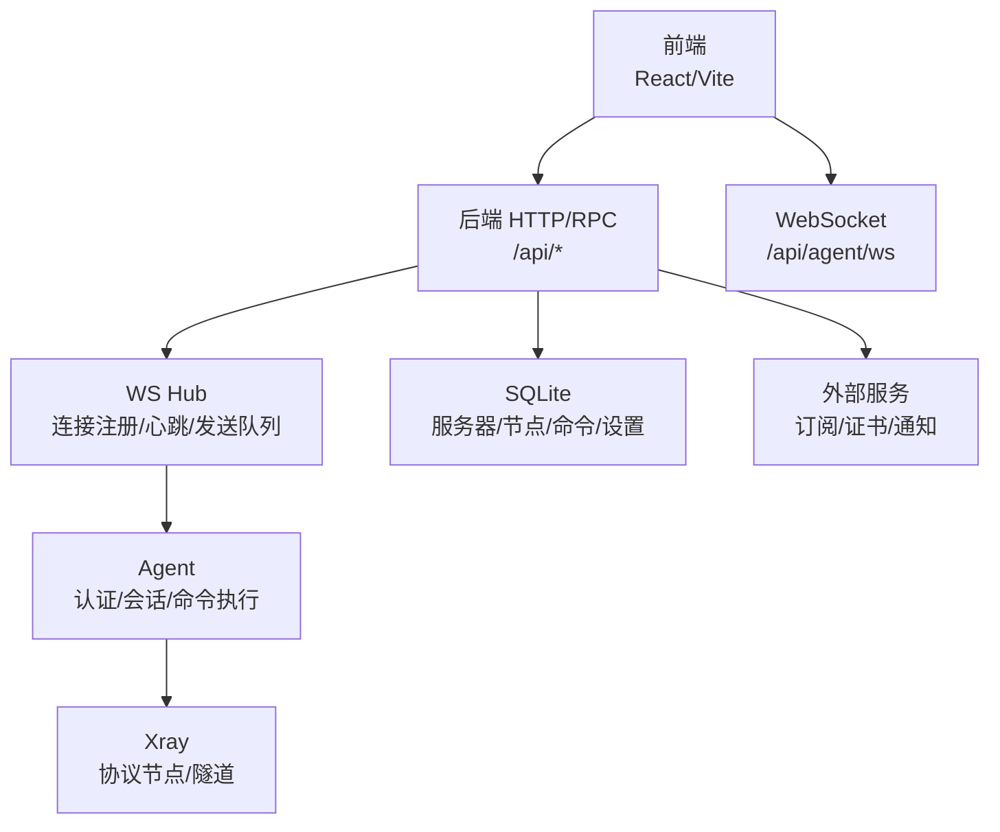
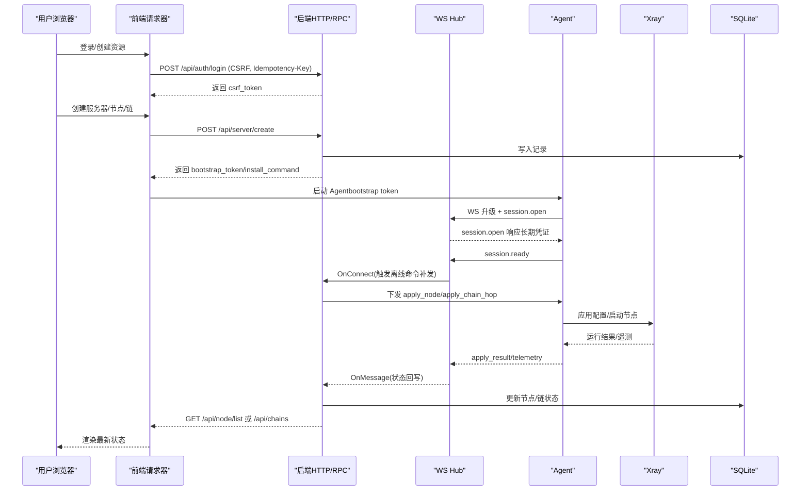
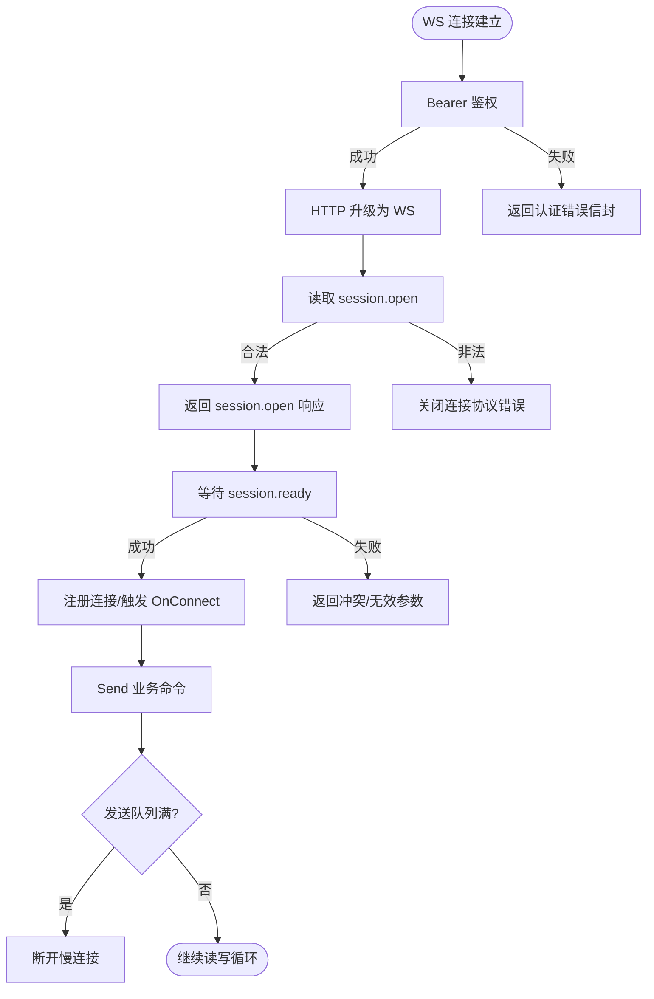
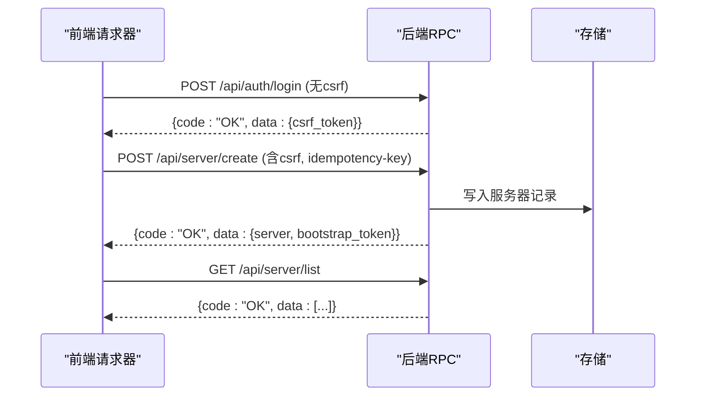
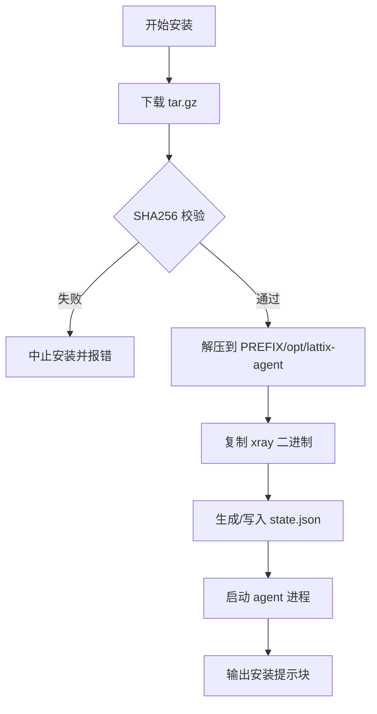
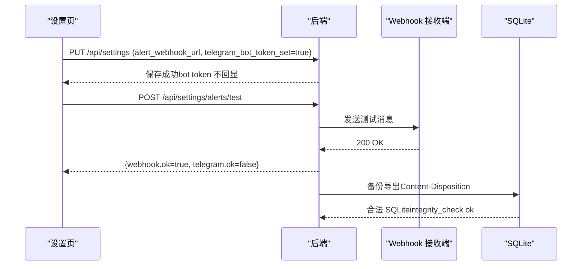
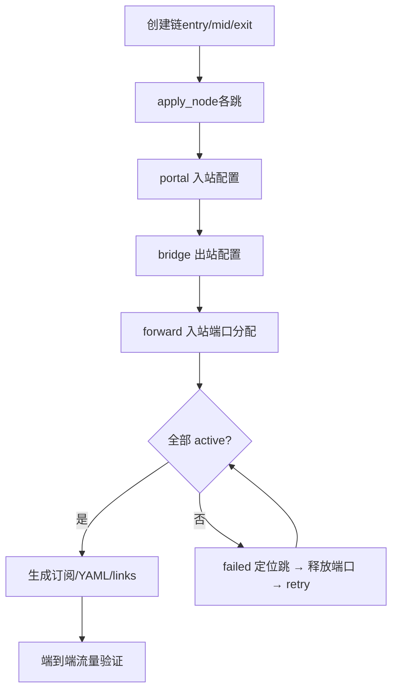
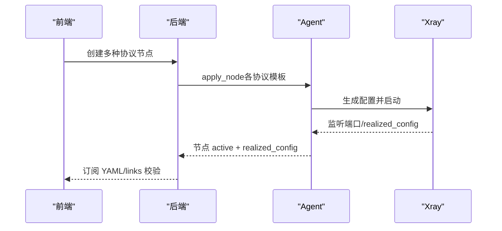
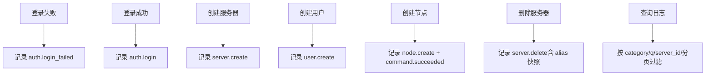
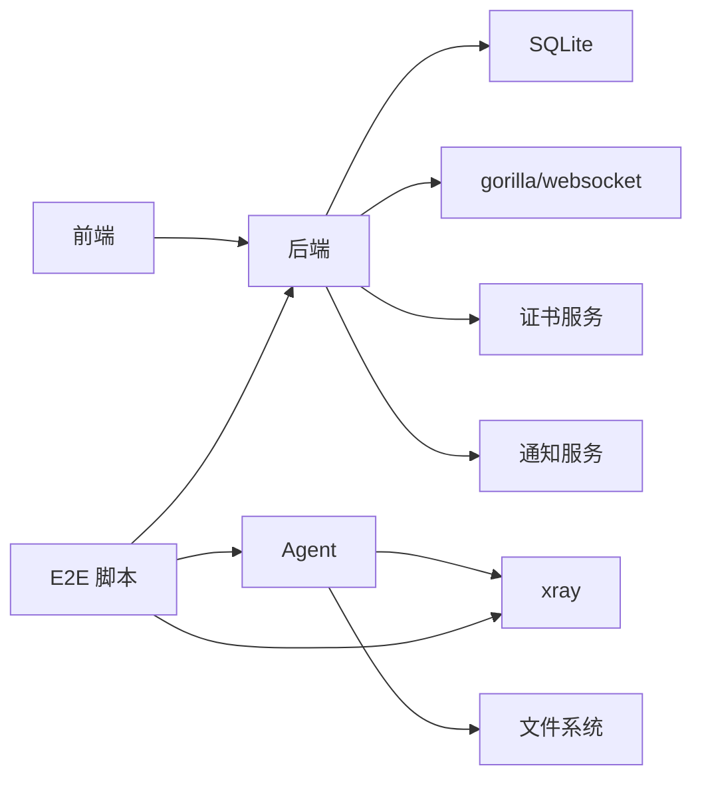

# 组件集成测试

<cite>
**本文引用的文件**   
- [scripts/dev-e2e.sh](file://scripts/dev-e2e.sh)
- [scripts/dev-e2e-panel.sh](file://scripts/dev-e2e-panel.sh)
- [scripts/dev-e2e-install-agent.sh](file://scripts/dev-e2e-install-agent.sh)
- [scripts/dev-e2e-alerts.sh](file://scripts/dev-e2e-alerts.sh)
- [scripts/dev-e2e-chains.sh](file://scripts/dev-e2e-chains.sh)
- [scripts/dev-e2e-event-log.sh](file://scripts/dev-e2e-event-log.sh)
- [scripts/dev-e2e-vlessenc.sh](file://scripts/dev-e2e-vlessenc.sh)
- [scripts/dev-e2e-protocols.sh](file://scripts/dev-e2e-protocols.sh)
- [src/backend/internal/ws/hub.go](file://src/backend/internal/ws/hub.go)
- [src/backend/internal/ws/agent.go](file://src/backend/internal/ws/agent.go)
- [src/backend/internal/ws/agent_test.go](file://src/backend/internal/ws/agent_test.go)
- [src/backend/internal/panel/contract_test.go](file://src/backend/internal/panel/contract_test.go)
- [src/backend/internal/panel/servers_install_test.go](file://src/backend/internal/panel/servers_install_test.go)
- [src/backend/internal/dispatch/chain_test.go](file://src/backend/internal/dispatch/chain_test.go)
- [src/frontend/src/lib/requester.ts](file://src/frontend/src/lib/requester.ts)
- [Dockerfile](file://Dockerfile)
</cite>

## 目录
1. [简介](#简介)
2. [项目结构](#项目结构)
3. [核心组件](#核心组件)
4. [架构总览](#架构总览)
5. [详细组件分析](#详细组件分析)
6. [依赖关系分析](#依赖关系分析)
7. [性能考量](#性能考量)
8. [故障排查指南](#故障排查指南)
9. [结论](#结论)
10. [附录](#附录)

## 简介
本文件面向 Lattix-codex 项目的组件级与端到端（E2E）集成测试，覆盖以下关键目标：
- 后端服务与 Agent 的通信测试：控制通道握手、命令下发与补发、状态同步与离线重试。
- 前端与后端的接口集成测试：页面交互、数据渲染、实时更新与幂等性。
- 第三方服务集成测试：外部 API 调用、证书服务热加载、通知服务（Webhook/Telegram）集成。
- 多组件协同场景：链式代理配置、告警系统、事件日志审计。
- 测试环境容器化部署、依赖模拟、测试数据管理策略与最佳实践。

## 项目结构
本项目采用前后端分离与多进程协作模式：
- 后端（Panel）提供 HTTP/RPC 与 WebSocket 控制通道，维护连接拓扑、命令队列与持久化存储。
- Agent 负责节点生命周期、Xray 配置管理与上报遥测。
- 前端通过 REST 与 WebSocket 进行交互，展示实时状态与操作面板。
- E2E 脚本以 Bash + Python 驱动，构建并编排后端、Agent、xray 与辅助服务，完成端到端断言。

**图表来源**
- [src/backend/internal/ws/hub.go:1-120](file://src/backend/internal/ws/hub.go#L1-L120)
- [src/backend/internal/ws/agent.go:30-120](file://src/backend/internal/ws/agent.go#L30-L120)
- [scripts/dev-e2e-panel.sh:1-60](file://scripts/dev-e2e-panel.sh#L1-L60)

**章节来源**
- [scripts/dev-e2e-panel.sh:1-60](file://scripts/dev-e2e-panel.sh#L1-L60)
- [Dockerfile:1-44](file://Dockerfile#L1-L44)

## 核心组件
- 控制通道（WebSocket Hub）：实现 Agent 连接注册、心跳保活、消息分发、离线重连与优雅停机（drain）。
- 命令调度与状态机：将 apply/remove 类命令持久化，在线时下发，离线时滞留并在重连后补发。
- 前端请求器：封装 CSRF、幂等键、请求/追踪 ID，统一错误解析与重试。
- 安装与自更新：install-agent.sh/latx-ag 校验包完整性，支持用户态/开发态安装与版本回滚。
- 告警与备份：Webhook/Telegram 双通道测试，SQLite 备份下载与完整性校验。
- 链式代理：入口/中转/出口五阶段编排，端口分配、订阅生成、失败重试与恢复。

**章节来源**
- [src/backend/internal/ws/hub.go:1-200](file://src/backend/internal/ws/hub.go#L1-L200)
- [src/backend/internal/ws/agent.go:1-200](file://src/backend/internal/ws/agent.go#L1-L200)
- [src/frontend/src/lib/requester.ts:169-201](file://src/frontend/src/lib/requester.ts#L169-L201)
- [scripts/dev-e2e-install-agent.sh:50-120](file://scripts/dev-e2e-install-agent.sh#L50-L120)
- [scripts/dev-e2e-alerts.sh:1-120](file://scripts/dev-e2e-alerts.sh#L1-L120)
- [scripts/dev-e2e-chains.sh:1-120](file://scripts/dev-e2e-chains.sh#L1-L120)

## 架构总览
下图展示了从前端到后端、再到 Agent 与 xray 的完整链路，以及 E2E 脚本如何编排这些组件。

**图表来源**
- [scripts/dev-e2e-panel.sh:60-134](file://scripts/dev-e2e-panel.sh#L60-L134)
- [src/backend/internal/ws/hub.go:120-220](file://src/backend/internal/ws/hub.go#L120-L220)
- [src/backend/internal/ws/agent.go:120-220](file://src/backend/internal/ws/agent.go#L120-L220)

## 详细组件分析

### 控制通道与命令下发（Hub + Agent）
- 握手流程：Bearer Token 鉴权 → Upgrade → session.open → session.ready → 注册连接。
- 心跳与超时：Agent 主动 Ping，Panel 原样 Pong；读超时由 pongTimeout 控制。
- 命令下发：业务命令进入 send 缓冲，满则断开慢连接并重连补发；离线命令在 OnConnect 回调中补发。
- 状态同步：OnMessage 接收 apply_result，更新数据库与连接快照。

**图表来源**
- [src/backend/internal/ws/agent.go:30-120](file://src/backend/internal/ws/agent.go#L30-L120)
- [src/backend/internal/ws/hub.go:100-180](file://src/backend/internal/ws/hub.go#L100-L180)

**章节来源**
- [src/backend/internal/ws/agent.go:1-200](file://src/backend/internal/ws/agent.go#L1-L200)
- [src/backend/internal/ws/hub.go:1-200](file://src/backend/internal/ws/hub.go#L1-L200)
- [scripts/dev-e2e.sh:1-91](file://scripts/dev-e2e.sh#L1-L91)

### 前端与后端接口集成（Requester + RPC）
- 请求头：X-Request-ID、X-Trace-ID、Idempotency-Key、X-CSRF-Token。
- 错误处理：统一解析 envelope.code/message，抛出结构化错误。
- 幂等性：POST 请求携带唯一幂等键，服务端保证重复提交不生效。
- 认证与会话：登录后获取 csrf_token，后续请求附带。

**图表来源**
- [src/frontend/src/lib/requester.ts:169-201](file://src/frontend/src/lib/requester.ts#L169-L201)
- [scripts/dev-e2e-panel.sh:70-120](file://scripts/dev-e2e-panel.sh#L70-L120)

**章节来源**
- [src/frontend/src/lib/requester.ts:169-201](file://src/frontend/src/lib/requester.ts#L169-L201)
- [scripts/dev-e2e-panel.sh:1-134](file://scripts/dev-e2e-panel.sh#L1-L134)

### 安装与自更新（install-agent.sh + latx-ag）
- 包完整性：checksums.txt 校验 SHA256，篡改即中止。
- 安装模式：LATX_DEV=1 降级安装（复制 xray），用户态模式无需 root。
- 状态清理：预置坏 state.json 不影响首次 bootstrap 换发长期凭证。
- 运维能力：latx-ag version/status/log/update/uninstall。

**图表来源**
- [scripts/dev-e2e-install-agent.sh:50-120](file://scripts/dev-e2e-install-agent.sh#L50-L120)

**章节来源**
- [scripts/dev-e2e-install-agent.sh:1-224](file://scripts/dev-e2e-install-agent.sh#L1-L224)
- [src/backend/internal/panel/servers_install_test.go:1-32](file://src/backend/internal/panel/servers_install_test.go#L1-L32)

### 告警系统与备份（Webhook/Telegram + SQLite Backup）
- 告警通道：Webhook 本地接收验证，Telegram 假 token 预期失败。
- 防抖机制：同一 server_offline 事件 5 分钟内不重复发送。
- 漂移检测：外部修改 xray 配置触发 config_drift。
- 备份下载：GET /api/backup 返回合法 SQLite，文件名带时间戳，临时文件自动清理。

**图表来源**
- [scripts/dev-e2e-alerts.sh:100-204](file://scripts/dev-e2e-alerts.sh#L100-L204)

**章节来源**
- [scripts/dev-e2e-alerts.sh:1-204](file://scripts/dev-e2e-alerts.sh#L1-L204)

### 链式代理与 NAT（入口/中转/出口）
- 五阶段编排：apply_node → portal → bridge → forward → active。
- 端口分配：入口 forward_port 与 portal_port 回执，NAT 机器限制 allowed_ports。
- 订阅生成：YAML 与 links 端点包含入口地址、端口、出口公钥/short_id。
- 故障恢复：停出口 agent → degraded → 重启恢复 active；端口占用导致 failed，释放后 retry 幂等。

**图表来源**
- [scripts/dev-e2e-chains.sh:100-271](file://scripts/dev-e2e-chains.sh#L100-L271)

**章节来源**
- [scripts/dev-e2e-chains.sh:1-271](file://scripts/dev-e2e-chains.sh#L1-L271)
- [src/backend/internal/dispatch/chain_test.go:1-149](file://src/backend/internal/dispatch/chain_test.go#L1-L149)

### 全协议向导与 VLESS Encryption
- 协议覆盖：vless/tcp/grpc/xhttp、vmess、trojan、shadowsocks、socks/http、dokodemo-door。
- realized_config 校验：network、flow、public_key、port 等字段正确。
- VLESS Encryption：mlkem768 组合 vision 1-RTT，订阅含 encryption 字段。

**图表来源**
- [scripts/dev-e2e-protocols.sh:80-166](file://scripts/dev-e2e-protocols.sh#L80-L166)
- [scripts/dev-e2e-vlessenc.sh:110-141](file://scripts/dev-e2e-vlessenc.sh#L110-L141)

**章节来源**
- [scripts/dev-e2e-protocols.sh:1-166](file://scripts/dev-e2e-protocols.sh#L1-L166)
- [scripts/dev-e2e-vlessenc.sh:1-141](file://scripts/dev-e2e-vlessenc.sh#L1-L141)

### 事件日志与审计
- 操作日志：auth.login_failed/auth.login、server.create/user.create/node.create/command.succeeded/server.delete。
- 过滤与分页：category、q、server_id、limit/offset。
- 请求日志尾窗：接口自身不入日志，避免污染。

**图表来源**
- [scripts/dev-e2e-event-log.sh:50-134](file://scripts/dev-e2e-event-log.sh#L50-L134)

**章节来源**
- [scripts/dev-e2e-event-log.sh:1-134](file://scripts/dev-e2e-event-log.sh#L1-L134)

## 依赖关系分析
- 后端依赖：SQLite（持久化）、gorilla/websocket（WS）、外部证书服务（TLS 热加载）、通知服务（Webhook/Telegram）。
- Agent 依赖：xray（协议栈）、文件系统（配置/状态）、系统进程管理（exec runner）。
- 前端依赖：Fetch API、Cookie/CSRF、WebSocket（可选）。
- E2E 依赖：python3、curl、openssl、xray 二进制。

**图表来源**
- [Dockerfile:1-44](file://Dockerfile#L1-L44)
- [src/backend/internal/ws/hub.go:1-60](file://src/backend/internal/ws/hub.go#L1-L60)

**章节来源**
- [Dockerfile:1-44](file://Dockerfile#L1-L44)
- [src/backend/internal/ws/hub.go:1-60](file://src/backend/internal/ws/hub.go#L1-L60)

## 性能考量
- WS 发送队列：单连接缓冲 256 条，满则断开慢连接，重连后补发，避免背压扩散。
- 心跳超时：90s 未收到任何字节判定连接死亡，降低僵尸连接占用。
- 幂等键：减少重复提交对存储与下游的影响。
- 配置校验：xray run -test 预检，失败即丢弃，避免脏配置影响稳定性。

[本节为通用指导，不直接分析具体文件]

## 故障排查指南
- 控制通道问题：检查 WS 握手错误信封、session.open/ready 载荷、认证失败原因。
- 命令未下发：确认 OnConnect 回调是否触发、离线命令状态是否为 queued/sent。
- 节点未 active：查看 apply_result 错误、xray 配置校验输出、端口占用情况。
- 告警未触发：验证 Webhook 可达性、Telegram token 有效性、防抖窗口。
- 备份异常：检查 Content-Disposition 文件名、SQLite 头部与 integrity_check。

**章节来源**
- [src/backend/internal/ws/agent_test.go:1-43](file://src/backend/internal/ws/agent_test.go#L1-L43)
- [scripts/dev-e2e-alerts.sh:150-204](file://scripts/dev-e2e-alerts.sh#L150-L204)

## 结论
本集成测试体系覆盖了 Lattix-codex 的核心路径：控制通道、命令下发、状态同步、前端交互、第三方集成与多组件协同。通过 E2E 脚本与单元测试结合，确保系统在真实环境与模拟环境下均具备高可靠性与可观测性。建议在生产环境中延续相同测试策略，持续回归关键路径。

[本节为总结，不直接分析具体文件]

## 附录
- 容器化部署：使用 Dockerfile 构建镜像，暴露 8080 端口，环境变量 LATTIX_DEPLOY_MODE=docker、LATTIX_DB=/data/lattix.db、LATTIX_TLS_DIR=/data/certs。
- 测试数据管理：每个 E2E 脚本使用 mktemp -d 隔离工作目录，退出时清理进程与文件。
- 依赖服务模拟：本地 webhook 接收器、端口占位监听器、假 release 源。

**章节来源**
- [Dockerfile:24-44](file://Dockerfile#L24-L44)
- [scripts/dev-e2e-alerts.sh:30-70](file://scripts/dev-e2e-alerts.sh#L30-L70)
- [scripts/dev-e2e-install-agent.sh:50-90](file://scripts/dev-e2e-install-agent.sh#L50-L90)