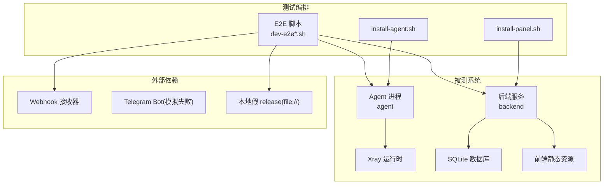
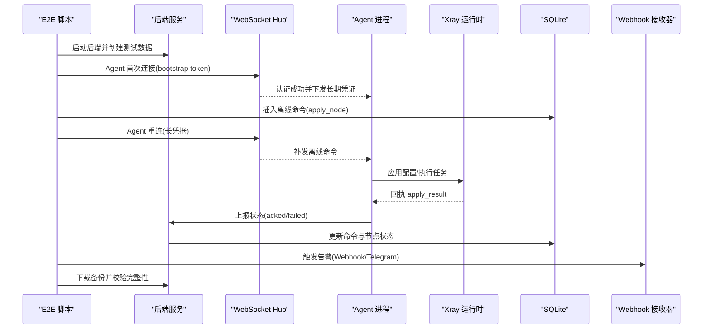
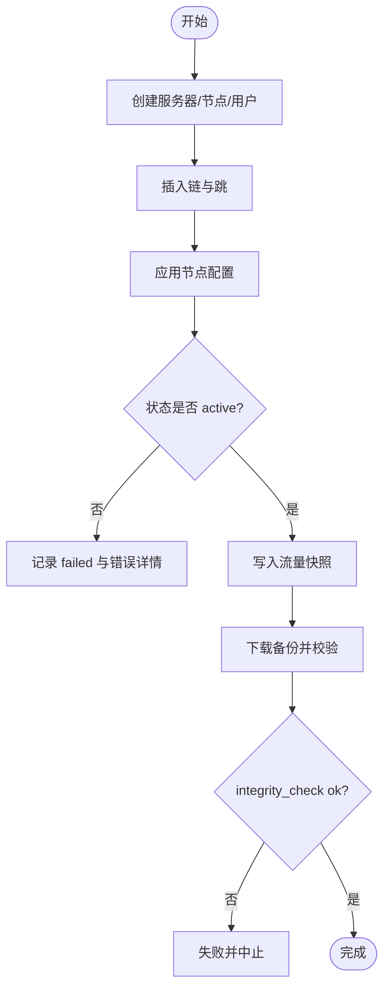
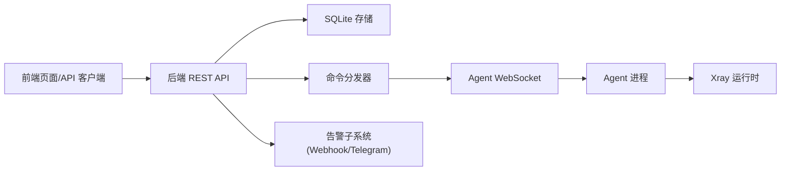
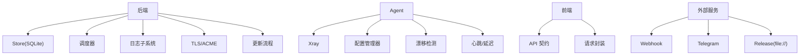

# 集成测试

<cite>
**本文引用的文件**   
- [scripts/dev-e2e.sh](file://scripts/dev-e2e.sh)
- [scripts/dev-e2e-alerts.sh](file://scripts/dev-e2e-alerts.sh)
- [scripts/dev-e2e-chains.sh](file://scripts/dev-e2e-chains.sh)
- [scripts/dev-e2e-event-log.sh](file://scripts/dev-e2e-event-log.sh)
- [scripts/dev-e2e-install-panel.sh](file://scripts/dev-e2e-install-panel.sh)
- [scripts/dev-e2e-install-agent.sh](file://scripts/dev-e2e-install-agent.sh)
- [Dockerfile](file://Dockerfile)
- [src/backend/internal/ws/agent_test.go](file://src/backend/internal/ws/agent_test.go)
- [src/backend/internal/dispatch/chain_test.go](file://src/backend/internal/dispatch/chain_test.go)
- [src/backend/internal/store/server_chain_delete_test.go](file://src/backend/internal/store/server_chain_delete_test.go)
- [src/backend/internal/store/chain_traffic_test.go](file://src/backend/internal/store/chain_traffic_test.go)
- [src/agent/cmd/agent/latency.go](file://src/agent/cmd/agent/latency.go)
- [src/agent/internal/xray/manager.go](file://src/agent/internal/xray/manager.go)
- [src/backend/internal/panel/update.go](file://src/backend/internal/panel/update.go)
- [src/frontend/src/lib/api.ts](file://src/frontend/src/lib/api.ts)
- [src/frontend/src/lib/api-contract.generated.ts](file://src/frontend/src/lib/api-contract.generated.ts)
</cite>

## 目录
1. [简介](#简介)
2. [项目结构](#项目结构)
3. [核心组件](#核心组件)
4. [架构总览](#架构总览)
5. [详细组件分析](#详细组件分析)
6. [依赖关系分析](#依赖关系分析)
7. [性能考量](#性能考量)
8. [故障排查指南](#故障排查指南)
9. [结论](#结论)
10. [附录](#附录)

## 简介
本文件面向 Lattix-codex 项目的集成测试，覆盖以下目标：
- HTTP REST API 集成测试（登录、鉴权、CSRF、幂等键）
- WebSocket 实时通信测试（Agent 握手、心跳与延迟探测、离线命令补发）
- 数据库事务与一致性测试（SQLite 备份、链删除级联、流量快照）
- 多组件集成策略（后端服务与 Agent、前端与后端、第三方服务如 Telegram/Webhook）
- 测试环境搭建（Docker 容器化、模拟 release、测试数据库初始化）
- 测试数据准备与管理（种子数据、Mock 服务、状态管理）
- 具体 E2E 脚本使用（Alerts、Chains、事件日志、安装面板/Agent）

## 项目结构
Lattix-codex 的集成测试以 Bash 驱动的 E2E 脚本为主，辅以 Go 单元测试与最小化的前端 API 契约。关键路径如下：
- scripts 目录：端到端测试脚本与安装脚本
- src/backend/internal：后端业务逻辑与存储层，包含 ws、dispatch、store、panel 等子模块
- src/agent：Agent 程序与 xray 管理器
- src/frontend：前端 API 客户端与类型契约
- Dockerfile：构建镜像与运行参数



图表来源
- [scripts/dev-e2e.sh:1-91](file://scripts/dev-e2e.sh#L1-L91)
- [scripts/dev-e2e-alerts.sh:1-204](file://scripts/dev-e2e-alerts.sh#L1-L204)
- [scripts/dev-e2e-chains.sh:1-271](file://scripts/dev-e2e-chains.sh#L1-L271)
- [scripts/dev-e2e-event-log.sh:1-134](file://scripts/dev-e2e-event-log.sh#L1-L134)
- [scripts/dev-e2e-install-panel.sh:1-150](file://scripts/dev-e2e-install-panel.sh#L1-L150)
- [scripts/dev-e2e-install-agent.sh:1-224](file://scripts/dev-e2e-install-agent.sh#L1-L224)
- [Dockerfile:1-44](file://Dockerfile#L1-L44)

章节来源
- [scripts/dev-e2e.sh:1-91](file://scripts/dev-e2e.sh#L1-L91)
- [scripts/dev-e2e-alerts.sh:1-204](file://scripts/dev-e2e-alerts.sh#L1-L204)
- [scripts/dev-e2e-chains.sh:1-271](file://scripts/dev-e2e-chains.sh#L1-L271)
- [scripts/dev-e2e-event-log.sh:1-134](file://scripts/dev-e2e-event-log.sh#L1-L134)
- [scripts/dev-e2e-install-panel.sh:1-150](file://scripts/dev-e2e-install-panel.sh#L1-L150)
- [scripts/dev-e2e-install-agent.sh:1-224](file://scripts/dev-e2e-install-agent.sh#L1-L224)
- [Dockerfile:1-44](file://Dockerfile#L1-L44)

## 核心组件
- E2E 控制通道验收脚本：验证 bootstrap 认证换发长期凭证、离线命令滞留与重连补发、命令状态回写与错误详情。
- 告警与备份 E2E：设置告警三键、alerts/test 双通道结果、server_offline 防抖、config_drift、node_failed、备份下载与完整性校验。
- 代理链 E2E：同机双 Agent（入口/NAT 出口）、五阶段编排、真实流量断言、订阅与 links、degraded/retry/删除全链路。
- 事件日志 E2E：登录成功/失败留痕、服务器/用户/节点/命令操作审计、分页与关键字过滤、请求日志尾窗。
- 安装面板/Agent E2E：checksum 校验、无 systemd 降级安装、版本/状态检查、会话失效与密码强度校验。

章节来源
- [scripts/dev-e2e.sh:1-91](file://scripts/dev-e2e.sh#L1-L91)
- [scripts/dev-e2e-alerts.sh:1-204](file://scripts/dev-e2e-alerts.sh#L1-L204)
- [scripts/dev-e2e-chains.sh:1-271](file://scripts/dev-e2e-chains.sh#L1-L271)
- [scripts/dev-e2e-event-log.sh:1-134](file://scripts/dev-e2e-event-log.sh#L1-L134)
- [scripts/dev-e2e-install-panel.sh:1-150](file://scripts/dev-e2e-install-panel.sh#L1-L150)
- [scripts/dev-e2e-install-agent.sh:1-224](file://scripts/dev-e2e-install-agent.sh#L1-L224)

## 架构总览
集成测试围绕“后端 + Agent + Xray + SQLite”的核心链路展开，通过 Bash 脚本驱动 API、WebSocket、文件系统与进程生命周期，形成闭环验证。



图表来源
- [scripts/dev-e2e.sh:1-91](file://scripts/dev-e2e.sh#L1-L91)
- [scripts/dev-e2e-alerts.sh:1-204](file://scripts/dev-e2e-alerts.sh#L1-L204)
- [scripts/dev-e2e-chains.sh:1-271](file://scripts/dev-e2e-chains.sh#L1-L271)
- [src/backend/internal/ws/agent_test.go:1-64](file://src/backend/internal/ws/agent_test.go#L1-L64)

## 详细组件分析

### HTTP REST API 集成测试
- 登录与 CSRF：测试脚本通过 curl 携带 Cookie 与 CSRF Token，调用 /api/auth/login 获取令牌，后续请求复用会话。
- 幂等性：安装 Agent 时注入 Idempotency-Key，避免重复安装导致的状态不一致。
- 鉴权与权限：未登录访问备份接口返回 401；登录后正常下载并校验 Content-Disposition。
- 前端契约：前端 api.ts 定义登录、登出、查询等接口，生成类型契约用于前后端一致性。

```mermaid
sequenceDiagram
participant Client as "E2E 脚本/前端"
participant Panel as "后端服务"
participant Store as "Store/Settings"
Client->>Panel : POST /api/auth/login {username,password}
Panel-->>Client : {csrf_token, session}
Client->>Panel : GET /api/backup (无 Cookie)
Panel-->>Client : 401 Unauthorized
Client->>Panel : GET /api/backup (带 Cookie)
Panel-->>Client : 200 OK + attachment; filename="lattix-backup-*.db"
Client->>Panel : PUT /api/settings {alert_webhook_url,...}
Panel->>Store : 写入设置(不回显敏感字段)
Panel-->>Client : 返回脱敏 DTO
```

图表来源
- [scripts/dev-e2e-install-agent.sh:89-114](file://scripts/dev-e2e-install-agent.sh#L89-L114)
- [scripts/dev-e2e-alerts.sh:107-122](file://scripts/dev-e2e-alerts.sh#L107-L122)
- [src/frontend/src/lib/api.ts:58-100](file://src/frontend/src/lib/api.ts#L58-L100)
- [src/frontend/src/lib/api-contract.generated.ts:76-87](file://src/frontend/src/lib/api-contract.generated.ts#L76-L87)

章节来源
- [scripts/dev-e2e-install-agent.sh:89-114](file://scripts/dev-e2e-install-agent.sh#L89-L114)
- [scripts/dev-e2e-alerts.sh:107-122](file://scripts/dev-e2e-alerts.sh#L107-L122)
- [src/frontend/src/lib/api.ts:58-100](file://src/frontend/src/lib/api.ts#L58-L100)
- [src/frontend/src/lib/api-contract.generated.ts:76-87](file://src/frontend/src/lib/api-contract.generated.ts#L76-L87)

### WebSocket 实时通信测试
- 握手与认证：Agent 通过 ws://.../api/agent/ws 连接，服务端校验 bootstrap/长期凭据，失败返回结构化 RPC 响应。
- 心跳与延迟：Agent 侧实现 Ping/Pong 探针，统计延迟样本，确保链路健康。
- 离线命令补发：命令在 sent 状态时断开重连后应重置并重发，确保最终一致。

```mermaid
classDiagram
class LatencyTracker {
-mu : Mutex
-next : uint64
-pending : map[uint64]time.Time
-samples : []float64
-ready : chan struct{}
-once : sync.Once
-enabled : bool
+sendProbe(conn) error
+recordLatency() float64
}
class WSAgentTest {
+TestClientIP()
+TestHandshakeAuthenticationErrorIsStructuredRPCResponse()
}
LatencyTracker <.. WSAgentTest : "被 E2E 间接验证"
```

图表来源
- [src/agent/cmd/agent/latency.go:1-55](file://src/agent/cmd/agent/latency.go#L1-L55)
- [src/backend/internal/ws/agent_test.go:1-64](file://src/backend/internal/ws/agent_test.go#L1-L64)

章节来源
- [src/agent/cmd/agent/latency.go:1-55](file://src/agent/cmd/agent/latency.go#L1-L55)
- [src/backend/internal/ws/agent_test.go:1-64](file://src/backend/internal/ws/agent_test.go#L1-L64)
- [scripts/dev-e2e.sh:34-46](file://scripts/dev-e2e.sh#L34-L46)

### 数据库事务与一致性测试
- 链删除与级联：删除服务器时保持服务身份不变，清理任务但保留必要引用。
- 流量快照：每日流量桶为空时返回空数组；快照可恢复且按乘数计算。
- 备份完整性：下载 SQLite 文件，校验头字节与 integrity_check，确保数据完整。



图表来源
- [src/backend/internal/store/server_chain_delete_test.go:11-109](file://src/backend/internal/store/server_chain_delete_test.go#L11-L109)
- [src/backend/internal/store/chain_traffic_test.go:1-50](file://src/backend/internal/store/chain_traffic_test.go#L1-L50)
- [scripts/dev-e2e-alerts.sh:178-196](file://scripts/dev-e2e-alerts.sh#L178-L196)

章节来源
- [src/backend/internal/store/server_chain_delete_test.go:11-109](file://src/backend/internal/store/server_chain_delete_test.go#L11-L109)
- [src/backend/internal/store/chain_traffic_test.go:1-50](file://src/backend/internal/store/chain_traffic_test.go#L1-L50)
- [scripts/dev-e2e-alerts.sh:178-196](file://scripts/dev-e2e-alerts.sh#L178-L196)

### 多组件集成测试策略
- 后端与 Agent：通过 bootstrap token 建立信任，换发长期凭据，命令队列与回执推进状态机。
- 前端与后端：REST API 调用、CSRF 保护、会话管理与类型契约。
- 第三方服务：Webhook 本地接收器验证成功，Telegram 假 token 验证失败；端口占用构造 node_failed。



图表来源
- [scripts/dev-e2e-chains.sh:106-149](file://scripts/dev-e2e-chains.sh#L106-L149)
- [scripts/dev-e2e-alerts.sh:99-122](file://scripts/dev-e2e-alerts.sh#L99-L122)
- [src/backend/internal/dispatch/chain_test.go:1-149](file://src/backend/internal/dispatch/chain_test.go#L1-L149)

章节来源
- [scripts/dev-e2e-chains.sh:106-149](file://scripts/dev-e2e-chains.sh#L106-L149)
- [scripts/dev-e2e-alerts.sh:99-122](file://scripts/dev-e2e-alerts.sh#L99-L122)
- [src/backend/internal/dispatch/chain_test.go:1-149](file://src/backend/internal/dispatch/chain_test.go#L1-L149)

### 测试环境搭建方法
- Docker 容器化：基于 golang 与 bun 构建前端与后端，暴露 8080 端口，环境变量指定 DB/TLS/ACME 目录。
- 模拟服务：Python 实现的 Webhook 接收器与端口占位监听，用于构造成功/失败场景。
- 测试数据库：SQLite 内存或临时文件，通过 Python 脚本执行 SQL 初始化与断言。
- 假 release：本地 file:// 基址提供 tarball 与 checksums.txt，绕过网络与 CI 依赖。

章节来源
- [Dockerfile:1-44](file://Dockerfile#L1-L44)
- [scripts/dev-e2e-alerts.sh:37-62](file://scripts/dev-e2e-alerts.sh#L37-L62)
- [scripts/dev-e2e.sh:17-24](file://scripts/dev-e2e.sh#L17-L24)
- [scripts/dev-e2e-install-panel.sh:31-42](file://scripts/dev-e2e-install-panel.sh#L31-L42)
- [scripts/dev-e2e-install-agent.sh:57-69](file://scripts/dev-e2e-install-agent.sh#L57-L69)

### 测试数据准备与管理策略
- 种子数据：通过 SQL INSERT 创建服务器、节点、用户、链与命令，保证初始状态可控。
- Mock 服务：Webhook 接收器、端口占位监听、xray 配置文件动态修改。
- 状态管理：Agent state.json 持久化长期凭据，E2E 脚本读取并断言换发行为。
- 配置漂移：Agent 侧维护配置哈希，检测外部篡改并上报 config_drift。

章节来源
- [scripts/dev-e2e.sh:31-51](file://scripts/dev-e2e.sh#L31-L51)
- [scripts/dev-e2e-alerts.sh:147-163](file://scripts/dev-e2e-alerts.sh#L147-L163)
- [src/agent/internal/xray/manager.go:259-304](file://src/agent/internal/xray/manager.go#L259-L304)
- [scripts/dev-e2e-install-agent.sh:116-151](file://scripts/dev-e2e-install-agent.sh#L116-L151)

### 具体集成测试脚本示例与使用方法
- E2E 控制通道：scripts/dev-e2e.sh
  - 构建后端与 Agent，启动后端，插入 bootstrap 服务器，Agent 首次连接认证并换发长凭据。
  - 模拟离线命令滞留与重连补发，断言命令状态回写与错误详情。
- Alerts 测试：scripts/dev-e2e-alerts.sh
  - 启动 Webhook 接收器与后端，设置告警三键，POST alerts/test 验证双通道结果。
  - 杀 Agent 触发 server_offline，5 分钟内防抖抑制重复告警；外部篡改配置触发 config_drift。
  - 端口占用构造 node_failed，GET /api/backup 下载并校验 SQLite 完整性。
- Chains 测试：scripts/dev-e2e-chains.sh
  - 双 Agent（入口/NAT 出口），建链并等待五阶段编排 active，验证订阅与 links。
  - 真实流量断言（可选跳过），degraded 与恢复，失败重试与幂等拒绝，删除链与清理。
- 事件日志测试：scripts/dev-e2e-event-log.sh
  - 登录失败/成功留痕，服务器/用户/节点/命令操作审计，分页与关键字过滤，请求日志尾窗。
- 安装面板/Agent：scripts/dev-e2e-install-panel.sh、scripts/dev-e2e-install-agent.sh
  - checksum 篡改中止安装，无 systemd 降级安装，版本/状态检查，会话失效与密码强度校验。

章节来源
- [scripts/dev-e2e.sh:1-91](file://scripts/dev-e2e.sh#L1-L91)
- [scripts/dev-e2e-alerts.sh:1-204](file://scripts/dev-e2e-alerts.sh#L1-L204)
- [scripts/dev-e2e-chains.sh:1-271](file://scripts/dev-e2e-chains.sh#L1-L271)
- [scripts/dev-e2e-event-log.sh:1-134](file://scripts/dev-e2e-event-log.sh#L1-L134)
- [scripts/dev-e2e-install-panel.sh:1-150](file://scripts/dev-e2e-install-panel.sh#L1-L150)
- [scripts/dev-e2e-install-agent.sh:1-224](file://scripts/dev-e2e-install-agent.sh#L1-L224)

## 依赖关系分析
- 后端依赖：SQLite 存储、调度器、日志子系统、TLS/ACME、发布更新流程。
- Agent 依赖：xray 运行时、配置管理器、漂移检测、心跳与延迟追踪。
- 前端依赖：OpenAPI 契约、请求封装、CSRF 与会话管理。
- 外部依赖：Webhook、Telegram、Release 源（file://）。



图表来源
- [src/backend/internal/panel/update.go:312-421](file://src/backend/internal/panel/update.go#L312-L421)
- [src/agent/internal/xray/manager.go:259-304](file://src/agent/internal/xray/manager.go#L259-L304)
- [src/frontend/src/lib/api.ts:58-100](file://src/frontend/src/lib/api.ts#L58-L100)

章节来源
- [src/backend/internal/panel/update.go:312-421](file://src/backend/internal/panel/update.go#L312-L421)
- [src/agent/internal/xray/manager.go:259-304](file://src/agent/internal/xray/manager.go#L259-L304)
- [src/frontend/src/lib/api.ts:58-100](file://src/frontend/src/lib/api.ts#L58-L100)

## 性能考量
- 心跳与延迟：Agent 侧使用 Ping/Pong 探针与滑动窗口统计，避免频繁 IO。
- 命令补发：仅对 sent 状态命令进行重放，减少冗余负载。
- 备份下载：流式下载与完整性校验，避免大文件内存占用。
- 配置漂移：哈希比对与懒加载，降低 CPU 开销。

章节来源
- [src/agent/cmd/agent/latency.go:1-55](file://src/agent/cmd/agent/latency.go#L1-L55)
- [scripts/dev-e2e.sh:48-65](file://scripts/dev-e2e.sh#L48-L65)
- [scripts/dev-e2e-alerts.sh:178-196](file://scripts/dev-e2e-alerts.sh#L178-L196)
- [src/agent/internal/xray/manager.go:275-297](file://src/agent/internal/xray/manager.go#L275-L297)

## 故障排查指南
- 认证失败：检查 bootstrap token 是否正确，Agent 日志中是否有 “authenticated as server” 提示。
- 命令未补发：确认命令状态为 sent，重连后是否收到 apply_node/add_user 等命令。
- 告警未触发：验证 Webhook 接收器是否运行，Telegram token 是否为假；检查防抖时间窗口。
- 链状态异常：查看各跳状态与错误详情，释放端口后重试，确认 retry 幂等拒绝。
- 备份不完整：校验 SQLite 头字节与 integrity_check，检查临时文件清理。

章节来源
- [scripts/dev-e2e.sh:39-46](file://scripts/dev-e2e.sh#L39-L46)
- [scripts/dev-e2e.sh:58-71](file://scripts/dev-e2e.sh#L58-L71)
- [scripts/dev-e2e-alerts.sh:124-145](file://scripts/dev-e2e-alerts.sh#L124-L145)
- [scripts/dev-e2e-chains.sh:222-243](file://scripts/dev-e2e-chains.sh#L222-L243)
- [scripts/dev-e2e-alerts.sh:186-196](file://scripts/dev-e2e-alerts.sh#L186-L196)

## 结论
Lattix-codex 的集成测试体系以 Bash E2E 脚本为核心，覆盖 HTTP、WebSocket、数据库与多组件交互，结合 Docker 与模拟服务，提供了稳定可靠的端到端验证能力。通过种子数据、Mock 与状态管理，确保了测试的可重复性与可维护性。建议持续完善测试覆盖率，特别是在复杂链路与第三方服务集成方面。

## 附录
- 运行单个 E2E 脚本前，确保已安装 python3、curl、xray 二进制（可通过 XRAY_BIN 覆盖）。
- 使用 LATX_DEV=1 与 LATX_PREFIX 可在无 root 环境下运行 Agent 安装测试。
- CHAINS_SKIP_EXTERNAL=1 可跳过外网流量断言，适用于离线环境。

章节来源
- [scripts/dev-e2e-alerts.sh:1-13](file://scripts/dev-e2e-alerts.sh#L1-L13)
- [scripts/dev-e2e-install-agent.sh:1-11](file://scripts/dev-e2e-install-agent.sh#L1-L11)
- [scripts/dev-e2e-chains.sh:11-13](file://scripts/dev-e2e-chains.sh#L11-L13)