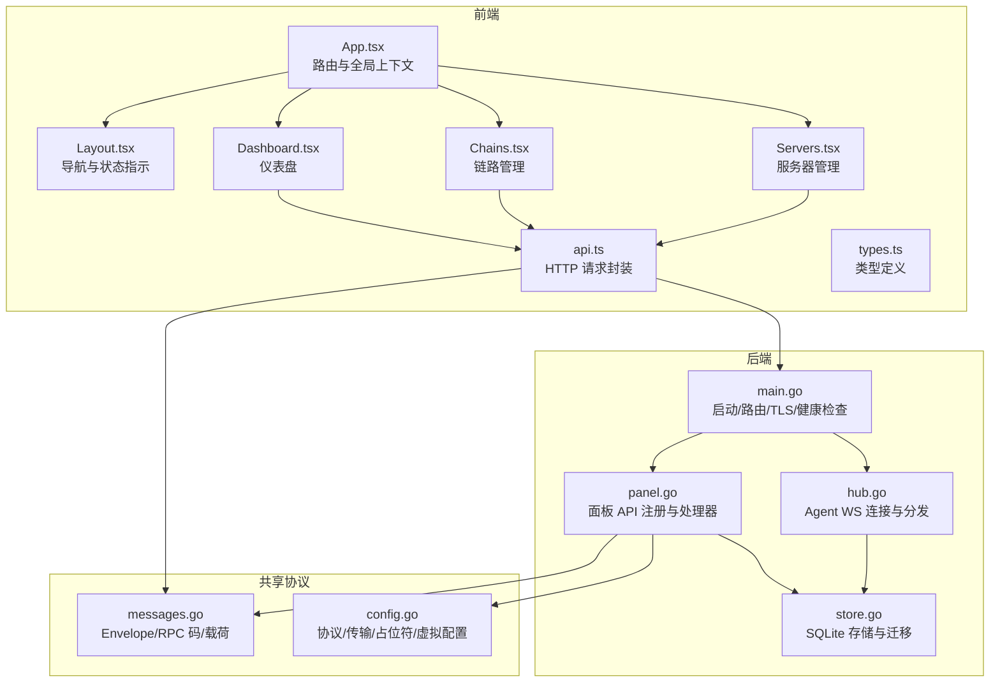
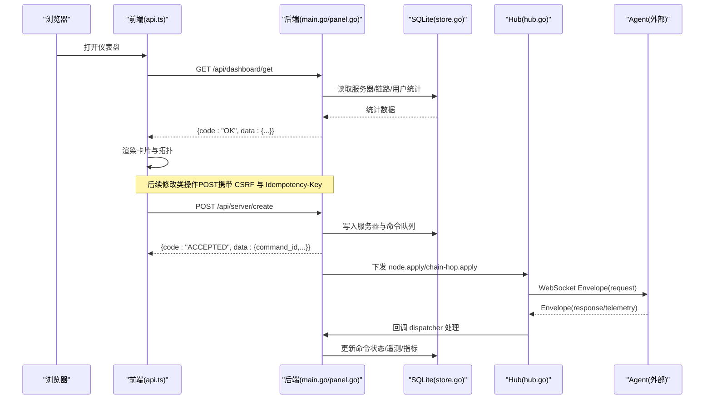
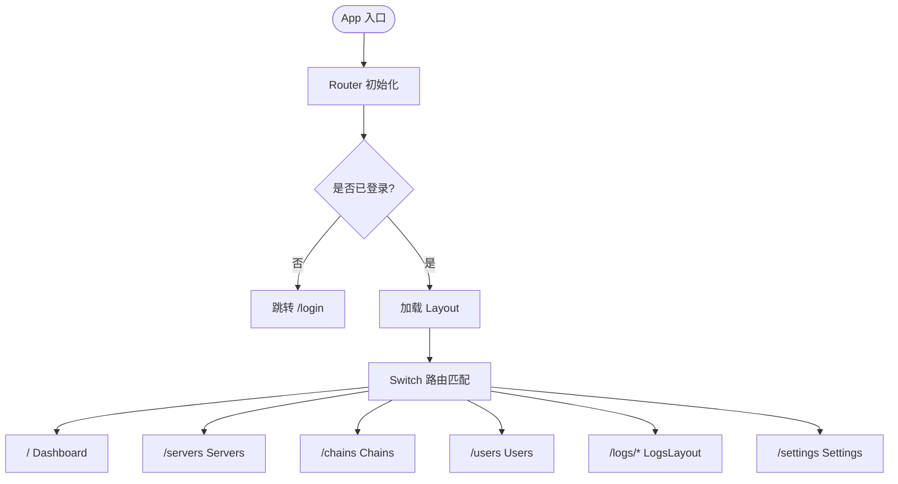
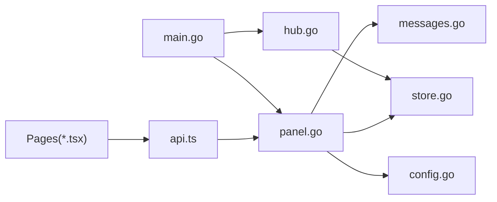

# 交互式管理界面

<cite>
**本文引用的文件**   
- [App.tsx](file://src/frontend/src/App.tsx)
- [Layout.tsx](file://src/frontend/src/components/Layout.tsx)
- [Dashboard.tsx](file://src/frontend/src/pages/Dashboard.tsx)
- [Chains.tsx](file://src/frontend/src/pages/Chains.tsx)
- [Servers.tsx](file://src/frontend/src/pages/Servers.tsx)
- [api.ts](file://src/frontend/src/lib/api.ts)
- [types.ts](file://src/frontend/src/lib/types.ts)
- [main.go](file://src/backend/cmd/backend/main.go)
- [panel.go](file://src/backend/internal/panel/panel.go)
- [hub.go](file://src/backend/internal/ws/hub.go)
- [store.go](file://src/backend/internal/store/store.go)
- [config.go](file://src/shared/config.go)
- [messages.go](file://src/shared/messages.go)
- [openapi.yaml](file://docs/openapi.yaml)
- [rpc-api-design.md](file://docs/rpc-api-design.md)
- [frontend.md](file://docs/frontend.md)
</cite>

## 目录
1. [简介](#简介)
2. [项目结构](#项目结构)
3. [核心组件](#核心组件)
4. [架构总览](#架构总览)
5. [详细组件分析](#详细组件分析)
6. [依赖关系分析](#依赖关系分析)
7. [性能考量](#性能考量)
8. [故障排查指南](#故障排查指南)
9. [结论](#结论)
10. [附录](#附录)

## 简介
本文件面向“交互式管理界面”（Lattix 控制面板）的完整技术文档，涵盖前端 React SPA、后端 Go HTTP API、WebSocket 控制通道、SQLite 存储与共享协议类型。文档从系统架构、组件职责、数据流、处理逻辑、集成点、错误处理与性能特性等维度进行系统化说明，并辅以代码级图示，帮助读者快速理解与上手。

## 项目结构
- 前端（React + Vite + TypeScript + shadcn/ui）：位于 src/frontend，提供仪表盘、服务器、链路、用户、日志、设置等页面；通过 api.ts 统一调用后端 RPC。
- 后端（Go）：位于 src/backend，包含 HTTP 路由注册、面板业务逻辑、WebSocket Hub、调度器、告警、日志、存储等模块。
- 共享协议（Go）：位于 src/shared，定义前后端与 Agent 间共用的消息信封、RPC 码、配置模板与实现值等。
- 设计文档：docs 下包含 OpenAPI 契约、RPC 协议设计、前端开发说明等。

**图表来源** 
- [App.tsx:1-121](file://src/frontend/src/App.tsx#L1-L121)
- [Layout.tsx:1-231](file://src/frontend/src/components/Layout.tsx#L1-L231)
- [Dashboard.tsx:1-199](file://src/frontend/src/pages/Dashboard.tsx#L1-L199)
- [Chains.tsx:1-200](file://src/frontend/src/pages/Chains.tsx#L1-L200)
- [Servers.tsx:1-200](file://src/frontend/src/pages/Servers.tsx#L1-L200)
- [api.ts:1-294](file://src/frontend/src/lib/api.ts#L1-L294)
- [main.go:1-638](file://src/backend/cmd/backend/main.go#L1-L638)
- [panel.go:1-438](file://src/backend/internal/panel/panel.go#L1-L438)
- [hub.go:1-413](file://src/backend/internal/ws/hub.go#L1-L413)
- [store.go:1-200](file://src/backend/internal/store/store.go#L1-L200)
- [messages.go:1-313](file://src/shared/messages.go#L1-L313)
- [config.go:1-206](file://src/shared/config.go#L1-L206)

**章节来源**
- [frontend.md:1-17](file://docs/frontend.md#L1-L17)
- [App.tsx:1-121](file://src/frontend/src/App.tsx#L1-L121)
- [main.go:1-638](file://src/backend/cmd/backend/main.go#L1-L638)

## 核心组件
- 前端 App 与路由：集中式路由、懒加载页面、认证守卫、主题与时区上下文。
- 布局与导航：侧边栏、移动端抽屉、面板生命周期状态指示、登出流程。
- 页面模块：仪表盘（聚合统计与拓扑）、服务器（增删改查、端口段、计费与流量计划）、链路（多跳编排、状态与流量历史）。
- 请求层：统一的 Requester，封装 CSRF、幂等键、超时取消、严格响应信封解析与错误转换。
- 后端主进程：参数解析、TLS/ACME、静态资源嵌入、健康检查、优雅关停、WS 升级、路由注册。
- 面板 API：按领域注册 RPC 路由，鉴权、CSRF、幂等、日志策略、统一响应信封。
- WebSocket Hub：Agent 连接注册表、发送队列、心跳与超时、重连与离线补发、生命周期同步。
- 存储层：SQLite Schema、命令队列与操作日志、指标历史、幂等记录、用户-节点关联等。
- 共享协议：Envelope、RPC 码、消息类型、虚拟配置与实现值、遥测与漂移上报等。

**章节来源**
- [App.tsx:1-121](file://src/frontend/src/App.tsx#L1-L121)
- [Layout.tsx:1-231](file://src/frontend/src/components/Layout.tsx#L1-L231)
- [Dashboard.tsx:1-199](file://src/frontend/src/pages/Dashboard.tsx#L1-L199)
- [Chains.tsx:1-200](file://src/frontend/src/pages/Chains.tsx#L1-L200)
- [Servers.tsx:1-200](file://src/frontend/src/pages/Servers.tsx#L1-L200)
- [api.ts:1-294](file://src/frontend/src/lib/api.ts#L1-L294)
- [panel.go:1-438](file://src/backend/internal/panel/panel.go#L1-L438)
- [hub.go:1-413](file://src/backend/internal/ws/hub.go#L1-L413)
- [store.go:1-200](file://src/backend/internal/store/store.go#L1-L200)
- [messages.go:1-313](file://src/shared/messages.go#L1-L313)
- [config.go:1-206](file://src/shared/config.go#L1-L206)

## 架构总览
整体采用“前端 SPA + 后端 HTTP API + WebSocket 控制通道 + SQLite”的分层架构。前端通过 api.ts 发起 RESTful 风格的 JSON RPC，后端 panel.go 负责鉴权、校验、落库与编排；Agent 通过 ws hub.go 建立长连接，接收 node/chain/user 等指令并回传遥测与结果。

**图表来源** 
- [api.ts:1-294](file://src/frontend/src/lib/api.ts#L1-L294)
- [panel.go:1-438](file://src/backend/internal/panel/panel.go#L1-L438)
- [main.go:1-638](file://src/backend/cmd/backend/main.go#L1-L638)
- [hub.go:1-413](file://src/backend/internal/ws/hub.go#L1-L413)
- [store.go:1-200](file://src/backend/internal/store/store.go#L1-L200)
- [messages.go:1-313](file://src/shared/messages.go#L1-L313)

## 详细组件分析

### 前端应用与路由（App.tsx）
- 使用 wouter Router 与 Suspense 懒加载页面，提供登录保护 RequireAuth 与受保护路由 ProtectedRoutes。
- 全局 Provider：Theme、Dialog、Auth、Timezone。
- 路由映射：/、/servers、/chains、/users、/logs/*、/settings。

**图表来源** 
- [App.tsx:1-121](file://src/frontend/src/App.tsx#L1-L121)

**章节来源**
- [App.tsx:1-121](file://src/frontend/src/App.tsx#L1-L121)

### 布局与导航（Layout.tsx）
- 侧边栏/移动端抽屉导航，高亮当前路径。
- 面板生命周期状态轮询展示（startup/active/updating/faulted）。
- 登出流程与错误提示。

**章节来源**
- [Layout.tsx:1-231](file://src/frontend/src/components/Layout.tsx#L1-L231)

### 仪表盘（Dashboard.tsx）
- 并发拉取 dashboard/stats、server/list、chain/list。
- 每 5 秒轮询，AbortController 取消过期请求。
- 展示服务器/在线节点/链路/订阅用户统计与拓扑图。

**章节来源**
- [Dashboard.tsx:1-199](file://src/frontend/src/pages/Dashboard.tsx#L1-L199)

### 服务器管理（Servers.tsx）
- 支持创建/更新/删除、旋转 token、修复、升级 xray/agent。
- 端口段编辑与校验（单端口/范围/映射），地址候选（learned_addr + NIC 非环回）。
- 计费与流量计划表单，服务商管理与汇率刷新。

**章节来源**
- [Servers.tsx:1-200](file://src/frontend/src/pages/Servers.tsx#L1-L200)

### 链路管理（Chains.tsx）
- 多跳编排（entry/middle/exit），状态机（pending/applying/active/degraded/waiting_for_agent 等）。
- 实时流量历史折线图（相对用量），链重试与强制发布。
- Reality dest 白名单与指纹/加密方式选择。

**章节来源**
- [Chains.tsx:1-200](file://src/frontend/src/pages/Chains.tsx#L1-L200)

### 请求层（api.ts）
- 统一封装 GET/POST/下载，自动注入 CSRF、Idempotency-Key、request/trace ID。
- 严格解析统一响应信封，错误分类（业务/传输/协议）。
- 暴露各域 API：auth、dashboard、server、node、chain、user、setting、panel、log、backup。

**章节来源**
- [api.ts:1-294](file://src/frontend/src/lib/api.ts#L1-L294)

### 类型定义（types.ts）
- 仪表盘统计、服务器指标、端口段、机器类型、计费与流量计划、命令日志、节点状态等。
- 与后端 OpenAPI 契约保持一致的类型来源。

**章节来源**
- [types.ts:1-200](file://src/frontend/src/lib/types.ts#L1-L200)

### 后端主进程（main.go）
- 参数解析：监听地址、数据库、日志目录、静态覆盖、管理员账号密码、公共 URL、GitHub 仓库、TLS/ACME、重置管理员等。
- TLS 模式：off/cert/path/acme，支持热加载证书与 ACME 自动签发。
- 健康检查：/healthz、/readyz（含 drain 与 DB Ping）。
- 路由注册：/api/agent/ws、/sub/{token}、/sub/{token}/links、SPA 静态资源回退。
- 优雅关停：drain 中间件拒绝新请求、关闭 WS、等待后台任务、记录停止原因。

**章节来源**
- [main.go:1-638](file://src/backend/cmd/backend/main.go#L1-L638)

### 面板 API（panel.go）
- 按领域注册 RPC 路由，区分 read/poll/read+fail-only/write/idempotent/CSRF/SameOrigin 等选项。
- 统一响应信封 writeRPC，错误映射 rpcCodeForLegacyStatus。
- 面板基础信息：Operator、PanelBase、isSecure。
- 后台任务：用户过期清理、指标保留、版本检查、计费巡检、汇率刷新。

**章节来源**
- [panel.go:1-438](file://src/backend/internal/panel/panel.go#L1-L438)

### WebSocket Hub（hub.go）
- Hub 作为 Agent 连接注册表与 Requester，维护连接状态、发送队列、超时与慢连接断开。
- BeginDrain 关闭所有 Agent 连接，Wait 等待完成。
- SyncLifecycle 向所有在线 Agent 广播生命周期变更并等待 ACK。
- register/unregister 触发 OnOnline/OnReconnect/OnDisconnect 钩子。

**章节来源**
- [hub.go:1-413](file://src/backend/internal/ws/hub.go#L1-L413)

### 存储层（store.go）
- SQLite Schema：servers、providers、billing、traffic_plans、users、nodes、commands、rpc_idempotency、user_nodes、server_metrics、metric_history 等。
- 同时承担离线命令队列与操作日志、指标历史、幂等记录等职责。

**章节来源**
- [store.go:1-200](file://src/backend/internal/store/store.go#L1-L200)

### 共享协议（messages.go, config.go）
- Envelope 统一信封：kind/type/request_id/trace_id/code/message/data，MarshalJSON 保证 response 必带 code/message。
- RPC 码：OK/ACCEPTED/AUTH_REQUIRED/INVALID_ARGUMENT/NOT_FOUND/CONFLICT/OPERATION_LOCKED/UNSUPPORTED_ACTION/INTERNAL_ERROR/UPSTREAM_ERROR/SERVICE_UNAVAILABLE/SERVER_OFFLINE/PORT_OUT_OF_RANGE/UPDATE_IN_PROGRESS。
- 消息类型：session.open/ready、credential.commit、lifecycle.changed、settings.sync/changed、node.apply/remove、user.add/remove、xray.upgrade、agent.upgrade/uninstall、telemetry.report、config.drift、chain-hop.apply/remove。
- 虚拟配置 VirtualConfig 与实现值 RealizedConfig，占位符 PORT/PRIVATE_KEY/CLIENTS/DECRYPTION/TAG。
- 协议常量：Protocols、Networks、XHTTPModes、VLessEncMethods、SSMethods、Fingerprints 等。

**章节来源**
- [messages.go:1-313](file://src/shared/messages.go#L1-L313)
- [config.go:1-206](file://src/shared/config.go#L1-L206)

## 依赖关系分析
- 前端依赖后端 OpenAPI 契约与 api.ts 方法；页面组件通过 types.ts 保持类型一致。
- 后端 main.go 组装 panel、ws、store、logging、alert、dispatch、lifecycle 等模块。
- panel.go 依赖 store、dispatcher、hub、alerter、scheduler、releases/exchange/catalog。
- hub.go 依赖 shared.Envelope 与 lifecycle 快照接口。
- store.go 提供持久化能力，被 panel 与 ws 共同使用。

**图表来源** 
- [api.ts:1-294](file://src/frontend/src/lib/api.ts#L1-L294)
- [panel.go:1-438](file://src/backend/internal/panel/panel.go#L1-L438)
- [main.go:1-638](file://src/backend/cmd/backend/main.go#L1-L638)
- [hub.go:1-413](file://src/backend/internal/ws/hub.go#L1-L413)
- [store.go:1-200](file://src/backend/internal/store/store.go#L1-L200)
- [messages.go:1-313](file://src/shared/messages.go#L1-L313)
- [config.go:1-206](file://src/shared/config.go#L1-L206)

**章节来源**
- [openapi.yaml:1-200](file://docs/openapi.yaml#L1-L200)
- [rpc-api-design.md:1-382](file://docs/rpc-api-design.md#L1-L382)

## 性能考量
- 前端：
  - 懒加载页面与 Suspense 降低首屏体积。
  - 并发请求与 AbortController 避免竞态与内存泄漏。
  - 静默请求（display:'silent'）减少 UI 抖动。
- 后端：
  - HTTP Server 读写超时与空闲超时合理配置。
  - WS 写超时与发送队列满即断线，重连后补发，保障稳定性。
  - 健康检查不进入高频请求日志，ready 状态变化写操作日志。
  - 优雅关停阶段不再反向写请求日志，确保最后一条为 panel.stopped。
- 存储：
  - SQLite 事务化迁移与索引优化（如幂等表索引）。
  - 指标历史定期清理，避免膨胀。

[本节为通用指导，无需源码引用]

## 故障排查指南
- 登录失败或会话失效：
  - 检查 CSRF Token 是否正确注入；改密/登出会清空 token。
  - 查看 /api/auth/me 返回与后端鉴权中间件行为。
- 请求报错：
  - 统一响应信封 code 字段判断业务错误；HTTP 状态仅表达协议层问题。
  - 关注 429 限流与 Retry-After 头。
- WS 连接异常：
  - Hub 发送队列满会断开连接，Agent 需重连并补发离线命令。
  - 检查 OnProtocolError 回调与 OnDisconnect 事件。
- 健康检查：
  - /healthz 仅进程可响应；/readyz 检查初始化与 DB Ping，drain 期间返回 503。
- 日志定位：
  - 操作日志与请求日志分离，结合 request_id/trace_id 追踪全链路。

**章节来源**
- [rpc-api-design.md:1-382](file://docs/rpc-api-design.md#L1-L382)
- [main.go:1-638](file://src/backend/cmd/backend/main.go#L1-L638)
- [panel.go:1-438](file://src/backend/internal/panel/panel.go#L1-L438)
- [hub.go:1-413](file://src/backend/internal/ws/hub.go#L1-L413)

## 结论
该交互式管理界面以清晰的模块化设计与严格的协议约束实现了高可用、易扩展的控制平面。前端通过统一请求层与类型安全提升开发效率；后端以 panel API + WS Hub + SQLite 为核心，配合优雅关停与健康检查保障生产稳定性。建议在后续迭代中持续完善监控告警、权限细化与多管理员支持。

[本节为总结性内容，无需源码引用]

## 附录
- 前端开发命令与构建产物位置见 docs/frontend.md。
- 管理 API 契约详见 docs/openapi.yaml 与 docs/rpc-api-design.md。

**章节来源**
- [frontend.md:1-17](file://docs/frontend.md#L1-L17)
- [openapi.yaml:1-200](file://docs/openapi.yaml#L1-L200)
- [rpc-api-design.md:1-382](file://docs/rpc-api-design.md#L1-L382)