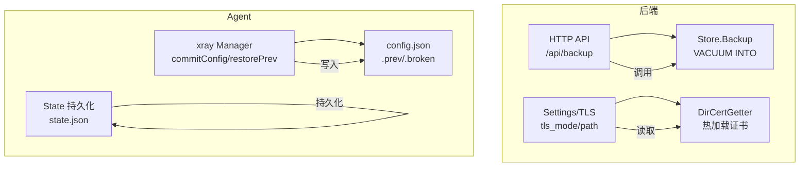
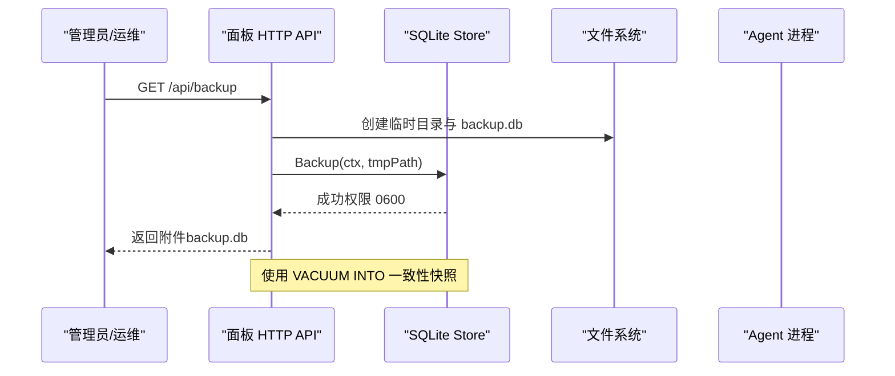
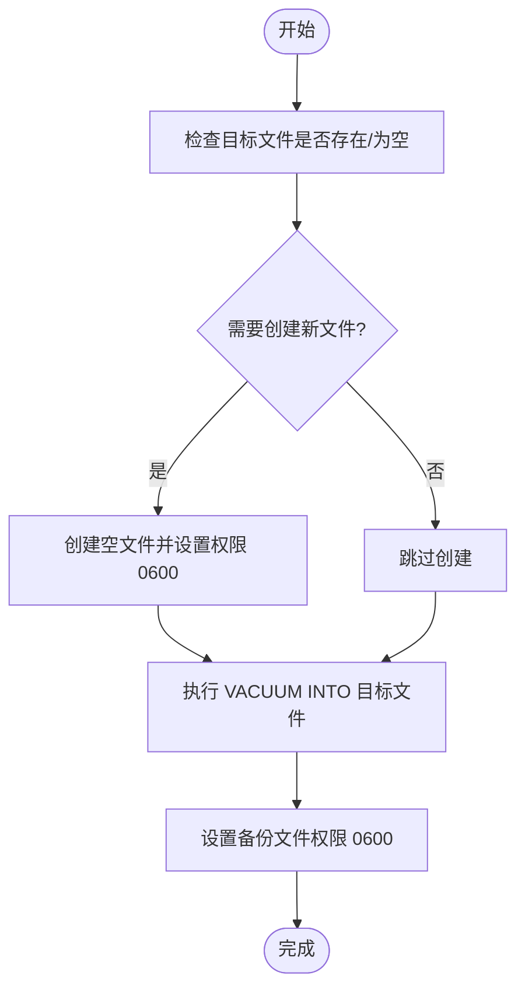
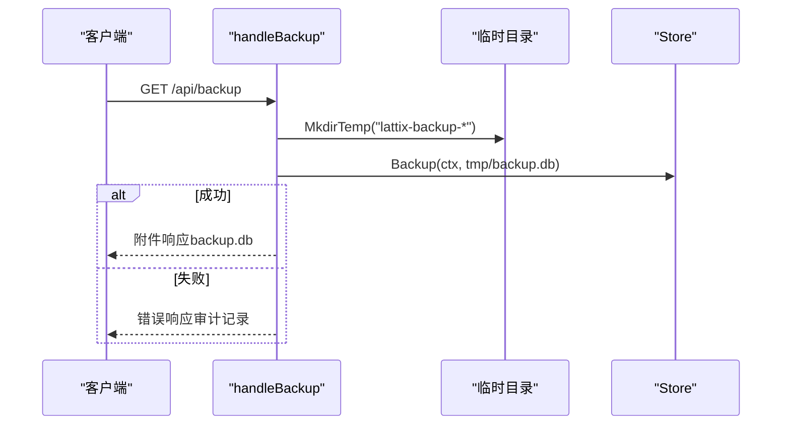
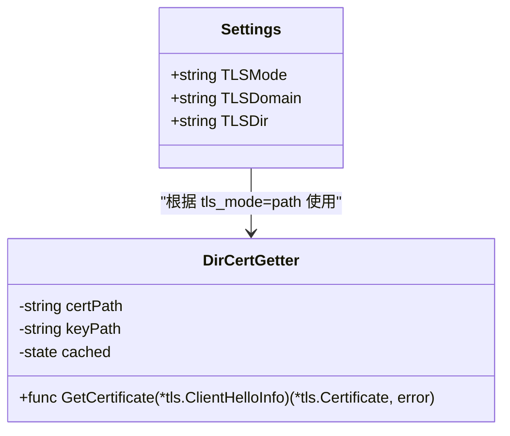
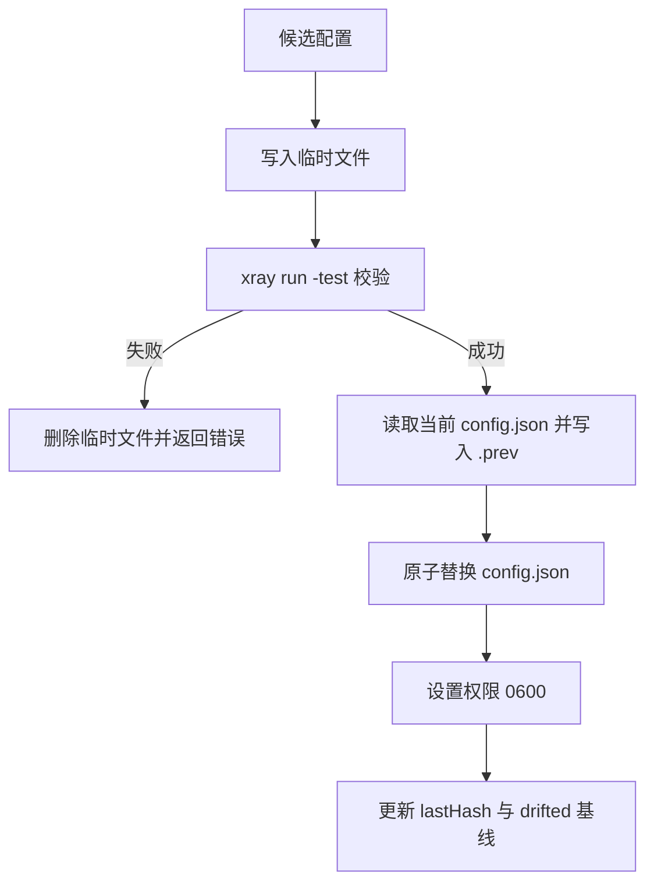
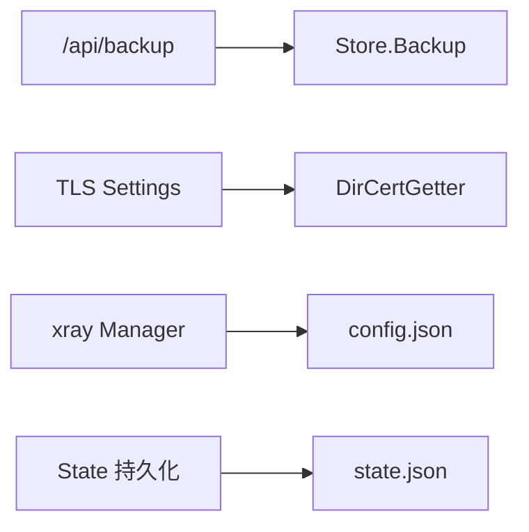

# 备份恢复

<cite>
**本文引用的文件**   
- [store.go](file://src/backend/internal/store/store.go)
- [alerts.go](file://src/backend/internal/panel/alerts.go)
- [settings.go](file://src/backend/internal/panel/settings.go)
- [certdir.go](file://src/backend/internal/panel/certdir.go)
- [manager.go](file://src/agent/internal/xray/manager.go)
- [state.go](file://src/agent/internal/state/state.go)
- [main.go](file://src/backend/cmd/backend/main.go)
- [install-panel.sh](file://scripts/dev-e2e-install-panel.sh)
</cite>

## 目录
1. [简介](#简介)
2. [项目结构](#项目结构)
3. [核心组件](#核心组件)
4. [架构总览](#架构总览)
5. [详细组件分析](#详细组件分析)
6. [依赖关系分析](#依赖关系分析)
7. [性能考量](#性能考量)
8. [故障排查指南](#故障排查指南)
9. [结论](#结论)
10. [附录](#附录)

## 简介
本文件为 Lattix-codex 项目的“备份与恢复”综合文档，覆盖数据备份策略、自动备份任务配置与调度、手动备份与恢复操作、灾难恢复流程、版本管理与清理策略、自动化脚本与集成方案、跨平台与异地容灾实现，以及测试与验证方法。内容基于代码库中的存储层、面板设置与证书管理、Agent 配置管理等实现进行说明，确保可落地执行。

## 项目结构
与备份恢复相关的关键位置：
- 后端存储层（SQLite）提供一致性快照导出能力
- 面板 API 暴露备份下载接口
- 面板设置与证书目录管理支持 TLS 证书热加载与路径模式
- Agent 侧 xray 配置文件管理具备原子落盘、校验与回滚机制
- Agent 本地状态持久化用于重启重建与幂等重发

**图表来源** 
- [store.go:448-494](file://src/backend/internal/store/store.go#L448-L494)
- [alerts.go:33-51](file://src/backend/internal/panel/alerts.go#L33-L51)
- [settings.go:27-33](file://src/backend/internal/panel/settings.go#L27-L33)
- [certdir.go:48-96](file://src/backend/internal/panel/certdir.go#L48-L96)
- [manager.go:235-287](file://src/agent/internal/xray/manager.go#L235-L287)
- [state.go:60-109](file://src/agent/internal/state/state.go#L60-L109)

**章节来源**
- [store.go:448-494](file://src/backend/internal/store/store.go#L448-L494)
- [alerts.go:33-51](file://src/backend/internal/panel/alerts.go#L33-L51)
- [settings.go:27-33](file://src/backend/internal/panel/settings.go#L27-L33)
- [certdir.go:48-96](file://src/backend/internal/panel/certdir.go#L48-L96)
- [manager.go:235-287](file://src/agent/internal/xray/manager.go#L235-L287)
- [state.go:60-109](file://src/agent/internal/state/state.go#L60-L109)

## 核心组件
- 数据库备份导出：通过 SQLite VACUUM INTO 生成一致性快照，单连接 + busy_timeout 保证并发安全
- 备份下载 API：GET /api/backup 将临时文件以附件形式返回，失败审计记录
- 证书与配置：TLS 支持 off/cert/acme/path 四种模式；path 模式按目录热加载证书
- Agent 配置管理：原子写、xray run -test 校验、.prev 回滚、漂移检测与净化
- Agent 本地状态：JSON 持久化，原子替换，用于重启重建与幂等重发

**章节来源**
- [store.go:448-494](file://src/backend/internal/store/store.go#L448-L494)
- [alerts.go:33-51](file://src/backend/internal/panel/alerts.go#L33-L51)
- [settings.go:27-33](file://src/backend/internal/panel/settings.go#L27-L33)
- [certdir.go:48-96](file://src/backend/internal/panel/certdir.go#L48-L96)
- [manager.go:235-287](file://src/agent/internal/xray/manager.go#L235-L287)
- [state.go:60-109](file://src/agent/internal/state/state.go#L60-L109)

## 架构总览
备份恢复整体流程：
- 触发方式：API 调用或外部定时任务
- 数据源：SQLite 数据库文件、面板设置（含证书）、日志目录、Agent 配置与状态
- 输出产物：数据库快照文件、证书目录打包、配置文件与状态文件打包
- 恢复步骤：导入数据库、恢复证书与配置、重启服务并验证

**图表来源** 
- [alerts.go:33-51](file://src/backend/internal/panel/alerts.go#L33-L51)
- [store.go:448-494](file://src/backend/internal/store/store.go#L448-L494)

**章节来源**
- [alerts.go:33-51](file://src/backend/internal/panel/alerts.go#L33-L51)
- [store.go:448-494](file://src/backend/internal/store/store.go#L448-L494)

## 详细组件分析

### 数据库备份与恢复
- 备份机制：Store.Backup 使用 VACUUM INTO 导出一致性快照，目标文件必须不存在或为空，且权限设为 0600
- 并发安全：单连接 + busy_timeout(5000)，避免 database is locked
- 恢复方法：使用 sqlite3 直接还原（例如 .restore），或通过应用启动时指定 db 参数指向备份文件

**图表来源** 
- [store.go:448-494](file://src/backend/internal/store/store.go#L448-L494)

**章节来源**
- [store.go:448-494](file://src/backend/internal/store/store.go#L448-L494)

### 备份下载 API
- 接口：GET /api/backup
- 行为：在临时目录创建 backup.db，调用 Store.Backup，成功后以附件返回；失败记录审计事件
- 安全：临时目录隔离，文件权限严格

**图表来源** 
- [alerts.go:33-51](file://src/backend/internal/panel/alerts.go#L33-L51)

**章节来源**
- [alerts.go:33-51](file://src/backend/internal/panel/alerts.go#L33-L51)

### 证书与配置备份
- TLS 模式：off/cert/acme/path
- path 模式：证书位于 <tls-dir>/<域名>/fullchain.pem 与 privkey.pem，GetCertificate 按 mtime 热加载
- 备份范围：建议打包 tls_dir 对应域名的证书目录，确保与域名一致

**图表来源** 
- [settings.go:27-33](file://src/backend/internal/panel/settings.go#L27-L33)
- [certdir.go:48-96](file://src/backend/internal/panel/certdir.go#L48-L96)

**章节来源**
- [settings.go:27-33](file://src/backend/internal/panel/settings.go#L27-L33)
- [certdir.go:48-96](file://src/backend/internal/panel/certdir.go#L48-L96)

### Agent 配置与状态备份
- xray 配置管理：commitConfig 原子写、xray run -test 校验、备份 .prev 用于回滚；loadConfig 损坏时迁移到 .broken 并重建骨架
- 漂移检测：ConfigDrift 比较哈希，删除视为漂移；restorePrev 恢复上一份可用配置
- 本地状态：state.json 原子写入（.tmp + rename），LoadSettings/SaveSettings 校验与保存

**图表来源** 
- [manager.go:235-287](file://src/agent/internal/xray/manager.go#L235-L287)
- [manager.go:289-304](file://src/agent/internal/xray/manager.go#L289-L304)
- [manager.go:319-334](file://src/agent/internal/xray/manager.go#L319-L334)
- [state.go:60-109](file://src/agent/internal/state/state.go#L60-L109)

**章节来源**
- [manager.go:235-287](file://src/agent/internal/xray/manager.go#L235-L287)
- [manager.go:289-304](file://src/agent/internal/xray/manager.go#L289-L304)
- [manager.go:319-334](file://src/agent/internal/xray/manager.go#L319-L334)
- [state.go:60-109](file://src/agent/internal/state/state.go#L60-L109)

### 自动备份任务配置与调度
- 面板内置未提供定时备份任务；可通过系统级调度器（如 cron/systemd timer）定期调用 /api/backup 或执行数据库导出命令
- 推荐频率：每日一次全量备份，关键变更前后增量备份
- 存储位置：远端对象存储（S3/OSS/COS）或 NAS，加密传输与静态加密
- 压缩与加密：建议在备份后使用 gzip/zstd 压缩，并使用 gpg 或 KMS 加密

[本节为通用指导，不直接分析具体文件]

### 手动备份与恢复操作指南
- 手动备份（API）：
  - 登录获取会话（示例见安装脚本中 curl 登录）
  - 调用 GET /api/backup 下载 backup.db
- 手动备份（命令行）：
  - 直接使用 sqlite3 工具对数据库文件执行 VACUUM INTO 或 .backup
- 恢复数据库：
  - 停止服务，替换数据库文件或使用 .restore 恢复
  - 重启服务并验证 /readyz 与健康检查
- 恢复证书与配置：
  - 恢复 tls_dir 下对应域名的证书文件
  - 恢复 Agent 的 config.json 与 state.json（注意权限 0600）

**章节来源**
- [install-panel.sh:84-103](file://scripts/dev-e2e-install-panel.sh#L84-L103)
- [store.go:448-494](file://src/backend/internal/store/store.go#L448-L494)
- [manager.go:235-287](file://src/agent/internal/xray/manager.go#L235-L287)
- [state.go:60-109](file://src/agent/internal/state/state.go#L60-L109)

### 灾难恢复流程
- 数据完整性验证：
  - 校验 backup.db 大小与权限，必要时用 sqlite3 检查完整性
- 服务重启：
  - 替换数据库与证书/配置后重启面板与 Agent
- 配置恢复：
  - 若 config.json 损坏，Agent 会自动迁移到 .broken 并重建骨架；必要时从 .prev 恢复
- 验证：
  - 访问 /readyz 与 /healthz，确认面板就绪；检查 Agent 在线状态

**章节来源**
- [store.go:448-494](file://src/backend/internal/store/store.go#L448-L494)
- [manager.go:319-334](file://src/agent/internal/xray/manager.go#L319-L334)
- [main.go:416-432](file://src/backend/cmd/backend/main.go#L416-L432)

### 版本管理与清理策略
- 数据库备份：保留最近 N 天全量备份，归档历史版本至冷存储
- 证书与配置：仅保留有效版本，清理过期证书与无用 .prev/.broken 文件
- Agent 二进制与配置：升级前自动备份 .bak，成功后清理；失败回滚并保留 .bak 供诊断

[本节为通用指导，不直接分析具体文件]

### 自动化脚本与集成方案
- 使用 cron/systemd timer 定时调用 /api/backup，并将结果上传至对象存储
- 结合 CI/CD 流水线，在发布前自动触发备份与恢复演练
- 监控告警：备份失败、存储空间不足、证书即将过期等

[本节为通用指导，不直接分析具体文件]

### 跨平台备份与异地容灾
- 跨平台：sqlite3 与标准工具（curl/gzip/gpg）在各平台均可使用
- 异地容灾：将备份同步至异地对象存储，启用跨区域复制与版本控制
- 多活恢复：在异地环境部署相同版本的面板与 Agent，恢复数据库与配置后切换流量

[本节为通用指导，不直接分析具体文件]

### 测试与验证方法
- 单元测试：Store.Backup 的权限与异常路径已覆盖
- 端到端测试：安装脚本中包含登录与设置页交互，可用于验证备份前的鉴权流程
- 恢复演练：在测试环境执行完整恢复流程，验证服务可用性

**章节来源**
- [store.go:448-494](file://src/backend/internal/store/store.go#L448-L494)
- [install-panel.sh:84-103](file://scripts/dev-e2e-install-panel.sh#L84-L103)

## 依赖关系分析
- 面板 API 依赖 Store.Backup 进行数据库快照导出
- 面板设置与证书目录管理影响 TLS 运行态与热加载行为
- Agent 配置管理依赖 xray 二进制进行校验与热更新
- 本地状态持久化保障重启后的幂等与重建

**图表来源** 
- [alerts.go:33-51](file://src/backend/internal/panel/alerts.go#L33-L51)
- [store.go:448-494](file://src/backend/internal/store/store.go#L448-L494)
- [settings.go:27-33](file://src/backend/internal/panel/settings.go#L27-L33)
- [certdir.go:48-96](file://src/backend/internal/panel/certdir.go#L48-L96)
- [manager.go:235-287](file://src/agent/internal/xray/manager.go#L235-L287)
- [state.go:60-109](file://src/agent/internal/state/state.go#L60-L109)

**章节来源**
- [alerts.go:33-51](file://src/backend/internal/panel/alerts.go#L33-L51)
- [store.go:448-494](file://src/backend/internal/store/store.go#L448-L494)
- [settings.go:27-33](file://src/backend/internal/panel/settings.go#L27-L33)
- [certdir.go:48-96](file://src/backend/internal/panel/certdir.go#L48-L96)
- [manager.go:235-287](file://src/agent/internal/xray/manager.go#L235-L287)
- [state.go:60-109](file://src/agent/internal/state/state.go#L60-L109)

## 性能考量
- 数据库备份：VACUUM INTO 会触发整库重写，建议在低峰期执行；单连接与 busy_timeout 降低锁竞争
- 证书热加载：按 mtime 缓存，避免频繁 I/O；续期替换文件后下一次握手即生效
- Agent 配置校验：xray run -test 可能耗时，应在后台异步执行并超时保护

[本节为通用指导，不直接分析具体文件]

## 故障排查指南
- 备份失败：检查临时目录权限、磁盘空间、Store.Backup 错误日志
- 证书加载失败：确认 tls_dir 下文件存在且配对有效，查看热加载日志
- Agent 配置损坏：检查 .broken 与 .prev 文件，必要时手动恢复
- 服务不可用：检查 /readyz 与 /healthz，确认数据库连通性与生命周期状态

**章节来源**
- [store.go:448-494](file://src/backend/internal/store/store.go#L448-L494)
- [certdir.go:48-96](file://src/backend/internal/panel/certdir.go#L48-L96)
- [manager.go:319-334](file://src/agent/internal/xray/manager.go#L319-L334)
- [main.go:416-432](file://src/backend/cmd/backend/main.go#L416-L432)

## 结论
Lattix-codex 的备份恢复体系以 SQLite 一致性快照为核心，配合面板 API 与 Agent 配置管理机制，形成完整的备份与恢复闭环。通过合理的调度、加密与异地容灾策略，可实现高可用的数据保护与快速恢复。建议在生产环境中实施自动化备份与演练，确保灾难恢复的有效性。

[本节为总结性内容，不直接分析具体文件]

## 附录
- 常用命令参考：
  - 备份：curl --cookie-jar session.txt -H 'Content-Type: application/json' -d '{"username":"admin","password":"..."}' http://host/api/login
  - 下载备份：curl --cookie session.txt http://host/api/backup -o backup.db
  - 数据库恢复：sqlite3 target.db ".restore backup.db"
- 安全建议：
  - 备份文件权限 0600，传输加密，静态加密
  - 证书与私钥最小权限原则，定期轮换

[本节为补充信息，不直接分析具体文件]