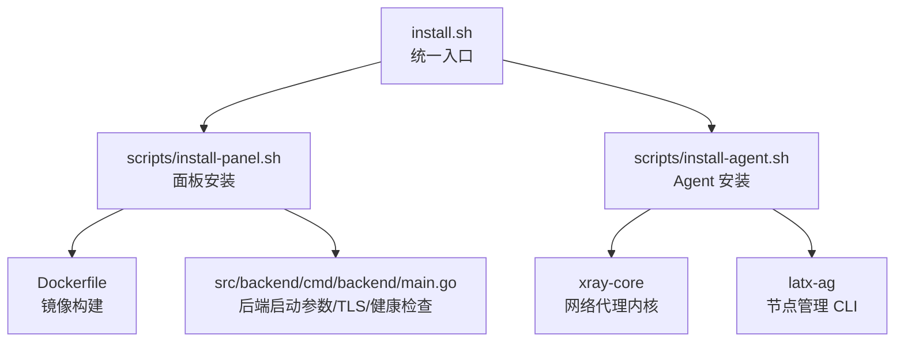
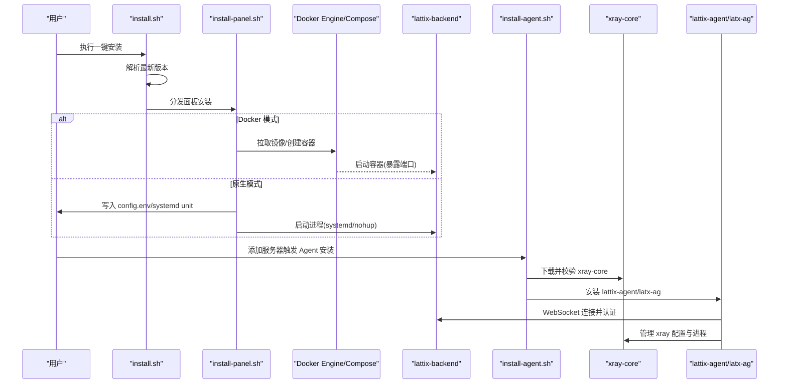
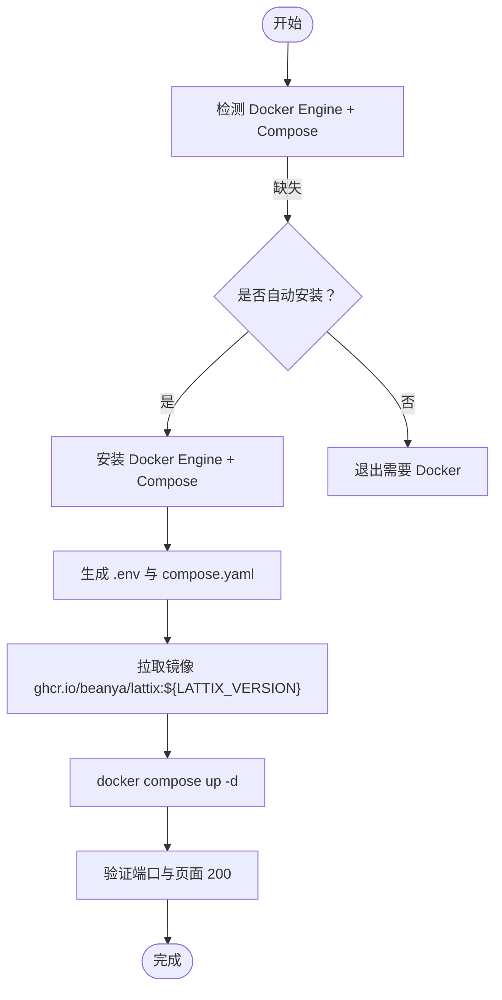
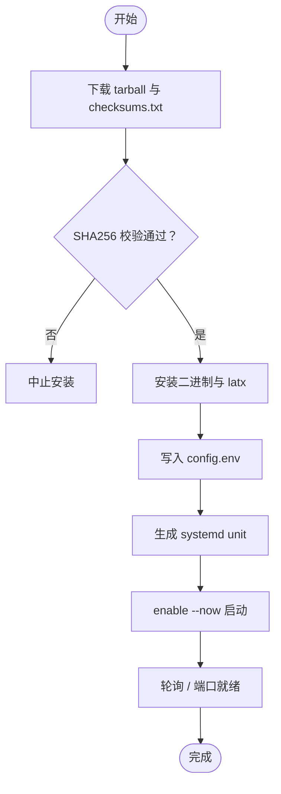
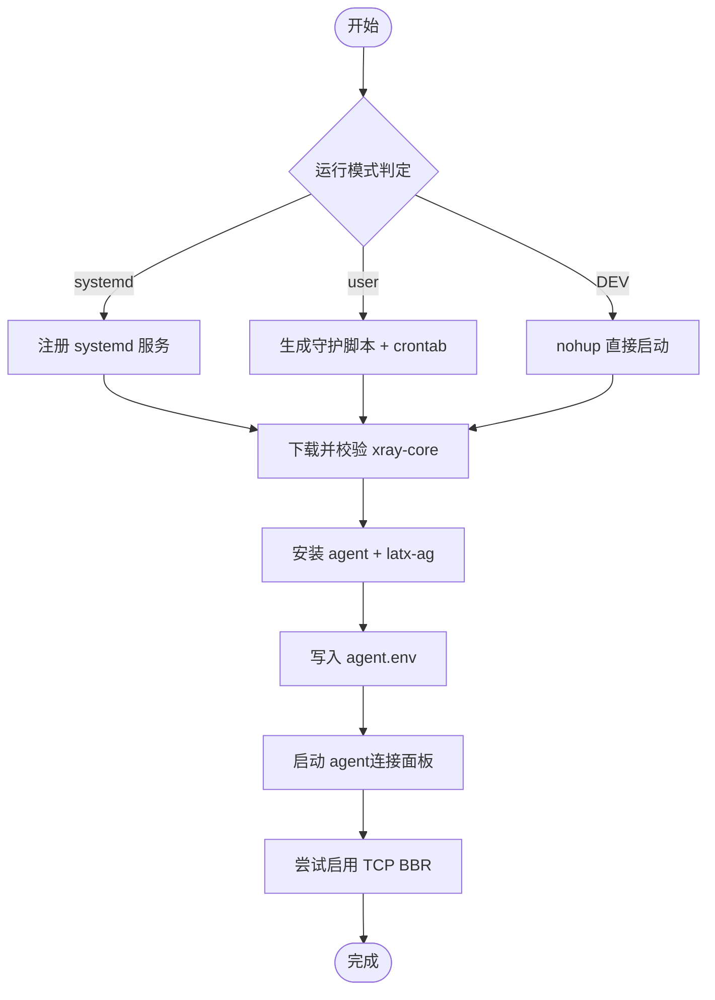
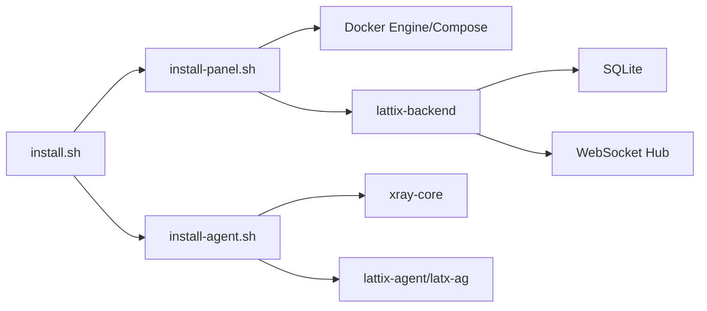

# 安装部署

<cite>
**本文引用的文件**   
- [Dockerfile](file://Dockerfile)
- [install.sh](file://install.sh)
- [scripts/install-panel.sh](file://scripts/install-panel.sh)
- [scripts/install-agent.sh](file://scripts/install-agent.sh)
- [src/backend/cmd/backend/main.go](file://src/backend/cmd/backend/main.go)
- [go.work](file://go.work)
- [docs/KNOWN_ISSUES.md](file://docs/KNOWN_ISSUES.md)
</cite>

## 目录
1. [简介](#简介)
2. [项目结构](#项目结构)
3. [核心组件](#核心组件)
4. [架构总览](#架构总览)
5. [详细组件分析](#详细组件分析)
6. [依赖关系分析](#依赖关系分析)
7. [性能与资源建议](#性能与资源建议)
8. [故障排查指南](#故障排查指南)
9. [结论](#结论)
10. [附录](#附录)

## 简介
本文件面向 Lattix-codex 的安装与部署，覆盖以下目标：
- 多种部署方式：Docker 容器化、原生二进制（systemd）、一键脚本（交互式向导）
- 完整环境要求：操作系统、依赖软件、系统资源
- 每种方式的安装步骤、配置选项、验证方法
- Docker Compose 编排示例、环境变量、端口映射
- 常见问题与解决方案
- 从初学者到高级运维的渐进式指导

## 项目结构
Lattix-codex 由后端面板、Agent、前端与安装脚本组成。关键部署相关文件如下：
- Dockerfile：构建前端产物、编译 Go 后端、生成最小运行镜像
- install.sh：统一入口，解析版本并分发到子安装器
- scripts/install-panel.sh：面板的一键安装（Docker 或原生 systemd）
- scripts/install-agent.sh：Agent 引导安装（含 xray-core、systemd/user 模式、latx-ag）
- src/backend/cmd/backend/main.go：后端启动参数与环境变量、TLS/ACME、健康检查等
- go.work：Go 工作区定义（开发/构建用）
- docs/KNOWN_ISSUES.md：已知问题与部署边界

**图表来源** 
- [install.sh:1-146](file://install.sh#L1-L146)
- [scripts/install-panel.sh:1-315](file://scripts/install-panel.sh#L1-L315)
- [scripts/install-agent.sh:1-457](file://scripts/install-agent.sh#L1-L457)
- [Dockerfile:1-44](file://Dockerfile#L1-L44)
- [src/backend/cmd/backend/main.go:62-90](file://src/backend/cmd/backend/main.go#L62-L90)

**章节来源**
- [Dockerfile:1-44](file://Dockerfile#L1-L44)
- [install.sh:1-146](file://install.sh#L1-L146)
- [scripts/install-panel.sh:1-315](file://scripts/install-panel.sh#L1-L315)
- [scripts/install-agent.sh:1-457](file://scripts/install-agent.sh#L1-L457)
- [src/backend/cmd/backend/main.go:62-90](file://src/backend/cmd/backend/main.go#L62-L90)
- [go.work:1-8](file://go.work#L1-L8)
- [docs/KNOWN_ISSUES.md:1-51](file://docs/KNOWN_ISSUES.md#L1-L51)

## 核心组件
- 面板后端（lattix-backend）
  - 提供 HTTP API、WebSocket 控制通道、SQLite 存储、内置前端 SPA
  - 支持 TLS（自带证书、域名路径模式、ACME 自动证书）
  - 健康检查端点 /healthz、就绪检查 /readyz
- Agent（lattix-agent + latx-ag）
  - 负责在远端服务器管理 xray-core，接收面板指令，上报状态
  - 支持 systemd 用户态/守护脚本常驻模式
- 安装器
  - install.sh：统一入口，自动解析最新版本，分发到 panel/agent 子安装器
  - install-panel.sh：面板安装（Docker 或 native），生成 .env 与 compose.yaml 或 systemd unit
  - install-agent.sh：Agent 引导安装，下载校验 xray-core 与 agent 包，注册服务/守护脚本

**章节来源**
- [src/backend/cmd/backend/main.go:62-90](file://src/backend/cmd/backend/main.go#L62-L90)
- [scripts/install-panel.sh:1-315](file://scripts/install-panel.sh#L1-L315)
- [scripts/install-agent.sh:1-457](file://scripts/install-agent.sh#L1-L457)
- [install.sh:1-146](file://install.sh#L1-L146)

## 架构总览
下图展示三种部署方式的关键交互与数据流：

**图表来源** 
- [install.sh:1-146](file://install.sh#L1-L146)
- [scripts/install-panel.sh:1-315](file://scripts/install-panel.sh#L1-L315)
- [scripts/install-agent.sh:1-457](file://scripts/install-agent.sh#L1-L457)
- [Dockerfile:1-44](file://Dockerfile#L1-L44)
- [src/backend/cmd/backend/main.go:62-90](file://src/backend/cmd/backend/main.go#L62-L90)

## 详细组件分析

### 环境要求
- 操作系统
  - 仅 Linux（x86_64/amd64、aarch64/arm64）
  - macOS/Windows/Docker Desktop 非生产支持
- 依赖软件
  - Docker 模式：Docker Engine + Compose（可自动安装，需确认）
  - 原生模式：curl、sha256sum、tar；systemd（推荐）
  - Agent：unzip（下载官方 xray 时）、可选 crontab（user 模式开机自启 best-effort）
- 系统资源
  - 内存/CPU：根据节点规模与并发决定；SQLite 单库适合中小规模
  - 磁盘：数据库文件、日志、证书缓存、xray 二进制与配置
- 网络
  - 反向代理（Nginx/OpenResty）终止 TLS 时，需转发 Host/X-Forwarded-Proto/X-Forwarded-For/WebSocket Upgrade
  - 若使用面板内置 ACME，需公网 TCP 443 可达

**章节来源**
- [docs/KNOWN_ISSUES.md:1-51](file://docs/KNOWN_ISSUES.md#L1-L51)
- [scripts/install-panel.sh:1-315](file://scripts/install-panel.sh#L1-L315)
- [scripts/install-agent.sh:1-457](file://scripts/install-agent.sh#L1-L457)

### 一键脚本安装（交互式向导）
- 入口命令
  - bash install.sh
  - 首次运行会提示选择“Docker Compose”或“原生二进制 + systemd”
- 交互参数
  - 部署地址、端口、管理员账号/密码、配置目录
- 行为说明
  - 自动解析最新 release 版本
  - 调用对应子安装器完成安装
  - 输出访问地址、管理员凭据、配置目录

**章节来源**
- [install.sh:1-146](file://install.sh#L1-L146)

### Docker 容器化部署
- 前置条件
  - 已安装 Docker Engine + Compose（未安装时可交互式确认或由 --install-docker 自动安装）
- 安装流程
  - 通过 install-panel.sh 的 docker 模式生成 .env 与 compose.yaml
  - 默认将面板绑定到 127.0.0.1:8080，数据持久化到 data/certs/acme-cache
- 环境变量（.env）
  - LATTIX_VERSION、LATTIX_BIND、LATTIX_PORT、LATTIX_ADMIN_USER、LATTIX_ADMIN_PASS、LATTIX_PUBLIC_URL、LATTIX_DEPLOY_MODE=docker、LATTIX_DB=/data/lattix.db、LATTIX_TLS_DIR=/data/certs、LATTIX_ACME_CACHE=/data/acme-cache
- 端口映射
  - 宿主机 ${LATTIX_BIND}:${LATTIX_PORT} -> 容器 8080
- 验证方法
  - curl http://${LATTIX_BIND}:${LATTIX_PORT}/ 应返回 200
  - 浏览器访问 ${LATTIX_PUBLIC_URL:-http://${LATTIX_BIND}:${LATTIX_PORT}}

**图表来源** 
- [scripts/install-panel.sh:1-315](file://scripts/install-panel.sh#L1-L315)
- [Dockerfile:1-44](file://Dockerfile#L1-L44)

**章节来源**
- [scripts/install-panel.sh:1-315](file://scripts/install-panel.sh#L1-L315)
- [Dockerfile:1-44](file://Dockerfile#L1-L44)

### 原生二进制安装（systemd）
- 前置条件
  - curl、sha256sum、tar；推荐使用 systemd
- 安装流程
  - 通过 install-panel.sh 的 native 模式下载 tarball，校验 checksums.txt
  - 安装 lattix-backend 与 latx 管理程序
  - 生成 config.env（包含管理员凭据、部署模式、数据目录等）
  - 注册 systemd unit 并启动
- 环境变量（config.env）
  - LATTIX_ADMIN_USER、LATTIX_ADMIN_PASS、LATTIX_PUBLIC_URL、LATTIX_DEPLOY_MODE=native、LATTIX_DB=...、LATTIX_TLS_DIR=...、LATTIX_ACME_CACHE=...
- 启动参数（后端）
  - -addr、-db、-log-dir、-static、-admin-user、-admin-pass、-public-url、-tls-cert/-tls-key、-tls-dir、-tls-acme-domain、-tls-acme-email、-reset-admin
- 验证方法
  - systemctl status <unit>
  - curl http://${BIND_ADDRESS}:${PORT}/ 应返回 200

**图表来源** 
- [scripts/install-panel.sh:1-315](file://scripts/install-panel.sh#L1-L315)
- [src/backend/cmd/backend/main.go:62-90](file://src/backend/cmd/backend/main.go#L62-L90)

**章节来源**
- [scripts/install-panel.sh:1-315](file://scripts/install-panel.sh#L1-L315)
- [src/backend/cmd/backend/main.go:62-90](file://src/backend/cmd/backend/main.go#L62-L90)

### Agent 引导安装
- 触发方式
  - 面板“添加服务器”后下发 bootstrap token，调用 install-agent.sh
- 安装流程
  - 解析/下载 xray-core（latest 或指定版本），校验官方 .dgst SHA2-256
  - 下载 agent 包（checksums.txt 校验），安装 lattix-agent 与 latx-ag
  - 写入 agent.env（面板 WS 地址与 bootstrap token）
  - 注册 systemd 服务（root+systemd）或生成守护脚本（user 模式）
  - 最佳努力启用 TCP BBR（sysctl + 持久化）
- 运行模式
  - systemd：root + systemctl，注册 xray.service 与 lattix-agent.service
  - user：无 root/无 systemd 自动降级，守护脚本常驻 + crontab @reboot（best-effort）
  - DEV：LATX_DEV=1，跳过 unit，nohup 直接启动
- 验证方法
  - latx-ag status/log/update/xray-update/uninstall
  - 面板侧查看服务器 online 状态

**图表来源** 
- [scripts/install-agent.sh:1-457](file://scripts/install-agent.sh#L1-L457)

**章节来源**
- [scripts/install-agent.sh:1-457](file://scripts/install-agent.sh#L1-L457)

### 后端启动参数与环境变量
- 启动参数（-addr、-db、-log-dir、-static、-admin-user、-admin-pass、-public-url、-tls-cert/-tls-key、-tls-dir、-tls-acme-domain、-tls-acme-email、-reset-admin）
- 环境变量（LATTIX_*）
  - LATTIX_DB、LATTIX_LOG_DIR、LATTIX_STATIC、LATTIX_ADMIN_USER、LATTIX_ADMIN_PASS、LATTIX_PUBLIC_URL、LATTIX_TLS_DIR、LATTIX_ACME_CACHE、LATTIX_DEPLOY_MODE
- 健康检查
  - /healthz 返回 ok
  - /readyz 返回 ready（内部检查 hub 与 DB 连通性）

**章节来源**
- [src/backend/cmd/backend/main.go:62-90](file://src/backend/cmd/backend/main.go#L62-L90)

## 依赖关系分析
- 安装器依赖
  - install.sh 依赖 curl 与 GitHub API 解析最新版本
  - install-panel.sh 依赖 curl/sha256sum/tar；Docker 模式依赖 Docker Engine + Compose
  - install-agent.sh 依赖 curl/sha256sum/unzip/tar；可选 crontab
- 运行时依赖
  - 面板后端：SQLite、可选 ACME（autocert）、WebSocket
  - Agent：xray-core、systemd 或守护脚本
- 外部依赖
  - GHCR 镜像 ghcr.io/beanya/lattix（匿名可拉取）
  - Xray-core Release（官方 .dgst 校验）

**图表来源** 
- [install.sh:1-146](file://install.sh#L1-L146)
- [scripts/install-panel.sh:1-315](file://scripts/install-panel.sh#L1-L315)
- [scripts/install-agent.sh:1-457](file://scripts/install-agent.sh#L1-L457)
- [src/backend/cmd/backend/main.go:62-90](file://src/backend/cmd/backend/main.go#L62-L90)

**章节来源**
- [install.sh:1-146](file://install.sh#L1-L146)
- [scripts/install-panel.sh:1-315](file://scripts/install-panel.sh#L1-L315)
- [scripts/install-agent.sh:1-457](file://scripts/install-agent.sh#L1-L457)
- [src/backend/cmd/backend/main.go:62-90](file://src/backend/cmd/backend/main.go#L62-L90)

## 性能与资源建议
- SQLite 单库适合中小规模；高并发场景建议评估读写瓶颈与 WAL 模式
- 日志轮转：请求日志按大小切分，操作日志限制条数
- 静态资源：为带 hash 的静态资源设置长期缓存（反向代理）
- BBR：最佳努力启用，提升拥塞控制性能（不改变安装成功与否）

[本节为通用建议，不直接分析具体文件]

## 故障排查指南
- 常见安装失败原因
  - 缺少依赖（curl/sha256sum/tar/unzip）
  - Docker Engine/Compose 未安装或未授权
  - 网络不可达（GitHub/GHCR 无法访问）
  - 端口冲突（8080/443）
  - 权限不足（root/sudo）
- 验证步骤
  - 面板：curl http://${BIND}:${PORT}/ 应返回 200；/healthz 与 /readyz
  - Agent：latx-ag status/log；查看 logs/agent.log
  - systemd：systemctl status <unit>
- 已知问题与边界
  - Docker 页面更新与镜像版本可能短暂不一致（自更新流程不拉镜像）
  - Docker 模式不提供宿主机运维能力（BBR/防火墙/Nginx 由管理员负责）
  - 内置 ACME 需要公网 443 可达
  - 证书路径在宿主机与容器内不同
  - GHCR 镜像必须保持公开
  - 城市数据块体积较大（首屏按需加载）
  - 仅支持 Linux

**章节来源**
- [docs/KNOWN_ISSUES.md:1-51](file://docs/KNOWN_ISSUES.md#L1-L51)
- [scripts/install-panel.sh:1-315](file://scripts/install-panel.sh#L1-L315)
- [scripts/install-agent.sh:1-457](file://scripts/install-agent.sh#L1-L457)
- [src/backend/cmd/backend/main.go:62-90](file://src/backend/cmd/backend/main.go#L62-L90)

## 结论
- 推荐使用一键脚本进行快速部署，自动处理版本解析与依赖检查
- Docker 模式适合隔离部署与简化运维；原生模式适合深度定制与系统集成
- Agent 安装支持多运行模式，适配不同权限与系统环境
- 遵循已知问题与边界，结合反向代理与证书管理实现安全稳定的生产部署

[本节为总结，不直接分析具体文件]

## 附录
- 常用命令参考
  - 面板：latx status/version/reset-admin（原生模式）
  - Agent：latx-ag status/log/update/xray-update/uninstall（user/systemd/DEV）
- 环境变量速查
  - 面板：LATTIX_ADMIN_USER/PASS、LATTIX_PUBLIC_URL、LATTIX_DB/TLS_DIR/ACME_CACHE、LATTIX_DEPLOY_MODE
  - Agent：LATTIX_PANEL_WS、LATTIX_TOKEN、XRAY_VERSION、LATX_RELEASE_BASE、LATX_PREFIX、LATX_DEV、LATX_USER_MODE

[本节为补充信息，不直接分析具体文件]