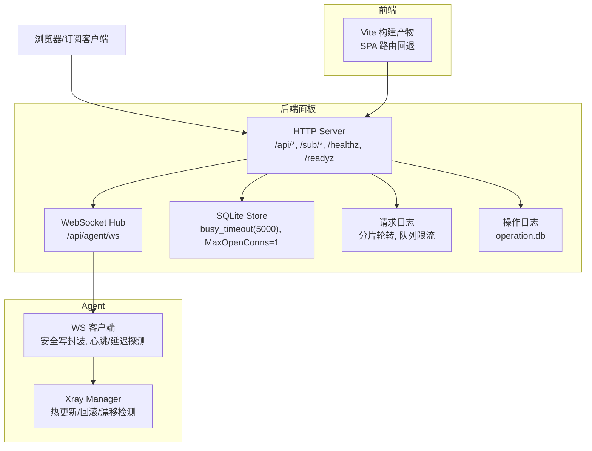
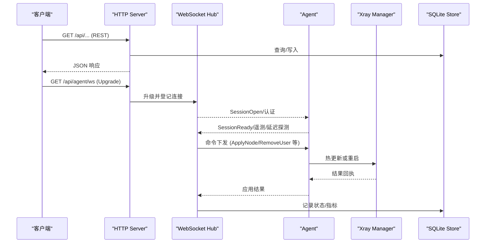
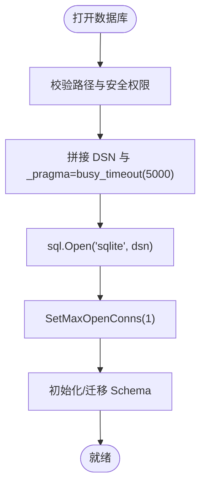
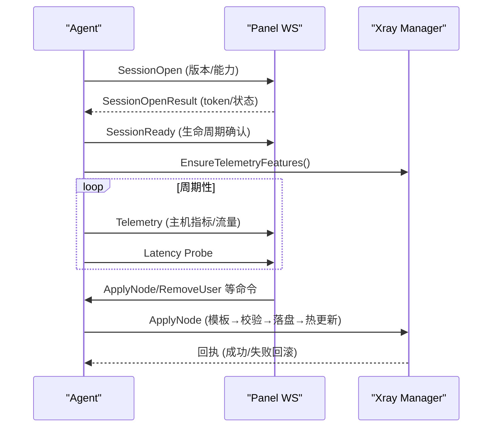
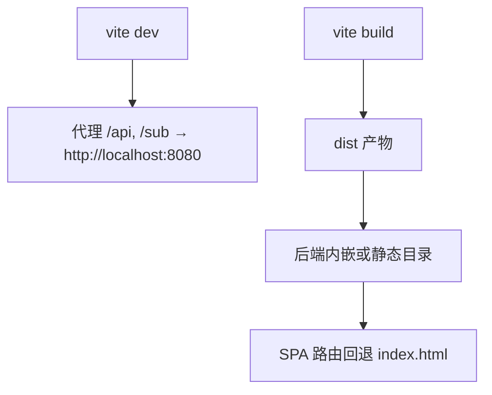
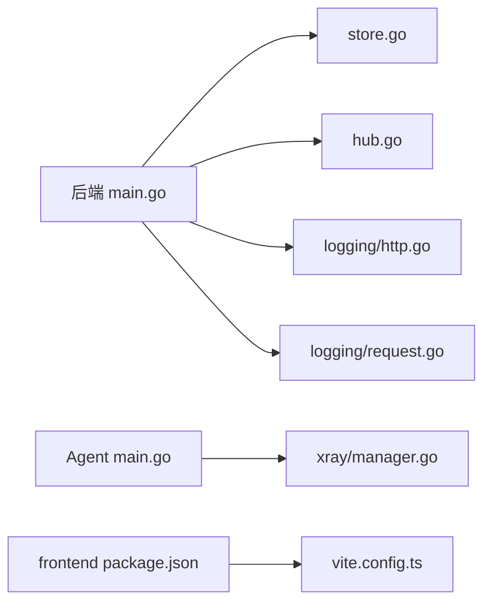

# 性能调优

<cite>
**本文引用的文件**   
- [src/backend/cmd/backend/main.go](file://src/backend/cmd/backend/main.go)
- [src/agent/cmd/agent/main.go](file://src/agent/cmd/agent/main.go)
- [src/backend/internal/store/store.go](file://src/backend/internal/store/store.go)
- [src/backend/internal/ws/hub.go](file://src/backend/internal/ws/hub.go)
- [src/agent/internal/xray/manager.go](file://src/agent/internal/xray/manager.go)
- [src/backend/internal/logging/http.go](file://src/backend/internal/logging/http.go)
- [src/backend/internal/logging/request.go](file://src/backend/internal/logging/request.go)
- [src/frontend/package.json](file://src/frontend/package.json)
- [src/frontend/vite.config.ts](file://src/frontend/vite.config.ts)
</cite>

## 目录
1. [简介](#简介)
2. [项目结构](#项目结构)
3. [核心组件](#核心组件)
4. [架构总览](#架构总览)
5. [详细组件分析](#详细组件分析)
6. [依赖关系分析](#依赖关系分析)
7. [性能考量与优化建议](#性能考量与优化建议)
8. [故障排查指南](#故障排查指南)
9. [结论](#结论)
10. [附录](#附录)

## 简介
本文件面向 Lattix-codex 的生产与运维团队，系统性梳理系统资源规划、数据库（SQLite）优化、WebSocket 连接与消息队列调优、Agent 程序与 Xray 进程管理、前端构建与缓存策略、监控与分析工具使用、性能测试方法与基准、以及生产环境最佳实践与常见问题解决方案。内容基于仓库源码实现进行提炼，确保建议可落地且与代码行为一致。

## 项目结构
Lattix-codex 由后端面板（Go）、Agent（Go）、前端（React/Vite）三部分组成：
- 后端面板：HTTP API + WebSocket 端点 + SQLite 存储 + 请求/操作日志
- Agent：通过单条 WebSocket 长连接与面板通信，负责 xray 配置管理与遥测上报
- 前端：Vite 构建的 React SPA，内嵌到后端二进制或通过静态目录提供



图表来源
- [src/backend/cmd/backend/main.go:450-477](file://src/backend/cmd/backend/main.go#L450-L477)
- [src/backend/internal/ws/hub.go:26-63](file://src/backend/internal/ws/hub.go#L26-L63)
- [src/backend/internal/store/store.go:368-389](file://src/backend/internal/store/store.go#L368-L389)
- [src/backend/internal/logging/request.go:90-105](file://src/backend/internal/logging/request.go#L90-L105)
- [src/agent/cmd/agent/main.go:142-186](file://src/agent/cmd/agent/main.go#L142-L186)
- [src/agent/internal/xray/manager.go:25-55](file://src/agent/internal/xray/manager.go#L25-L55)
- [src/frontend/vite.config.ts:7-21](file://src/frontend/vite.config.ts#L7-L21)

章节来源
- [src/backend/cmd/backend/main.go:70-120](file://src/backend/cmd/backend/main.go#L70-L120)
- [src/backend/internal/store/store.go:368-389](file://src/backend/internal/store/store.go#L368-L389)
- [src/backend/internal/logging/request.go:90-105](file://src/backend/internal/logging/request.go#L90-L105)
- [src/agent/cmd/agent/main.go:142-186](file://src/agent/cmd/agent/main.go#L142-L186)
- [src/frontend/vite.config.ts:7-21](file://src/frontend/vite.config.ts#L7-L21)

## 核心组件
- HTTP 服务器与中间件：设置读写超时、头部大小限制、优雅关停、健康检查
- WebSocket Hub：连接注册表、发送缓冲、Pong 超时、优雅排空
- SQLite Store：单连接、busy_timeout、权限加固、备份导出
- 请求日志：异步写入、分段轮转、容量上限、丢弃统计
- Agent 主循环：重连退避、会话建立、遥测/延迟探测、配置漂移检测
- Xray Manager：模板填充、原子落盘、gRPC 热操作、失败回滚、漂移修复

章节来源
- [src/backend/cmd/backend/main.go:474-484](file://src/backend/cmd/backend/main.go#L474-L484)
- [src/backend/internal/ws/hub.go:16-24](file://src/backend/internal/ws/hub.go#L16-L24)
- [src/backend/internal/store/store.go:368-389](file://src/backend/internal/store/store.go#L368-L389)
- [src/backend/internal/logging/request.go:90-105](file://src/backend/internal/logging/request.go#L90-L105)
- [src/agent/cmd/agent/main.go:69-98](file://src/agent/cmd/agent/main.go#L69-L98)
- [src/agent/internal/xray/manager.go:235-287](file://src/agent/internal/xray/manager.go#L235-L287)

## 架构总览
后端面板作为控制面，暴露 REST API 与 WebSocket 端点；Agent 以单条 WS 长连接承载命令下发、遥测上报与延迟探测；Xray 在 Agent 侧受管，支持 gRPC 热更新与失败回滚；SQLite 作为唯一持久化存储，采用单连接与 busy_timeout 避免锁冲突；请求日志与操作日志分别用于审计与诊断。



图表来源
- [src/backend/cmd/backend/main.go:372-382](file://src/backend/cmd/backend/main.go#L372-L382)
- [src/backend/internal/ws/hub.go:111-139](file://src/backend/internal/ws/hub.go#L111-L139)
- [src/agent/cmd/agent/main.go:142-186](file://src/agent/cmd/agent/main.go#L142-L186)
- [src/agent/internal/xray/manager.go:109-142](file://src/agent/internal/xray/manager.go#L109-L142)
- [src/backend/internal/store/store.go:368-389](file://src/backend/internal/store/store.go#L368-L389)

## 详细组件分析

### 数据库（SQLite）性能优化
- 连接模型：单连接 + busy_timeout(5000ms)，避免并发写导致的 database is locked
- 权限加固：数据库文件创建为 0600，防止敏感数据泄露
- 备份导出：VACUUM INTO 一致性快照，适合离线备份
- 索引策略：对高频查询字段添加索引（如 server_metric_history 的复合索引）
- 事务与批处理：批量写入时合并事务，减少 WAL 切换开销



图表来源
- [src/backend/internal/store/store.go:368-389](file://src/backend/internal/store/store.go#L368-L389)
- [src/backend/internal/store/store.go:391-419](file://src/backend/internal/store/store.go#L391-L419)
- [src/backend/internal/store/store.go:448-465](file://src/backend/internal/store/store.go#L448-L465)

章节来源
- [src/backend/internal/store/store.go:368-389](file://src/backend/internal/store/store.go#L368-L389)
- [src/backend/internal/store/store.go:391-419](file://src/backend/internal/store/store.go#L391-L419)
- [src/backend/internal/store/store.go:448-465](file://src/backend/internal/store/store.go#L448-L465)

### WebSocket 连接与消息队列优化
- 连接池：Hub 维护 map[int64]*agentConn，每服务器一条连接
- 发送缓冲：每连接 256 条消息队列，写满视为慢连接并断开
- 超时策略：writeTimeout=10s，pongTimeoutDefault=90s
- 优雅排空：BeginDrain 拒绝新工作并关闭所有连接，配合重试策略
- 协议错误：OnProtocolError 仅记录无业务响应的协议错误

```mermaid
classDiagram
class Hub {
+Send(ctx, serverID, env) error
+IsOnline(serverID) bool
+BeginDrain() void
+Wait(ctx) error
-conns map[int64]*agentConn
-states map[int64]ConnectionSnapshot
}
class agentConn {
-ws *websocket.Conn
-send chan shared.Envelope
-done chan struct{}
+writePump() void
+closeWithCode(code, reason) void
}
Hub --> agentConn : "管理连接"
```

图表来源
- [src/backend/internal/ws/hub.go:26-63](file://src/backend/internal/ws/hub.go#L26-L63)
- [src/backend/internal/ws/hub.go:111-139](file://src/backend/internal/ws/hub.go#L111-L139)
- [src/backend/internal/ws/hub.go:398-413](file://src/backend/internal/ws/hub.go#L398-L413)

章节来源
- [src/backend/internal/ws/hub.go:16-24](file://src/backend/internal/ws/hub.go#L16-L24)
- [src/backend/internal/ws/hub.go:111-139](file://src/backend/internal/ws/hub.go#L111-L139)
- [src/backend/internal/ws/hub.go:156-173](file://src/backend/internal/ws/hub.go#L156-L173)

### Agent 程序与 Xray 进程管理
- 重连策略：指数退避 + 面板不可用专用延迟 + 生命周期感知
- 会话建立：SessionOpen → SessionReady → 遥测/延迟探测启动
- 配置管理：模板填充 → 原子落盘 → gRPC 热操作 → 失败回滚
- 漂移检测：哈希比对外部修改，净化配置并恢复受管状态



图表来源
- [src/agent/cmd/agent/main.go:142-186](file://src/agent/cmd/agent/main.go#L142-L186)
- [src/agent/cmd/agent/main.go:264-281](file://src/agent/cmd/agent/main.go#L264-L281)
- [src/agent/internal/xray/manager.go:109-142](file://src/agent/internal/xray/manager.go#L109-L142)
- [src/agent/internal/xray/manager.go:235-287](file://src/agent/internal/xray/manager.go#L235-L287)

章节来源
- [src/agent/cmd/agent/main.go:69-98](file://src/agent/cmd/agent/main.go#L69-L98)
- [src/agent/cmd/agent/main.go:142-186](file://src/agent/cmd/agent/main.go#L142-L186)
- [src/agent/internal/xray/manager.go:109-142](file://src/agent/internal/xray/manager.go#L109-L142)

### 前端应用性能优化
- 构建工具：Vite + React + TailwindCSS
- 开发代理：/api 与 /sub 代理至后端 8080
- 产物嵌入：后端可内嵌前端构建产物，或指定静态目录覆盖
- 路由回退：SPA 未匹配路径返回 index.html



图表来源
- [src/frontend/vite.config.ts:7-21](file://src/frontend/vite.config.ts#L7-L21)
- [src/backend/cmd/backend/main.go:440-448](file://src/backend/cmd/backend/main.go#L440-L448)

章节来源
- [src/frontend/package.json:6-12](file://src/frontend/package.json#L6-L12)
- [src/frontend/vite.config.ts:7-21](file://src/frontend/vite.config.ts#L7-L21)
- [src/backend/cmd/backend/main.go:440-448](file://src/backend/cmd/backend/main.go#L440-L448)

## 依赖关系分析
- 后端依赖：gorilla/websocket、modernc.org/sqlite、golang.org/x/crypto/acme
- Agent 依赖：gorilla/websocket、systemd/exec runner
- 前端依赖：React、Vite、TailwindCSS、Three.js（地图可视化）



图表来源
- [src/backend/cmd/backend/main.go:27-36](file://src/backend/cmd/backend/main.go#L27-L36)
- [src/agent/cmd/agent/main.go:22-26](file://src/agent/cmd/agent/main.go#L22-L26)
- [src/frontend/package.json:14-46](file://src/frontend/package.json#L14-L46)

章节来源
- [src/backend/cmd/backend/main.go:27-36](file://src/backend/cmd/backend/main.go#L27-L36)
- [src/agent/cmd/agent/main.go:22-26](file://src/agent/cmd/agent/main.go#L22-L26)
- [src/frontend/package.json:14-46](file://src/frontend/package.json#L14-L46)

## 性能考量与优化建议

### 系统资源规划
- CPU：面板与 Agent 均为 Go 程序，建议至少 2 核；Xray 转发路径可能占用较高 CPU，按带宽与并发估算
- 内存：SQLite 单连接模式内存占用低；请求日志队列与 WebSocket 缓冲需预留内存（默认 10MB 日志上限）
- 磁盘：SQLite 文件 + 日志分片；建议 SSD；日志轮转策略需根据 IOPS 调整
- 网络：WebSocket 长连接数 × 平均包大小；TLS 握手开销；建议启用 TCP Fast Open（内核支持）

### 数据库性能优化
- 保持单连接与 busy_timeout(5000ms)，避免锁竞争
- 定期 VACUUM 释放碎片空间（可通过备份接口触发）
- 针对高频查询添加索引（如 server_metric_history 已含复合索引）
- 批量写入合并事务，减少 WAL 切换

章节来源
- [src/backend/internal/store/store.go:368-389](file://src/backend/internal/store/store.go#L368-L389)
- [src/backend/internal/store/store.go:448-465](file://src/backend/internal/store/store.go#L448-L465)

### WebSocket 连接调优
- 发送缓冲 256 条，写满即断线重连，避免慢连接拖垮系统
- Pong 超时 90s，读超时 90s，写超时 10s，平衡保活与资源占用
- 优雅排空 BeginDrain 配合 Agent 快速重试路径

章节来源
- [src/backend/internal/ws/hub.go:16-24](file://src/backend/internal/ws/hub.go#L16-L24)
- [src/backend/internal/ws/hub.go:156-173](file://src/backend/internal/ws/hub.go#L156-L173)

### Agent 与 Xray 优化
- 重连退避：结合面板生命周期与不可用延迟，避免雪崩
- 配置原子落盘：临时文件 + 校验 + 备份 + 原子替换，确保一致性
- 热更新优先：gRPC 热操作失败才回退重启，降低服务中断
- 漂移检测：哈希比对外部修改，自动净化配置

章节来源
- [src/agent/cmd/agent/main.go:69-98](file://src/agent/cmd/agent/main.go#L69-L98)
- [src/agent/internal/xray/manager.go:235-287](file://src/agent/internal/xray/manager.go#L235-L287)

### 前端性能优化
- 代码分割：按路由懒加载页面组件（Chains、Servers、Users 等）
- 缓存策略：Vite 构建产物带哈希，浏览器强缓存；后端静态目录可开启 CDN
- 资源压缩：启用 Brotli/Gzip（反向代理层）
- 首屏优化：内联关键 CSS，延迟加载 Three.js 地图

章节来源
- [src/frontend/package.json:6-12](file://src/frontend/package.json#L6-L12)
- [src/frontend/vite.config.ts:7-21](file://src/frontend/vite.config.ts#L7-L21)

### 监控与分析工具
- 健康检查：/healthz 与 /readyz 探针，/readyz 包含 DB Ping
- 请求日志：JSONL 格式，支持 Tail/Clear/Status 操作
- 操作日志：operation.db 记录面板生命周期与关键事件
- 遥测数据：Agent 上报主机指标（CPU/内存/磁盘/网络）与延迟

章节来源
- [src/backend/cmd/backend/main.go:384-432](file://src/backend/cmd/backend/main.go#L384-L432)
- [src/backend/internal/logging/request.go:131-158](file://src/backend/internal/logging/request.go#L131-L158)
- [src/agent/cmd/agent/main.go:284-314](file://src/agent/cmd/agent/main.go#L284-L314)

### 性能测试方法与基准
- 压测工具：wrk/ab 测试 HTTP API QPS 与延迟
- WebSocket 压测：自定义脚本模拟多 Agent 连接与消息吞吐
- 数据库基准：sysbench 或自定义 SQL 负载，观察锁等待与 WAL 增长
- 前端基准：Lighthouse 评估首屏与交互延迟

### 生产环境最佳实践
- 资源隔离：容器化部署，限制 CPU/内存配额
- 日志轮转：请求日志按大小分片，定期清理旧片段
- 证书管理：ACME 自动续期，路径模式热加载免重启
- 优雅关停：信号处理与上下文取消，确保连接与日志正常关闭

章节来源
- [src/backend/cmd/backend/main.go:503-571](file://src/backend/cmd/backend/main.go#L503-L571)
- [src/backend/internal/logging/request.go:284-333](file://src/backend/internal/logging/request.go#L284-L333)

### 常见问题解决方案
- “database is locked”：检查并发写逻辑，确保事务合并与 busy_timeout 生效
- WebSocket 频繁重连：检查网络质量与 Agent 重连退避策略
- 配置漂移告警：确认外部修改源，必要时禁用手动编辑
- 前端 404：确认静态目录或内嵌产物正确加载

章节来源
- [src/backend/internal/store/store.go:368-389](file://src/backend/internal/store/store.go#L368-L389)
- [src/agent/cmd/agent/main.go:69-98](file://src/agent/cmd/agent/main.go#L69-L98)
- [src/backend/cmd/backend/main.go:440-448](file://src/backend/cmd/backend/main.go#L440-L448)

## 故障排查指南
- 查看请求日志：Tail/Clear/Status 接口，定位错误与延迟
- 检查操作日志：operation.db 记录面板启动/停止与关键事件
- 验证 WebSocket：/api/agent/ws 握手状态与 OnProtocolError 回调
- 监控 Agent 状态：SessionOpen/Ready 回执与遥测数据

章节来源
- [src/backend/internal/logging/request.go:131-158](file://src/backend/internal/logging/request.go#L131-L158)
- [src/backend/internal/logging/http.go:84-105](file://src/backend/internal/logging/http.go#L84-L105)
- [src/agent/cmd/agent/main.go:142-186](file://src/agent/cmd/agent/main.go#L142-L186)

## 结论
Lattix-codex 通过单连接 SQLite、WebSocket Hub 与 Agent 协同，实现了高可靠的控制面与数据面分离。性能调优应聚焦于数据库锁争用、WebSocket 缓冲与超时、Agent 重连策略与 Xray 热更新效率，以及前端构建与缓存策略。生产环境需结合监控与日志，持续优化资源分配与配置参数。

## 附录
- 环境变量与启动参数：参考 main.go 中的 flag 定义
- 配置文件路径：Agent 的 state/settings/xray-config 默认路径
- 端口规划：HTTP/HTTPS、WebSocket、Xray gRPC API

章节来源
- [src/backend/cmd/backend/main.go:83-98](file://src/backend/cmd/backend/main.go#L83-L98)
- [src/agent/cmd/agent/main.go:34-43](file://src/agent/cmd/agent/main.go#L34-L43)