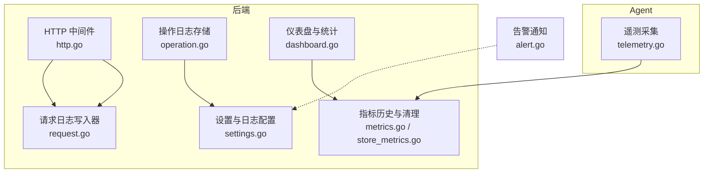
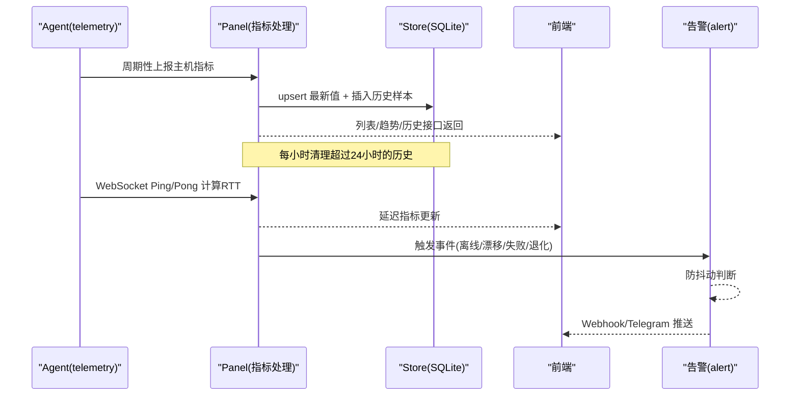
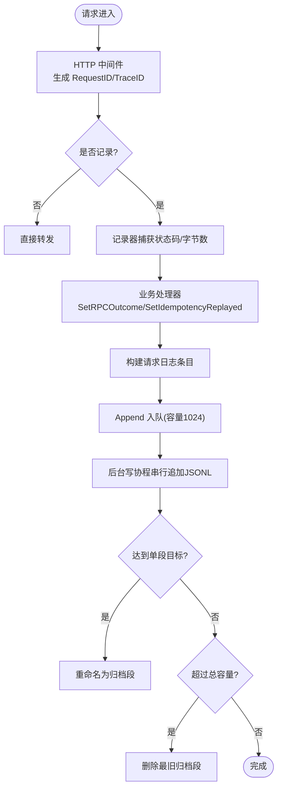
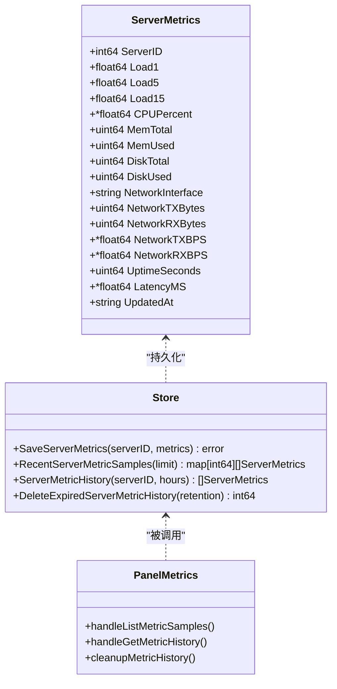
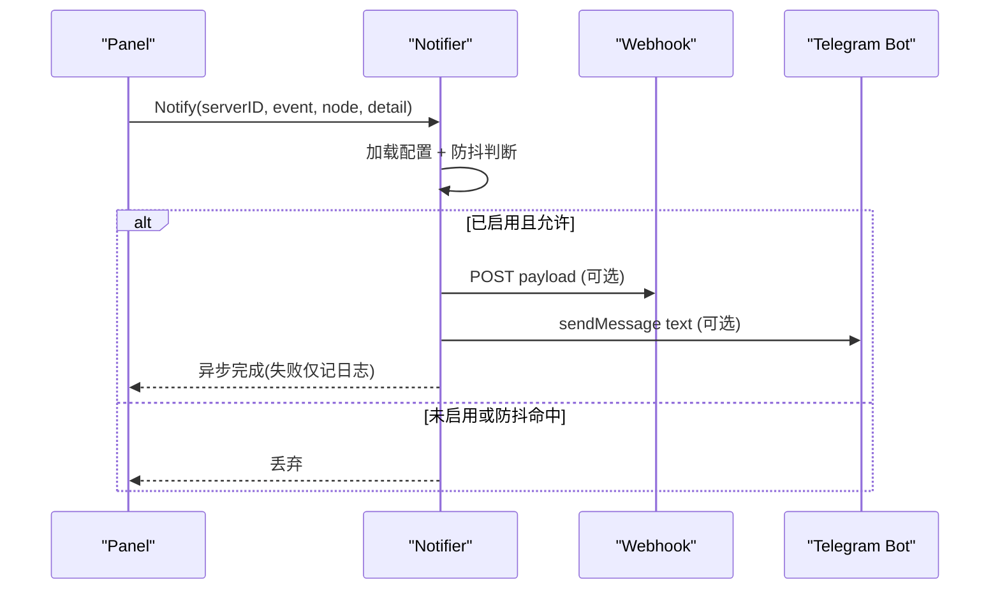
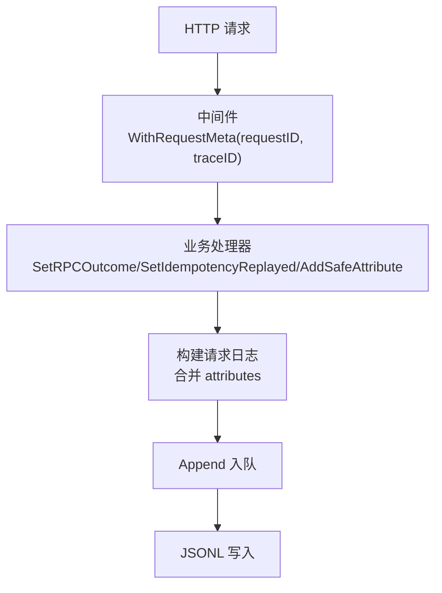
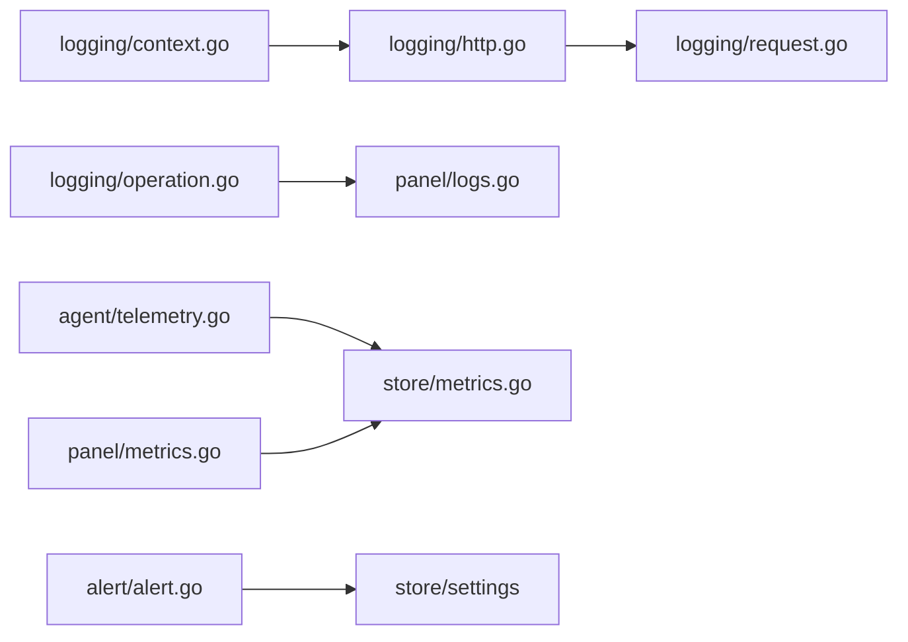

# 监控日志

<cite>
**本文引用的文件**   
- [logging-design.md](file://docs/logging-design.md)
- [server-probe-monitoring-design.md](file://docs/server-probe-monitoring-design.md)
- [context.go](file://src/backend/internal/logging/context.go)
- [http.go](file://src/backend/internal/logging/http.go)
- [operation.go](file://src/backend/internal/logging/operation.go)
- [request.go](file://src/backend/internal/logging/request.go)
- [alert.go](file://src/backend/internal/alert/alert.go)
- [telemetry.go](file://src/agent/cmd/agent/telemetry.go)
- [metrics.go](file://src/backend/internal/panel/metrics.go)
- [store_metrics.go](file://src/backend/internal/store/metrics.go)
- [panel_logs.go](file://src/backend/internal/panel/logs.go)
- [dashboard.go](file://src/backend/internal/panel/dashboard.go)
</cite>

## 目录
1. [简介](#简介)
2. [项目结构](#项目结构)
3. [核心组件](#核心组件)
4. [架构总览](#架构总览)
5. [详细组件分析](#详细组件分析)
6. [依赖关系分析](#依赖关系分析)
7. [性能考量](#性能考量)
8. [故障排查指南](#故障排查指南)
9. [结论](#结论)
10. [附录](#附录)

## 简介
本文件为 Lattix-codex 项目的监控与日志管理完整文档，覆盖以下方面：
- 日志系统架构：操作日志与请求日志的设计、存储、轮转与保留策略
- 监控指标：主机探针指标定义、采集方式、存储与查询接口
- 告警规则与通知渠道：事件类型、防抖、Webhook 与 Telegram 推送
- 日志分析与查询：前端行为、API 用法与常用筛选思路
- 监控面板与仪表板：服务器卡片网格、趋势图与详情抽屉
- 分布式追踪：RequestID/TraceID 贯穿 HTTP 与 WebSocket
- 数据存储与保留：SQLite 表结构与清理策略
- 扩展性与高可用：异步写入、降级与容量限制

## 项目结构
本项目在后端与 Agent 两侧分别实现日志与监控能力：
- 后端日志子系统位于 logging 包，提供操作日志（SQLite）与请求日志（JSONL）
- 后端监控数据通过 store.metrics 持久化，并在 panel.metrics 暴露 API
- Agent 侧 telemetry 负责主机指标采集与上报
- alert 包实现事件告警的双通道推送

图表来源
- [http.go:1-409](file://src/backend/internal/logging/http.go#L1-L409)
- [request.go:1-527](file://src/backend/internal/logging/request.go#L1-L527)
- [operation.go:1-462](file://src/backend/internal/logging/operation.go#L1-L462)
- [metrics.go:1-105](file://src/backend/internal/panel/metrics.go#L1-L105)
- [store_metrics.go:1-276](file://src/backend/internal/store/metrics.go#L1-L276)
- [telemetry.go:1-326](file://src/agent/cmd/agent/telemetry.go#L1-L326)
- [alert.go:1-234](file://src/backend/internal/alert/alert.go#L1-L234)

章节来源
- [logging-design.md:1-311](file://docs/logging-design.md#L1-L311)
- [server-probe-monitoring-design.md:1-104](file://docs/server-probe-monitoring-design.md#L1-L104)

## 核心组件
- 操作日志（Operation Log）
  - 独立 SQLite 文件 operation.db，固定类别与重要程度，支持分页与过滤
  - 生命周期事件（启动/异常退出/停止）、Agent 连接状态变更、命令执行结果等
- 请求日志（Request Log）
  - JSONL 分段文件，异步队列写入，自动轮转与容量控制
  - 脱敏与安全属性白名单，按路由策略记录级别
- 主机探针监控（Server Probe）
  - Agent 每 60s 上报 CPU/负载/内存/磁盘/网卡/延迟等
  - Panel 保存最新值与历史样本，提供批量与单实例查询
- 告警通知（Alert）
  - Webhook 与 Telegram 双通道，防抖动窗口，事件类型包括离线、漂移、节点失败、链路退化
- 分布式追踪（Trace）
  - RequestID/TraceID 贯穿 HTTP 与 WS，响应头回传，便于关联日志与追踪

章节来源
- [operation.go:1-462](file://src/backend/internal/logging/operation.go#L1-L462)
- [request.go:1-527](file://src/backend/internal/logging/request.go#L1-L527)
- [http.go:1-409](file://src/backend/internal/logging/http.go#L1-L409)
- [telemetry.go:1-326](file://src/agent/cmd/agent/telemetry.go#L1-L326)
- [store_metrics.go:1-276](file://src/backend/internal/store/metrics.go#L1-L276)
- [alert.go:1-234](file://src/backend/internal/alert/alert.go#L1-L234)

## 架构总览
下图展示从 Agent 采集到 Panel 存储与展示的端到端流程，以及日志与告警的交互。

图表来源
- [telemetry.go:1-326](file://src/agent/cmd/agent/telemetry.go#L1-L326)
- [store_metrics.go:1-276](file://src/backend/internal/store/metrics.go#L1-L276)
- [metrics.go:1-105](file://src/backend/internal/panel/metrics.go#L1-L105)
- [alert.go:1-234](file://src/backend/internal/alert/alert.go#L1-L234)

## 详细组件分析

### 日志系统（操作日志与请求日志）
- 设计目标与边界
  - 两类日志独立存储、独立限额、独立清空；不进入业务数据库备份
  - 写入失败不阻断业务；默认不自动刷新页面降低面板压力
- 存储与目录
  - 操作日志：operation.db（SQLite），独立连接与索引
  - 请求日志：requests-current.jsonl 与带时间戳归档段，权限 0600
- 操作日志
  - 固定类别（server/chain/user/settings/panel/agent/command/auth/log）
  - 重要程度由服务端判定（info/warning/error）
  - 生命周期：启动写入 started，异常退出写入 unclean_shutdown，停止写入 stopped
  - 保留策略：默认 1000 条，范围 100–100000，每次写入后裁剪最旧记录
- 请求日志
  - JSONL 字段包含 timestamp、request_id、trace_id、severity、transport、method、path、route、rpc_type、attributes、http_status、rpc_code、duration_ms、response_bytes、operator、ip、user_agent、error_summary、idempotency_replayed
  - 路由策略：full/failures_only/none，由服务端注册时声明
  - 重要程度：info/warning/error，依据 HTTP 状态码、RPC code 与耗时判定
  - 脱敏规则：敏感名匹配替换为 [REDACTED]，路径 token 哈希前缀，长度限制
  - 异步写入：容量 1024 的内存队列，单写协程串行追加；丢弃累计并聚合记录
  - 分段与容量：默认 10 MiB，单段目标为总量的 1/10，最小 64 KiB；达到阈值重命名归档
- HTTP API
  - GET /api/log/list-operations：分页与过滤
  - POST /api/log/clear-operations：清空并审计
  - GET /api/log/list-requests：读取最新窗口与容量状态
  - POST /api/log/clear-requests：清空文件

图表来源
- [http.go:1-409](file://src/backend/internal/logging/http.go#L1-L409)
- [request.go:1-527](file://src/backend/internal/logging/request.go#L1-L527)

章节来源
- [logging-design.md:1-311](file://docs/logging-design.md#L1-L311)
- [operation.go:1-462](file://src/backend/internal/logging/operation.go#L1-L462)
- [request.go:1-527](file://src/backend/internal/logging/request.go#L1-L527)
- [http.go:1-409](file://src/backend/internal/logging/http.go#L1-L409)
- [panel_logs.go:1-142](file://src/backend/internal/panel/logs.go#L1-L142)

### 监控指标（主机探针与存储）
- 指标定义
  - CPU 使用率（两次采样差值）、负载（load1/5/15）、内存（MemTotal-MemAvailable）、磁盘（statfs("/")）、网卡（默认路由接口 TX/RX 与速率）、运行时间、延迟（WebSocket RTT 中位数）
- 采集与协议
  - Agent 每 60s 上报 HostMetrics，Panel 以服务端时间为采样时间
  - 心跳与延迟：认证成功后立即 Ping，后续每 30s 探测一次，最近三次中位数为当前延迟
- 存储与保留
  - server_metrics 保存每台服务器最新值；server_metric_history 保存时间序列
  - 每小时清理 24 小时以前历史；删除服务器时同步清理
- API
  - GET /api/server/list-metric-samples?limit=30：批量最近样本
  - GET /api/server/get-metric-history?server_id=<id>&hours=24：单台历史

图表来源
- [store_metrics.go:1-276](file://src/backend/internal/store/metrics.go#L1-L276)
- [metrics.go:1-105](file://src/backend/internal/panel/metrics.go#L1-L105)

章节来源
- [server-probe-monitoring-design.md:1-104](file://docs/server-probe-monitoring-design.md#L1-L104)
- [telemetry.go:1-326](file://src/agent/cmd/agent/telemetry.go#L1-L326)
- [store_metrics.go:1-276](file://src/backend/internal/store/metrics.go#L1-L276)
- [metrics.go:1-105](file://src/backend/internal/panel/metrics.go#L1-L105)

### 告警规则与通知渠道
- 事件类型
  - server_offline（WS 断开导致 online→offline，仅跃迁）
  - config_drift（drift_report 上报漂移）
  - node_failed（apply 失败/死信导致节点置 failed）
  - chain_degraded（链任一跳 server 离线导致 active→degraded）
- 防抖与超时
  - 默认防抖窗口 5 分钟，可通过环境变量 LATTIX_ALERT_DEBOUNCE 覆盖
  - 发送超时 5 秒，失败仅记日志，不阻塞主路径
- 通知渠道
  - Webhook：POST JSON 载荷
  - Telegram：Bot sendMessage 纯文本
- 测试与配置
  - 三项设置全空 = 关闭；支持测试发送并返回各通道结果

图表来源
- [alert.go:1-234](file://src/backend/internal/alert/alert.go#L1-L234)

章节来源
- [alert.go:1-234](file://src/backend/internal/alert/alert.go#L1-L234)

### 分布式追踪（RequestID/TraceID）
- 中间件生成 RequestID/TraceID，回写响应头 X-Request-ID/X-Trace-ID
- 上下文携带 RequestMeta（RPCCode、SafeMessage、IdempotencyReplayed、Attributes）
- 请求日志与操作日志均携带 request_id/trace_id，便于跨服务关联

图表来源
- [context.go:1-67](file://src/backend/internal/logging/context.go#L1-L67)
- [http.go:1-409](file://src/backend/internal/logging/http.go#L1-L409)

章节来源
- [context.go:1-67](file://src/backend/internal/logging/context.go#L1-L67)
- [http.go:1-409](file://src/backend/internal/logging/http.go#L1-L409)

### 前端日志页与仪表板
- 日志页
  - 操作日志：服务端过滤与分页，支持 severity/category/operator/query/time
  - 请求日志：客户端窗口过滤，窗口大小 10/30/50/100，默认 30 行
  - 设置页显示保留条数、容量上限、当前占用与丢弃数、实际目录、备份不含日志提示
- 仪表板
  - 服务器总数、在线数、链路数与活跃/退化数量、用户数

章节来源
- [logging-design.md:271-311](file://docs/logging-design.md#L271-L311)
- [panel_logs.go:1-142](file://src/backend/internal/panel/logs.go#L1-L142)
- [dashboard.go:1-74](file://src/backend/internal/panel/dashboard.go#L1-L74)

## 依赖关系分析
- 模块耦合
  - logging.http 依赖 logging.context 获取 RequestMeta
  - logging.request 与 logging.operation 分别面向 JSONL 与 SQLite
  - panel.metrics 依赖 store.metrics 进行读写
  - agent.telemetry 依赖 xray.Manager 获取流量统计
  - alert 依赖 store 读取告警配置
- 外部依赖
  - SQLite（modernc.org/sqlite）用于操作日志与指标历史
  - HTTP/Webhook/Telegram 外部服务

图表来源
- [context.go:1-67](file://src/backend/internal/logging/context.go#L1-L67)
- [http.go:1-409](file://src/backend/internal/logging/http.go#L1-L409)
- [request.go:1-527](file://src/backend/internal/logging/request.go#L1-L527)
- [operation.go:1-462](file://src/backend/internal/logging/operation.go#L1-L462)
- [panel_logs.go:1-142](file://src/backend/internal/panel/logs.go#L1-L142)
- [telemetry.go:1-326](file://src/agent/cmd/agent/telemetry.go#L1-L326)
- [store_metrics.go:1-276](file://src/backend/internal/store/metrics.go#L1-L276)
- [metrics.go:1-105](file://src/backend/internal/panel/metrics.go#L1-L105)
- [alert.go:1-234](file://src/backend/internal/alert/alert.go#L1-L234)

章节来源
- [store_metrics.go:1-276](file://src/backend/internal/store/metrics.go#L1-L276)
- [metrics.go:1-105](file://src/backend/internal/panel/metrics.go#L1-L105)
- [alert.go:1-234](file://src/backend/internal/alert/alert.go#L1-L234)

## 性能考量
- 日志写入
  - 请求日志采用 1024 容量队列与单写协程串行追加，避免阻塞业务
  - 写入失败降级为丢弃，累计丢弃并通过操作日志聚合记录
  - JSONL 分段与容量控制减少 I/O 放大，Tail 只读尾部提升读取效率
- 操作日志
  - 独立 SQLite 连接与事务，写入后即时裁剪最旧记录，防止膨胀
- 指标存储
  - upsert 最新值与插入历史在同一事务内，减少锁竞争
  - 定时清理历史，保持查询性能
- 前端轮询
  - 默认不自动刷新，用户可配置刷新间隔，降低面板压力

[本节为通用指导，无需具体文件引用]

## 故障排查指南
- 请求日志
  - 检查队列丢弃计数与目录权限；确认 JSONL 完整性（启动时修复不完整行）
  - 查看路由策略是否正确（failures_only/none）
- 操作日志
  - 校验 operation.db 是否启用与最大条数设置；清空后审计记录是否存在
- 指标历史
  - 确认 Agent 心跳与 RTT 正常；检查 24 小时清理任务是否执行
- 告警
  - 验证 Webhook/Telegram 配置；观察防抖窗口是否命中；查看发送超时与错误日志

章节来源
- [request.go:1-527](file://src/backend/internal/logging/request.go#L1-L527)
- [operation.go:1-462](file://src/backend/internal/logging/operation.go#L1-L462)
- [store_metrics.go:1-276](file://src/backend/internal/store/metrics.go#L1-L276)
- [alert.go:1-234](file://src/backend/internal/alert/alert.go#L1-L234)

## 结论
Lattix-codex 的监控与日志体系以“低侵入、高可靠、易扩展”为目标：
- 日志系统通过独立存储与异步写入保障业务稳定性
- 主机探针指标提供实时与历史观测能力，支撑可视化与告警
- 告警双通道与防抖机制确保及时触达且不重复打扰
- 分布式追踪贯穿 HTTP/WS，便于问题定位
- 存储与保留策略兼顾性能与成本，适合单机部署与小型团队运维

[本节为总结性内容，无需具体文件引用]

## 附录
- 常用查询思路
  - 操作日志：按 severity/category/operator/query/from-to 组合过滤，分页查看
  - 请求日志：按 limit 窗口读取，结合 attributes 中的 path.* 与 query.* 筛选
  - 指标历史：按 server_id 与 hours 获取趋势，limit 控制样本数量
- 配置项参考
  - 操作日志保留条数：operation_log_limit（100–100000）
  - 请求日志容量：request_log_max_mb（1–1024）
  - 告警防抖：LATTIX_ALERT_DEBOUNCE（Go duration）
  - 日志目录：-log-dir 或 LATTIX_LOG_DIR

章节来源
- [logging-design.md:1-311](file://docs/logging-design.md#L1-L311)
- [server-probe-monitoring-design.md:1-104](file://docs/server-probe-monitoring-design.md#L1-L104)
- [panel_logs.go:1-142](file://src/backend/internal/panel/logs.go#L1-L142)
- [metrics.go:1-105](file://src/backend/internal/panel/metrics.go#L1-L105)
- [store_metrics.go:1-276](file://src/backend/internal/store/metrics.go#L1-L276)
- [alert.go:1-234](file://src/backend/internal/alert/alert.go#L1-L234)