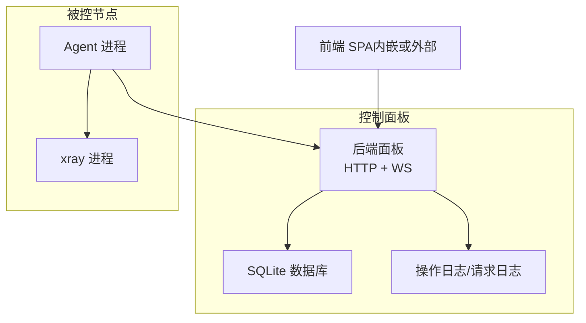
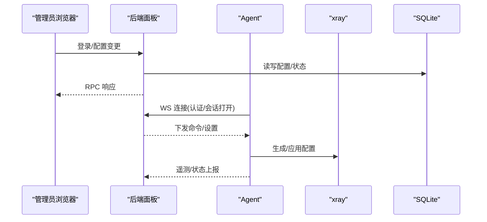
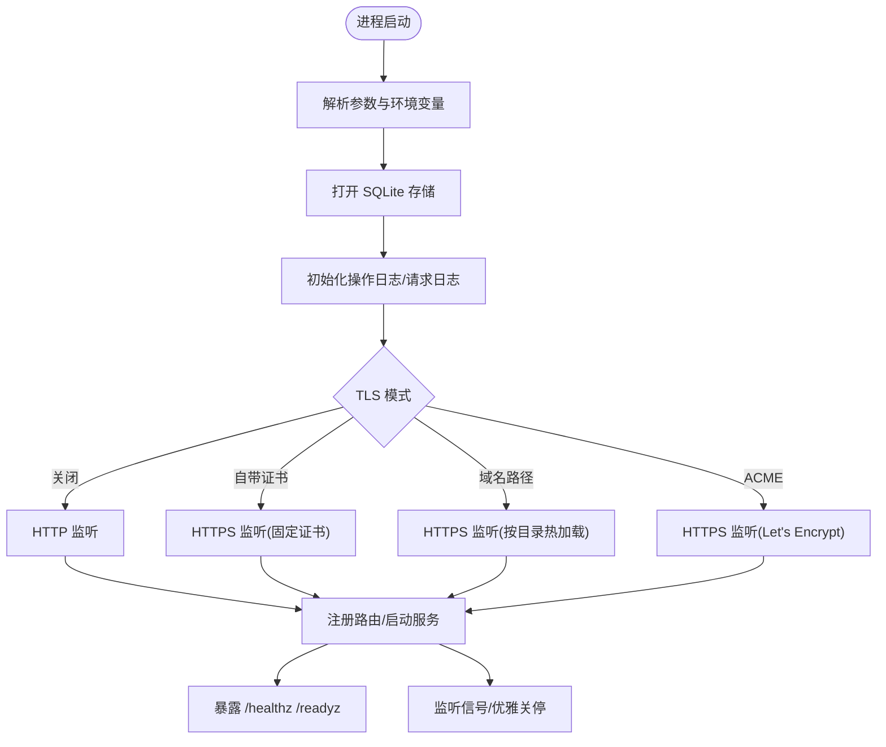
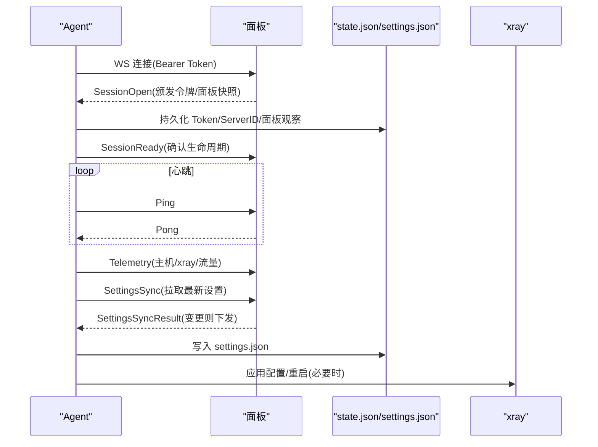
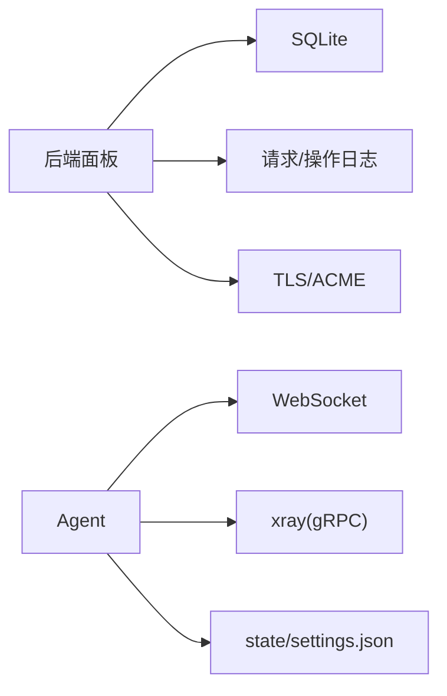
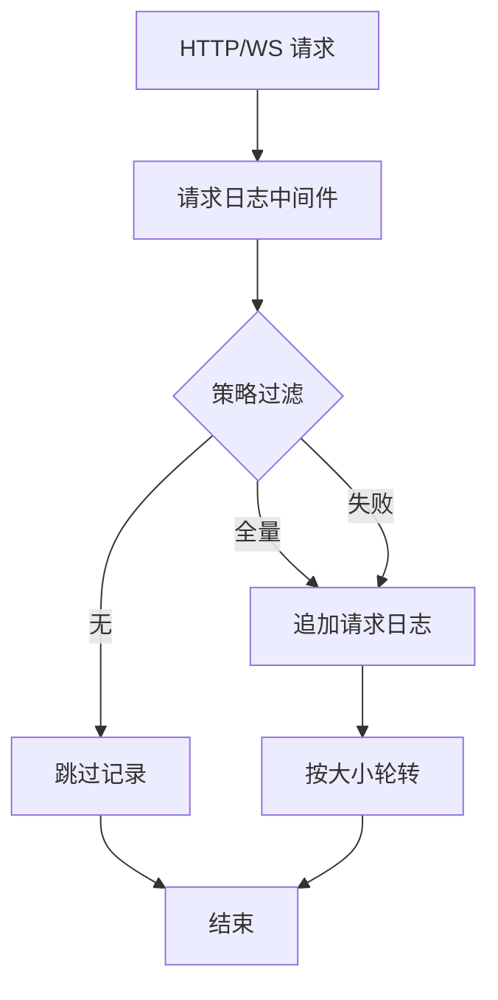

# 部署运维

<cite>
**本文引用的文件**   
- [Dockerfile](file://Dockerfile)
- [install.sh](file://install.sh)
- [src/backend/cmd/backend/main.go](file://src/backend/cmd/backend/main.go)
- [src/agent/cmd/agent/main.go](file://src/agent/cmd/agent/main.go)
- [src/backend/internal/logging/http.go](file://src/backend/internal/logging/http.go)
- [src/backend/internal/store/store.go](file://src/backend/internal/store/store.go)
- [scripts/install-panel.sh](file://scripts/install-panel.sh)
- [docs/openapi.yaml](file://docs/openapi.yaml)
</cite>

## 目录
1. [简介](#简介)
2. [项目结构](#项目结构)
3. [核心组件](#核心组件)
4. [架构总览](#架构总览)
5. [详细组件分析](#详细组件分析)
6. [依赖关系分析](#依赖关系分析)
7. [性能与容量规划](#性能与容量规划)
8. [监控与日志](#监控与日志)
9. [备份与恢复](#备份与恢复)
10. [故障排查指南](#故障排查指南)
11. [生产最佳实践与安全加固](#生产最佳实践与安全加固)
12. [结论](#结论)

## 简介
本文件面向 Lattix-codex 的生产部署与运维，覆盖 Docker 容器化、原生二进制（systemd）安装、以及 Kubernetes 部署方案；提供环境变量与配置文件管理、TLS 证书配置（含 ACME）、监控与日志、备份恢复、性能调优、故障排查及生产安全建议。读者无需深入源码即可按步骤完成部署与日常运维。

## 项目结构
- 后端面板：Go 单二进制，内置前端静态资源，暴露 HTTP API 与 WebSocket 控制通道，使用 SQLite 持久化。
- Agent：运行在被控服务器上的独立二进制，通过 WebSocket 长连接与面板通信，负责 xray 生命周期管理与遥测上报。
- 前端：Bun/Vite 构建产物嵌入到后端二进制中，也可通过 -static 参数覆盖。
- 安装脚本：统一入口 install.sh 分发 panel/agent 子安装器；提供 Docker Compose 与 systemd 两种模式。

**图示来源** 
- [src/backend/cmd/backend/main.go:1-120](file://src/backend/cmd/backend/main.go#L1-L120)
- [src/agent/cmd/agent/main.go:1-120](file://src/agent/cmd/agent/main.go#L1-L120)
- [src/backend/internal/store/store.go:1-60](file://src/backend/internal/store/store.go#L1-L60)

**章节来源**
- [Dockerfile:1-44](file://Dockerfile#L1-L44)
- [install.sh:1-146](file://install.sh#L1-L146)
- [scripts/install-panel.sh:1-315](file://scripts/install-panel.sh#L1-L315)

## 核心组件
- 后端面板（backend）
  - 启动参数与环境变量：监听地址、数据库路径、日志目录、管理员账号密码、对外 URL、TLS 模式（关闭/自带证书/域名路径/ACME）、ACME 邮箱与缓存等。
  - 健康检查：/healthz、/readyz；就绪检查包含 Hub 状态与数据库 Ping。
  - 路由：REST RPC 接口、WebSocket 控制通道 /api/agent/ws、订阅端点 /sub/{token}、SPA 回退。
- Agent
  - 启动参数：面板 WS 地址、初始 token、状态与设置文件路径、xray 二进制与配置路径、gRPC API 地址、服务控制方式、升级基址等。
  - 连接流程：首次握手、会话建立、心跳保活、延迟探测、遥测上报、配置漂移检测、设置同步。
- 存储与日志
  - SQLite Schema：服务器、用户、节点、命令队列、指标历史、汇率等表。
  - 请求日志：可轮转、敏感字段脱敏、策略过滤（全量/失败/无）。

**章节来源**
- [src/backend/cmd/backend/main.go:62-120](file://src/backend/cmd/backend/main.go#L62-L120)
- [src/backend/cmd/backend/main.go:376-472](file://src/backend/cmd/backend/main.go#L376-L472)
- [src/agent/cmd/agent/main.go:33-98](file://src/agent/cmd/agent/main.go#L33-L98)
- [src/backend/internal/store/store.go:15-200](file://src/backend/internal/store/store.go#L15-L200)
- [src/backend/internal/logging/http.go:43-82](file://src/backend/internal/logging/http.go#L43-L82)

## 架构总览
面板作为控制平面，Agent 作为数据面代理，两者通过 WebSocket 进行双向 RPC。面板提供 REST API 供前端调用，同时维护 SQLite 状态。Agent 管理 xray 的生命周期并上报遥测。

**图示来源** 
- [src/backend/cmd/backend/main.go:324-374](file://src/backend/cmd/backend/main.go#L324-L374)
- [src/agent/cmd/agent/main.go:137-256](file://src/agent/cmd/agent/main.go#L137-L256)
- [docs/openapi.yaml:1-120](file://docs/openapi.yaml#L1-L120)

## 详细组件分析

### 后端面板（Backend）
- 启动与 TLS
  - 支持四种 TLS 模式：关闭、自带证书、域名路径（热加载）、ACME（Let's Encrypt，TLS-ALPN-01，仅需 443 可达）。
  - 可通过设置页保存的 tls_mode 覆盖启动参数，重启生效；path 模式按 mtime 热加载证书，续期免重启。
- 健康与就绪
  - /healthz 返回 ok；/readyz 在 Hub 未排空或面板非 Active 时返回 503，并记录 ready 状态迁移事件。
- 路由与中间件
  - 请求日志中间件对 /api/* 和 /sub/* 进行采集，支持策略过滤与敏感字段脱敏。
  - 优雅关停：收到信号后进入 Drain，拒绝新业务请求，等待 Agent 连接与后台任务结束。
- 配置项与环境变量
  - 关键环境变量：LATTIX_DB、LATTIX_LOG_DIR、LATTIX_STATIC、LATTIX_ADMIN_USER、LATTIX_ADMIN_PASS、LATTIX_PUBLIC_URL、LATTIX_TLS_DIR、LATTIX_ACME_CACHE、LATTIX_DEPLOY_MODE。
  - 启动参数：-addr、-db、-log-dir、-static、-admin-user、-admin-pass、-public-url、-tls-cert/-tls-key、-tls-dir、-tls-acme-domain、-tls-acme-email、-reset-admin。

**图示来源** 
- [src/backend/cmd/backend/main.go:62-120](file://src/backend/cmd/backend/main.go#L62-L120)
- [src/backend/cmd/backend/main.go:376-472](file://src/backend/cmd/backend/main.go#L376-L472)

**章节来源**
- [src/backend/cmd/backend/main.go:62-120](file://src/backend/cmd/backend/main.go#L62-L120)
- [src/backend/cmd/backend/main.go:376-472](file://src/backend/cmd/backend/main.go#L376-L472)
- [src/backend/internal/logging/http.go:43-82](file://src/backend/internal/logging/http.go#L43-L82)

### Agent
- 连接与认证
  - 首次连接需 bootstrap token；成功后交换长期凭证并落盘 state.json。
  - 支持跨面板重新绑定：若面板实例 ID 变化，清理旧配置并重置状态。
- 心跳与延迟探测
  - 应用层 Ping/Pong 保活；周期性延迟探针，受面板生命周期与重试策略影响。
- 遥测与漂移检测
  - 定时上报主机负载、CPU、内存、网络、xray 版本与流量计数器；检测 xray 配置漂移并上报。
- 设置同步
  - 拉取面板下发的 AgentSettings，校验后落盘 settings.json 并应用；失败则重试并记录错误。

**图示来源** 
- [src/agent/cmd/agent/main.go:137-256](file://src/agent/cmd/agent/main.go#L137-L256)
- [src/agent/cmd/agent/main.go:528-715](file://src/agent/cmd/agent/main.go#L528-L715)

**章节来源**
- [src/agent/cmd/agent/main.go:33-98](file://src/agent/cmd/agent/main.go#L33-L98)
- [src/agent/cmd/agent/main.go:137-256](file://src/agent/cmd/agent/main.go#L137-L256)
- [src/agent/cmd/agent/main.go:528-715](file://src/agent/cmd/agent/main.go#L528-L715)

### 安装与部署脚本
- 统一入口 install.sh
  - 自动解析最新版本，下载对应版本的 panel/agent 子安装器并执行。
  - 交互式向导支持 Docker Compose 与原生二进制两种模式。
- 面板安装脚本 scripts/install-panel.sh
  - Docker 模式：生成 .env 与 compose.yaml，创建 data/certs/acme-cache 目录，拉起容器。
  - 原生模式：下载二进制与校验和，安装到 /usr/local/lattix-panel，生成 systemd 单元与 config.env，启用自启。

**章节来源**
- [install.sh:1-146](file://install.sh#L1-L146)
- [scripts/install-panel.sh:1-315](file://scripts/install-panel.sh#L1-L315)

### Docker 镜像与运行
- 多阶段构建：前端用 Bun 构建，后端用 Go 编译静态二进制，最终镜像基于 Alpine，最小化运行时依赖。
- 默认环境变量：LATTIX_DEPLOY_MODE=docker、LATTIX_DB=/data/lattix.db、LATTIX_TLS_DIR=/data/certs、LATTIX_ACME_CACHE=/data/acme-cache。
- 端口：默认 8080；可通过 -addr 或反向代理映射。

**章节来源**
- [Dockerfile:1-44](file://Dockerfile#L1-L44)

## 依赖关系分析
- 后端依赖
  - 存储：SQLite（modernc.org/sqlite），Schema 定义于 store.go。
  - 日志：请求日志与操作日志，支持大小限制与轮转。
  - TLS：标准库 crypto/tls 与 autocert（ACME）。
- Agent 依赖
  - WebSocket 客户端：gorilla/websocket。
  - xray 管理：通过 gRPC API 查询统计、生成/应用配置。
- 外部依赖
  - GitHub Releases 用于面板/Agent/xray 版本获取与自升级。
  - Let's Encrypt ACME 用于自动证书。

**图示来源** 
- [src/backend/internal/store/store.go:1-60](file://src/backend/internal/store/store.go#L1-L60)
- [src/backend/cmd/backend/main.go:1-60](file://src/backend/cmd/backend/main.go#L1-L60)
- [src/agent/cmd/agent/main.go:1-60](file://src/agent/cmd/agent/main.go#L1-L60)

**章节来源**
- [src/backend/internal/store/store.go:1-60](file://src/backend/internal/store/store.go#L1-L60)
- [src/backend/cmd/backend/main.go:1-60](file://src/backend/cmd/backend/main.go#L1-L60)
- [src/agent/cmd/agent/main.go:1-60](file://src/agent/cmd/agent/main.go#L1-L60)

## 性能与容量规划
- 系统资源
  - 面板：轻量级，单进程；建议 1C2G 起步，磁盘 I/O 以 SQLite 为主。
  - Agent：取决于 xray 流量与遥测频率；建议与 xray 同机部署，避免额外开销。
- 数据库优化
  - 使用 SSD 存储 SQLite；合理设置 WAL 模式（由驱动默认开启）；定期 VACUUM 与备份。
- 网络优化
  - 面板仅暴露必要端口（如 8080/443），通过反向代理（Nginx/Caddy）做 TLS 终止与限流。
  - 调整 TCP 内核参数（如 net.core.somaxconn、net.ipv4.tcp_tw_reuse）提升并发。
- 日志与存储
  - 根据 QPS 调整请求日志最大体积与保留策略；将 logs 目录挂载至高性能磁盘。
- 水平扩展
  - 面板为有状态（SQLite），不建议多副本；如需高可用，考虑主从或迁移至外部数据库（需二次开发）。

[本节为通用指导，不直接分析具体文件]

## 监控与日志
- 日志级别与策略
  - 请求日志策略：full/failures_only/none；敏感字段自动脱敏；支持按路径与参数裁剪。
  - 操作日志：记录面板启动/停止、Agent 在线/离线、链降级等关键事件。
- 日志轮转
  - 请求日志按大小轮转；可通过设置页调整 RequestLogMaxMB。
- 监控指标
  - Agent 上报主机负载、CPU、内存、网络、xray 版本与流量计数器；面板聚合展示与历史查询。
- 告警
  - 支持 Webhook/Telegram 告警；可在设置页配置并测试。

**图示来源** 
- [src/backend/internal/logging/http.go:43-82](file://src/backend/internal/logging/http.go#L43-L82)
- [src/backend/internal/logging/http.go:195-204](file://src/backend/internal/logging/http.go#L195-L204)

**章节来源**
- [src/backend/internal/logging/http.go:43-82](file://src/backend/internal/logging/http.go#L43-L82)
- [src/backend/internal/logging/http.go:195-204](file://src/backend/internal/logging/http.go#L195-L204)

## 备份与恢复
- 备份范围
  - 数据库：lattix.db（SQLite 文件）。
  - 配置：certs（证书）、acme-cache（ACME 缓存）、logs（可选）、config.env/.env（环境变量）。
- 备份策略
  - 每日增量/每周全量；确保一致性（停止面板或使用 fsfreeze/快照）。
  - 加密传输与存储；保留至少 N 个版本。
- 恢复流程
  - 停止面板 → 恢复 db/certs/logs/config → 启动面板 → 验证 /readyz 与登录。
- 灾难恢复
  - 在新节点安装相同版本 → 恢复数据 → 验证 Agent 重连与链状态。

[本节为通用指导，不直接分析具体文件]

## 故障排查指南
- 无法访问面板
  - 检查 /healthz 与 /readyz；查看日志目录 logs 与 operation.db。
  - 确认防火墙/反向代理端口映射正确。
- TLS 问题
  - ACME 模式需 443 可达；检查域名解析与 DNS；查看 acme-cache 权限。
  - 域名路径模式确保证书文件存在且可读；mtime 更新触发热加载。
- Agent 无法连接
  - 检查 bootstrap token 是否有效；查看 state.json 权限与内容。
  - 面板是否处于 Active 状态；Hub 是否排空中。
- 配置未生效
  - 检查 Agent 设置同步结果与 settings.json；查看漂移检测上报。
- 日志过大或丢失
  - 调整 RequestLogMaxMB；检查磁盘空间与轮转策略。

**章节来源**
- [src/backend/cmd/backend/main.go:376-424](file://src/backend/cmd/backend/main.go#L376-L424)
- [src/agent/cmd/agent/main.go:137-256](file://src/agent/cmd/agent/main.go#L137-L256)

## 生产最佳实践与安全加固
- 最小权限
  - 面板与 Agent 以独立用户运行；限制文件系统权限（data/certs 仅读/写必要目录）。
- 网络安全
  - 仅开放必要端口；使用反向代理做 TLS 终止与访问控制；启用速率限制与 IP 白名单。
- 密钥管理
  - 管理员密码通过 bcrypt 哈希存储；避免明文传递；定期轮换。
- 更新与升级
  - 使用官方 Release 与校验和；启用面板/Agent/xray 自升级；灰度发布。
- 审计与合规
  - 开启操作日志与请求日志；集中收集到 SIEM；定期审计。
- 高可用与容灾
  - 面板单副本 + 可靠存储；Agent 多节点冗余；定期演练恢复流程。

[本节为通用指导，不直接分析具体文件]

## 结论
Lattix-codex 提供了简洁可靠的控制面板与 Agent 体系，支持多种部署方式与灵活的 TLS 配置。通过合理的资源规划、日志与监控、备份恢复与安全防护，可在生产环境稳定运行。建议结合企业现有基础设施（反向代理、CI/CD、监控平台）完善自动化与可观测性。