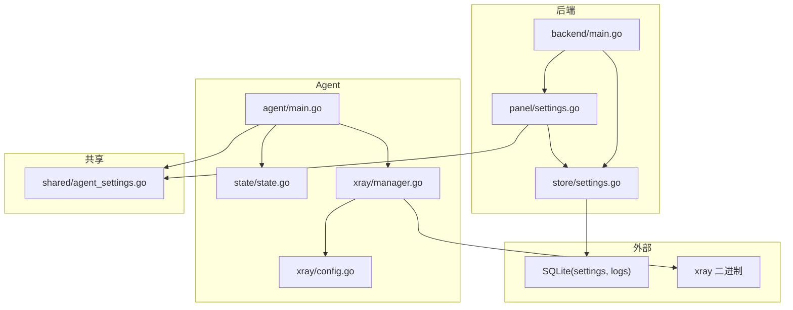
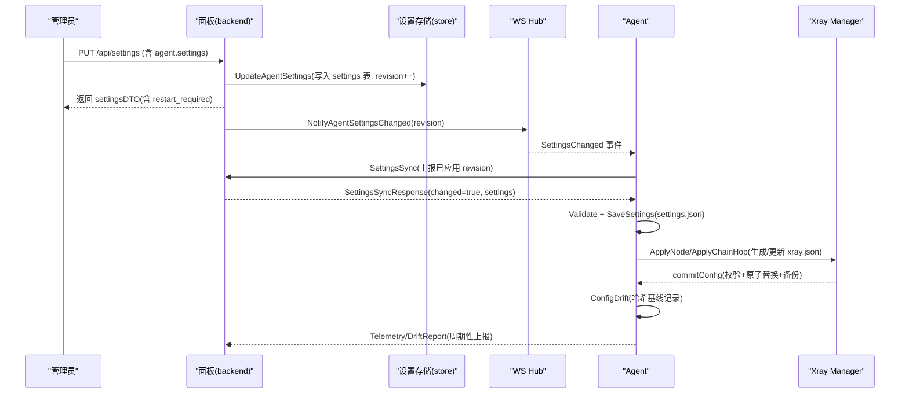
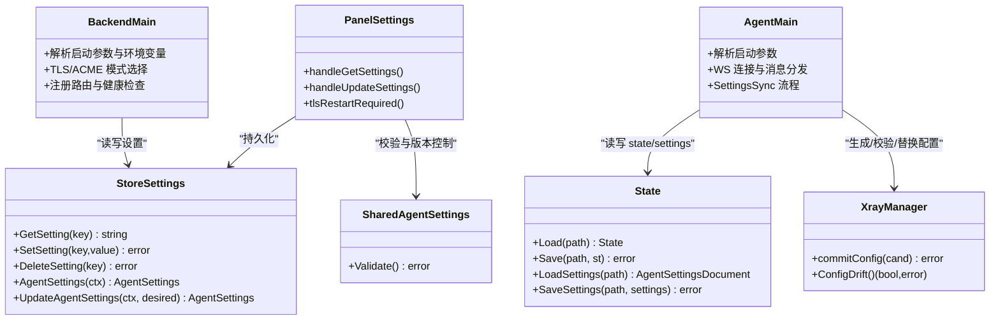

# 配置管理

<cite>
**本文引用的文件**   
- [src/agent/cmd/agent/main.go](file://src/agent/cmd/agent/main.go)
- [src/backend/cmd/backend/main.go](file://src/backend/cmd/backend/main.go)
- [src/shared/agent_settings.go](file://src/shared/agent_settings.go)
- [src/backend/internal/store/settings.go](file://src/backend/internal/store/settings.go)
- [src/backend/internal/panel/settings.go](file://src/backend/internal/panel/settings.go)
- [src/agent/internal/xray/config.go](file://src/agent/internal/xray/config.go)
- [src/agent/internal/xray/manager.go](file://src/agent/internal/xray/manager.go)
- [src/agent/internal/state/state.go](file://src/agent/internal/state/state.go)
- [docs/openapi.yaml](file://docs/openapi.yaml)
- [Dockerfile](file://Dockerfile)
</cite>

## 目录
1. [简介](#简介)
2. [项目结构](#项目结构)
3. [核心组件](#核心组件)
4. [架构总览](#架构总览)
5. [详细组件分析](#详细组件分析)
6. [依赖关系分析](#依赖关系分析)
7. [性能与可靠性](#性能与可靠性)
8. [故障排查指南](#故障排查指南)
9. [结论](#结论)
10. [附录：配置模板与最佳实践](#附录配置模板与最佳实践)

## 简介
本文件为 Lattix-codex 项目的“配置管理”权威文档，覆盖后端服务、Agent 程序、Xray 运行时、数据库、网络与安全（TLS/ACME）、告警、日志等全栈配置项。内容包含：
- 配置文件格式与位置（JSON、SQLite settings、环境变量）
- 启动参数与环境变量说明（取值范围、默认值）
- 面板设置 API 的键名与语义
- Agent 受管设置的校验规则与热更新机制
- Xray 配置文件的生成、校验、回滚与漂移检测
- 生产环境优化建议与安全加固要点
- 自动化配置管理与审计能力使用方式

## 项目结构
Lattix-codex 由后端面板、Agent 进程、共享类型定义与前端组成。配置相关的关键代码分布如下：
- 后端启动参数与环境变量解析、TLS/ACME 模式选择、设置持久化
- Agent 启动参数、状态与设置文件路径、Xray 二进制与配置路径
- 共享的 AgentSettings 结构与校验规则
- 面板设置存储（settings 表）与读取/写入接口
- Xray 配置生成、校验、原子替换与漂移检测

**图表来源** 
- [src/backend/cmd/backend/main.go:74-90](file://src/backend/cmd/backend/main.go#L74-L90)
- [src/backend/internal/store/settings.go:13-40](file://src/backend/internal/store/settings.go#L13-L40)
- [src/backend/internal/panel/settings.go:110-172](file://src/backend/internal/panel/settings.go#L110-L172)
- [src/agent/cmd/agent/main.go:33-44](file://src/agent/cmd/agent/main.go#L33-L44)
- [src/agent/internal/state/state.go:60-109](file://src/agent/internal/state/state.go#L60-L109)
- [src/agent/internal/xray/manager.go:232-304](file://src/agent/internal/xray/manager.go#L232-L304)
- [src/agent/internal/xray/config.go:10-20](file://src/agent/internal/xray/config.go#L10-L20)
- [src/shared/agent_settings.go:8-17](file://src/shared/agent_settings.go#L8-L17)

**章节来源**
- [src/backend/cmd/backend/main.go:74-90](file://src/backend/cmd/backend/main.go#L74-L90)
- [src/agent/cmd/agent/main.go:33-44](file://src/agent/cmd/agent/main.go#L33-L44)
- [src/backend/internal/store/settings.go:13-40](file://src/backend/internal/store/settings.go#L13-L40)
- [src/backend/internal/panel/settings.go:110-172](file://src/backend/internal/panel/settings.go#L110-L172)
- [src/agent/internal/xray/manager.go:232-304](file://src/agent/internal/xray/manager.go#L232-L304)
- [src/agent/internal/xray/config.go:10-20](file://src/agent/internal/xray/config.go#L10-L20)
- [src/shared/agent_settings.go:8-17](file://src/shared/agent_settings.go#L8-L17)

## 核心组件
- 后端启动参数与环境变量
  - HTTP 监听地址、数据库路径、日志目录、静态资源覆盖、管理员凭据、对外 URL、GitHub 仓库、TLS/ACME 证书与缓存目录等
  - 支持通过环境变量 LATTIX_* 覆盖默认值
- Agent 启动参数
  - 面板 WS 地址、引导 token、状态文件路径、设置文件路径、xray 二进制与配置路径、gRPC API、运行器模式、release 基址
- 面板设置存储
  - settings 表 key-value 形式，提供 Get/Set/Delete；AgentSettings 以 JSON 序列化存储并带 revision 版本控制
- 面板设置 API
  - GET /api/settings 返回当前保存值与运行态快照（含 restart_required）
  - PUT /api/settings 统一更新各类设置，含 AgentSettings、TLS、告警、日志、巡检调度等
- Agent 受管设置
  - AgentSettingsDocument 包含 schema_version、panel 元数据、agent 配置（reconnect、telemetry、drift_detection），具备严格 Validate 校验
- Xray 配置管理
  - 模板占位符替换、用户列表增删、inbounds 按 tag 操作、原子落盘与 xray run -test 校验、备份与回滚、漂移检测

**章节来源**
- [src/backend/cmd/backend/main.go:74-90](file://src/backend/cmd/backend/main.go#L74-L90)
- [src/agent/cmd/agent/main.go:33-44](file://src/agent/cmd/agent/main.go#L33-L44)
- [src/backend/internal/store/settings.go:42-73](file://src/backend/internal/store/settings.go#L42-L73)
- [src/backend/internal/panel/settings.go:110-172](file://src/backend/internal/panel/settings.go#L110-L172)
- [src/shared/agent_settings.go:37-93](file://src/shared/agent_settings.go#L37-L93)
- [src/agent/internal/xray/config.go:83-114](file://src/agent/internal/xray/config.go#L83-L114)
- [src/agent/internal/xray/manager.go:232-304](file://src/agent/internal/xray/manager.go#L232-L304)

## 架构总览
下图展示配置在面板与 Agent 之间的流转与控制面交互：

**图表来源** 
- [src/backend/internal/panel/settings.go:221-566](file://src/backend/internal/panel/settings.go#L221-L566)
- [src/backend/internal/store/settings.go:101-158](file://src/backend/internal/store/settings.go#L101-L158)
- [src/agent/cmd/agent/main.go:545-715](file://src/agent/cmd/agent/main.go#L545-L715)
- [src/agent/internal/xray/manager.go:232-304](file://src/agent/internal/xray/manager.go#L232-L304)

## 详细组件分析

### 后端服务配置（启动参数与环境变量）
- 关键参数
  - addr: HTTP 监听地址
  - db: SQLite 数据库路径（可被 LATTIX_DB 覆盖）
  - log-dir: 日志目录（空则与 db 同级 logs/）
  - static: 前端构建产物覆盖目录（空则内嵌）
  - admin-user/admin-pass: 管理员账号密码（可被 LATTIX_ADMIN_USER/LATTIX_ADMIN_PASS 覆盖）
  - public-url: 面板对外地址（用于生成安装命令/订阅链接）
  - github-repo: release 仓库（org/repo）
  - tls-cert/tls-key: 自带证书（需同时提供）
  - tls-dir: 域名路径模式证书根目录（~/cert 或 LATTIX_TLS_DIR）
  - tls-acme-domain/acme-cache/acme-email: ACME 自动证书域名、缓存目录、邮箱
  - reset-admin: 重置管理员密码后退出（不启动面板）
- TLS 生效优先级
  - 设置页保存的 tls_mode 优先于启动参数；未设置时完全跟随启动参数
  - off/cert/acme/path 四种模式，path 模式支持热加载续期
- 健康检查
  - /healthz 与 /readyz 暴露存活与就绪状态

**章节来源**
- [src/backend/cmd/backend/main.go:74-90](file://src/backend/cmd/backend/main.go#L74-L90)
- [src/backend/cmd/backend/main.go:172-238](file://src/backend/cmd/backend/main.go#L172-L238)
- [src/backend/cmd/backend/main.go:376-424](file://src/backend/cmd/backend/main.go#L376-L424)

### 面板设置（API 与存储）
- 设置键（settings 表 key）
  - timezone/public_url/tls_mode/tls_cert_pem/tls_key_pem/tls_domain/acme_domain/acme_email/admin_pass_bcrypt/alert_webhook_url/alert_telegram_bot_token/alert_telegram_chat_id/operation_log_limit/request_log_max_mb/panel_instance_id/agent_settings/release_inspection/agent_release_cache/xray_release_cache/billing_inspection/exchange_rate_inspection/reporting_currency/exchange_rate_cache/traffic_timezone
- 获取与更新
  - GET /api/settings：返回保存值与运行态快照（含 restart_required）
  - PUT /api/settings：统一更新，含 AgentSettings、TLS、告警、日志、巡检调度、币种等
- 密码管理
  - 设置页改密会覆盖启动参数，bcrypt 哈希落库，会话密钥派生自密码哈希，改密即全部会话失效

**章节来源**
- [src/backend/internal/store/settings.go:13-40](file://src/backend/internal/store/settings.go#L13-L40)
- [src/backend/internal/panel/settings.go:110-172](file://src/backend/internal/panel/settings.go#L110-L172)
- [src/backend/internal/panel/settings.go:221-566](file://src/backend/internal/panel/settings.go#L221-L566)
- [src/backend/internal/panel/settings.go:568-614](file://src/backend/internal/panel/settings.go#L568-L614)

### Agent 受管设置（AgentSettings）
- 结构字段
  - revision: 只读，面板保存时递增
  - reconnect.mode: infinite/limited；max_retries: 1–100
  - telemetry.interval_seconds: 10–3600
  - drift_detection.interval_seconds: 5–3600
- 校验规则
  - AgentSettings.Validate() 对 revision、reconnect、telemetry、drift_detection 进行严格范围与枚举校验
  - AgentSettingsDocument.Validate() 校验 schema_version、panel.instance_id 必填
- 同步流程
  - Agent 定时发送 SettingsSync，面板返回 changed + settings，Agent 校验后落盘 settings.json 并应用

**章节来源**
- [src/shared/agent_settings.go:37-93](file://src/shared/agent_settings.go#L37-L93)
- [src/agent/cmd/agent/main.go:668-715](file://src/agent/cmd/agent/main.go#L668-L715)
- [src/agent/internal/state/state.go:75-109](file://src/agent/internal/state/state.go#L75-L109)

### Xray 配置管理（config.json）
- 模板与占位符
  - PORT/CLIENTS/PRIVATE_KEY/TAG/DECRYPTION 等占位符由 Agent 填充，原样写入 xray inbound JSON
- 用户列表操作
  - 按协议区分 clients/accounts，支持增量扇出（仅处理 payload 中列出的节点 tag）
- 原子落盘与校验
  - 写临时文件 → xray run -test 校验 → 备份 .prev → 原子替换 → 记录哈希基线
- 漂移检测
  - 定期计算 config.json 哈希并与上次落盘哈希比对，差异即漂移，上报面板

**章节来源**
- [src/agent/internal/xray/config.go:10-20](file://src/agent/internal/xray/config.go#L10-L20)
- [src/agent/internal/xray/config.go:83-114](file://src/agent/internal/xray/config.go#L83-L114)
- [src/agent/internal/xray/manager.go:232-304](file://src/agent/internal/xray/manager.go#L232-L304)

### 状态与设置文件（Agent）
- state.json：长期凭证、面板观察、链 piece 记录等
- settings.json：面板下发的 AgentSettingsDocument，带 schema_version 与 panel 元数据
- 读写策略
  - 先写 .tmp 再原子 rename，权限 0o600，确保一致性

**章节来源**
- [src/agent/internal/state/state.go:60-109](file://src/agent/internal/state/state.go#L60-L109)

### Docker 部署与默认环境变量
- 容器镜像内置环境变量：LATTIX_DEPLOY_MODE=docker、LATTIX_DB=/data/lattix.db、LATTIX_TLS_DIR=/data/certs、LATTIX_ACME_CACHE=/data/acme-cache
- 端口暴露 8080，ENTRYPOINT/CMD 指定后端二进制与默认监听地址

**章节来源**
- [Dockerfile:33-43](file://Dockerfile#L33-L43)

## 依赖关系分析
- 后端 main 依赖 store 与 panel，panel 依赖 store 与 shared.AgentSettings
- Agent main 依赖 state、xray.Manager、shared.AgentSettings
- Xray Manager 依赖文件系统与 xray 二进制，负责配置校验与回滚
- OpenAPI 定义了 RPC 信封与 AgentSettings 结构，供前端生成类型

**图表来源** 
- [src/backend/cmd/backend/main.go:74-90](file://src/backend/cmd/backend/main.go#L74-L90)
- [src/backend/internal/store/settings.go:42-73](file://src/backend/internal/store/settings.go#L42-L73)
- [src/backend/internal/panel/settings.go:110-172](file://src/backend/internal/panel/settings.go#L110-L172)
- [src/agent/cmd/agent/main.go:33-44](file://src/agent/cmd/agent/main.go#L33-L44)
- [src/agent/internal/state/state.go:60-109](file://src/agent/internal/state/state.go#L60-L109)
- [src/agent/internal/xray/manager.go:232-304](file://src/agent/internal/xray/manager.go#L232-L304)
- [src/shared/agent_settings.go:37-93](file://src/shared/agent_settings.go#L37-L93)

## 性能与可靠性
- 配置落盘采用原子写入（.tmp + rename），避免部分写入导致损坏
- Xray 配置变更先校验（xray run -test），失败丢弃临时文件，成功则备份旧配置并原子替换
- 漂移检测基于 SHA256 哈希，首次调用以当前文件为基线，删除视为漂移
- 设置更新通过 revision 控制，Agent 侧幂等应用，避免重复下发
- 日志与请求日志支持容量限制与丢弃统计，便于生产调优

**章节来源**
- [src/agent/internal/state/state.go:60-109](file://src/agent/internal/state/state.go#L60-L109)
- [src/agent/internal/xray/manager.go:232-304](file://src/agent/internal/xray/manager.go#L232-L304)
- [src/backend/cmd/backend/main.go:163-170](file://src/backend/cmd/backend/main.go#L163-L170)

## 故障排查指南
- 认证拒绝
  - Agent 首次连接若收到明确拒绝，将停止自动重试，需重新绑定新面板并重启
- 设置同步失败
  - Agent 侧会记录 last_apply_error，可通过 SettingsSync 回执查看
- 配置漂移
  - 当检测到 config.json 被外部修改，会上报 DriftReport，需恢复受管状态
- 日志与审计
  - 操作日志与请求日志可通过面板 API 查询与清理；设置变更会记录审计事件

**章节来源**
- [src/agent/cmd/agent/main.go:68-98](file://src/agent/cmd/agent/main.go#L68-L98)
- [src/agent/cmd/agent/main.go:682-715](file://src/agent/cmd/agent/main.go#L682-L715)
- [src/agent/cmd/agent/main.go:311-353](file://src/agent/cmd/agent/main.go#L311-L353)
- [src/backend/internal/panel/settings.go:518-566](file://src/backend/internal/panel/settings.go#L518-L566)

## 结论
Lattix-codex 的配置体系以“面板集中管理 + Agent 受管执行”为核心，结合严格的校验、原子落盘、回滚与漂移检测，确保配置一致性与高可用。通过统一的设置 API 与 settings 表，实现跨模块配置的可观测与可审计。生产环境建议启用 TLS/ACME、合理配置日志容量与巡检调度，并通过 revision 与 SettingsSync 保障 Agent 侧稳定应用。

## 附录：配置模板与最佳实践

### 后端服务配置清单（示例）
- 启动参数
  - addr: 如 ":8080"
  - db: 绝对路径，如 "/data/lattix.db"
  - log-dir: 绝对路径，如 "/data/logs"
  - admin-user/admin-pass: 强密码（生产建议使用设置页改密）
  - public-url: 形如 https://panel.example.com
  - tls-dir: 绝对路径，如 "/data/certs"
  - tls-acme-domain/acme-cache/acme-email: 按需配置
- 环境变量
  - LATTIX_DB、LATTIX_LOG_DIR、LATTIX_STATIC、LATTIX_ADMIN_USER、LATTIX_ADMIN_PASS、LATTIX_PUBLIC_URL、LATTIX_TLS_DIR、LATTIX_ACME_CACHE

**章节来源**
- [src/backend/cmd/backend/main.go:74-90](file://src/backend/cmd/backend/main.go#L74-L90)

### Agent 配置清单（示例）
- 启动参数
  - panel: ws://panel.example.com/api/agent/ws
  - token: 首次引导 token（后续由面板签发）
  - state: /opt/lattix-agent/data/state.json
  - settings: /opt/lattix-agent/data/settings.json
  - xray-bin: /opt/lattix-agent/bin/xray
  - xray-config: /opt/lattix-agent/config/xray.json
  - xray-api: 127.0.0.1:10085
  - xray-runner: systemd|exec
  - xray-release-base: 可选镜像源
- 文件
  - state.json：长期凭证与面板观察
  - settings.json：面板下发的 AgentSettingsDocument

**章节来源**
- [src/agent/cmd/agent/main.go:33-44](file://src/agent/cmd/agent/main.go#L33-L44)
- [src/agent/internal/state/state.go:60-109](file://src/agent/internal/state/state.go#L60-L109)

### 面板设置键（settings 表 key）速查
- timezone/public_url/tls_mode/tls_cert_pem/tls_key_pem/tls_domain/acme_domain/acme_email/admin_pass_bcrypt
- alert_webhook_url/alert_telegram_bot_token/alert_telegram_chat_id
- operation_log_limit/request_log_max_mb
- agent_settings/release_inspection/billing_inspection/exchange_rate_inspection/reporting_currency/exchange_rate_cache/traffic_timezone

**章节来源**
- [src/backend/internal/store/settings.go:13-40](file://src/backend/internal/store/settings.go#L13-L40)

### AgentSettings 字段与取值范围
- reconnect.mode: infinite|limited；max_retries: 1–100
- telemetry.interval_seconds: 10–3600
- drift_detection.interval_seconds: 5–3600
- revision: 只读，面板递增

**章节来源**
- [src/shared/agent_settings.go:37-93](file://src/shared/agent_settings.go#L37-L93)

### Xray 配置模板与占位符
- 占位符：PORT、CLIENTS、PRIVATE_KEY、TAG、DECRYPTION
- 用户列表：按协议区分 clients/accounts，支持增量扇出
- 校验与回滚：xray run -test 校验失败丢弃；成功则备份 .prev 并原子替换

**章节来源**
- [src/agent/internal/xray/config.go:83-114](file://src/agent/internal/xray/config.go#L83-L114)
- [src/agent/internal/xray/manager.go:232-304](file://src/agent/internal/xray/manager.go#L232-L304)

### 安全与生产优化建议
- 启用 TLS/ACME，优先 path 模式配合外部 ACME 续期
- 设置强密码并通过设置页改密（覆盖启动参数）
- 限制日志容量与保留条数，避免磁盘耗尽
- 使用 revision 与 SettingsSync 保证 Agent 侧幂等应用
- 监控漂移检测与告警 Webhook/Telegram 通知

**章节来源**
- [src/backend/cmd/backend/main.go:172-238](file://src/backend/cmd/backend/main.go#L172-L238)
- [src/backend/internal/panel/settings.go:221-566](file://src/backend/internal/panel/settings.go#L221-L566)
- [src/agent/internal/xray/manager.go:275-304](file://src/agent/internal/xray/manager.go#L275-L304)

### 配置热更新与迁移策略
- 热更新
  - TLS path 模式：证书文件替换后热加载，无需重启
  - AgentSettings：通过 revision 与 SettingsSync 推送，Agent 校验后应用
- 迁移策略
  - schema_version 校验，不支持的版本直接拒绝
  - AgentSettingsDocument 的 panel.instance_id 必填，确保面板身份稳定

**章节来源**
- [src/backend/cmd/backend/main.go:196-238](file://src/backend/cmd/backend/main.go#L196-L238)
- [src/shared/agent_settings.go:85-93](file://src/shared/agent_settings.go#L85-L93)

### 自动化与审计
- 自动化
  - 通过 /api/setting/update 批量更新设置，结合 CI/CD 脚本实现配置即代码
  - 使用 /api/log/list-operations 与 /api/log/list-requests 拉取审计与请求日志
- 审计
  - 设置变更会记录审计事件（含敏感字段脱敏）
  - 告警 Webhook/Telegram 可用于实时通知

**章节来源**
- [src/backend/internal/panel/settings.go:518-566](file://src/backend/internal/panel/settings.go#L518-L566)
- [docs/openapi.yaml:306-337](file://docs/openapi.yaml#L306-L337)