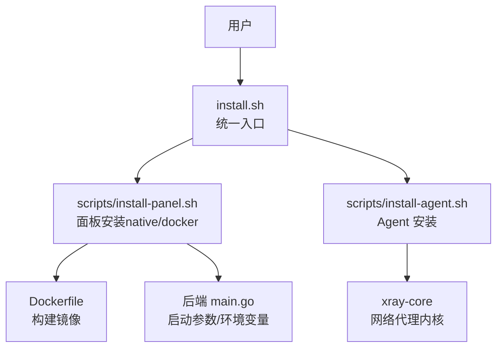
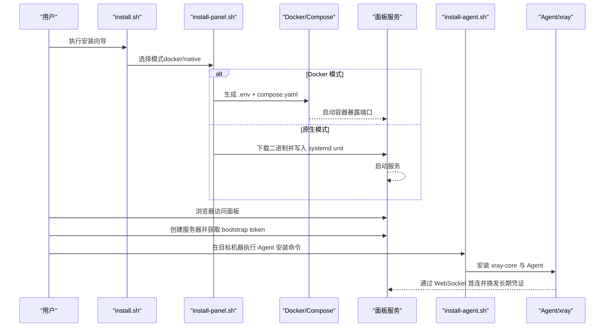

# 快速开始

<cite>
**本文引用的文件**   
- [install.sh](file://install.sh)
- [Dockerfile](file://Dockerfile)
- [scripts/install-panel.sh](file://scripts/install-panel.sh)
- [scripts/install-agent.sh](file://scripts/install-agent.sh)
- [src/backend/cmd/backend/main.go](file://src/backend/cmd/backend/main.go)
- [docs/KNOWN_ISSUES.md](file://docs/KNOWN_ISSUES.md)
- [scripts/dev-e2e-install-panel.sh](file://scripts/dev-e2e-install-panel.sh)
- [scripts/dev-e2e-install-agent.sh](file://scripts/dev-e2e-install-agent.sh)
</cite>

## 目录
1. [简介](#简介)
2. [项目结构](#项目结构)
3. [核心组件](#核心组件)
4. [架构总览](#架构总览)
5. [详细安装与部署指南](#详细安装与部署指南)
6. [依赖分析](#依赖分析)
7. [性能与部署建议](#性能与部署建议)
8. [故障排查指南](#故障排查指南)
9. [验证安装成功](#验证安装成功)
10. [结论](#结论)

## 简介
本快速开始指南面向首次接触 Lattix-codex 的用户，目标是帮助你在最短时间内完成面板（Panel）与节点（Agent）的安装、基础配置与可用性验证。内容涵盖：
- 环境要求与依赖准备
- 一键安装脚本使用方法
- Docker 部署与原生安装的差异与选择建议
- 首次启动后的基本配置（管理员账户、TLS、初始服务器添加）
- 常见安装问题与排障方法
- 安装成功的验证步骤

## 项目结构
Lattix-codex 由后端面板、前端界面、Agent 管理程序以及安装脚本组成。关键入口与产物如下：
- 根级安装入口：install.sh（统一分发到 panel/agent 子安装器）
- 面板安装脚本：scripts/install-panel.sh（支持 native/systemd 或 docker/compose）
- Agent 安装脚本：scripts/install-agent.sh（自动下载 xray-core、注册服务/守护脚本）
- 容器镜像构建：Dockerfile（多阶段构建前端与后端，最小化运行镜像）
- 后端主程序参数与环境变量：src/backend/cmd/backend/main.go

图表来源
- [install.sh:1-146](file://install.sh#L1-L146)
- [scripts/install-panel.sh:1-317](file://scripts/install-panel.sh#L1-L317)
- [scripts/install-agent.sh:1-460](file://scripts/install-agent.sh#L1-L460)
- [Dockerfile:1-44](file://Dockerfile#L1-L44)
- [src/backend/cmd/backend/main.go:80-120](file://src/backend/cmd/backend/main.go#L80-L120)

章节来源
- [install.sh:1-146](file://install.sh#L1-L146)
- [scripts/install-panel.sh:1-317](file://scripts/install-panel.sh#L1-L317)
- [scripts/install-agent.sh:1-460](file://scripts/install-agent.sh#L1-L460)
- [Dockerfile:1-44](file://Dockerfile#L1-L44)
- [src/backend/cmd/backend/main.go:80-120](file://src/backend/cmd/backend/main.go#L80-L120)

## 核心组件
- 面板（Backend）：提供 Web UI、API、WebSocket 控制通道、证书与 ACME、设置持久化等能力。
- Agent（Node）：安装在目标机器上，负责拉取并下发 xray 配置、维护进程状态、上报遥测。
- 安装器：一键脚本，自动解析版本、校验包完整性、生成 systemd unit 或 Compose 配置。
- 运行时：SQLite 数据库、日志、证书目录、ACME 缓存。

章节来源
- [src/backend/cmd/backend/main.go:80-120](file://src/backend/cmd/backend/main.go#L80-L120)
- [scripts/install-panel.sh:158-198](file://scripts/install-panel.sh#L158-L198)
- [scripts/install-agent.sh:285-330](file://scripts/install-agent.sh#L285-L330)

## 架构总览

图表来源
- [install.sh:78-101](file://install.sh#L78-L101)
- [scripts/install-panel.sh:158-198](file://scripts/install-panel.sh#L158-L198)
- [scripts/install-agent.sh:321-330](file://scripts/install-agent.sh#L321-L330)

## 详细安装与部署指南

### 环境要求与依赖
- 操作系统：Linux（仅支持 Linux；macOS/Windows 非正式支持）
- 架构：linux/amd64、linux/arm64
- 网络：能访问 GitHub Releases 与 GHCR（ghcr.io/beanya/lattix）
- 工具（根据模式不同需要部分依赖）：
  - curl、tar、sha256sum（通用）
  - unzip（安装 xray-core 时需要）
  - Docker Engine + Compose（Docker 模式）
  - systemctl（原生 systemd 模式）

章节来源
- [docs/KNOWN_ISSUES.md:48-51](file://docs/KNOWN_ISSUES.md#L48-L51)
- [scripts/install-panel.sh:82-107](file://scripts/install-panel.sh#L82-L107)
- [scripts/install-agent.sh:267-283](file://scripts/install-agent.sh#L267-L283)

### 一键安装脚本使用方法
- 统一入口：install.sh
  - 交互式向导：直接运行 install.sh，选择“1) Docker Compose（推荐）”或“2) 原生二进制 + systemd”，按提示输入绑定地址、端口、管理员账号密码、配置目录等。
  - 非交互模式：通过命令行参数指定 --mode、--version、--bind、--port、--admin-user、--admin-pass、--public-url、--config-dir 等。
- 面板安装：scripts/install-panel.sh
  - --mode native|docker 二选一
  - --version vX.Y.Z（必填）
  - --install-docker（可选，自动安装 Docker Engine + Compose）
  - --bind/--port/--admin-user/--admin-pass/--public-url/--config-dir（按需传入）
- Agent 安装：scripts/install-agent.sh
  - 必需：--panel <PANEL_URL>、--token <BOOTSTRAP_TOKEN>、--version <VERSION>
  - 可选：--xray-version latest|vX.Y.Z
  - 开发/用户态模式：LATX_DEV=1、LATX_USER_MODE=1、XRAY_BIN 覆盖等

章节来源
- [install.sh:78-101](file://install.sh#L78-L101)
- [scripts/install-panel.sh:20-46](file://scripts/install-panel.sh#L20-L46)
- [scripts/install-agent.sh:161-175](file://scripts/install-agent.sh#L161-L175)

### Docker 部署方式（推荐）
- 优点：隔离性好、升级简单、无需宿主机 systemd；适合大多数生产场景。
- 安装流程：
  - 使用 install.sh 选择 Docker 模式，或调用 scripts/install-panel.sh --mode docker
  - 自动生成 config/.env 与 compose.yaml，默认将数据目录挂载至 /opt/lattix-panel/data
  - 默认监听 127.0.0.1:8080，可通过反向代理对外暴露
- 重要环境变量（写入 config/.env 后生效）：
  - LATTIX_ADMIN_USER、LATTIX_ADMIN_PASS、LATTIX_PUBLIC_URL、LATTIX_BIND、LATTIX_PORT
  - LATTIX_DB=/data/lattix.db、LATTIX_TLS_DIR=/data/certs、LATTIX_ACME_CACHE=/data/acme-cache
- 注意：
  - 内置 ACME 需要公网 443 可达；若使用 Nginx/OpenResty 终止 TLS，则无需启用面板自身 TLS
  - 证书路径在容器内为 /data/certs/<域名>/fullchain.pem|privkey.pem

章节来源
- [scripts/install-panel.sh:158-198](file://scripts/install-panel.sh#L158-L198)
- [Dockerfile:33-37](file://Dockerfile#L33-L37)
- [docs/KNOWN_ISSUES.md:23-36](file://docs/KNOWN_ISSUES.md#L23-L36)

### 原生安装方式（systemd）
- 优点：无容器开销、可直接管理宿主机资源；适合对性能敏感或受限环境。
- 安装流程：
  - 使用 install.sh 选择原生模式，或调用 scripts/install-panel.sh --mode native
  - 自动下载二进制、校验 checksums.txt、写入 /usr/local/lattix-panel
  - 生成 systemd unit 并 enable --now
- 配置文件：/usr/local/lattix-panel/config.env（权限 0600），包含管理员凭据、公共 URL、部署模式、数据与证书路径等
- 常用环境变量（可覆盖启动参数）：
  - LATTIX_DB、LATTIX_LOG_DIR、LATTIX_STATIC、LATTIX_ADMIN_USER、LATTIX_ADMIN_PASS、LATTIX_PUBLIC_URL、LATTIX_TLS_DIR、LATTIX_ACME_CACHE

章节来源
- [scripts/install-panel.sh:200-310](file://scripts/install-panel.sh#L200-L310)
- [src/backend/cmd/backend/main.go:83-98](file://src/backend/cmd/backend/main.go#L83-L98)

### 首次启动后的基本配置
- 管理员账户创建：
  - 首次登录使用安装时提供的用户名与密码；如未显式设置，面板会随机生成或采用默认值
  - 可在设置页修改密码；短密码会被拒绝，bcrypt 哈希落库，旧会话失效
- TLS 证书配置：
  - 三种模式：off（关闭）、cert（自带证书 PEM）、acme（Let's Encrypt）、path（域名路径模式，热加载）
  - path 模式：将证书放置于 <tls-dir>/<域名>/fullchain.pem|privkey.pem，替换文件后下一次握手即生效，免重启续期
  - acme 模式：需公网 443 可达，面板自动申请与续期
- 初始服务器添加：
  - 在面板“服务器”页面新增一台服务器，复制生成的安装命令（含 --panel 与 --token）
  - 在目标机器执行该命令，Agent 将首连面板并换发长期凭证

章节来源
- [src/backend/cmd/backend/main.go:102-120](file://src/backend/cmd/backend/main.go#L102-L120)
- [src/backend/internal/panel/settings.go:27-33](file://src/backend/internal/panel/settings.go#L27-L33)
- [scripts/install-agent.sh:321-330](file://scripts/install-agent.sh#L321-L330)

### 常见问题与注意事项
- Docker 模式不提供宿主机运维能力（BBR、防火墙、日志轮转等需自行处理）
- 内置 ACME 必须公网 443 可达；使用 Nginx 反代时无需启用面板自身 TLS
- 证书路径在宿主机与容器内不同，请确保外部工具写入正确的宿主机路径
- GHCR 镜像必须保持公开，匿名拉取失败会导致新的 Docker 安装失败
- 仅支持 Linux；Docker Desktop 不属于正式支持的生产部署环境

章节来源
- [docs/KNOWN_ISSUES.md:17-51](file://docs/KNOWN_ISSUES.md#L17-L51)

## 依赖分析
- 安装器依赖：curl、tar、sha256sum、unzip（Agent 安装 xray-core 时）
- Docker 模式依赖：Docker Engine + Compose（可自动安装）
- 原生模式依赖：systemctl（用于注册服务）
- 运行时依赖：SQLite（数据库）、文件系统（日志、证书、ACME 缓存）

章节来源
- [scripts/install-panel.sh:82-107](file://scripts/install-panel.sh#L82-L107)
- [scripts/install-agent.sh:267-283](file://scripts/install-agent.sh#L267-L283)

## 性能与部署建议
- 推荐使用 Docker 模式以获得更好的隔离性与升级体验
- 使用 Nginx/OpenResty 终止 TLS，转发 Host、X-Forwarded-Proto、X-Forwarded-For 与 WebSocket Upgrade 头
- 静态资源开启长期缓存，减少重复下载
- 合理设置日志大小与保留策略，避免磁盘占用过高

[本节为通用指导，不直接分析具体文件]

## 故障排查指南
- 安装失败（checksum 校验不通过）：检查网络与 Release 资产是否被篡改
- 面板无法启动：查看 systemd 日志或容器日志；确认端口未被占用、证书路径正确
- Agent 无法上线：检查 WebSocket 连接（ws/wss）与 bootstrap token 是否正确；查看 agent.log
- TLS 问题：确认 mode 与证书文件路径一致；path 模式下确保证书文件名符合约定
- Docker 更新不一致：重建容器前需先更新 config/.env 中的 LATTIX_VERSION，再 pull 并 up

章节来源
- [scripts/dev-e2e-install-panel.sh:60-68](file://scripts/dev-e2e-install-panel.sh#L60-L68)
- [scripts/dev-e2e-install-agent.sh:116-138](file://scripts/dev-e2e-install-agent.sh#L116-L138)
- [docs/KNOWN_ISSUES.md:5-22](file://docs/KNOWN_ISSUES.md#L5-L22)

## 验证安装成功
- 面板可用性：
  - 浏览器访问 http://<绑定地址>:<端口>，返回 200 且可登录
  - 使用 latx status/version（原生模式）或查看容器状态（Docker 模式）
- 管理员登录：
  - 使用安装时提供的用户名与密码登录；如重置过密码，旧会话应失效
- Agent 上线：
  - 在面板“服务器”列表看到对应节点 online
  - 使用 latx-ag status/log（Agent 侧）查看进程与日志

章节来源
- [scripts/dev-e2e-install-panel.sh:84-115](file://scripts/dev-e2e-install-panel.sh#L84-L115)
- [scripts/dev-e2e-install-agent.sh:170-223](file://scripts/dev-e2e-install-agent.sh#L170-L223)

## 结论
通过以上步骤，你可以在最短时间内完成 Lattix-codex 的面板与 Agent 安装、基础配置与可用性验证。推荐优先使用 Docker 模式进行部署，结合 Nginx/OpenResty 终止 TLS，以获得更稳定与易维护的运维体验。遇到问题时，参考故障排查指南与已知问题文档定位与解决。