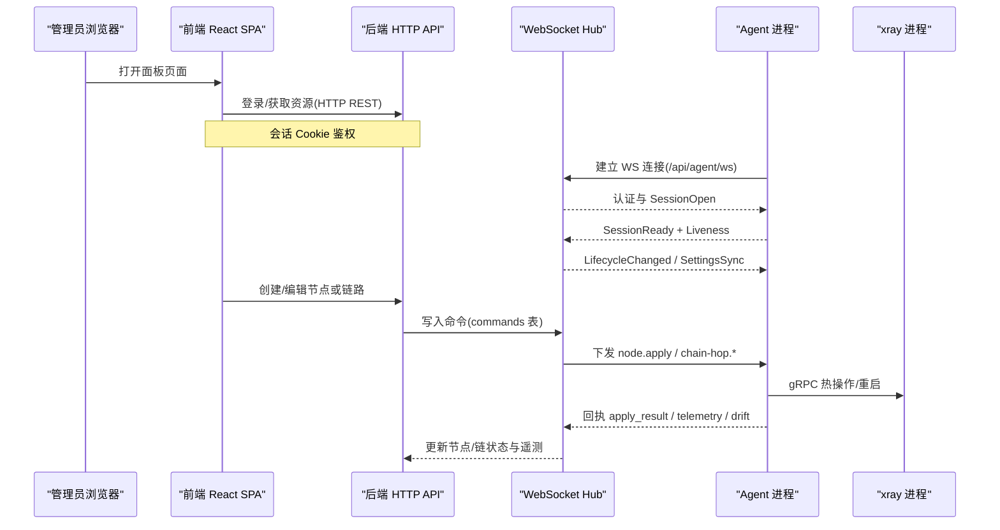
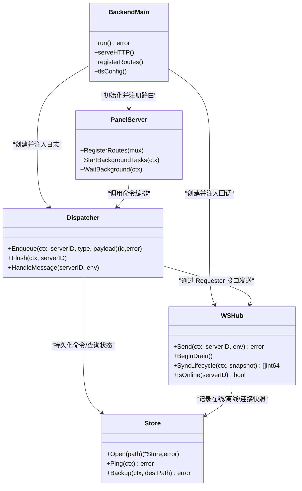
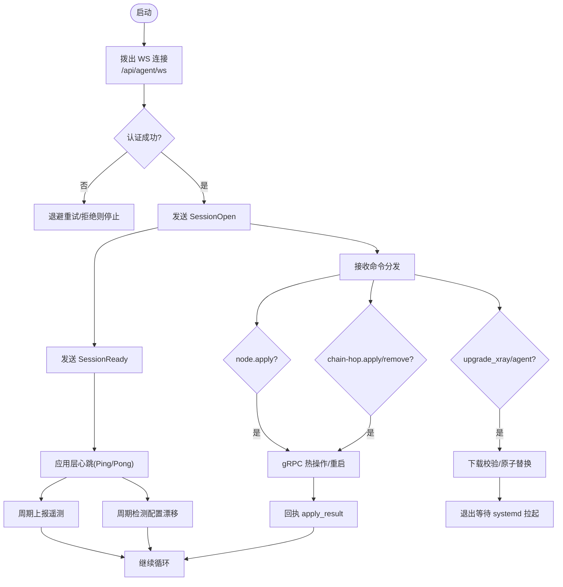
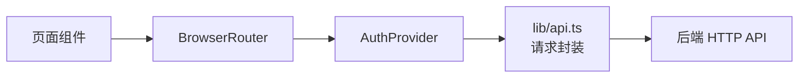
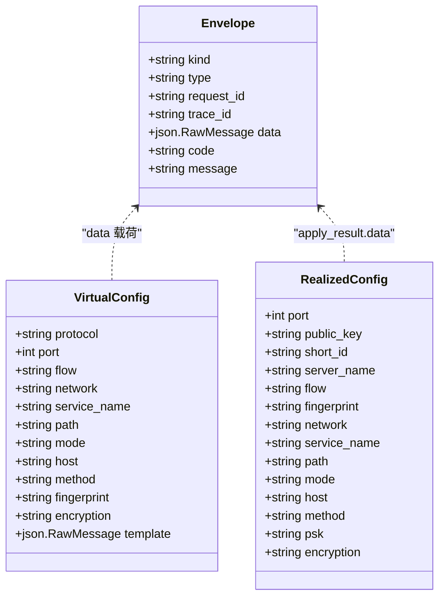
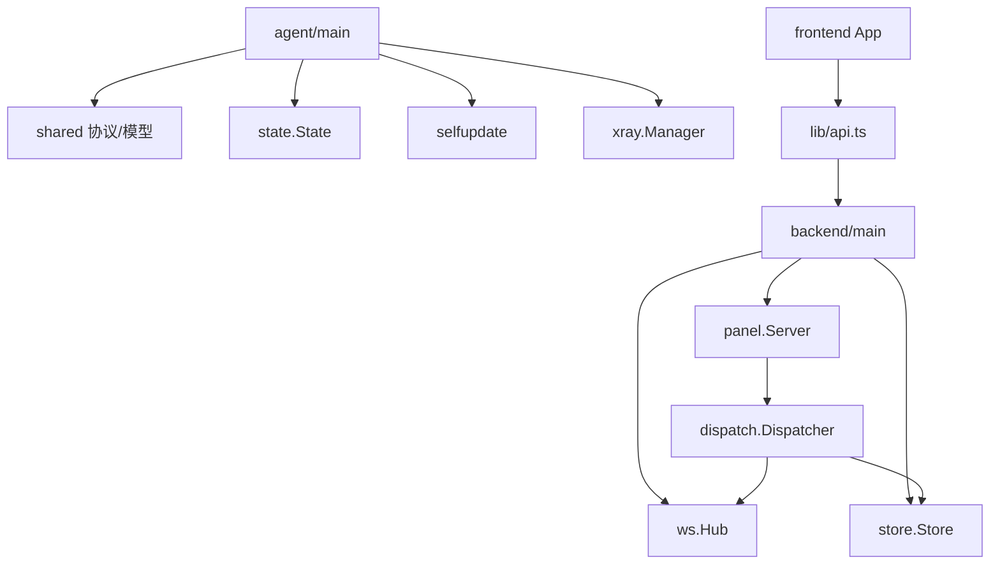
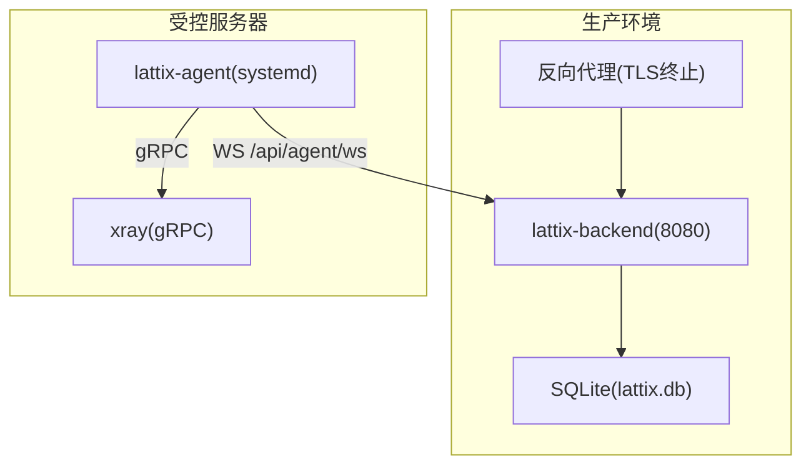

# 技术架构总览

<cite>
**本文引用的文件**   
- [src/backend/cmd/backend/main.go](file://src/backend/cmd/backend/main.go)
- [src/agent/cmd/agent/main.go](file://src/agent/cmd/agent/main.go)
- [src/frontend/src/App.tsx](file://src/frontend/src/App.tsx)
- [src/shared/messages.go](file://src/shared/messages.go)
- [src/shared/config.go](file://src/shared/config.go)
- [src/backend/internal/ws/hub.go](file://src/backend/internal/ws/hub.go)
- [src/backend/internal/store/store.go](file://src/backend/internal/store/store.go)
- [src/backend/internal/panel/panel.go](file://src/backend/internal/panel/panel.go)
- [src/backend/internal/dispatch/dispatcher.go](file://src/backend/internal/dispatch/dispatcher.go)
- [docs/openapi.yaml](file://docs/openapi.yaml)
- [Dockerfile](file://Dockerfile)
- [go.work](file://go.work)
- [docs/framework-design.md](file://docs/framework-design.md)
</cite>

## 目录
1. [引言](#引言)
2. [项目结构](#项目结构)
3. [核心组件](#核心组件)
4. [架构总览](#架构总览)
5. [详细组件分析](#详细组件分析)
6. [依赖关系分析](#依赖关系分析)
7. [性能与可靠性](#性能与可靠性)
8. [故障排查指南](#故障排查指南)
9. [结论](#结论)
10. [附录：部署拓扑与通信机制](#附录部署拓扑与通信机制)

## 引言
本文件为 Lattix-codex 项目的技术架构总览，面向不同技术背景的读者，系统阐述整体架构理念、前后端分离与事件驱动通信模式、各组件职责与交互关系、数据流向与通信机制（HTTP REST API、WebSocket 实时通信、配置下发与状态上报）、部署拓扑与组件依赖，并辅以架构图表帮助理解。

## 项目结构
仓库采用 monorepo 组织，包含前端 SPA、后端服务、Agent 程序与共享模块：
- src/frontend：React SPA，由 Vite 构建，产物嵌入后端二进制或外部静态目录提供
- src/backend：Go 实现的面板 HTTP API + WebSocket Hub + SQLite 存储
- src/agent：Go 实现的 Agent 进程，受控服务器上的 xray 进程管理
- src/shared：Go 模块，定义 WS 消息信封、协议类型与虚拟配置模型，供后端与 Agent 共用
- docs：设计文档与 OpenAPI 规范
- scripts：安装与 e2e 脚本
- Dockerfile：多阶段构建，将前端产物嵌入后端，单二进制运行

```mermaid
graph TB
subgraph "前端"
FE["React SPA<br/>Vite 构建"]
end
subgraph "后端"
BE["Backend 主进程<br/>HTTP API + WS Hub"]
DB["SQLite 数据库"]
end
subgraph "Agent"
AG["Agent 进程<br/>systemd 托管"]
XR["xray 进程<br/>gRPC API"]
end
FE --> |HTTP REST / WebSocket Upgrade| BE
BE --> |WS 长连接(主动拨出)| AG
BE --> |读写| DB
AG --> |gRPC| XR
```

图表来源
- [src/backend/cmd/backend/main.go:1-120](file://src/backend/cmd/backend/main.go#L1-L120)
- [src/agent/cmd/agent/main.go:1-60](file://src/agent/cmd/agent/main.go#L1-L60)
- [Dockerfile:1-44](file://Dockerfile#L1-L44)

章节来源
- [docs/framework-design.md:45-62](file://docs/framework-design.md#L45-L62)
- [Dockerfile:1-44](file://Dockerfile#L1-L44)
- [go.work:1-8](file://go.work#L1-L8)

## 核心组件
- 后端服务（HTTP API + WebSocket Hub）
  - 提供面板管理 API（登录、仪表盘、服务器/节点/用户/链/设置等），以及 Agent 控制通道端点
  - 通过 WebSocket Hub 维护与每个 Agent 的长连接，负责认证、命令投递、离线队列与重连补发
- Agent 程序（Xray 进程管理）
  - 主动拨出至后端 /api/agent/ws，建立一条 WS 长连接承担全部双向通信
  - 管理 xray 进程生命周期、配置落地、热操作、遥测上报、自升级与卸载
- 前端应用（React SPA）
  - 路由与页面：登录、仪表盘、服务器、链路、用户、日志、设置
  - 通过 HTTP REST API 与后端交互，使用 session cookie 鉴权
- 共享模块（消息协议与数据模型）
  - 统一信封 Envelope、业务码、消息类型、遥测与漂移报告、虚拟配置与生效配置等

章节来源
- [src/backend/cmd/backend/main.go:1-120](file://src/backend/cmd/backend/main.go#L1-L120)
- [src/agent/cmd/agent/main.go:1-120](file://src/agent/cmd/agent/main.go#L1-L120)
- [src/frontend/src/App.tsx:1-73](file://src/frontend/src/App.tsx#L1-L73)
- [src/shared/messages.go:1-120](file://src/shared/messages.go#L1-L120)
- [src/shared/config.go:1-120](file://src/shared/config.go#L1-L120)

## 架构总览
整体采用“前后端分离 + 单通道事件驱动”的架构：
- 前端通过 HTTP REST API 访问后端；后端以 WebSocket 作为唯一控制通道与 Agent 通信
- Agent 主动拨出，后端不主动外连 Agent，天然兼容 NAT 环境
- 命令持久化到 commands 表，离线排队，重连后按幂等性补发
- 遥测与漂移检测通过事件流周期性上报，后端聚合展示与告警



图表来源
- [src/backend/cmd/backend/main.go:320-470](file://src/backend/cmd/backend/main.go#L320-L470)
- [src/backend/internal/ws/hub.go:1-120](file://src/backend/internal/ws/hub.go#L1-L120)
- [src/agent/cmd/agent/main.go:130-260](file://src/agent/cmd/agent/main.go#L130-L260)
- [src/shared/messages.go:70-120](file://src/shared/messages.go#L70-L120)

## 详细组件分析

### 后端服务（HTTP API + WebSocket Hub）
- HTTP API：基于 Go net/http 路由注册，RESTful RPC 风格，统一返回 code/message/data 信封
- WebSocket Hub：维护 Agent 连接注册表、发送队列、生命周期同步、优雅关停与降级
- 存储层：SQLite 单连接 + busy_timeout，commands 表充当离线队列与操作日志
- 调度与任务：后台定时任务（过期清理、指标保留、版本检查、计费巡检、汇率刷新）



图表来源
- [src/backend/cmd/backend/main.go:320-470](file://src/backend/cmd/backend/main.go#L320-L470)
- [src/backend/internal/panel/panel.go:1-120](file://src/backend/internal/panel/panel.go#L1-L120)
- [src/backend/internal/ws/hub.go:1-120](file://src/backend/internal/ws/hub.go#L1-L120)
- [src/backend/internal/dispatch/dispatcher.go:1-120](file://src/backend/internal/dispatch/dispatcher.go#L1-L120)
- [src/backend/internal/store/store.go:1-120](file://src/backend/internal/store/store.go#L1-L120)

章节来源
- [src/backend/cmd/backend/main.go:1-120](file://src/backend/cmd/backend/main.go#L1-L120)
- [src/backend/internal/panel/panel.go:1-200](file://src/backend/internal/panel/panel.go#L1-L200)
- [src/backend/internal/ws/hub.go:1-200](file://src/backend/internal/ws/hub.go#L1-L200)
- [src/backend/internal/dispatch/dispatcher.go:1-200](file://src/backend/internal/dispatch/dispatcher.go#L1-L200)
- [src/backend/internal/store/store.go:1-200](file://src/backend/internal/store/store.go#L1-L200)

### Agent 程序（Xray 进程管理）
- 连接建立：携带 Bearer token 拨出至后端 /api/agent/ws，完成 SessionOpen/SessionReady/CredentialCommit
- 心跳与延迟：应用层 Ping/Pong 保活，独立探针测量 RTT
- 配置下发：接收 node.apply / chain-hop.*，填充模板占位符，校验并落盘，gRPC 热操作或重启兜底
- 遥测与漂移：周期上报主机指标与流量计数器，检测 config.json 漂移并上报
- 自升级与卸载：下载校验、原子替换、退出等待 systemd 拉起；卸载支持是否清除 xray



图表来源
- [src/agent/cmd/agent/main.go:130-380](file://src/agent/cmd/agent/main.go#L130-L380)
- [src/agent/cmd/agent/main.go:520-760](file://src/agent/cmd/agent/main.go#L520-L760)
- [src/shared/messages.go:120-220](file://src/shared/messages.go#L120-L220)

章节来源
- [src/agent/cmd/agent/main.go:1-200](file://src/agent/cmd/agent/main.go#L1-L200)
- [src/agent/cmd/agent/main.go:520-760](file://src/agent/cmd/agent/main.go#L520-L760)
- [src/shared/messages.go:120-220](file://src/shared/messages.go#L120-L220)

### 前端应用（React SPA）
- 路由与鉴权：BrowserRouter + RequireAuth，登录后设置 CSRF Token
- 页面模块：Dashboard/Servers/Chains/Users/Logs/Settings
- API 封装：统一 requester，错误处理与未授权回调



图表来源
- [src/frontend/src/App.tsx:1-73](file://src/frontend/src/App.tsx#L1-L73)
- [src/frontend/src/lib/api.ts:1-120](file://src/frontend/src/lib/api.ts#L1-L120)

章节来源
- [src/frontend/src/App.tsx:1-73](file://src/frontend/src/App.tsx#L1-L73)
- [src/frontend/src/lib/api.ts:1-120](file://src/frontend/src/lib/api.ts#L1-L120)

### 共享模块（消息协议与数据模型）
- 信封 Envelope：kind/type/request_id/trace_id/data，响应含 code/message
- 消息类型：session、settings、telemetry、drift、node/chain/user 操作
- 虚拟配置 VirtualConfig 与生效配置 RealizedConfig：模板占位符与回显字段



图表来源
- [src/shared/messages.go:1-120](file://src/shared/messages.go#L1-L120)
- [src/shared/config.go:120-206](file://src/shared/config.go#L120-L206)

章节来源
- [src/shared/messages.go:1-120](file://src/shared/messages.go#L1-L120)
- [src/shared/config.go:120-206](file://src/shared/config.go#L120-L206)

## 依赖关系分析
- 后端依赖：store（SQLite）、dispatch（命令编排）、ws（Hub）、panel（API 路由）、logging（操作/请求日志）、alert（事件告警）
- Agent 依赖：shared（协议与模型）、state（本地状态）、selfupdate（自升级）、xray（进程管理）
- 前端依赖：lib/api.ts（请求封装）、auth/theme/timezone 等上下文



图表来源
- [src/backend/cmd/backend/main.go:320-470](file://src/backend/cmd/backend/main.go#L320-L470)
- [src/backend/internal/panel/panel.go:1-120](file://src/backend/internal/panel/panel.go#L1-L120)
- [src/backend/internal/dispatch/dispatcher.go:1-120](file://src/backend/internal/dispatch/dispatcher.go#L1-L120)
- [src/agent/cmd/agent/main.go:1-120](file://src/agent/cmd/agent/main.go#L1-L120)
- [src/frontend/src/lib/api.ts:1-120](file://src/frontend/src/lib/api.ts#L1-L120)

章节来源
- [src/backend/cmd/backend/main.go:320-470](file://src/backend/cmd/backend/main.go#L320-L470)
- [src/backend/internal/panel/panel.go:1-120](file://src/backend/internal/panel/panel.go#L1-L120)
- [src/backend/internal/dispatch/dispatcher.go:1-120](file://src/backend/internal/dispatch/dispatcher.go#L1-L120)
- [src/agent/cmd/agent/main.go:1-120](file://src/agent/cmd/agent/main.go#L1-L120)
- [src/frontend/src/lib/api.ts:1-120](file://src/frontend/src/lib/api.ts#L1-L120)

## 性能与可靠性
- 连接与超时：WS 写超时 10s，读超时 90s；慢连接断开并重连补发
- 并发与锁：每服务器一把 flush 锁，避免重复投递；SQLite 单连接 + busy_timeout
- 幂等与死信：命令 attempts 上限 10，超阈标记 failed 不再重发；Agent 处理器保证幂等
- 优雅关停：BeginDrain 拒绝新工作，关闭所有 WS 连接，等待后台任务与日志落盘

章节来源
- [src/backend/internal/ws/hub.go:1-200](file://src/backend/internal/ws/hub.go#L1-L200)
- [src/backend/internal/dispatch/dispatcher.go:160-220](file://src/backend/internal/dispatch/dispatcher.go#L160-L220)
- [src/backend/internal/store/store.go:360-396](file://src/backend/internal/store/store.go#L360-L396)

## 故障排查指南
- 连接失败/认证拒绝：检查 Agent bootstrap token 与面板凭证 epoch；明确拒绝时 Agent 停止自动重试
- 命令未送达：查看 commands 表 status（queued/sent/acked/failed），确认 Hub 是否在线与发送队列是否满
- 配置漂移：Agent 上报 drift=true，面板显示徽章并提供修复按钮（重放 active 节点）
- 遥测缺失：检查 telemetry 间隔设置与 Agent 侧 stats/policy 配置是否启用
- 订阅异常：确认 nodes.realized_config 端口/public_key/short_id 是否正确回填

章节来源
- [src/agent/cmd/agent/main.go:60-120](file://src/agent/cmd/agent/main.go#L60-L120)
- [src/backend/internal/dispatch/dispatcher.go:160-220](file://src/backend/internal/dispatch/dispatcher.go#L160-L220)
- [src/backend/internal/store/store.go:130-170](file://src/backend/internal/store/store.go#L130-L170)

## 结论
Lattix-codex 通过前后端分离与单通道事件驱动实现了高可靠、易扩展的控制平面。后端集中管理、Agent 被动接入的设计简化了网络拓扑与 NAT 场景；统一的共享协议确保两端一致性；离线队列与幂等回执保障命令可达与可恢复。结合遥测、漂移检测与告警，形成完整的运维闭环。

## 附录：部署拓扑与通信机制
- 部署形态：单二进制后端（内嵌前端），可选 TLS 自带证书/ACME/反代终止
- 容器化：多阶段构建，非 root 用户运行，暴露 8080，环境变量配置 DB/TLS/ACME
- 通信机制：
  - HTTP REST API：面板管理接口，JSON 信封，code/message/data
  - WebSocket 控制通道：Agent 主动拨出，承载配置下发、状态上报、遥测与漂移
  - gRPC：Agent 与 xray 的进程内通信，用于热操作与统计拉取



图表来源
- [Dockerfile:1-44](file://Dockerfile#L1-L44)
- [src/backend/cmd/backend/main.go:440-470](file://src/backend/cmd/backend/main.go#L440-L470)
- [src/agent/cmd/agent/main.go:30-60](file://src/agent/cmd/agent/main.go#L30-L60)

章节来源
- [Dockerfile:1-44](file://Dockerfile#L1-L44)
- [docs/openapi.yaml:1-120](file://docs/openapi.yaml#L1-L120)
- [src/backend/cmd/backend/main.go:440-470](file://src/backend/cmd/backend/main.go#L440-L470)
- [src/agent/cmd/agent/main.go:30-60](file://src/agent/cmd/agent/main.go#L30-L60)