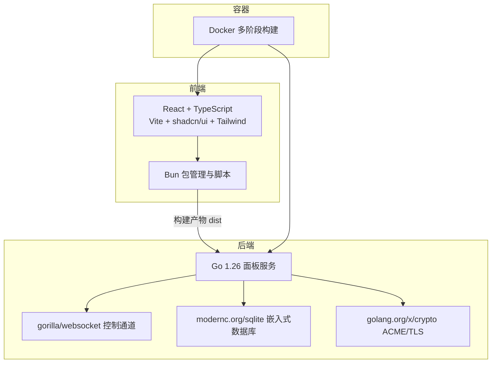
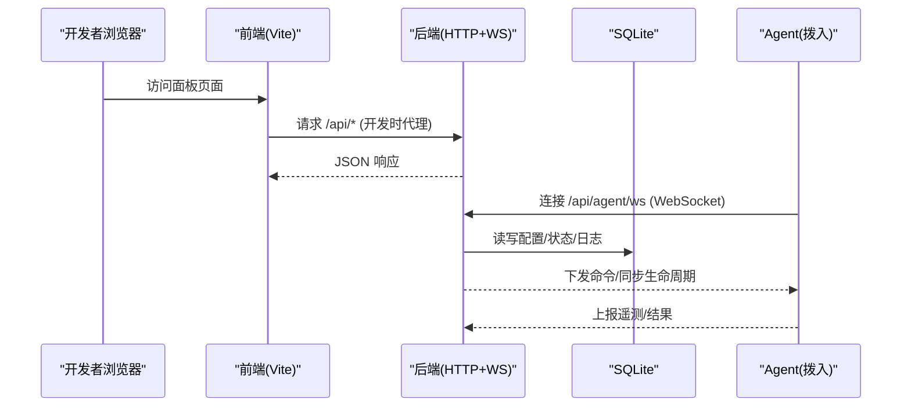
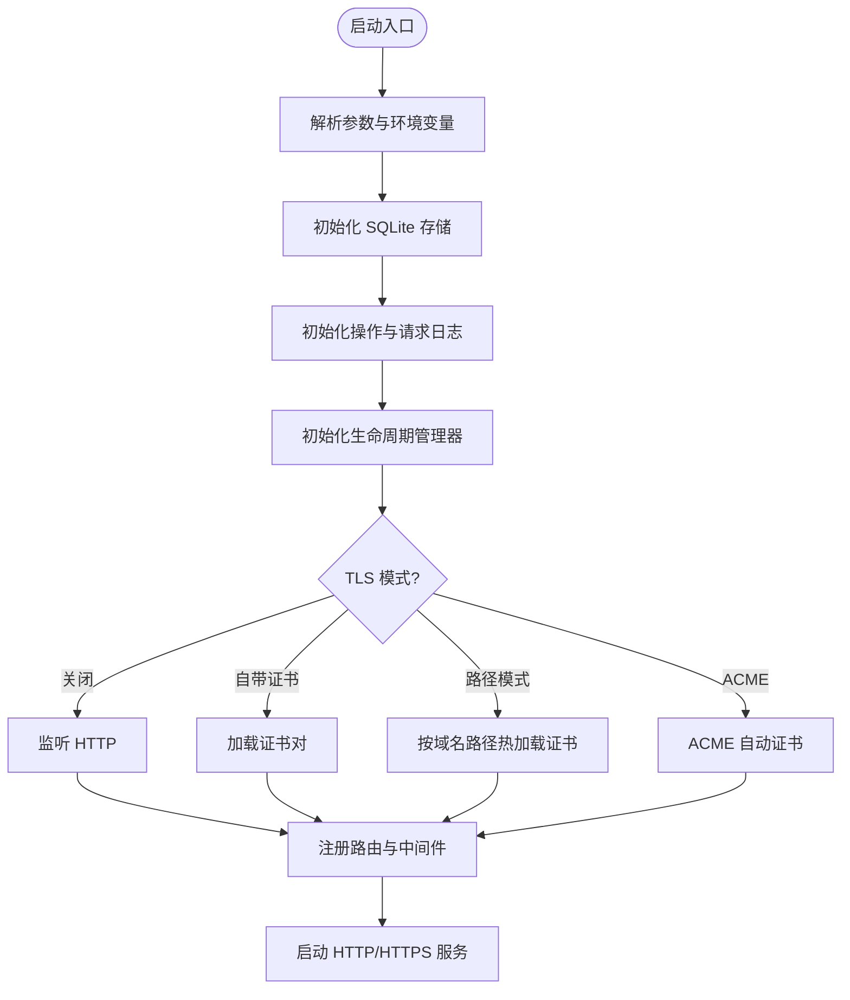
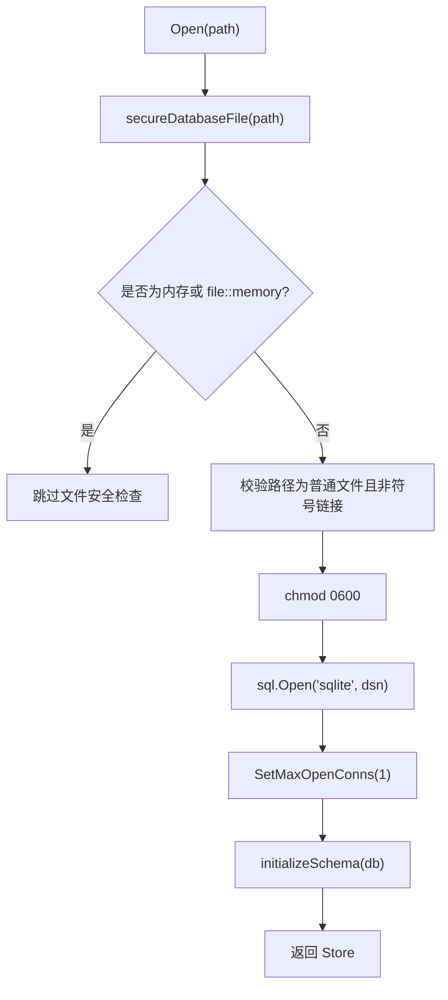
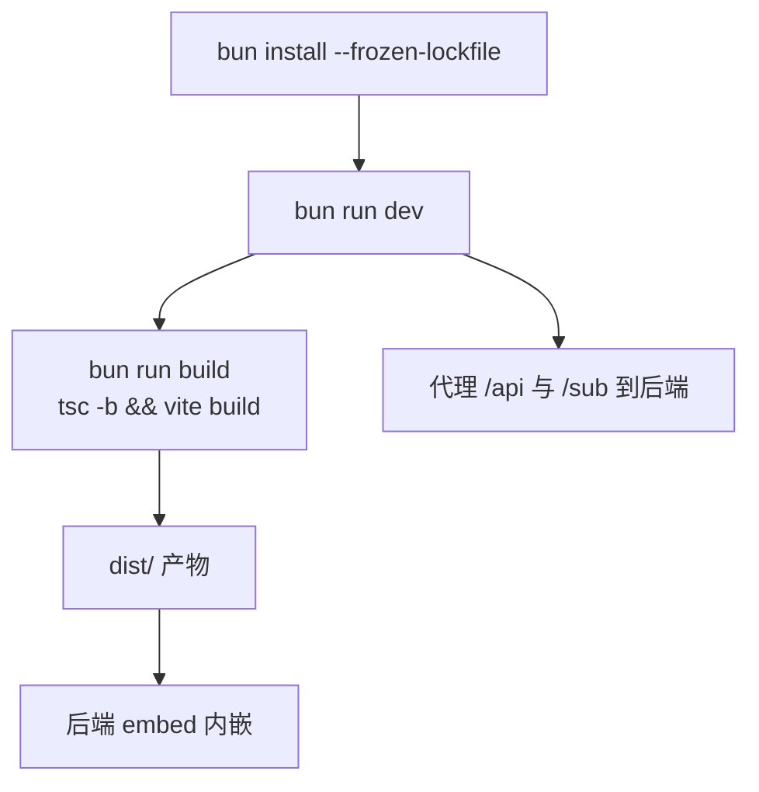
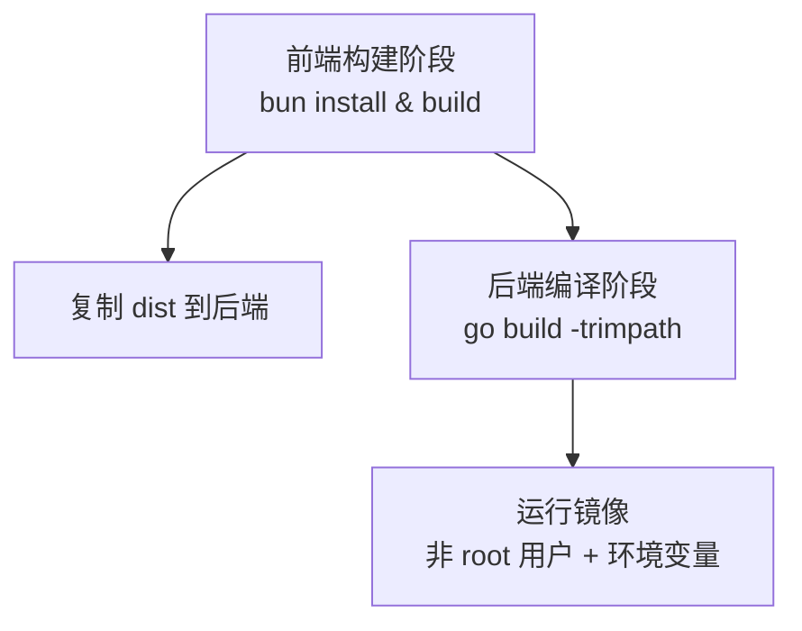
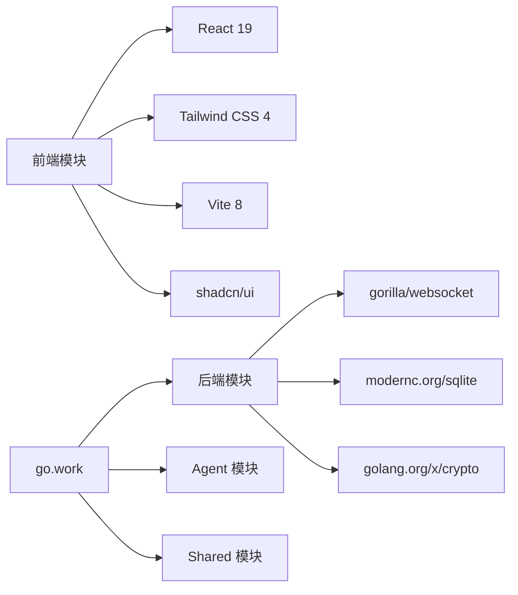

# 技术栈说明

<cite>
**本文引用的文件**   
- [src/backend/go.mod](file://src/backend/go.mod)
- [src/agent/go.mod](file://src/agent/go.mod)
- [go.work](file://go.work)
- [Dockerfile](file://Dockerfile)
- [src/frontend/package.json](file://src/frontend/package.json)
- [src/frontend/vite.config.ts](file://src/frontend/vite.config.ts)
- [src/frontend/components.json](file://src/frontend/components.json)
- [docs/frontend.md](file://docs/frontend.md)
- [src/backend/internal/web/embed.go](file://src/backend/internal/web/embed.go)
- [src/backend/cmd/backend/main.go](file://src/backend/cmd/backend/main.go)
- [src/backend/internal/ws/hub.go](file://src/backend/internal/ws/hub.go)
- [src/backend/internal/store/store.go](file://src/backend/internal/store/store.go)
</cite>

## 目录
1. [简介](#简介)
2. [项目结构](#项目结构)
3. [核心组件](#核心组件)
4. [架构总览](#架构总览)
5. [详细组件分析](#详细组件分析)
6. [依赖关系分析](#依赖关系分析)
7. [性能考量](#性能考量)
8. [故障排查指南](#故障排查指南)
9. [结论](#结论)
10. [附录：版本兼容与升级建议](#附录版本兼容与升级建议)

## 简介
本技术栈说明面向 Lattix-codex 项目的开发者，系统梳理后端与前端的技术选型、关键库的作用与特点、构建与容器化流程，以及各组件在项目中的集成方式。文档同时提供版本兼容性信息与升级建议，帮助读者理解项目的架构决策与最佳实践。

## 项目结构
- 后端（Go）：位于 src/backend，使用 Go Modules 管理依赖，通过 go.work 聚合 agent、backend、shared 三个模块；SQLite 作为持久化存储；gorilla/websocket 实现 Agent 控制通道；golang.org/x/crypto 提供 ACME/TLS 能力。
- 前端（React + TypeScript + Vite）：位于 src/frontend，使用 Bun 进行包管理与脚本执行；Vite 构建并代理到后端 API；shadcn/ui 与 Tailwind CSS 提供 UI 组件与样式；构建产物由后端二进制内嵌。
- 容器化：Dockerfile 多阶段构建，先以 oven/bun:1-alpine 构建前端，再以 golang:1.26.5-alpine 编译后端，最终输出最小镜像运行面板。



**图表来源** 
- [Dockerfile:1-44](file://Dockerfile#L1-L44)
- [src/backend/cmd/backend/main.go:372-448](file://src/backend/cmd/backend/main.go#L372-L448)
- [src/backend/internal/web/embed.go:1-23](file://src/backend/internal/web/embed.go#L1-L23)
- [src/frontend/vite.config.ts:1-21](file://src/frontend/vite.config.ts#L1-L21)

**章节来源**
- [docs/frontend.md:1-17](file://docs/frontend.md#L1-L17)
- [Dockerfile:1-44](file://Dockerfile#L1-L44)
- [go.work:1-10](file://go.work#L1-L10)

## 核心组件
- 后端语言与运行时：Go 1.26，工具链 go1.26.5，单进程高并发 HTTP 服务。
- WebSocket 通信：gorilla/websocket v1.5.3，用于 Panel 与 Agent 的双向控制通道，具备连接注册、心跳、缓冲与优雅关停。
- 数据存储：modernc.org/sqlite v1.54.0，纯 Go SQLite，零 CGO 嵌入，支持内存与文件模式，配合 busy_timeout 避免锁冲突。
- 安全与证书：golang.org/x/crypto v0.54.0，提供 ACME 自动证书、TLS 配置与密码哈希等能力。
- 前端框架：React 19 与 TypeScript，Vite 构建，shadcn/ui 组件库，Tailwind CSS 原子样式。
- 包管理与脚本：Bun（前端），Go Modules（后端），Docker（容器化）。

**章节来源**
- [src/backend/go.mod:1-33](file://src/backend/go.mod#L1-L33)
- [src/agent/go.mod:1-59](file://src/agent/go.mod#L1-L59)
- [src/frontend/package.json:1-53](file://src/frontend/package.json#L1-L53)
- [src/backend/internal/store/store.go:1-494](file://src/backend/internal/store/store.go#L1-L494)
- [src/backend/cmd/backend/main.go:1-638](file://src/backend/cmd/backend/main.go#L1-L638)

## 架构总览
Panel 作为单一可执行文件，提供三类能力：
- HTTP API：面板管理、订阅链接、健康检查等。
- WebSocket 控制通道：与 Agent 建立长连接，下发命令、接收遥测与状态。
- 静态资源服务：内嵌前端 SPA，支持客户端路由回退。



**图表来源** 
- [src/backend/cmd/backend/main.go:372-448](file://src/backend/cmd/backend/main.go#L372-L448)
- [src/backend/internal/ws/hub.go:1-413](file://src/backend/internal/ws/hub.go#L1-L413)
- [src/backend/internal/store/store.go:358-494](file://src/backend/internal/store/store.go#L358-L494)

## 详细组件分析

### 后端核心：HTTP 服务与 TLS/ACME
- 入口 main.go 解析启动参数与环境变量，初始化 Store、日志、生命周期、告警、路由与中间件。
- 支持三种 TLS 模式：关闭、自带证书、域名路径热加载、ACME 自动证书（Let's Encrypt，TLS-ALPN-01）。
- 健康检查与健康就绪端点：/healthz 与 /readyz，后者校验 Hub 是否排空与生命周期状态。
- 前端 SPA 处理：未匹配的路径回退 index.html，API 前缀保持协议层 404。



**图表来源** 
- [src/backend/cmd/backend/main.go:70-246](file://src/backend/cmd/backend/main.go#L70-L246)
- [src/backend/cmd/backend/main.go:450-477](file://src/backend/cmd/backend/main.go#L450-L477)

**章节来源**
- [src/backend/cmd/backend/main.go:70-246](file://src/backend/cmd/backend/main.go#L70-L246)
- [src/backend/cmd/backend/main.go:372-448](file://src/backend/cmd/backend/main.go#L372-L448)
- [src/backend/cmd/backend/main.go:450-477](file://src/backend/cmd/backend/main.go#L450-L477)

### 后端核心：WebSocket Hub（Agent 控制通道）
- Hub 维护 Agent 连接表与连接快照，提供 IsOnline、Send、SyncLifecycle、BeginDrain、CloseAllAgents 等方法。
- 写路径串行化：每个连接一个 writePump，避免 gorilla 并发写限制；发送队列满视为慢连接并断开。
- 生命周期回调：OnConnect/OnOnline/OnReconnect/OnDisconnect 触发业务逻辑（补发离线命令、链状态重算、告警）。
- 优雅关停：BeginDrain 拒绝新任务并以特定关闭码通知 Agent 快速重试。

```mermaid
classDiagram
class Hub {
+Authenticator Auth
+LifecycleProvider Lifecycle
+OnUpgrade(r)
+OnConnect(serverID)
+OnOnline(serverID)
+OnReconnect(serverID)
+OnMessage(serverID, env)
+OnProtocolError(...)
+OnDisconnect(serverID)
+IsOnline(serverID) bool
+Send(ctx, serverID, env) error
+SyncLifecycle(ctx, snapshot) []int64
+BeginDrain()
+CloseAllAgents(code, reason)
-conns map[int64]*agentConn
-states map[int64]ConnectionSnapshot
-draining bool
}
class agentConn {
-hub *Hub
-serverID int64
-sessionID string
-sessionKind string
-ws *websocket.Conn
-send chan shared.Envelope
-done chan struct{}
-writePump()
-close()
-closeWithCode(code, reason)
}
Hub --> agentConn : "管理多个连接"
```

**图表来源** 
- [src/backend/internal/ws/hub.go:26-55](file://src/backend/internal/ws/hub.go#L26-L55)
- [src/backend/internal/ws/hub.go:281-313](file://src/backend/internal/ws/hub.go#L281-L313)
- [src/backend/internal/ws/hub.go:398-413](file://src/backend/internal/ws/hub.go#L398-L413)

**章节来源**
- [src/backend/internal/ws/hub.go:1-413](file://src/backend/internal/ws/hub.go#L1-L413)

### 后端核心：SQLite 存储（modernc.org/sqlite）
- Schema 定义涵盖服务器、用户、节点、命令队列、遥测、流量、链与修订等核心实体。
- Open 设置 DSN 与 busy_timeout，单连接模式避免并发写锁冲突。
- 安全策略：数据库文件权限 0600，禁止符号链接与非普通文件；备份使用 VACUUM INTO 并严格校验目标文件。
- 备份接口 Backup 保证一致性快照导出，适合运维下载。



**图表来源** 
- [src/backend/internal/store/store.go:368-389](file://src/backend/internal/store/store.go#L368-L389)
- [src/backend/internal/store/store.go:391-419](file://src/backend/internal/store/store.go#L391-L419)
- [src/backend/internal/store/store.go:448-465](file://src/backend/internal/store/store.go#L448-L465)

**章节来源**
- [src/backend/internal/store/store.go:1-494](file://src/backend/internal/store/store.go#L1-L494)

### 前端工程：Vite + React + TypeScript + shadcn/ui + Tailwind
- package.json 声明依赖与脚本：dev/build/lint/preview，TypeScript 类型生成与检查在 build 中执行。
- vite.config.ts 启用 react 与 tailwindcss 插件，配置别名 @，开发代理 /api 与 /sub 到后端 8080。
- components.json 配置 shadcn/ui 的样式风格、图标库、别名与 CSS 变量。
- 构建产物 dist 被后端 embed 内嵌，发布时复制到 backend/internal/web/dist。



**图表来源** 
- [src/frontend/package.json:6-12](file://src/frontend/package.json#L6-L12)
- [src/frontend/vite.config.ts:7-20](file://src/frontend/vite.config.ts#L7-L20)
- [src/frontend/components.json:1-26](file://src/frontend/components.json#L1-L26)
- [src/backend/internal/web/embed.go:9-23](file://src/backend/internal/web/embed.go#L9-L23)

**章节来源**
- [docs/frontend.md:1-17](file://docs/frontend.md#L1-L17)
- [src/frontend/package.json:1-53](file://src/frontend/package.json#L1-L53)
- [src/frontend/vite.config.ts:1-21](file://src/frontend/vite.config.ts#L1-L21)
- [src/frontend/components.json:1-26](file://src/frontend/components.json#L1-L26)

### 容器化：Docker 多阶段构建
- 第一阶段：oven/bun:1-alpine 安装依赖并构建前端。
- 第二阶段：golang:1.26.5-alpine 编译后端，注入版本号与仓库信息，复制前端 dist 到 internal/web/dist。
- 运行阶段：alpine 基础镜像，创建非 root 用户，暴露 8080，设置环境变量与入口命令。



**图表来源** 
- [Dockerfile:1-44](file://Dockerfile#L1-L44)

**章节来源**
- [Dockerfile:1-44](file://Dockerfile#L1-L44)

## 依赖关系分析
- 后端依赖：
  - gorilla/websocket v1.5.3：WebSocket 传输。
  - modernc.org/sqlite v1.54.0：嵌入式数据库。
  - golang.org/x/crypto v0.54.0：ACME/TLS 与安全功能。
  - 其他间接依赖如 net/sys/text 等。
- 前端依赖：
  - React 19、react-dom 19、react-router-dom 7、three 等。
  - Tailwind CSS 4、@tailwindcss/vite、shadcn/ui、oxlint、openapi-typescript。
- 工作区：go.work 统一 toolchain 与 use 子模块。



**图表来源** 
- [src/backend/go.mod:7-15](file://src/backend/go.mod#L7-L15)
- [src/agent/go.mod:7-12](file://src/agent/go.mod#L7-L12)
- [src/frontend/package.json:14-46](file://src/frontend/package.json#L14-L46)
- [go.work:1-10](file://go.work#L1-L10)

**章节来源**
- [src/backend/go.mod:1-33](file://src/backend/go.mod#L1-L33)
- [src/agent/go.mod:1-59](file://src/agent/go.mod#L1-L59)
- [src/frontend/package.json:1-53](file://src/frontend/package.json#L1-L53)
- [go.work:1-10](file://go.work#L1-L10)

## 性能考量
- WebSocket 写超时与缓冲：writeTimeout 10s，每连接 sendBuffer 256，满则断连并由上层重连补发，避免慢连接拖垮整体。
- SQLite 单连接与 busy_timeout：避免 database is locked，保障并发读与顺序写稳定。
- HTTP 超时与限流：ReadHeader/Read/Write/Idle 超时合理配置，MaxHeaderBytes 防大头部攻击。
- 前端构建优化：Vite 增量构建与按需打包，生产构建包含类型检查与压缩。

[本节为通用指导，不直接分析具体文件]

## 故障排查指南
- WebSocket 协议错误：Hub.OnProtocolError 记录无业务响应的协议错误，便于定位握手与消息格式问题。
- 连接状态与离线告警：Hub 注销路径触发 OnDisconnect，结合告警器与操作日志记录 offline 事件。
- 就绪性检查：/readyz 失败通常因 Hub 处于 draining 或生命周期非 active，或 SQLite Ping 失败。
- 前端构建失败：确保 bun.lock 存在并使用 --frozen-lockfile；检查 openapi.yaml 类型生成步骤。

**章节来源**
- [src/backend/internal/ws/hub.go:42-46](file://src/backend/internal/ws/hub.go#L42-L46)
- [src/backend/cmd/backend/main.go:416-432](file://src/backend/cmd/backend/main.go#L416-L432)
- [docs/frontend.md:6-12](file://docs/frontend.md#L6-L12)

## 结论
本项目采用 Go + SQLite + WebSocket 的后端架构，结合现代前端技术栈（React 19、Vite、shadcn/ui、Tailwind CSS），并通过 Docker 多阶段构建实现一体化交付。技术选型兼顾了高性能、易部署与良好的可维护性，适用于面板管理与 Agent 控制的场景。

[本节为总结性内容，不直接分析具体文件]

## 附录：版本兼容与升级建议
- Go 与工具链：
  - 当前使用 Go 1.26，toolchain go1.26.5；升级时需同步更新 go.work 与各模块 go.mod 的 toolchain 字段。
- 后端依赖：
  - gorilla/websocket v1.5.3：稳定版，升级注意兼容旧握手行为。
  - modernc.org/sqlite v1.54.0：纯 Go 实现，升级关注 schema 迁移与 PRAGMA 行为变化。
  - golang.org/x/crypto v0.54.0：ACME/TLS 相关，升级需验证证书热加载与 ALPN 行为。
- 前端依赖：
  - React 19、TypeScript ~6.0.2、Vite 8、Tailwind CSS 4、shadcn/ui：升级需关注 breaking changes 与插件兼容性。
  - Bun：锁定 bun.lock，升级时优先验证脚本与依赖树。
- 容器镜像：
  - 基础镜像 alpine 3.22、oven/bun:1-alpine、golang:1.26.5-alpine；升级需验证运行时与构建环境兼容性。

**章节来源**
- [go.work:1-10](file://go.work#L1-L10)
- [src/backend/go.mod:1-33](file://src/backend/go.mod#L1-L33)
- [src/agent/go.mod:1-59](file://src/agent/go.mod#L1-L59)
- [src/frontend/package.json:1-53](file://src/frontend/package.json#L1-L53)
- [Dockerfile:1-44](file://Dockerfile#L1-L44)