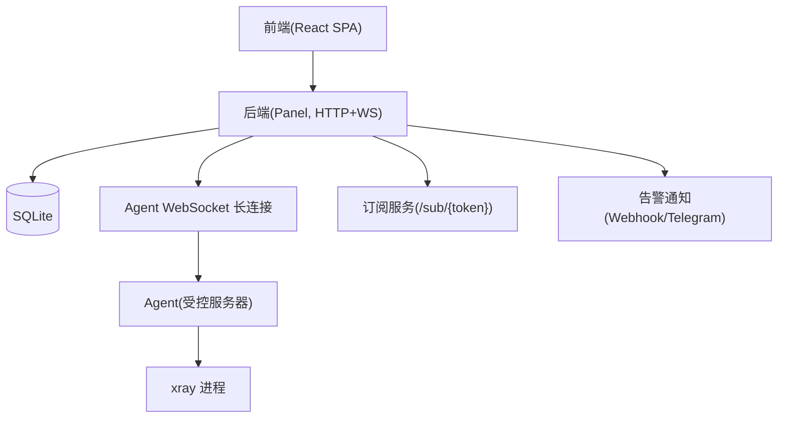
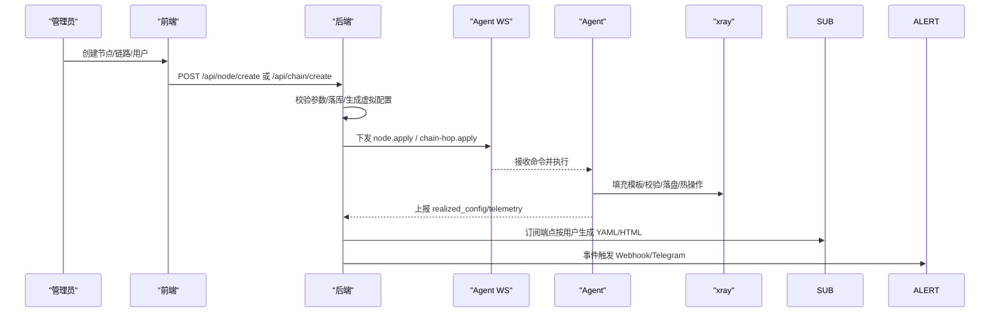
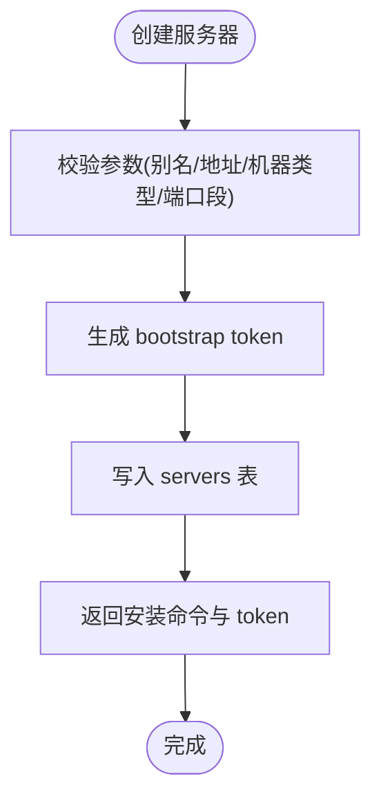
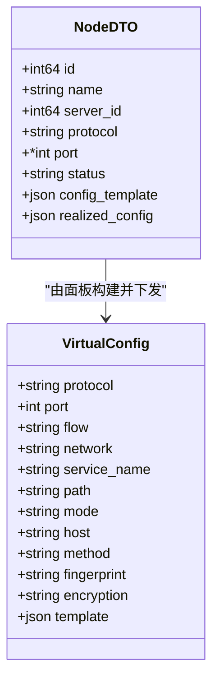
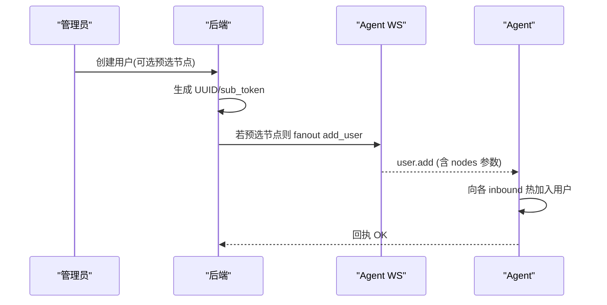
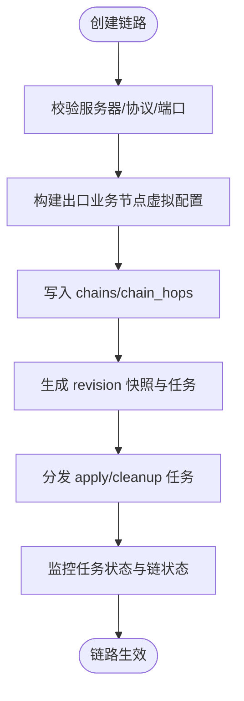
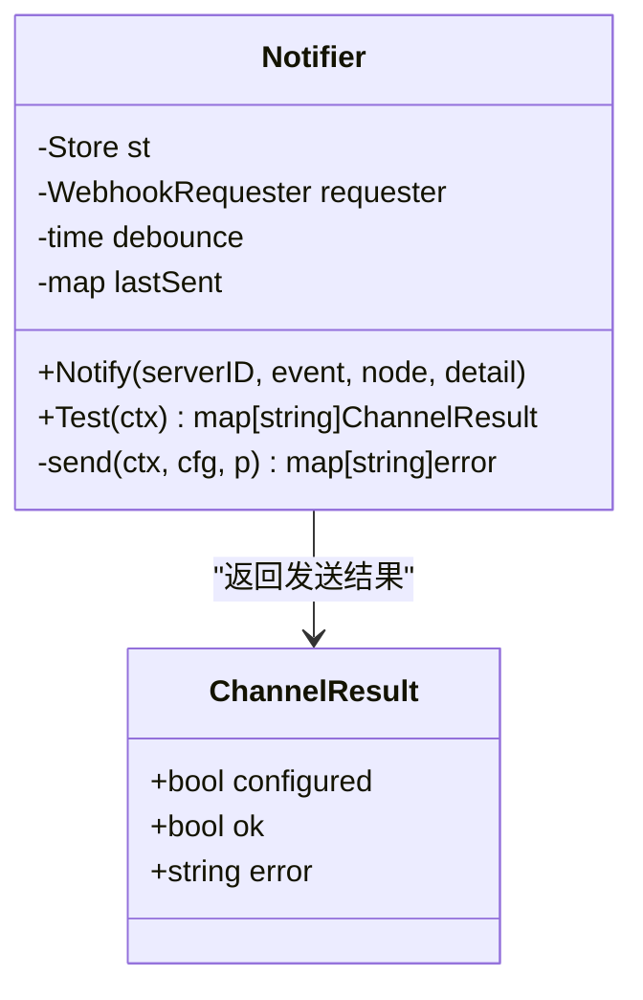
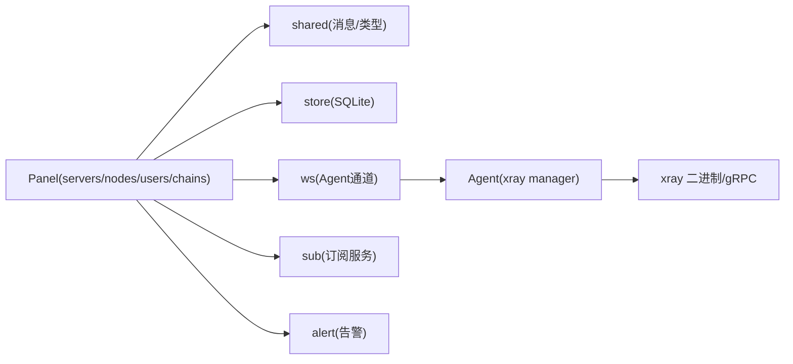

# 核心功能特性

<cite>
**本文引用的文件**   
- [servers.go](file://src/backend/internal/panel/servers.go)
- [nodes.go](file://src/backend/internal/panel/nodes.go)
- [users.go](file://src/backend/internal/panel/users.go)
- [chains.go](file://src/backend/internal/panel/chains.go)
- [alert.go](file://src/backend/internal/alert/alert.go)
- [sub.go](file://src/backend/internal/sub/sub.go)
- [manager.go](file://src/agent/internal/xray/manager.go)
- [chain.go](file://src/shared/chain.go)
- [rpc-api-design.md](file://docs/rpc-api-design.md)
- [framework-design.md](file://docs/framework-design.md)
- [Servers.tsx](file://src/frontend/src/pages/Servers.tsx)
- [Chains.tsx](file://src/frontend/src/pages/Chains.tsx)
- [Users.tsx](file://src/frontend/src/pages/Users.tsx)
</cite>

## 目录
1. [简介](#简介)
2. [项目结构](#项目结构)
3. [核心组件](#核心组件)
4. [架构总览](#架构总览)
5. [详细组件分析](#详细组件分析)
6. [依赖关系分析](#依赖关系分析)
7. [性能与可靠性](#性能与可靠性)
8. [故障排查指南](#故障排查指南)
9. [结论](#结论)
10. [附录：操作示例与配置案例](#附录操作示例与配置案例)

## 简介
本文件面向 Lattix-codex 平台的核心能力，系统性阐述服务器管理、节点管理（VLESS + Reality 协议）、用户管理与订阅、链路编排（直连/中转/复杂拓扑）、监控告警等模块的设计理念、使用场景与协作方式。文档从基础操作到高级配置分层展开，既适合初次使用者快速上手，也为资深用户提供深入的技术细节与排障要点。

## 项目结构
Lattix-codex 采用前后端分离与 Agent 协同的架构：
- 前端 React SPA 提供可视化界面，托管于后端静态资源中
- 后端（Panel）提供 HTTP 管理 API、WebSocket 通道、SQLite 存储
- Agent 部署在受控服务器上，独占管理 xray 进程，负责配置落地与热更新
- Shared 包定义 Panel 与 Agent 共享的消息结构与类型

图表来源
- [framework-design.md:23-44](file://docs/framework-design.md#L23-L44)
- [rpc-api-design.md:143-209](file://docs/rpc-api-design.md#L143-L209)

章节来源
- [framework-design.md:23-62](file://docs/framework-design.md#L23-L62)
- [rpc-api-design.md:143-209](file://docs/rpc-api-design.md#L143-L209)

## 核心组件
- 服务器管理：添加、配置、升级、修复、删除；支持 direct/NAT 机器类型与端口段限制
- 节点管理：多协议（VLESS/VMess/Trojan/Shadowsocks/SOCKS/HTTP/Dokodemo），Reality 传输（tcp/grpc/xhttp），自动端口分配与状态监控
- 用户管理：多用户、有效期控制、停用/恢复、按节点维度分配与扇出
- 链路编排：直连/中转/复杂拓扑，逐跳编排与发布版本管理，流量倍率与历史统计
- 监控告警：主机指标遥测、事件告警（离线/漂移/失败/降级），Webhook/Telegram 双通道
- 订阅服务：mihomo YAML 与浏览器落地页，vless:// 链接集合

章节来源
- [servers.go:164-319](file://src/backend/internal/panel/servers.go#L164-L319)
- [nodes.go:53-250](file://src/backend/internal/panel/nodes.go#L53-L250)
- [users.go:50-156](file://src/backend/internal/panel/users.go#L50-L156)
- [chains.go:154-433](file://src/backend/internal/panel/chains.go#L154-L433)
- [alert.go:107-132](file://src/backend/internal/alert/alert.go#L107-L132)
- [sub.go:143-190](file://src/backend/internal/sub/sub.go#L143-L190)

## 架构总览
面板通过单条 WebSocket 长连接与 Agent 通信，所有命令下发与遥测上报均走该通道。Agent 独占管理 xray 配置文件，执行模板填充、校验、落盘与热更新。订阅服务根据用户与节点状态生成 mihomo YAML 或落地页。

图表来源
- [rpc-api-design.md:283-354](file://docs/rpc-api-design.md#L283-L354)
- [manager.go:106-139](file://src/agent/internal/xray/manager.go#L106-L139)
- [sub.go:143-190](file://src/backend/internal/sub/sub.go#L143-L190)

## 详细组件分析

### 服务器管理（添加、配置、监控多台受控服务器）
- 新增服务器：生成一次性 bootstrap token 与安装命令，支持 direct/NAT 机器类型与端口段限制
- 更新服务器：修改别名、公网地址、NAT 端口段、地理位置、计费与流量计划
- 升级管理：分别升级 xray 与 agent，支持 latest/指定版本
- 配置漂移修复：重放 active 节点的 apply_node 重建配置并清除漂移标志
- 删除服务器：在线先下发 uninstall，离线仅删除记录

图表来源
- [servers.go:208-319](file://src/backend/internal/panel/servers.go#L208-L319)

章节来源
- [servers.go:164-319](file://src/backend/internal/panel/servers.go#L164-L319)
- [servers.go:382-533](file://src/backend/internal/panel/servers.go#L382-L533)
- [servers.go:584-669](file://src/backend/internal/panel/servers.go#L584-L669)
- [servers.go:671-717](file://src/backend/internal/panel/servers.go#L671-L717)
- [servers.go:731-800](file://src/backend/internal/panel/servers.go#L731-L800)

### 节点管理（VLESS + Reality 协议配置、端口分配、状态监控）
- 协议支持：VLESS/VMess/Trojan/Shadowsocks/SOCKS/HTTP/Dokodemo
- Reality 传输：tcp/grpc/xhttp，指纹、短ID、dest/serverNames 可配置
- 端口策略：可指定端口或在 NAT 受限端口段内自动挑选
- 生命周期：pending → applying → active | failed，支持重试与删除

图表来源
- [nodes.go:21-51](file://src/backend/internal/panel/nodes.go#L21-L51)
- [nodes.go:393-462](file://src/backend/internal/panel/nodes.go#L393-L462)

章节来源
- [nodes.go:53-250](file://src/backend/internal/panel/nodes.go#L53-L250)
- [nodes.go:328-369](file://src/backend/internal/panel/nodes.go#L328-L369)
- [nodes.go:393-462](file://src/backend/internal/panel/nodes.go#L393-L462)

### 用户管理（多用户支持、权限控制、订阅链接生成）
- 用户模型：UUID、sub_token、有效期、停用标记、节点分配
- 节点分配：按差量扇出 add_user/remove_user，dokodemo 节点无用户概念
- 订阅链接：mihomo YAML 与浏览器落地页，vless:// 链接集合
- 停权机制：expired/disabled 有效停权态，过期自动移除用户

图表来源
- [users.go:82-156](file://src/backend/internal/panel/users.go#L82-L156)
- [users.go:347-379](file://src/backend/internal/panel/users.go#L347-L379)

章节来源
- [users.go:50-156](file://src/backend/internal/panel/users.go#L50-L156)
- [users.go:287-345](file://src/backend/internal/panel/users.go#L287-L345)
- [sub.go:143-190](file://src/backend/internal/sub/sub.go#L143-L190)

### 链路编排（直连链路、中转链路、复杂拓扑管理）
- 拓扑约束：1-4 台服务器，入口/中间/出口角色，同机不重复
- 传输选择：direct/reverse/encrypted，plaintext 协议自动加密
- 版本化发布：revision 快照、任务状态机、强制发布
- 流量统计：原始与有效流量、倍率、历史日桶

图表来源
- [chains.go:199-433](file://src/backend/internal/panel/chains.go#L199-L433)

章节来源
- [chains.go:154-433](file://src/backend/internal/panel/chains.go#L154-L433)
- [chains.go:441-634](file://src/backend/internal/panel/chains.go#L441-L634)
- [chains.go:668-713](file://src/backend/internal/panel/chains.go#L668-L713)

### 监控告警（实时状态、流量统计、事件通知）
- 遥测数据：主机负载/CPU/内存/磁盘/网络/延迟/uptime
- 事件类型：server_offline/config_drift/node_failed/chain_degraded
- 通知渠道：Webhook/Telegram，防抖动窗口避免重复推送

图表来源
- [alert.go:33-67](file://src/backend/internal/alert/alert.go#L33-L67)
- [alert.go:107-132](file://src/backend/internal/alert/alert.go#L107-L132)

章节来源
- [alert.go:107-132](file://src/backend/internal/alert/alert.go#L107-L132)
- [alert.go:158-172](file://src/backend/internal/alert/alert.go#L158-L172)

## 依赖关系分析
- 后端依赖 shared 包定义的消息结构与类型，确保 Panel ↔ Agent 协议一致
- Agent 依赖 xray 二进制与 gRPC API，实现配置热更新与流量统计
- 订阅服务依赖 store 查询用户与节点状态，生成 mihomo YAML
- 告警模块依赖外部 Webhook/Telegram 接口，异步发送不阻塞主路径

图表来源
- [chain.go:1-24](file://src/shared/chain.go#L1-L24)
- [manager.go:24-55](file://src/agent/internal/xray/manager.go#L24-L55)

章节来源
- [chain.go:1-24](file://src/shared/chain.go#L1-L24)
- [manager.go:24-55](file://src/agent/internal/xray/manager.go#L24-L55)

## 性能与可靠性
- 配置变更串行化：Agent 侧通过互斥锁保证 config.json 原子写入与回滚
- 热操作优先：gRPC API 热更新为主路径，失败才重启兜底
- 离线队列：commands 表持久化未终态命令，重连后补发
- 漂移检测：哈希比对检测外部修改，自动净化并重建受管配置
- 订阅幂等：用户维度流量累计与节点状态变化不影响已生成订阅

章节来源
- [manager.go:232-273](file://src/agent/internal/xray/manager.go#L232-L273)
- [manager.go:275-316](file://src/agent/internal/xray/manager.go#L275-L316)
- [framework-design.md:40-44](file://docs/framework-design.md#L40-L44)

## 故障排查指南
- 节点应用失败：检查 dest 预检白名单、端口占用、xray 配置校验输出
- 配置漂移：查看 config.drift 事件，触发 repair_server 重建配置
- 链路部署异常：查看 revision tasks 状态，定位失败 hop 与错误信息
- 订阅为空：确认用户未 expired/disabled，节点为 active 且 realized_config 完整
- 告警未送达：检查 webhook/telegram 配置，验证网络连通性与超时设置

章节来源
- [nodes.go:196-250](file://src/backend/internal/panel/nodes.go#L196-L250)
- [servers.go:671-717](file://src/backend/internal/panel/servers.go#L671-L717)
- [chains.go:787-800](file://src/backend/internal/panel/chains.go#L787-L800)
- [sub.go:143-190](file://src/backend/internal/sub/sub.go#L143-L190)
- [alert.go:158-172](file://src/backend/internal/alert/alert.go#L158-L172)

## 结论
Lattix-codex 通过清晰的职责划分与严格的协议契约，实现了从服务器管理到链路编排的全流程自动化。其设计兼顾易用性与可靠性，支持 NAT 环境、配置漂移修复、离线命令队列与多通道告警，为中小规模代理网络提供了稳定高效的管控平台。

## 附录：操作示例与配置案例

### 服务器管理示例
- 添加服务器：填写别名、国家/位置、机器类型（direct/nat）、公网地址（nat必填）、端口段（可选）
- 旋转凭证：定期更换 bootstrap token，重置回 bootstrap 状态
- 升级 xray：指定版本或 latest，自动下载校验并重启
- 修复漂移：重放 active 节点 apply_node，清除 config_drift 标志

章节来源
- [servers.go:208-319](file://src/backend/internal/panel/servers.go#L208-L319)
- [servers.go:321-380](file://src/backend/internal/panel/servers.go#L321-L380)
- [servers.go:584-669](file://src/backend/internal/panel/servers.go#L584-L669)
- [servers.go:671-717](file://src/backend/internal/panel/servers.go#L671-L717)

### 节点管理示例
- VLESS + Reality：选择 tcp/grpc/xhttp 传输，配置 short_id、dest、server_names、fingerprint
- Shadowsocks 2022：自动生成 PSK，客户端密码格式为 "PSK:用户密钥"
- Dokodemo-door：配置目标地址与端口，用于端口转发（不能作为链出口）

章节来源
- [nodes.go:76-194](file://src/backend/internal/panel/nodes.go#L76-L194)
- [nodes.go:393-462](file://src/backend/internal/panel/nodes.go#L393-L462)

### 用户管理示例
- 创建用户：设置名称、有效期（RFC3339）、可选预选节点
- 分配节点：整体替换用户节点分配，差量扇出 add_user/remove_user
- 停用/恢复：disabled/expired 有效停权态，自动扇出用户移除/恢复

章节来源
- [users.go:82-156](file://src/backend/internal/panel/users.go#L82-L156)
- [users.go:287-345](file://src/backend/internal/panel/users.go#L287-L345)
- [users.go:347-379](file://src/backend/internal/panel/users.go#L347-L379)

### 链路编排示例
- 直连链路：单台服务器作为入口与出口，配置业务节点协议与端口
- 中转链路：入口 → 中转（0-2台）→ 出口，自动选择传输方式（direct/reverse/encrypted）
- 流量倍率：设置 0.001-1000.000 倍率，影响 effective 流量统计

章节来源
- [chains.go:199-433](file://src/backend/internal/panel/chains.go#L199-L433)
- [chains.go:668-713](file://src/backend/internal/panel/chains.go#L668-L713)

### 监控告警示例
- 配置 Webhook：设置 webhook URL，测试发送验证连通性
- 配置 Telegram：设置 bot token 与 chat_id，接收纯文本告警
- 事件类型：server_offline/config_drift/node_failed/chain_degraded

章节来源
- [alert.go:107-132](file://src/backend/internal/alert/alert.go#L107-L132)
- [alert.go:181-204](file://src/backend/internal/alert/alert.go#L181-L204)

### 订阅服务示例
- mihomo YAML：包含 proxies 列表与 select 组，嵌入用户 UUID 与 Reality 参数
- 浏览器落地页：显示用量、有效期、节点数，提供一键导入链接
- vless:// 链接：集合端点返回分配的 active 节点分享链接

章节来源
- [sub.go:143-190](file://src/backend/internal/sub/sub.go#L143-L190)
- [sub.go:301-382](file://src/backend/internal/sub/sub.go#L301-L382)