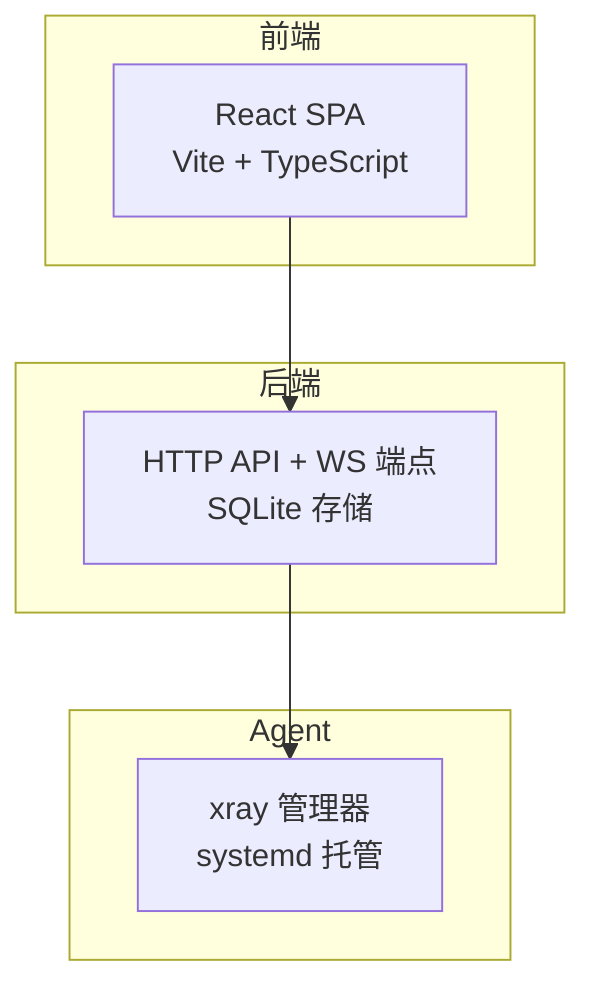
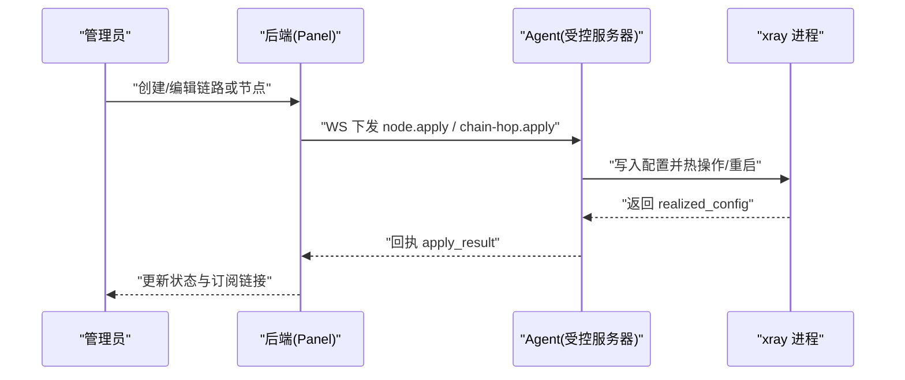
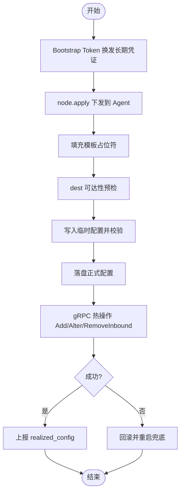
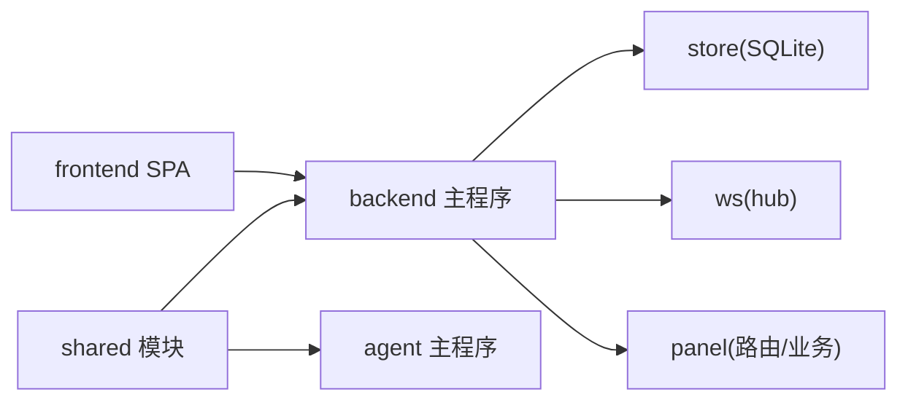

# 项目介绍与目标

<cite>
**本文引用的文件**   
- [框架设计文档](file://docs/framework-design.md)
- [RPC API 设计](file://docs/rpc-api-design.md)
- [后端主程序](file://src/backend/cmd/backend/main.go)
- [Agent 主程序](file://src/agent/cmd/agent/main.go)
- [共享配置与协议常量](file://src/shared/config.go)
- [前端包定义](file://src/frontend/package.json)
- [Docker 构建文件](file://Dockerfile)
- [统一安装入口脚本](file://install.sh)
</cite>

## 目录
1. [简介](#简介)
2. [项目结构](#项目结构)
3. [核心组件](#核心组件)
4. [架构总览](#架构总览)
5. [关键流程与数据流](#关键流程与数据流)
6. [依赖关系分析](#依赖关系分析)
7. [性能与可靠性特性](#性能与可靠性特性)
8. [常见问题与排障建议](#常见问题与排障建议)
9. [结论与愿景](#结论与愿景)
10. [附录：术语与定位](#附录术语与定位)

## 简介
Lattix-codex 是一个面向代理服务器的统一管理面板，旨在为系统管理员、DevOps 工程师和网络运维人员提供“一站式”的代理服务器管理能力。它通过一个集中式的面板（Backend）统一管理多台受控服务器（Agent），实现多服务器编排、配置一致性保障、实时监控与告警、订阅链接生成与分发等能力。

项目的核心价值在于：
- 降低多服务器管理的复杂度：统一的可视化界面与命令下发通道，避免手工逐台操作带来的不一致与错误。
- 保证配置一致性：虚拟配置模板 + Agent 落地执行 + 漂移检测与修复，确保每台机器的实际运行态与期望态一致。
- 实时可观测性：主机遥测、链路流量统计、连接状态与延迟探测，帮助快速定位问题并优化体验。
- 自动化运维：支持 xray 版本升级、Agent 自升级、证书自动签发与热加载、优雅关停与重启。
- 优秀的用户体验：现代化的 React SPA 前端，简洁直观的操作向导，一键生成订阅链接与二维码。

目标用户群体：
- 系统管理员：负责服务器部署、安全策略与生命周期管理。
- DevOps 工程师：关注自动化、可观测性与持续交付。
- 网络运维人员：需要稳定的代理链路、低延迟与高可用。

整体定位与独特优势：
- 以“单条 WebSocket 长连接”作为控制面，Agent 主动拨出至面板，天然兼容 NAT 环境。
- 全协议向导与订阅生态：支持 VLESS+Reality 及多种 inbound 协议，输出 mihomo（Clash.Meta）YAML 与 vless:// 链接集合。
- 链式拓扑与 NAT 支持：直连、中转、出口角色灵活组合，端口段与非 1:1 映射适配 IDC 场景。
- 轻量存储与易部署：SQLite 持久化，Docker 原生镜像与 systemd 托管，安装脚本统一入口。

[本节不直接分析具体代码文件]

## 项目结构
仓库采用 monorepo 组织，前后端与共享模块清晰分离：
- src/backend：Go 编写的后端服务，提供 HTTP API、WebSocket 端点、SQLite 存储与面板页面嵌入。
- src/agent：Go 编写的独立二进制，systemd 托管，负责 xray 配置落地与服务管理。
- src/shared：Go 模块，定义 WS 消息结构与虚拟配置类型，供后端与 Agent 共用。
- src/frontend：Vite + React + TypeScript + shadcn/ui 构建的前端 SPA，产物由后端内嵌托管。
- scripts：安装与 e2e 测试脚本，包含面板与 Agent 的安装器。
- docs：设计文档与协议规范，包括框架设计、RPC 设计、日志与调度等。

图表来源
- [框架设计文档:23-36](file://docs/framework-design.md#L23-L36)
- [后端主程序:364-441](file://src/backend/cmd/backend/main.go#L364-L441)
- [Agent 主程序:1-30](file://src/agent/cmd/agent/main.go#L1-L30)

章节来源
- [框架设计文档:45-62](file://docs/framework-design.md#L45-L62)
- [前端包定义:1-48](file://src/frontend/package.json#L1-L48)

## 核心组件
- 后端（Backend）：承载面板 HTTP API、WebSocket 控制通道、SQLite 存储、TLS 配置与 ACME 自动证书、健康检查与就绪探针、订阅端点、SPA 静态资源托管。
- Agent：在受控服务器上运行，维护与面板的 WS 长连接，执行节点应用、用户增删、xray 升级、自升级、卸载、遥测上报、配置漂移检测。
- 共享模块（shared）：定义协议常量、虚拟配置与已生效配置结构、占位符替换规则等，确保两端类型一致。
- 前端（Frontend）：提供登录、仪表盘、服务器管理、链路编排、用户分配、设置与日志查看等页面，生成订阅 YAML 与链接。

章节来源
- [后端主程序:1-120](file://src/backend/cmd/backend/main.go#L1-L120)
- [Agent 主程序:1-60](file://src/agent/cmd/agent/main.go#L1-L60)
- [共享配置与协议常量:1-60](file://src/shared/config.go#L1-L60)
- [前端包定义:1-48](file://src/frontend/package.json#L1-L48)

## 架构总览
Lattix 采用“面板集中管控 + Agent 受控执行”的架构，控制面通过一条 WebSocket 长连接完成全部双向通信。面板不主动外连 Agent，Agent 也不暴露任何监听端点，天然兼容公网与 NAT 环境。

图表来源
- [框架设计文档:98-128](file://docs/framework-design.md#L98-L128)
- [后端主程序:364-441](file://src/backend/cmd/backend/main.go#L364-L441)
- [Agent 主程序:528-666](file://src/agent/cmd/agent/main.go#L528-L666)

章节来源
- [框架设计文档:23-44](file://docs/framework-design.md#L23-L44)
- [RPC API 设计:1-40](file://docs/rpc-api-design.md#L1-L40)

## 关键流程与数据流
- 服务器引导与认证：面板生成一次性 bootstrap token，Agent 首次连接换发长期凭证，后续重连使用长期 token。
- 节点应用流水线：填充模板占位符 → dest 预检 → 临时配置校验 → 落盘正式配置 → gRPC 热操作 → 失败回滚。
- 订阅与链接：面板按用户维度生成 mihomo YAML 与 vless:// 链接集合，响应头携带用量与有效期信息。
- 遥测与监控：Agent 周期上报主机指标、xray 状态与流量增量；面板持久化并展示趋势。
- 配置漂移 reconcile：Agent 定期比对配置哈希，外部修改时上报；面板提供修复按钮重放 active 节点。

图表来源
- [框架设计文档:130-147](file://docs/framework-design.md#L130-L147)
- [Agent 主程序:528-666](file://src/agent/cmd/agent/main.go#L528-L666)

章节来源
- [框架设计文档:130-147](file://docs/framework-design.md#L130-L147)
- [RPC API 设计:98-128](file://docs/rpc-api-design.md#L98-L128)

## 依赖关系分析
- 后端依赖 shared 模块的消息与配置结构，ws/hub 用于 Agent 连接管理与命令分发，store 负责 SQLite 读写，panel 模块提供路由与业务逻辑。
- Agent 依赖 shared 模块，内部包含 xray 管理器、状态持久化、自升级与遥测采集。
- 前端通过 API 契约与后端交互，构建产物由后端内嵌托管。

图表来源
- [后端主程序:1-40](file://src/backend/cmd/backend/main.go#L1-L40)
- [Agent 主程序:1-30](file://src/agent/cmd/agent/main.go#L1-L30)
- [共享配置与协议常量:1-60](file://src/shared/config.go#L1-L60)

章节来源
- [后端主程序:1-40](file://src/backend/cmd/backend/main.go#L1-L40)
- [Agent 主程序:1-30](file://src/agent/cmd/agent/main.go#L1-L30)
- [共享配置与协议常量:1-60](file://src/shared/config.go#L1-L60)

## 性能与可靠性特性
- 控制面单通道：一条 WS 长连接承担所有命令与事件，减少连接开销与复杂性。
- 离线排队与幂等：命令滞留 commands 表，重连后补发；死信超过上限标记 failed。
- 优雅关停：drain 中间件拒绝新请求，等待现有连接关闭，记录生命周期事件。
- TLS 与证书：支持自带证书、ACME 自动证书与反向代理终止，GetCertificate 热加载免重启。
- 遥测与延迟探测：心跳 Ping/Pong 维持连接，latency probe 仅在 active 状态测量。
- 备份与告警：SQLite 备份下载、Webhook/Telegram 告警，防抖动窗口避免重复通知。

章节来源
- [后端主程序:569-587](file://src/backend/cmd/backend/main.go#L569-L587)
- [框架设计文档:238-285](file://docs/framework-design.md#L238-L285)

## 常见问题与排障建议
- 认证失败：Agent 收到明确拒绝后停止自动重试，需重新绑定面板并重启。
- 配置漂移：外部修改导致 drift 标志置位，使用“修复漂移”按钮重放 active 节点。
- 订阅失效：NAT 机器地址必须手动填写，禁用自动学习；链入口 address 决定订阅 server。
- 升级失败：xray 升级失败会回滚并重启；Agent 自升级成功后退出由 systemd 拉起新版本。
- 健康检查：/healthz 与 /readyz 分别用于存活与就绪判断，drain 期间返回 SERVICE_UNAVAILABLE。

章节来源
- [框架设计文档:238-285](file://docs/framework-design.md#L238-L285)
- [后端主程序:376-424](file://src/backend/cmd/backend/main.go#L376-L424)

## 结论与愿景
Lattix-codex 通过现代化架构与自动化运维能力，显著降低了代理服务器管理的复杂度与风险。其设计理念强调：
- 统一平台：一个面板管理多台服务器，避免碎片化管理。
- 自动化优先：从安装、配置、升级到监控与告警，全流程自动化。
- 用户体验至上：直观的向导、即时的预览与一键订阅，降低使用门槛。
- 开放与兼容：支持主流客户端与协议，输出标准格式便于集成。

未来迭代将继续完善 NAT 与链路编排、流量配额与计费、多管理员与 RBAC 等能力，但 MVP 阶段已具备完整的生产可用性。

[本节不直接分析具体代码文件]

## 附录：术语与定位
- 面板（Panel）：后端服务，提供 HTTP API、WS 端点与 SPA 页面。
- Agent：受控服务器上的独立二进制，管理 xray 进程与配置。
- 节点（Node）：xray inbound 实例，代表一个代理服务入口。
- 链路（Chain）：由多个跳组成的代理拓扑，支持直连、中转与出口。
- 订阅（Subscription）：mihomo YAML 与 vless:// 链接集合，供客户端导入。
- 漂移（Drift）：配置文件被外部修改导致的与期望态不一致。

章节来源
- [框架设计文档:1-22](file://docs/framework-design.md#L1-L22)
- [RPC API 设计:1-40](file://docs/rpc-api-design.md#L1-L40)