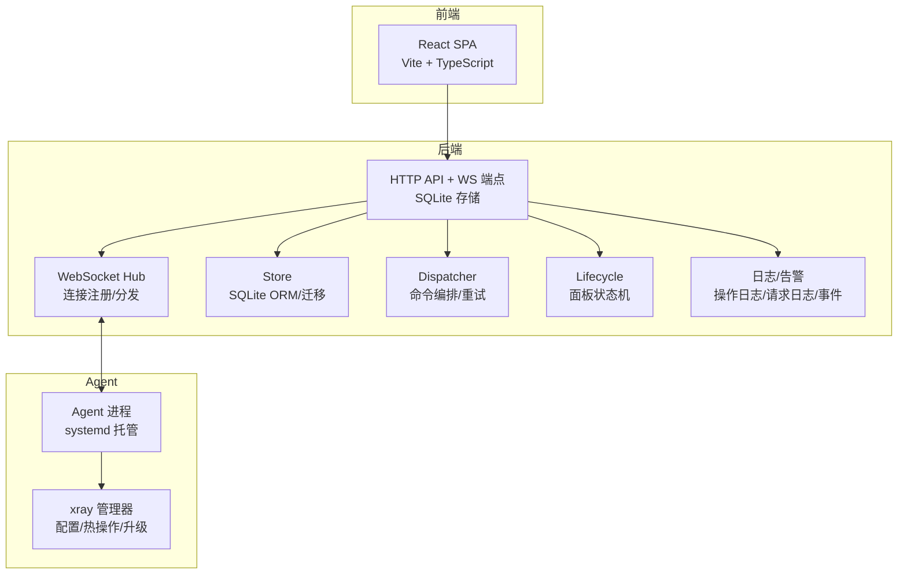
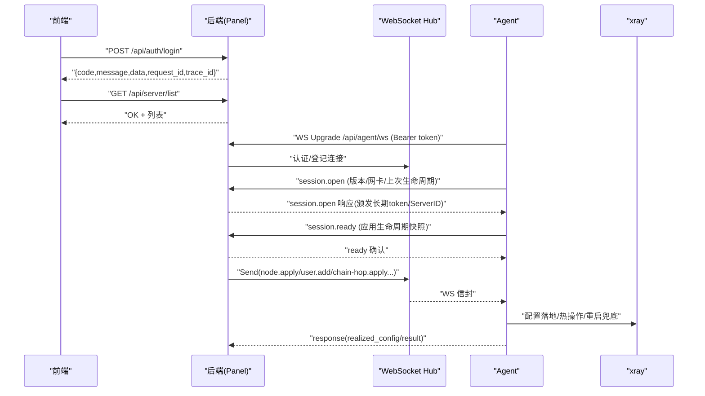
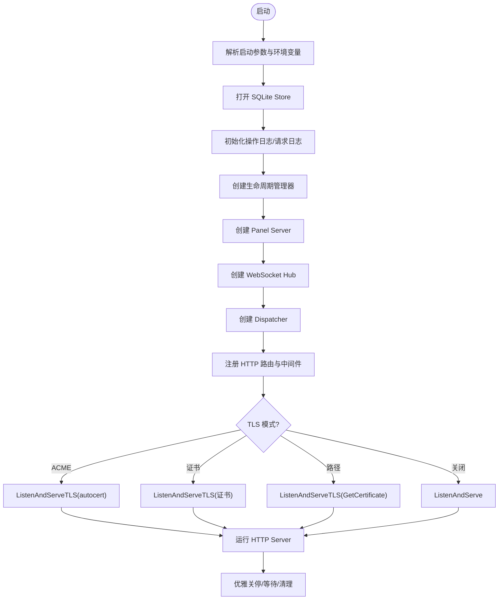
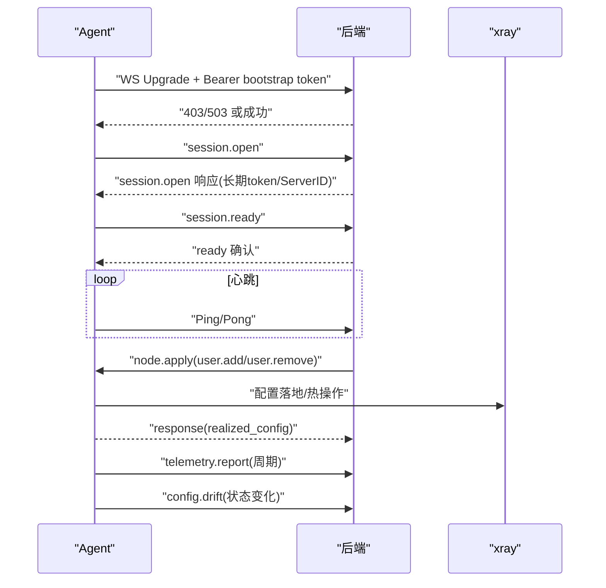
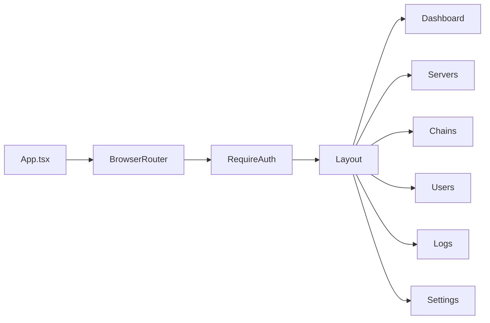
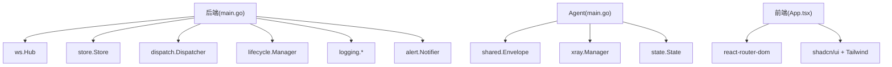

# 项目概述

<cite>
**本文引用的文件**   
- [后端主程序 main.go](file://src/backend/cmd/backend/main.go)
- [Agent 主程序 main.go](file://src/agent/cmd/agent/main.go)
- [前端入口 App.tsx](file://src/frontend/src/App.tsx)
- [共享消息与协议 messages.go](file://src/shared/messages.go)
- [面板服务 panel.go](file://src/backend/internal/panel/panel.go)
- [WebSocket Hub hub.go](file://src/backend/internal/ws/hub.go)
- [框架设计文档 framework-design.md](file://docs/framework-design.md)
- [RPC API 设计 rpc-api-design.md](file://docs/rpc-api-design.md)
</cite>

## 目录
1. [简介](#简介)
2. [项目结构](#项目结构)
3. [核心组件](#核心组件)
4. [架构总览](#架构总览)
5. [详细组件分析](#详细组件分析)
6. [依赖关系分析](#依赖关系分析)
7. [性能考量](#性能考量)
8. [故障排查指南](#故障排查指南)
9. [结论](#结论)
10. [附录](#附录)

## 简介
Lattix-codex 是一个现代化的代理服务器管理面板，采用前后端分离与“主控面板 + Agent”的架构。后端（Go）提供 HTTP 管理 API、WebSocket 控制通道与 SQLite 存储；Agent（Go）部署在受控服务器上，通过单条 WebSocket 长连接主动拨出至面板，承担配置落地、热操作、遥测上报与自升级等职责；前端（React + Vite）提供可视化界面，构建产物由后端内嵌托管。项目强调事件驱动通信、状态机管理与离线命令队列，适用于统一管理平台、自动化部署与实时监控等场景。

## 项目结构
仓库采用 monorepo 组织，核心目录如下：
- src/backend：Go 后端，包含 HTTP API、WebSocket Hub、SQLite Store、调度器、日志与告警等
- src/agent：Go Agent，负责 xray 进程管理、配置下发、遥测与自升级
- src/frontend：React SPA，Vite 构建，shadcn/ui 组件库
- src/shared：Go 模块，定义 WS 信封、消息类型与虚拟配置等共享契约
- docs：设计与协议文档（框架、RPC、状态机、日志、计费、链修订等）
- scripts：安装脚本与 e2e 测试脚本

图表来源
- [后端主程序 main.go:69-472](file://src/backend/cmd/backend/main.go#L69-L472)
- [WebSocket Hub hub.go:25-138](file://src/backend/internal/ws/hub.go#L25-L138)
- [面板服务 panel.go:159-276](file://src/backend/internal/panel/panel.go#L159-L276)
- [Agent 主程序 main.go:33-98](file://src/agent/cmd/agent/main.go#L33-L98)

章节来源
- [框架设计文档 framework-design.md:23-62](file://docs/framework-design.md#L23-L62)

## 核心组件
- 后端（Backend）
  - HTTP 管理 API：登录、仪表盘、服务器/节点/链路/用户/设置、备份、日志查询等
  - WebSocket Hub：维护 Agent 连接、认证、消息路由、生命周期同步与优雅关停
  - Store：SQLite 持久化，含服务器、用户、节点、命令队列、遥测、流量统计、链修订等
  - Dispatcher：命令派发、离线排队、重发与死信处理、链编排推进
  - Lifecycle：面板状态机（startup/active/updating/faulted），与 Hub 联动
  - Logging & Alerting：操作日志、请求日志、事件告警（Webhook/Telegram）
- Agent
  - 连接管理：Bootstrap 换发长期凭证、会话建立、心跳与延迟探测
  - xray 管理：配置渲染、热操作（Add/Alter/Remove Inbound）、重启兜底、版本升级
  - 遥测上报：主机指标、Xray 运行状态、业务流量计数器
  - 配置漂移检测：周期比对并上报，支持修复回滚
- 前端（Frontend）
  - React SPA：路由、鉴权、主题、页面（仪表盘/服务器/链路/用户/日志/设置）
  - 订阅落地页：mihomo YAML 与 vless:// 链接集合生成
- 共享模块（Shared）
  - WS 信封 Envelope、消息类型、结果码、遥测与链跳规格等

章节来源
- [RPC API 设计 rpc-api-design.md:143-200](file://docs/rpc-api-design.md#L143-L200)
- [共享消息与协议 messages.go:13-137](file://src/shared/messages.go#L13-L137)
- [面板服务 panel.go:159-276](file://src/backend/internal/panel/panel.go#L159-L276)

## 架构总览
系统以“单条 WebSocket 长连接”作为 Agent → Backend 的唯一双向通道，Panel 不主动外连 Agent。Agent 主动拨入，完成认证与会话建立后，承载所有控制面指令与遥测数据。前端通过 HTTP RPC 与面板交互，面板将命令经 Hub 投递到对应 Agent，Agent 执行后回执。

图表来源
- [后端主程序 main.go:324-472](file://src/backend/cmd/backend/main.go#L324-L472)
- [WebSocket Hub hub.go:110-138](file://src/backend/internal/ws/hub.go#L110-L138)
- [Agent 主程序 main.go:137-256](file://src/agent/cmd/agent/main.go#L137-L256)

章节来源
- [框架设计文档 framework-design.md:23-44](file://docs/framework-design.md#L23-L44)

## 详细组件分析

### 后端（Backend）
- 启动流程
  - 解析参数（监听地址、数据库路径、TLS、ACME、管理员账号等）
  - 初始化 Store、OperationLog、RequestLog、LifecycleManager
  - 创建 Panel Server、Hub、Dispatcher，注册路由与中间件
  - 根据 TLS 模式选择监听方式（HTTP/HTTPS ACME/证书/域名路径）
  - 启动 HTTP Server，恢复链修订任务，广播生命周期活跃状态
- 关键特性
  - 优雅关停：BeginDrain 拒绝新工作，关闭所有 Agent WS，等待后台任务结束
  - 健康检查：/healthz、/readyz（结合 Hub 与 Lifecycle 状态）
  - 订阅服务：/sub/{token} 返回 mihomo YAML 或落地页，/links 返回 vless 链接集合
  - 日志与告警：操作日志与请求日志独立存储，事件触发 Webhook/Telegram

图表来源
- [后端主程序 main.go:69-472](file://src/backend/cmd/backend/main.go#L69-L472)

章节来源
- [后端主程序 main.go:69-472](file://src/backend/cmd/backend/main.go#L69-L472)
- [面板服务 panel.go:159-276](file://src/backend/internal/panel/panel.go#L159-L276)

### Agent（Agent）
- 连接与认证
  - 使用 bootstrap token 首次连接，换取长期 token 并落盘 state.json
  - 跨面板重绑定自动清理旧受管状态
- 会话与心跳
  - session.open 携带 Agent/xray 版本、网卡地址、上次生命周期观测
  - session.ready 确认生命周期快照，开始 liveness 心跳
  - 每 30s Ping，90s 无流量判定连接死亡，退避重连
- 配置与热操作
  - node.apply：填充模板、dest 预检、写入临时配置、xray run -test、落盘正式配置、gRPC 热操作、失败则重启兜底
  - user.add/remove：按节点协议构造 account，不支持热删时走重启兜底
- 遥测与漂移
  - telemetry.report：主机指标、Xray 运行状态、业务流量绝对计数器
  - config.drift：周期比对配置哈希，外部修改即上报
- 自升级
  - agent.upgrade：下载校验 checksums.txt，原子替换二进制并退出，由 systemd 拉起新版本

图表来源
- [Agent 主程序 main.go:137-381](file://src/agent/cmd/agent/main.go#L137-L381)
- [共享消息与协议 messages.go:139-313](file://src/shared/messages.go#L139-L313)

章节来源
- [Agent 主程序 main.go:33-381](file://src/agent/cmd/agent/main.go#L33-L381)
- [共享消息与协议 messages.go:139-313](file://src/shared/messages.go#L139-L313)

### 前端（Frontend）
- 路由与鉴权
  - BrowserRouter 管理页面路由，RequireAuth 守卫登录态
  - AuthProvider 管理登录/登出与会话
- 页面模块
  - Dashboard/Servers/Chains/Users/Logs/Settings
  - 订阅落地页由后端生成，前端仅消费 API
- 构建与开发
  - Vite + TypeScript + shadcn/ui，bun 包管理

图表来源
- [前端入口 App.tsx:37-73](file://src/frontend/src/App.tsx#L37-L73)

章节来源
- [前端入口 App.tsx:37-73](file://src/frontend/src/App.tsx#L37-L73)

### 共享模块（Shared）
- 统一信封 Envelope：kind/type/request_id/trace_id/data，响应附加 code/message
- 消息类型：session、settings、node/chain、user、telemetry、drift、upgrade/uninstall 等
- 遥测与链跳规格：HostMetrics、TrafficCounter、PortalSpec/BridgeSpec/ForwardSpec

章节来源
- [共享消息与协议 messages.go:13-137](file://src/shared/messages.go#L13-L137)
- [共享消息与协议 messages.go:195-313](file://src/shared/messages.go#L195-L313)

## 依赖关系分析
- 后端依赖
  - ws.Hub：Agent 连接注册与消息分发
  - store.Store：SQLite 数据访问与迁移
  - dispatch.Dispatcher：命令派发与链编排
  - lifecycle.Manager：面板状态机
  - logging.OperationStore/RequestLog：日志记录
  - alert.Notifier：事件告警
- Agent 依赖
  - shared.Envelope：协议信封
  - xray.Manager：配置与进程管理
  - state/state.json：长期凭证与面板观察
- 前端依赖
  - React Router、shadcn/ui、TailwindCSS、Vite

图表来源
- [后端主程序 main.go:27-36](file://src/backend/cmd/backend/main.go#L27-L36)
- [WebSocket Hub hub.go:25-54](file://src/backend/internal/ws/hub.go#L25-L54)
- [Agent 主程序 main.go:22-26](file://src/agent/cmd/agent/main.go#L22-L26)
- [前端入口 App.tsx:1-17](file://src/frontend/src/App.tsx#L1-L17)

章节来源
- [后端主程序 main.go:27-36](file://src/backend/cmd/backend/main.go#L27-L36)
- [WebSocket Hub hub.go:25-54](file://src/backend/internal/ws/hub.go#L25-L54)
- [Agent 主程序 main.go:22-26](file://src/agent/cmd/agent/main.go#L22-L26)
- [前端入口 App.tsx:1-17](file://src/frontend/src/App.tsx#L1-L17)

## 性能考量
- 连接模型
  - 单条 WS 长连接承载全部控制面，避免频繁握手开销
  - 写缓冲限制（256 帧），慢连接断开，重连后补发
- 心跳与超时
  - Agent 每 30s Ping，90s 无流量判死；单次写超时 10s
- 日志与存储
  - 操作日志与请求日志独立存储与容量策略，避免阻塞主路径
  - SQLite 适合小规模（≤30 服务器，≤50 用户）
- 遥测与流量
  - 绝对计数器增量计算，幂等补差，减少重复统计
- 优雅关停
  - BeginDrain 拒绝新工作，等待连接与后台任务结束，确保一致性

章节来源
- [WebSocket Hub hub.go:15-22](file://src/backend/internal/ws/hub.go#L15-L22)
- [后端主程序 main.go:524-566](file://src/backend/cmd/backend/main.go#L524-L566)
- [框架设计文档 framework-design.md:251-266](file://docs/framework-design.md#L251-L266)

## 故障排查指南
- 连接问题
  - 检查 Agent 是否成功 session.open/ready，查看心跳与 Pong
  - 确认 Bootstrap Token 有效，跨面板重绑会清理旧状态
- 配置下发失败
  - 查看 node.apply 回执与 realized_config，确认 dest 预检与端口占用
  - 若热操作失败，检查 xray 重启与回滚日志
- 遥测与漂移
  - 确认 telemetry.report 周期上报，config.drift 状态变化上报
- 面板就绪
  - /readyz 未就绪时检查 Hub 是否 Drain、Lifecycle 是否为 active、DB Ping 是否正常
- 日志与告警
  - 操作日志与请求日志独立查询，事件告警支持 Webhook/Telegram 测试

章节来源
- [Agent 主程序 main.go:528-666](file://src/agent/cmd/agent/main.go#L528-L666)
- [后端主程序 main.go:376-424](file://src/backend/cmd/backend/main.go#L376-L424)
- [框架设计文档 framework-design.md:339-384](file://docs/framework-design.md#L339-L384)

## 结论
Lattix-codex 通过“面板 + Agent”的清晰分层、单通道 WS 控制面、SQLite 轻量存储与 React 现代化前端，实现了统一的代理服务器管理能力。其事件驱动通信、状态机管理与离线命令队列确保了高可用与可观测性，适用于中小规模的多服务器代理统一管理、自动化部署与实时监控场景。

## 附录
- 技术栈概览
  - 后端：Go、Gorilla WebSocket、SQLite、ACME/TLS
  - Agent：Go、xray gRPC API、systemd
  - 前端：React、Vite、TypeScript、shadcn/ui、TailwindCSS
  - 共享：Go module 定义 WS 信封与消息类型
- 主要使用场景
  - 统一管理平台：集中创建/编辑/删除服务器、节点、链路、用户
  - 自动化部署：一键安装面板与 Agent，版本升级与自修复
  - 实时监控：主机指标、业务流量、连接状态、事件告警

章节来源
- [框架设计文档 framework-design.md:45-62](file://docs/framework-design.md#L45-L62)
- [RPC API 设计 rpc-api-design.md:143-200](file://docs/rpc-api-design.md#L143-L200)