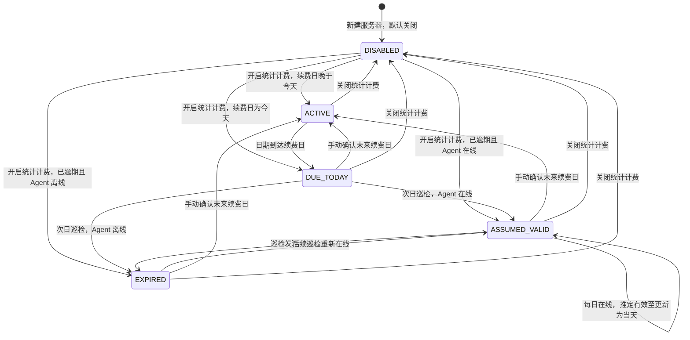

# 后端调度与服务器计费设计

## 公共定时任务器

后端所有重复执行任务统一注册到 `TaskScheduler`。业务模块只提供一次执行函数，不自行创建 ticker 或 goroutine。

| 任务 | 触发方式 | 启动补跑 | 是否开放设置 |
|---|---|---:|---:|
| `user.expiry` | 固定间隔 1 分钟 | 是 | 否 |
| `metrics.retention` | 固定间隔 1 小时 | 是 | 否 |
| `release.agent` | 间隔或日历计划 | 是 | 是 |
| `release.xray` | 间隔或日历计划 | 是 | 是 |
| `billing.lifecycle` | 每日指定时间，默认 00:05 | 是 | 是 |
| `exchange_rates.refresh` | 每日指定时间，默认 02:30 | 是 | 是 |
| `external_subscriptions.sync` | 固定间隔 15 分钟 | 否 | 每订阅配置 |

`external_subscriptions.sync` 扫描所有到达各自更新间隔的外部订阅并同步（间隔每订阅
可配，最小 1 小时、默认 24 小时，详见[框架设计 §9.1](framework-design.md)）；启动时
不补跑，新建订阅在创建时即时同步一次。

调度器按面板时区计算日历计划。每项任务独立超时、禁止自身重叠；失败不阻止其他任务。设置变更通过 `NotifyChanged` 唤醒调度循环并重新计算执行时间。固定间隔任务从上次完成时间继续计算，避免慢任务堆积。

## 计费资料

服务器原价以 `amount_minor + currency` 保存，不使用 `120USD/y` 等组合文本。周期以 `interval_count + interval_unit` 保存，单位为 `day/month/year`。币种使用 ISO 4217 三字码。

`billing_enabled` 关闭时保留资料，但服务器不参与费用汇总、续费巡检或计费状态展示。服务商为独立实体，名称大小写不敏感唯一，可保存官网地址。

流量计划独立于费用计费。所有服务器均累计默认网卡收发增量，额度默认无限。有限额度使用十进制单位：`1 GB = 10^9 bytes`，`1 TB = 1000 GB`。计流方式支持仅出站、双向合计、取收发较大值。卡片使用从左向右填充的离散分段条：使用率低于 60% 为绿色，达到 60% 且低于 80% 为黄色，达到 80% 为红色；周期数据不完整时使用中性色且不发出阈值预警。

## 生命周期状态机

续费日当天无论 Agent 是否在线均为 `DUE_TODAY`。逾期后在线只表示 `ASSUMED_VALID`，不是财务确认；离线为 `EXPIRED`，重新上线可恢复推定有效。转为已过期时保留最后的 `assumed_valid_through`。手动续费必须提交晚于今天的新续费日，且由 `validBillingTransition` 按上图校验前置状态（due_today/assumed_valid/expired → active；active → active 仅改期；disabled 必须先重新开启统计计费）。

## 汇率

Frankfurter 是默认公开汇率源，成功结果按汇率日期持久化。刷新失败继续使用最近缓存，不阻止服务器新增或编辑。服务器详情同时显示原价、统计币种折算价、汇率来源和日期。

自定义汇率以 `[金额][源币种] : [金额][目标币种]` 保存，其中至少一侧金额必须等于 1。目标币种由保存时的面板展示币种确定，不由用户另外选择；每个源币种只保存一条记录，每个目标币种最多启用一个锚点。

仅 `enabled = 1` 且目标币种等于当前展示币种的记录参与自定义计算。切换展示币种不会删除或改写旧记录：例如 `1 USD : 7 CNY` 在展示币种改为 EUR 后保留但不应用，切回 CNY 后自动恢复应用。

费用响应同时提供公共汇率结果 `public_converted` 和可选的自定义结果 `custom_converted`。以 `1 USD : 7 CNY` 为锚点时，USD 直接按自定义汇率换算；CAD、EUR、JPY 等先按 Frankfurter 缓存换成 USD，再按自定义汇率换成 CNY；原价为 CNY 的费用保持不变。以 `1 EUR : 10 CNY` 为锚点时，同理先将其他外币换成 EUR。详情界面将两种结果放在独立的整行区域，避免压缩服务器信息网格。

## 成本统计 API

成本统计页的两个口径对应两个只读端点，query 一致
（`from`/`to`/`granularity`/`rate_mode`）：

- `GET /api/billing/stats`（已生效成本）：按周期摊算**已生效期间**的成本——开通日至
  服务截止（含推定有效宽限），公共汇率与自定义锚点双口径字段并列返回
  （`actual_costs_public` / `actual_costs_custom` / `actual_totals_*`）。
- `GET /api/billing/stats/estimated`（计算成本）：对启用统计计费且未过期的服务器按
  日成本 × 周期天数（日 1 / 月 30 / 年 365）估算每周期成本；日成本按计费周期推导
  （年付 = 年付价 ÷ 12 ÷ 30、月付 = 月付价 ÷ 30、季付 = 季付价 ÷ 3 ÷ 30），响应含
  `monthly_minor` / `annual_minor`（及 custom 变体）精确折算值。

完整 DTO 契约以 [OpenAPI](openapi.yaml) 的 `BillingActualStats` /
`BillingEstimatedStats` schema 为准（`panel/contract_test.go` 强制两者一致）。
