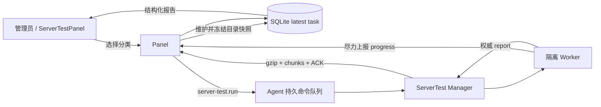

# 服务器测试设计与实现契约

> 状态：已实现（v0.0.9）。本文记录服务器测试功能的需求结论、运行语义、
> 数据源边界和当前实现，后续修改协议、目录或探测动作时必须同步更新本文。

## 1. 目标与非目标

管理员在服务器详情页选择测试分类并下发一个原子任务，由该服务器的 Agent 独立完成测试。
Panel 只负责目录维护、任务下发、进度展示、最终结果接收和报告渲染，不参与测试过程。
每台服务器仅保留最近一次任务，用于表达最近的网络状态，不保存历史报告。

TCP/回程/大包/测速动作参考 [TcpQuality](https://github.com/ibsgss/TcpQuality) 与
[NodeQuality](https://github.com/LloydAsp/NodeQuality) 的原理实现为项目内 Go 函数。
IP 质量检测执行上游 [xykt/IPQuality](https://github.com/xykt/IPQuality) 脚本
（`bash ip.sh -p -j -f`），Agent 缓存脚本并按版本校验更新。范围明确如下：

- 测试网络性能、IP 质量、连通性和回程；不测试 CPU、内存、磁盘等硬件性能；
- IP 质量脚本以 `-p` 隐私模式运行，禁止生成在线报告链接、禁止上传报告；
- 脚本会执行 25 端口邮件连通性检测与 400+ DNSBL 黑名单查询；
- 不调用 `tcpquality.ibsgss.uk` 等上游辅助代理；
- 允许直接请求被测节点，以及 Cloudflare、Apple、IP 数据库、流媒体等公开服务；
- 测试产生的数据只回传当前 Lattix Panel，由 Panel 解析并渲染。

“不影响实机”在这里指测试结束后不留下配置、进程或临时文件，不承诺测试期间零资源消耗。
测速和大量网络探测会占用带宽、连接、CPU 与运营商配额。

## 2. 组件职责

**Panel**：维护动态 CDN 目录和内置静态目录；在下发时冻结选中分类所需的目标、目录版本与
SHA-256；每台服务器只允许一个非终态任务；按 generation 接收最终结果并替换上一代结果。

**Agent**：只接受 Panel 下发的完整目标快照，不抓取 Zstatic 目录；将整个任务持久化后启动
独立 worker；Panel/WebSocket 离线不终止测试；完成后等待 Panel 可用并确认全部结果分片。

**Frontend**：服务器详情页最后显示“服务器测试”。无结果时显示运行入口，有结果后替换为
报告按钮；任务运行中显示分类与目标进度，并明确“进度为尽力上报，最终报告为权威结果”。

## 3. 测试分类

一个任务至少选择一类，最多选择以下全部十类。分类按固定顺序串行，分类内部可并行目标。

| 分类 | 动作与结果 |
| --- | --- |
| `ip_quality` | 分别检测 IPv4/IPv6；Cloudflare trace 获取出口身份，Team Cymru ASN，公开 IP 数据库、DNSBL、流媒体与 AI 服务可用性 |
| `tcp_ipv4` | 31 个省级三网 IPv4 目标，SYN 延迟、收包数与丢包；主目标失败切换城市备用目标 |
| `tcp_ipv6` | 31 个省级三网 IPv6 目标，口径同 IPv4 |
| `large_packet_ipv4` | 大 SYN 回程可达性；先做 Cloudflare 环境预检，再对三网目标发送 23 个大包与 7 个小包 |
| `cernet_ipv4` | 31 个公开高校 IPv4 目标的 TCP 延迟与丢包 |
| `cernet2_ipv6` | 同一批教育网目标的 IPv6/CERNET2 连通性 |
| `international` | 44 个国际站点/CDN 的 TCP 延迟与丢包，已排除 NodeSeek |
| `return_route_ipv4` | 对省级三网 IPv4 目标执行 UDP error-queue traceroute，最多 30 跳，每跳 3 包；连续 5 跳无响应提前终止；每目标独立 120s 预算，类别总预算 20 分钟 |
| `return_route_ipv6` | IPv6 回程，口径同 IPv4 |
| `speed` | Apple CDN IPv4/IPv6 单线程下载与上传；没有公开授权方式的火山引擎 TOS 目标明确显示不可用 |

普通 TCP 目标发送 30 次探测，国际目标发送 15 次，目标并发上限 16，单目标窗口 30 秒。
有 `CAP_NET_RAW`（通常为 root）时使用原始 SYN，权限不足时自动降级为 TCP connect，并在
环境与单目标结果中标记降级原因。零响应不是成功，使用 `probe_no_response` 回报。

大包测试必须具备 raw socket；Cloudflare 1200-byte SYN 预检 20 次，收包不超过 4 次时以
`large_syn_environment_filtered` 停止该分类，避免把系统或运营商过滤误判为目标质量。

测速单方向窗口 15 秒；单个 Apple 目标下载最多 768 MiB、上传最多 2 GiB，IPv4/IPv6 全部
跑满时理论上限约 5.5 GiB。UI 在勾选测速时必须显示流量警告。

## 4. IP 质量检测（脚本化）

IP 质量检测执行上游 xykt/IPQuality 脚本 `ip.sh`，固定参数 `-p -j -f`：

- `-p` 隐私模式：不生成在线报告链接，不上传 `upload.check.place`；
- `-j` 输出 JSON 到 stdout（双栈时依次输出 IPv4、IPv6 两个文档）；
- `-f` 展示完整出口 IP（Lattix 报告按用户要求展示完整 IP）。

脚本来源 `https://raw.githubusercontent.com/xykt/IPQuality/main/ip.sh`，由 Agent 缓存在
数据目录 `scripts/ip.sh`。每次测试前拉取最新脚本并与缓存比对 `script_version`，相同则复用
缓存，不同则原子替换；拉取失败回退缓存并在报告中标记 `script_stale`。

脚本依赖 `jq curl bc netcat dnsutils iproute2`。Agent 在测试前用 `exec.LookPath` 检测，
缺失时运行脚本自身的 `-y` 自动安装轮次（120 秒窗口，轮询依赖就绪后立即终止进程组），
安装失败或超时如实报错。

执行超时 15 分钟，超时后终止整个脚本进程组。脚本输出经流式 JSON 解码拆解为每个地址家族
一份文档，在 Agent 侧（`src/agent/internal/servertest/ipquality/`）解析并映射为 Lattix 强
类型结构 `shared.IPQualityResult`，字段覆盖脚本输出的全部内容：Head（IP/版本/时间）、
Info（ASN/组织/城市/地区/注册地/时区/IP 类型）、Type（用途与公司类型 per 数据库）、
Score（各库评分，保留原始字符串）、Factor（国家代码与代理/Tor/VPN/机房/滥用/爬虫因子
per 数据库）、Media（流媒体与 AI 解锁状态/地区/类型）、Mail（25 端口与邮局连通性、
DNSBL 汇总）。脚本的字面 `"null"` 字符串规范化为空值；未知服务或新增字段不丢失，每个
家族同时携带规范化后的原始 JSON 副本（`raw`）。

单栈主机只输出一个家族文档，缺失家族在报告中不出现；无任何公网地址时分类状态为
`unavailable`（错误码 `no_public_address`）。最终报告经 `server-test.result` 分片协议回传
Panel，由前端报告表渲染（基础信息、风险评分、因子矩阵、流媒体徽章、邮局检测与 DNSBL）。

## 5. 节点目录

### 5.1 动态 Zstatic 目录

Panel 固定请求：

`https://lf3-ips.zstaticcdn.com/nodes_data.js`

Panel 解析 `provinceBaseData`、`cityKeyList` 和 `extraCityNodeMeta`，生成可读字段
`telecom`、`unicom`、`mobile` 及 `ipv4`、`ipv6`、`dualstack`。省级目标显示如“广东电信”，
城市备用目标显示如“广东深圳电信”。Agent 只收到已经解析、校验并带 hash 的快照。

- 不调用 `tcpquality.ibsgss.uk/getNodes`；
- 不做 DNS 健康巡检或预解析，实际健康由 Agent 的连接预检决定；
- 抓取任务不在 Panel startup 阶段运行，默认每 6 小时调度一次；
- 管理员可以在 UI 手工刷新；首次有效缓存完成前不允许下发任何服务器测试；
- 缓存不过期；后续抓取或解析失败保留最后一份有效缓存，同时展示最后错误；
- 请求失败、解析失败与无有效缓存使用不同错误信息；
- 固定目录客户端使用系统 CA 并补入公开的 DigiCert Global Root G2，仍严格校验证书链、
  有效期和主机名，不使用 `InsecureSkipVerify`。

### 5.2 随版本维护的静态目录

静态 JSON 位于 `src/backend/internal/testcatalog/`，每份文件包含 `repository`、`commit`、
`path/note` 与版本，便于管理员对照上游变化后手工维护：

- `international_targets.json`：TcpQuality commit
  `a1423e634e81b71ac468150265804f3efdc59a78` 的国际站点/CDN，去除 NodeSeek；
- `education_targets.json`：依据相同上游分类自行维护的 31 个公开高校域名，替代私有 helper；
- `speed_targets.json`：只保留官方服务端点，不带 tosutil、内置凭据、hosts 修改或私有代理。

Panel 对每份静态目录计算 SHA-256，与 Zstatic catalog hash 一起形成任务的
`catalog_version`。目录变化不会改变已下发任务的目标集合。

## 6. 原子任务与持久化

Panel 的状态为：

`queued -> accepted -> running -> succeeded | completed_with_errors | failed`

勾选的 N 个分类属于同一个任务，不拆成 Panel 可单独取消或介入的子任务。每台服务器同时
最多一个非终态任务；再次下发返回冲突。终态后允许创建新 generation，新任务原子替换该
服务器的旧结果。Panel 拒绝旧 generation、错误 task ID，以及对同 generation 终态结果的
覆盖，因此极端重发不会用旧报告覆盖新报告。

任务下发后不提供取消操作，worker 总运行窗口为 60 分钟；超时产生 `task_timeout` 权威失败
结果，而不是由 Panel 根据连接状态推断。管理员需要等待终态后才能下发下一代任务。

Agent 同时也只运行一个服务器测试。接受命令前原子写入：

- `server-test-task.json`：`running | result_pending | completed`、boot ID、完整 payload 和 manifest；
- `server-test-result.json.gz`：待 Panel 确认的压缩结果；
- `server-test-tmp/<task-id>-*`：worker 临时目录，正常或异常退出路径均尽力删除。

Agent/主机在 `running` 阶段重启时，不继续未知进度的旧任务，而是生成权威失败报告：同一
boot ID 为 `agent_restarted`，boot ID 改变为 `host_rebooted`，无法判定时为
`execution_interrupted`。如果重启发生在 `result_pending`，Agent 继续投递已经完成的结果。

## 7. 命令队列与更新

所有 Panel 请求先进入 Agent 的 `command-queue.json` 持久队列。优先级为 Agent 更新 100、
卸载 90、Xray 更新 70、普通命令 50、服务器测试 10；高优先级影响尚未开始命令的选择，
不抢占已经运行的原子任务。

`server-test.run` 处理器在任务被 Agent 接受后立即返回 `ACCEPTED`，但队列的 after barrier
会一直等待任务完成并且最终结果获得 Panel ACK，之后才删除测试命令并执行后续更新。
因此 Panel 更新后紧接着下发的 Agent 版本同步不会丢失，也不会在测试中途重启 Agent。

## 8. 隔离、权限与残留

Linux 首选为 worker 创建 PID、mount、IPC namespace；网络 namespace 刻意共享宿主网络，
否则测到的不是服务器实际出口。若系统、容器或非 root 用户拒绝 namespace，自动降级为独立
进程、私有 `0700` 临时目录和 rlimit 隔离，并在报告写入 `sandbox=degraded` 与具体原因。

Worker 设置 `RLIMIT_NOFILE=1024`、`RLIMIT_NPROC=128`、禁止 core dump、文件大小上限 32 MiB；
Linux 使用 `Pdeathsig=SIGKILL`，父 Agent 消失时 worker 不会成为孤儿。常规测试不安装依赖、不
改 sysctl/hosts/防火墙/Xray 配置，不创建常驻服务；IP 质量测试在脚本依赖缺失时经脚本 `-y`
自动安装所需命令。默认按 root 能力运行；缺少 raw socket 权限时只降级相关动作，不要求管理
员额外部署 root helper。

## 9. 进度与最终结果

进度包含全局 `completed/total`、当前 phase、分类状态与分类内部 `m/n`。TCP、回程、教育网、
国际与测速按目标完成数更新；IP 质量按脚本阶段（下载脚本、检查依赖、运行检测、解析结果）
粗粒度更新。Agent 最多每秒发送
一次进度，Panel 只保留当前连接内序号最大的快照，进度不写历史数据库且允许丢失。

最终报告是唯一权威状态。Agent 将 JSON（最大 8 MiB）gzip，按 256 KiB 分片，通过
`server-test.result` 请求逐片发送；首片携带 manifest（尺寸、分片数、SHA-256、状态和错误）。
Panel 每片返回 `accepted | complete | superseded`，Agent 单片等待 20 秒，连接不可用或未确认时
每 10 秒重试。WebSocket 的 1 MiB 是 Lattix/Gorilla read limit，不是 WebSocket 协议限制；
256 KiB 分片及 JSON/base64 开销保持在该应用限制内。

## 10. UI 与 NAT 机型

完整独立 IP 机型默认勾选 IP 质量、IPv4/IPv6 TCP、IPv4/IPv6 回程和国际连通。NAT 机型
默认只勾选 IP 质量；TCP、大包、教育网、国际、回程或测速均允许管理员主动勾选，但首次勾选
时必须提示可能因系统、端口映射或运营商限制失败，确认后才加入任务。测速另显示流量警告。

运行对话框展示各分类的 best-effort 进度。终态后入口变为“测试结果”按钮，报告对话框按分类
显示目标、运营商、延迟、丢包、探测方法、路由、IP 质量报告（基础信息、风险评分、因子矩阵、
流媒体徽章、邮局检测与 DNSBL）与具体错误，不显示目标 URL、广告、上游项目标题或外部报告链接。

## 11. API、协议与错误口径

管理 API：

- `GET /api/server/get-test?server_id=<id>`：最近一次任务、进度与报告；
- `POST /api/server/run-test`：创建原子任务，要求登录、CSRF 与 idempotency key；
- `GET /api/server-test/catalog-status`：缓存可用性、hash、最后抓取与错误；
- `POST /api/server-test/refresh-catalog`：同步刷新动态目录。

Agent WS 类型为 `server-test.run`、`server-test.progress`、`server-test.result`，共享 schema 位于
`src/shared/server_testing.go`。错误必须同时提供稳定 `error_code` 和可读 `error_message`；权限不足、
目标不可达、无响应、分类不支持、worker 失败、Agent 重启、主机重启、目录不可用和 Panel
拒绝结果必须区分。WebSocket 断开本身不是测试失败原因。

Panel 的 RPC 日志只允许记录 `server_id` 等声明为安全的字段；Agent 记录 task ID、generation、
分类数量、worker/投递错误与降级原因。日志不得写入 provider 原始响应体、DNSBL 反向查询名或
IPregistry 临时 key；IP 质量报告包含完整出口 IP（用户要求展示），Agent 日志仍不记录该 IP。

## 12. 代码地图与维护检查

| 位置 | 所有权 |
| --- | --- |
| `src/shared/server_testing.go` | Panel/Agent 共享协议、状态、manifest 与报告结构 |
| `src/backend/internal/cdncatalog/` | Zstatic 抓取、受限 JS 解析、可读 schema、专用 TLS client |
| `src/backend/internal/testcatalog/` | 国际、教育网、测速静态目录及来源元数据 |
| `src/backend/internal/panel/server_tests.go` | API、目录快照与任务下发 |
| `src/backend/internal/store/server_tests.go` | 每服务器最新任务、generation 与分片原子提交 |
| `src/backend/internal/dispatch/dispatcher.go` | WS 下发、进度去重与结果 ACK |
| `src/agent/cmd/agent/command_queue.go` | 持久命令优先级与执行 barrier |
| `src/agent/internal/servertest/` | worker、journal、探测分类与结果投递 |
| `src/agent/internal/servertest/ipquality/` | ip.sh 缓存与版本校验、依赖处理、执行、JSON 解析映射 |
| `src/frontend/src/components/ServerTestPanel.tsx` | 分类选择、NAT 警告、进度与报告 UI |

修改目录时必须更新来源 commit/note、固定数量断言和 hash 测试；修改协议时必须同步 shared、
Panel、Agent、OpenAPI/前端类型与 current-protocol e2e；修改探测次数、超时、并发或流量上限时
必须同步本文和 UI 警告。验收至少运行 backend/agent/shared 的 `go test -race ./...`、`go vet ./...`
以及 frontend 的 lint、build、test，并实测“无系统 CA 时刷新目录”“Agent 重启失败报告”与
“断线完成后重连投递结果”。
