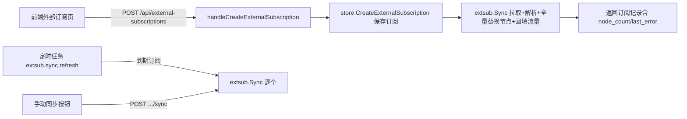

# 外部订阅导入功能设计

日期：2026-08-02

## 背景与问题

面板目前只服务自有服务器创建的链路（chain），订阅内容全部来自受控 Agent 落地出的节点。需求：支持管理员导入**外部订阅**（第三方机场等提供的订阅 URL），解析其中的节点并入库保存，供后续版本关联到用户订阅使用。

参照实现：https://github.com/iluobei/miaomiaowu（Clash 订阅管理工具）的节点/订阅解析导入功能。

本期范围：

- 新增「外部订阅」管理页：列表 + 新增/编辑/删除 + 手动同步 + 节点查看
- 解析外部订阅节点，保存到**外部链路表**（`external_chains`）
- 保存订阅信息（流量等）到**外部订阅表**（`external_subscriptions`）
- 下一版本再将外部链路关联到用户订阅（本期不做关联，不做用户侧暴露）

## 设计决策

- **独立 `extsub` 服务包 + 独立数据表**：不碰现有 `chains`/`nodes`/`shared_endpoints` 及其状态机（外部节点没有受控服务器，与 `nodes.server_id` 强关联语义冲突）。新表由 `Schema` 自动创建，无需迁移，`schemaVersion` 不变。
- **解析范围**：三种格式——① base64 分享链接（vless/vmess/ss/ssr/trojan/hysteria2/tuic/wireguard/anytls/snell/socks/http），② Clash/mihomo YAML（`proxies:` 段），③ v2rayN 自定义格式。协议尽量全解析，存标准化 JSON，后续转用户订阅时按客户端能力过滤。
- **重同步 = 全量替换**：重新拉取解析后，事务内删除该订阅旧节点并插入新节点（去重按 `config_sha256`）。
- **拉取安全**：URL 仅允许 https；拒绝 localhost / 内网 / 保留段 IP 字面量与私有域名（防 SSRF）。跳证书校验开关默认关闭。
- **流量信息**：解析 `subscription-userinfo` 响应头（upload/download/total/expire），浮点值取整，`expire=0` 视为无到期；自定义 UA 未拿到流量头时用 `clash-meta/2.4.0` 重试一次（多数机场只对 clash 系 UA 返回该头）。
- **同步策略**：手动同步 + 定时自动同步（复用 panel scheduler），每订阅可配自动更新开关与间隔（小时，最短 1 小时）。

## 数据模型

### `external_subscriptions`

```sql
CREATE TABLE IF NOT EXISTS external_subscriptions (
    id            INTEGER PRIMARY KEY AUTOINCREMENT,
    name          TEXT NOT NULL,
    url           TEXT NOT NULL UNIQUE,          -- 同 URL 视为同一订阅，重复导入时更新
    user_agent    TEXT NOT NULL DEFAULT '',      -- 空 = clash-meta/2.4.0
    skip_cert_verify INTEGER NOT NULL DEFAULT 0,
    auto_update   INTEGER NOT NULL DEFAULT 1,
    update_interval_hours INTEGER NOT NULL DEFAULT 24, -- 最短 1 小时
    format        TEXT NOT NULL DEFAULT '',      -- 上次识别到的格式：yaml|v2ray|v2rayn
    node_count    INTEGER NOT NULL DEFAULT 0,
    upload        INTEGER NOT NULL DEFAULT 0,    -- subscription-userinfo 流量（字节）
    download      INTEGER NOT NULL DEFAULT 0,
    total         INTEGER NOT NULL DEFAULT 0,
    expire        INTEGER,                       -- Unix 秒，NULL=未提供
    last_sync_at  DATETIME,
    last_attempt_at DATETIME,
    last_error    TEXT NOT NULL DEFAULT '',
    created_at    DATETIME NOT NULL DEFAULT CURRENT_TIMESTAMP,
    updated_at    DATETIME NOT NULL DEFAULT CURRENT_TIMESTAMP
);
```

### `external_chains`（外部链路表）

```sql
CREATE TABLE IF NOT EXISTS external_chains (
    id              INTEGER PRIMARY KEY AUTOINCREMENT,
    subscription_id INTEGER NOT NULL REFERENCES external_subscriptions(id) ON DELETE CASCADE,
    name            TEXT NOT NULL,
    protocol        TEXT NOT NULL,               -- vless|vmess|ss|ssr|trojan|hysteria2|tuic|wireguard|anytls|snell|socks|http
    server          TEXT NOT NULL DEFAULT '',
    port            INTEGER NOT NULL DEFAULT 0,
    config          TEXT NOT NULL,               -- 标准化 JSON（全部协议字段，url-decode 还原）
    config_sha256   TEXT NOT NULL,               -- 去重键
    created_at      DATETIME NOT NULL DEFAULT CURRENT_TIMESTAMP
);
CREATE INDEX IF NOT EXISTS idx_external_chains_subscription
    ON external_chains(subscription_id);
```

## 数据流



- **创建**：先落订阅记录（URL 唯一，重复导入更新记录），再立即执行一次同步；同步失败不删除记录，`last_error` 记录原因，可稍后重试。
- **同步**：拉取（UA/跳证按订阅配置，30s 超时，大小上限 2 MiB）→ 格式识别 → 解析 → 事务全量替换节点 → 回填 `node_count`/`format`/流量/`last_sync_at`。
- **删除订阅**：级联删除其全部外部链路（`ON DELETE CASCADE`）。

## 实施修订（2026-08-02）

- 路由采用现有 RPC 动词风格（前端 requester 无 PUT/DELETE）：`/api/external-subscription/list|create|update|delete|sync|chains`，替代初稿的 REST 式 `/api/external-subscriptions` 与 `PUT/DELETE .../{id}`；chains 路由的 `?id=` 查询参数通过 `AllowedQuery` 白名单放行（`validateRPCQuery` 默认拒绝任意查询参数）。
- `requester` 增加 `GetWithOptions`（返回响应头）与 `GetTextWithOptions`；跳证书校验由 Service 持有的第二套 `ExternalFileRequester`（InsecureSkipVerify Transport）实现，`FileRequestOptions` 仅携带 UserAgent。
- 本仓库未启用 `PRAGMA foreign_keys`，`external_chains` 的 `ON DELETE CASCADE` 不生效；删除订阅时在事务内显式删除关联节点（沿用 `DeleteServerCascade` 先例）。
- 解析器：`ParseSubscription` 先对原文逐行解析、无结果再回退到 base64 解码后解析（Go 的 `base64.DecodeString` 会忽略换行，必须先试原文避免吞掉 v2rayN 无 scheme 条目）；vmess/ssr 的 base64 载荷按 `u.Host + u.Path` 拼接后解码（载荷可能含 `/`）。

## 改动清单

### 1. Requester（`src/shared/requester/external.go`）

新增带选项的拉取方法（向后兼容，现有 `GetText` 调用不变）：

```go
type FileRequestOptions struct {
    UserAgent string
}

func (r ExternalFileRequester) GetWithOptions(ctx context.Context, url string, maxBytes int64, opts FileRequestOptions) (FileFetchResult, error)
func (r ExternalFileRequester) GetTextWithOptions(ctx context.Context, url string, maxBytes int64, opts FileRequestOptions) (string, error)
```

`FileRequestOptions` 仅携带 UserAgent；跳过证书校验由 Service 持有的第二套 `ExternalFileRequester`（InsecureSkipVerify Transport）实现，见「实施修订」。

### 2. Store（`src/backend/internal/store/external_subscriptions.go`）

- `Schema` 增加上述两张表（`store.go`）
- CRUD（沿用 `store/subscriptions.go` 风格：`?` 占位、`ON CONFLICT`、`ErrNotFound`、`scanXxx` 辅助）：
  - `CreateExternalSubscription(ctx, ExternalSubscription) (id, error)`
  - `UpdateExternalSubscription(ctx, ExternalSubscription) error`
  - `DeleteExternalSubscription(ctx, id) error`（事务内删节点）
  - `ListExternalSubscriptions(ctx) ([]ExternalSubscription, error)`
  - `ExternalSubscriptionByID(ctx, id) (ExternalSubscription, error)`
  - `ReplaceExternalChains(ctx, subID, []ExternalChain) (count, error)`（事务：删旧插新，按 `config_sha256` 去重）
  - `ListExternalChains(ctx, subID) ([]ExternalChain, error)`

### 3. 解析层（`src/backend/internal/extsub/parse.go` / `parse_yaml.go` / `parse_v2rayn.go`）

```go
// ParseSubscription 识别并解析订阅内容，返回标准化节点列表与识别出的格式。
func ParseSubscription(body []byte) ([]Node, format string, err error)
```

- `parse.go`：base64 分享链接（支持嵌套 base64；逐行按 scheme 解析；vmess 为 base64(JSON)；ss 为 SIP002）
- `parse_yaml.go`：mihomo YAML `proxies:` → 统一结构
- `parse_v2rayn.go`：v2rayN 自定义格式（行内 base64 JSON 条目）
- 统一结构 `Node{Name, Type, Server, Port, Extra map[string]any}`；解析失败的行跳过，汇总错误
- `config` JSON = 规范化后的完整字段；`config_sha256 = sha256(config JSON)`

### 4. 服务（`src/backend/internal/extsub/service.go`）

```go
type Service struct { st *store.Store; files external.ExternalFileRequester }

func (s *Service) Sync(ctx context.Context, id int64) (store.ExternalSubscription, error)
func (s *Service) SyncDue(ctx context.Context) error // 供定时任务：扫描 auto_update 到期订阅
```

- URL 校验：`validateURL`（https、拒绝私有/保留地址与 localhost）
- 拉取 → `ParseSubscription` → `ReplaceExternalChains` → 回填字段
- `SyncDue` 单订阅失败不影响其他订阅

### 5. Panel 路由（`src/backend/internal/panel/panel.go`）

- `GET /api/external-subscription/list`（read）
- `POST /api/external-subscription/create`（write，创建 + 首次同步）
- `POST /api/external-subscription/update`（write，编辑，不同步）
- `POST /api/external-subscription/delete`（write）
- `POST /api/external-subscription/sync`（write，手动同步）
- `GET /api/external-subscription/chains?id=`（read，节点列表；`id` 经 `AllowedQuery` 白名单放行）

均遵循现有 RPC 模式（`registerRPC`、`writeJSON`/`writeError`、audit）。`main.go` 装配 `extsub.Service`，panel 注册定时任务 `external_subscriptions.sync`（每 15 分钟跑 `SyncDue`）。

### 6. 前端

- `src/frontend/src/pages/ExternalSubscriptions.tsx`：卡片列表（名称/流量/到期/节点数/格式/上次同步/错误角标），新增/编辑弹窗（URL、名称、UA、跳证、自动更新与间隔），每卡片「同步 / 查看节点 / 删除」
- 路由 `/external-subscriptions`（App.tsx）+ Layout 导航项
- `docs/openapi.yaml` 补充路径与 operationId → `npm run build` 的 codegen 校验通过
- `lib/api.ts` 增加方法、`lib/types.ts` 增加响应类型

### 7. 测试

- parser 单测：各协议 fixture 链接、嵌套 base64、mihomo YAML、v2rayN、去重、坏行跳过
- store 单测：CRUD、URL 唯一冲突、全量替换事务（旧节点删除、去重）
- service 单测：拉取失败保留记录、UA/跳证透传、`subscription-userinfo` 解析（含浮点、expire=0）
- panel handler 单测：跟随现有 `server_tests_test.go` 风格（`httptest` + 临时 DB）

## 非目标（下一版本）

- 外部链路 → 用户订阅内容转换（mihomo/singbox/quanx/links 渲染）
- 用户与外部订阅/外部链路的关联、节点筛选/过滤
- 节点测速、流量聚合展示
