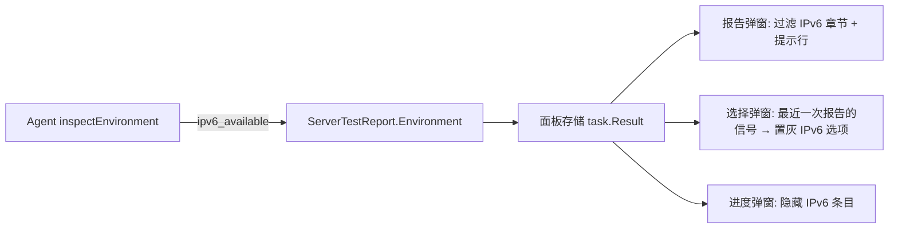

# IPv6 不可用时隐藏相关章节的设计

日期：2026-08-02

## 背景与问题

服务器测试报告弹窗无条件渲染所有勾选的测试类别。当服务器没有 IPv6 地址（或 IPv6 不可达）时，`tcp_ipv6`、`cernet2_ipv6`、`return_route_ipv6` 三个章节会渲染大量失败条目与错误信息（如回程章节的 30 跳 traceroute 冗余输出），报告冗长且无信息量。

需求：当 IPv6 不可用时，报告不显示相关章节，只提示「IPv6 不可用」；选择弹窗与进度弹窗同步处理，减少冗余。

## 判定信号

由 Agent 在任务启动时检测本机是否拥有可用的全局 IPv6 地址：

- 枚举 `net.Interfaces()` 与其地址，要求：IPv6 家族、`IsGlobalUnicast()`、非 link-local、非 ULA（`fc00::/7`，`IsPrivate()` 为真）。
- 结果写入报告 `environment.ipv6_available`（新增 `ServerTestEnvironment.IPv6Available bool json:"ipv6_available"`）。

选择该信号的原因：类别状态 `unavailable` 也可能由"测试目标不可达"引起（例如 IPv4 回程全部失败但 IPv4 本身可用），以类别状态推断会误隐藏可用章节。本机地址检测是确定性最强的信号。

## 数据流



- 报告弹窗使用**当前报告**的 `ipv6_available`。
- 选择/进度弹窗使用该服务器**最近一次已完成报告**的 `ipv6_available`（`GET /api/server-test` 已返回 `result`，零新接口）。
- 从未测过的服务器 → 信号未知（`undefined`）→ 不置灰、不隐藏，保持现状。
- 旧持久化报告无该字段 → 前端以 `=== false` 严格判断 → 不触发隐藏，向后兼容。

## 改动清单

### 1. 共享类型（`src/shared/server_testing.go`）

`ServerTestEnvironment` 增加：

```go
IPv6Available bool `json:"ipv6_available"`
```

### 2. Agent（`src/agent/internal/servertest/`）

- 新增 `ipv6.go`：`hasGlobalIPv6() bool`，实现地址枚举与过滤逻辑；非 Linux 平台也适用（无平台限制）。
- `runner.go` 的 `inspectEnvironment` 中调用并填充 `IPv6Available`。
- 新增 `ipv6_test.go`：覆盖全局 IPv6 命中、仅 link-local / ULA / IPv4 时未命中、无接口时未命中。

### 3. 前端类型（`src/frontend/src/lib/types.ts`）

`ServerTestEnvironment` 增加：

```ts
ipv6_available?: boolean
```

### 4. 前端组件（`src/frontend/src/components/ServerTestPanel.tsx`）

定义常量：

```ts
const ipv6Categories: ServerTestCategory[] = ['tcp_ipv6', 'cernet2_ipv6', 'return_route_ipv6']
```

- **报告弹窗**（`TestReport`）：`report.environment.ipv6_available === false` 时：
  - 渲染时过滤掉 `ipv6Categories` 对应的章节；
  - 章节列表顶部显示一行提示：「IPv6 不可用，IPv6 相关章节已隐藏」。
- **选择弹窗**：
  - `openSelection` 时若信号为不可用，先从 `selected` 中剔除 IPv6 类别；
  - IPv6 选项渲染为禁用样式（置灰），仍可点击勾选 → 复用 `warningOpen` 确认流程，提示「该服务器未检测到 IPv6 地址，相关测试可能全部失败」。
- **进度弹窗**：信号为不可用时，过滤掉 `ipv6Categories` 的行。

## 错误处理与边界

- 信号未知（无历史报告）：一切照旧。
- IPv6 可用但目标不可达：类别正常显示失败内容，不隐藏（符合"不可达≠不可用"的区分）。
- 用户手动勾选 IPv6 测试（无视置灰）：任务正常运行，报告按当前报告信号渲染。

## 测试

- Go：`hasGlobalIPv6` 单测（构造 netip.Addr 列表的逻辑可抽为纯函数便于测试；接口枚举为薄封装）。
- 前端：无既有前端测试框架则手工验证三类弹窗在信号真/假/未知三种情况下的表现。
- 验证命令：`go test ./src/agent/...`，前端构建 `npm run build`（或仓库现有 lint/build 命令）。
