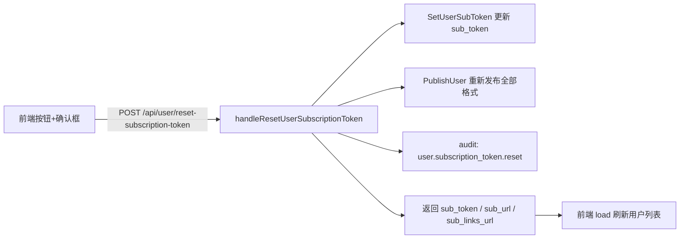

# 重置订阅地址（更换 sub_token）的设计

日期：2026-08-02

## 背景与问题

订阅地址 `{base}/sub/{sub_token}` 的 `sub_token` 目前只能随用户创建生成，无法更换。当链接泄露或需要强制用户重新导入时，管理员没有自助手段。现有「重新生成全部订阅格式」按钮（`POST /api/user/regenerate-subscription`）只重新发布内容（revision 递增），URL 不变。

需求：管理员在前端一键更换某用户的 `sub_token`，生成全新订阅地址；旧链接立即失效，同时重新发布订阅内容使新链接立即可用。

## 设计决策

- **只更换 `sub_token`，不动 UUID**：UUID 用于跨服务器节点鉴权（`add_user`/`remove_user` 扇出，§7），与订阅 URL 鉴权（§8）相互独立。换 token 不触发任何节点扇出，纯面板侧操作。
- **新 token 用 `randomHex(8)`**（16 字符十六进制，64 位熵）：与创建用户时一致；写入前按 `UserBySubToken` 查重，最多重试 5 次（UNIQUE 约束兜底，冲突概率可忽略）。
- **复用现有发布链路**：token 更新后调用 `PublishUser` 立即重新发布全部格式，保证新链接的订阅内容（含 rules URL 中的新 token）立即可用。

## 数据流



## 改动清单

### 1. Store（`src/backend/internal/store/users.go`）

新增：

```go
// SetUserSubToken 更换用户的订阅 token（§8）。
func (s *Store) SetUserSubToken(ctx context.Context, id int64, token string) error
```

`UPDATE users SET sub_token = ? WHERE id = ?`，无行受影响返回 `ErrNotFound`，UNIQUE 冲突向上抛出由调用方重试。

### 2. Panel 处理器（`src/backend/internal/panel/users.go`）

新增 `handleResetUserSubscriptionToken`（`POST /api/user/reset-subscription-token`，body `{"user_id": n}`）：

1. 解析并校验 `user_id`（`<= 0` → 400）；
2. 查用户（`UserByID`，不存在 → 404）；
3. 生成 token：循环 `randomHex(8)` + `UserBySubToken` 查重，最多 5 次；仍冲突 → 500；
4. `SetUserSubToken` 落库；
5. `s.subscriptions.PublishUser(ctx, userID, s.panelBase(r))` 重新发布（沿用 `handleRegenerateUserSubscription` 的模式）；
6. audit `user.subscription_token.reset`（记 `user_id`，不记 token 本身）；
7. 返回 `{"sub_token", "sub_url", "sub_links_url"}`。

`sub_url` / `sub_links_url` 用与 `handleListUsers` 相同的拼装方式（`s.panelBase(r)` + token）。

### 3. 路由（`src/backend/internal/panel/panel.go`）

```go
s.registerRPC(mux, http.MethodPost, "/api/user/reset-subscription-token",
    rpcRouteOptions{Auth: true, CSRF: true, Idempotent: true, SafeBodyFields: []string{"user_id"}},
    s.handleResetUserSubscriptionToken)
```

### 4. OpenAPI（`docs/openapi.yaml` + 重新生成契约）

`/api/user/regenerate-subscription` 条目之后新增 `/api/user/reset-subscription-token`（operationId `userResetSubscriptionToken`，参数同 `userRegenerateSubscription`），随后运行 `bun run generate:api` 刷新 `src/frontend/src/lib/api-contract.generated.ts`。

### 5. 前端 API（`src/frontend/src/lib/api.ts`）

```ts
resetUserSubscriptionToken: (userId: number) =>
  requester.post<{ sub_token: string; sub_url: string; sub_links_url: string }>(
    '/api/user/reset-subscription-token', { user_id: userId }),
```

### 6. 前端页面（`src/frontend/src/pages/Users.tsx`）

- 操作列新增按钮：`KeyRound` 图标，`variant="outline" size="sm"`，title「重置订阅地址（更换链接，旧链接立即失效）」；`resettingToken === u.id` 时禁用并显示 spinner（新增 state `resettingToken: number | null`）。
- 点击先走 `useAppDialog().confirm` 确认流程：「确认重置「{name}」的订阅地址？旧链接将立即失效，需要重新导入新链接。」（destructive）。
- 成功后 `load()` 刷新列表；失败 `setError(errorMessage(err))`。

## 错误处理与边界

- `user_id` 非法 / 服务未就绪 → 400；用户不存在 → 404。
- token 冲突重试耗尽 → 500（概率可忽略，64 位随机）。
- 重置后旧链接立即 404（`UserBySubToken` 查不到旧 token），无需额外清理。
- 不影响节点分配与 UUID；已导入的客户端需重新导入新链接才能继续更新订阅。

## 测试

- Store：`SetUserSubToken` 成功更新、目标用户不存在返回 `ErrNotFound`。
- Panel：`handleResetUserSubscriptionToken` 成功（token 变化、返回新 sub_url 含新 token、发布被触发）、user_id 非法 400、用户不存在 404。
- 前端：无既有前端测试框架，手工验证确认框、成功刷新、失败提示。
- 验证命令：`cd src/backend && go build ./... && go test ./internal/store/ ./internal/panel/`；前端 `cd src/frontend && bun run generate:api && bun run build`（或仓库现有 lint/build 命令）。
