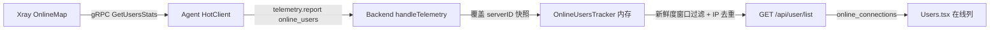

# 用户在线连接数展示的设计

日期：2026-08-04

## 背景与问题

面板目前只跟踪服务器/Agent 的在线状态（WS 连接 + 心跳），用户（`users` 表）没有任何在线概念。管理员无法得知某用户当前是否在线、有多少个在线连接，也无法在用户列表中直观对比活跃用户。

需求：在用户列表每行显示该用户的**在线连接数**（语义对齐 3x-ui：当前活跃连接的源 IP 去重数），跨服务器按 IP 去重聚合。

参考实现：
- **3x-ui**：调 xray `StatsService.GetUsersStats`（一次 RPC 拿全部在线用户 + IP 列表），在线 = xray `OnlineMap` 引用计数 > 0 的用户；显示去重在线 IP 数。
- **Remnawave**：只做"节点在线用户数"（求和）与"最近在线时间"（`online_at` 30s 窗口），不做每用户连接数。本项目按 3x-ui 语义做每用户连接数。

## 设计决策

- **数据源 = xray `GetUsersStats`**：项目锁定的 xray-core（`v1.260327.1`）stats API 原生支持（`app/stats/command/command.go:88`）：只返回有活跃连接（在线 IP 引用计数 > 0）的用户，附 IP 列表与 lastSeen。用户 email = 用户 UUID（与现有 `user.add` 一致，`src/agent/internal/xray/hot.go:123`），可直接映射。
- **依赖 policy `statsUserOnline`**：现有 `ensureStatsPolicy` 已注入 `statsUserUplink/Downlink`（`src/agent/internal/xray/manager.go:382-484`），扩展加 `statsUserOnline: true`；旧配置缺失则走既有"落盘重启"路径。
- **上报链路 = 复用 telemetry 周期推送**：不新增 RPC。`TelemetryPayload` 扩展 `online_users` 字段（每帧该服务器全量快照），随现有 `telemetry.report`（默认 60s，可配置 10-3600s）上报。前端用户列表已 5s 轮询，展示延迟 ≈ 60s，可接受。
- **聚合 = 面板内存 tracker 跨服务器按 IP 去重**：`serverID → user → IP set`，telemetry 帧全量覆盖该服务器快照；新鲜度窗口（2×上报间隔兜底，固定 120s）内无更新的服务器自动过期，离线服务器自然失效，无需跨层挂钩 hub unregister。不落库（纯实时展示）。
- **老 xray 降级**：`GetUsersStats` 返回 Unimplemented（老核心无此 API）时 agent 静默跳过该帧字段，面板显示 0。

## 数据流



## 改动清单

### 1. Shared 协议（`src/shared/messages.go`）

`TelemetryPayload` 新增：

```go
// OnlineUserStat 是某服务器当前在线的一个用户（有活跃连接）及其源 IP 列表（去重）。
type OnlineUserStat struct {
	User string   `json:"user"` // 用户 UUID（xray email）
	IPs  []string `json:"ips"`
}

// TelemetryPayload 新增字段：
OnlineUsers []OnlineUserStat `json:"online_users,omitempty"` // 该服务器在线用户全量快照
```

### 2. Agent

**`src/agent/internal/xray/hot.go`** 新增：

```go
// QueryOnlineUsers 拉取全部在线用户及源 IP（GetUsersStats，一次 RPC 覆盖全部用户）。
// 老 xray 核心无此 API 时返回 Unimplemented 错误（由调用方降级）。
func (c *HotClient) QueryOnlineUsers() ([]shared.OnlineUserStat, error)
```

内部调用 `statscommand.NewStatsServiceClient(conn).GetUsersStats(ctx, &statscommand.GetUsersStatsRequest{})`，将 `resp.Users[*].Email` 与 `Ips[*].Ip` 映射为 `shared.OnlineUserStat`。

**`src/agent/internal/xray/manager.go`**：
- `ensureStatsPolicy` 的 `levels["0"]` 键列表追加 `"statsUserOnline"`（manager.go:463 的 for 循环）。

**`src/agent/cmd/agent/telemetry.go`**：
- 新增 `onlineUsers()`：调 `t.mgr.QueryOnlineUsers()`；错误（含 Unimplemented）时返回 nil 并静默（调试日志即可），`telemetry.collect()` 组装进 payload。

### 3. Backend

**新文件 `src/backend/internal/panel/online_users.go`**（面板侧内存 tracker，`panel.Server` 上持有）：

```go
// OnlineUsersTracker 聚合各服务器上报的在线用户快照（telemetry 帧全量覆盖）。
type OnlineUsersTracker struct {
	mu        sync.Mutex
	servers   map[int64]map[string]map[string]struct{} // serverID → user → IP set
	updatedAt map[int64]time.Time
}

// ApplySnapshot 用某服务器一帧全量快照替换该服务器记录。
func (t *OnlineUsersTracker) ApplySnapshot(serverID int64, users []shared.OnlineUserStat, now time.Time)

// ConnectionsByUser 返回某用户跨服务器去重后的在线连接数；超过 freshness 的服务器记录不计入。
func (t *OnlineUsersTracker) ConnectionsByUser(userUUID string, now time.Time, freshness time.Duration) int
```

- freshness 固定 `2 * 60s`（telemetry 默认间隔的两倍兜底；极端慢配置下显示可能滞后，不引入动态窗口）。
- tracker 挂在 `panel.Server` 结构体，由 `handleTelemetry` 落库逻辑之后调用 `ApplySnapshot`。

**`src/backend/internal/panel/users.go`**：`handleListUsers` 响应每个用户附 `online_connections int`（`ConnectionsByUser(u.UUID, now, freshness)`）。响应 DTO 新增字段。

**`src/backend/internal/panel/panel.go`**：`NewServer` 初始化 tracker（若无则惰性初始化）。

**`src/backend/internal/dispatch/dispatcher.go`**：`handleTelemetry`（dispatcher.go:816）解析 `p.OnlineUsers` 后调用 tracker `ApplySnapshot`（Dispatcher 需能访问面板 tracker——沿用现有 panel 注入模式）。

### 4. Frontend（`src/frontend/src/pages/Users.tsx` + `src/frontend/src/lib/types.ts`）

- `SubUser` 类型新增 `online_connections: number`。
- 用户列表表格新增「在线」列：数字徽标（`text-success` 高亮，>0 时），0 显示 `-`；表头与现有列风格一致。
- 列表已 5s 轮询（Users.tsx:243），无需改刷新逻辑。

### 5. 已知边界

- **共享端点（shared endpoint）**：其 client 身份为 assignment 级、非 UUID，第一版不统计其在线数（后续迭代）。
- **`statsUserOnline` 生效需重启**：policy 缺失时 agent 落盘重启 xray（现有路径）；重启前该字段为空 → 面板显示 0。
- **离线/失联服务器**：超过 freshness 窗口无新帧 → 其贡献的 IP 不再计入，不显示陈旧数据。
- **同一用户同一 IP 出现在多台服务器**：面板按 IP 去重，不重复计数。

## 错误处理与边界

- `GetUsersStats` Unimplemented / 超时 / 连接失败 → agent 静默跳过，面板显示 0；下一帧自动恢复。
- telemetry 帧 JSON 解析失败 → 现有 `handleTelemetry` 已整体丢弃该帧（含在线数据）。
- tracker 无数据（面板刚启动、尚无 telemetry）→ 全部用户 0。
- 用户被删除后残留的在线快照 → 不影响展示（按 UUID 查询，查不到的用户不显示）。

## 测试

- **Agent**：
  - `manager_telemetry_test.go`：断言 `policy.levels["0"].statsUserOnline == true`（扩展现有循环）。
  - `telemetry` 组装测试：`onlineUsers()` 成功/Unimplemented 降级/空列表三种路径。
  - `hot.go` 的 gRPC 调用按现有 fake 模式（如有）或由 telemetry 层测试覆盖。
- **Backend**：
  - `OnlineUsersTracker` 单测：多服务器快照覆盖、跨服务器 IP 去重、freshness 过期（离线服务器不计入）、无数据返回 0。
  - `handleListUsers` 测试：响应含 `online_connections`（0 与 >0 两种）。
  - `handleTelemetry` 测试：`online_users` 帧被应用（沿用现有 dispatcher 测试模式）。
- **Frontend**：无既有前端测试框架，手工验证列渲染（>0 高亮、0 显示 `-`）。
- 验证命令：`cd src/backend && go build ./... && go test ./...`；`cd src/agent && go build ./... && go test ./...`；前端 `cd src/frontend && bun run build`（或仓库现有 lint/build 命令）。
