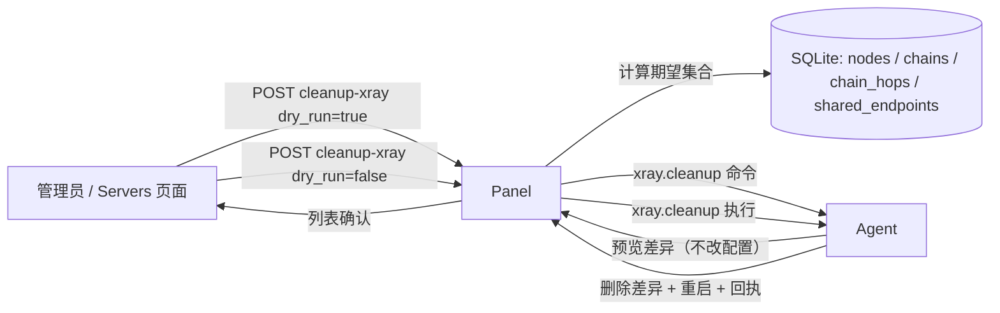

# Xray 缓存清理设计与实现契约

> 状态：设计已确认，待实现。本文记录「清理 xray 缓存」功能的需求结论、运行语义、
> 数据源边界和实现契约，后续修改协议或实现时必须同步更新本文。

## 1. 目标与非目标

为**已成功连接的服务器**提供手动清理 xray 缓存的能力：把 agent 管理的 `config.json`
中**没有被面板有效管理**的配置件删掉，仅保留面板当前仍在管理的 inbound/outbound/
reverse/routing 与 agent 基础设施。

典型场景：面板删链/删节点后清理命令丢失（死信）、服务器离线错过清理、漂移净化时
`node_` 前缀 inbound 被盲目保留等，导致 `config.json` 残留孤立监听（如端口 48834
已无任何直连或中转链路使用）。

范围与边界：

- 仅清理 inbound 监听与链 piece（outbound/reverse/routing 随 piece 一并清理）；
  不触碰 `api` inbound、`direct` outbound 等 agent 基础设施；
- 仅对**在线**服务器可触发（按钮依赖 WebSocket 连接）；
- 手动触发，不做定时自动清理；不涉及订阅、流量、遥测等其他数据；
- 面板是期望状态的权威，agent 是实际状态的唯一知情方：面板计算期望集合，
  agent 计算差异并执行，两者缺一不可；
- 清理以 **inbound tag / piece key** 精确匹配判定，不以端口为键（tag 能覆盖任意残留，
  端口信息仅用于展示与日志）。

## 2. 组件职责



**Panel**：点击时按服务器计算当前期望集合（见 §3），封装为 `xray.cleanup` 命令下发，
同步等待 agent 回执，把差异/结果原样返回前端。命令照常写入 commands 表（操作日志/审计）。

**Agent**：`Manager.CleanupXray` 按期望集合对比自身 `config.json` 与 `state.ChainPieces`
计算差异；dry-run 只报告，执行时走「落盘 → xray -test 校验 → 重启（失败回滚）」流水线，
并同步清理 `chainPieces` 记录（防重启重建/漂移净化时残留复活）。

**Frontend**：服务器页面在线行的「清理 Xray 缓存」两步对话框：先预览将删除列表，
确认后执行并展示结果；无残留时提示并结束。

## 3. 面板期望集合计算

`Store.ExpectedXrayState(serverID)` 返回两部分：期望 inbound tag 集合与期望 piece key
集合。数据源与规则：

### 3.1 直连节点（nodes）

该服务器全部节点（`nodes WHERE server_id = ?`，节点硬删除，不存在软删残留）：

- inbound tag：`node_<nodeID>`（`shared.NodeTag`）

pending/applying/active/failed 全部计入：面板仍管理这些节点（重试/订阅依赖），
清理不得破坏。

### 3.2 中转链跳（chain_hops）

该服务器**关联的全部链路**（`chain_hops JOIN chains ON chains.deleted_at IS NULL
WHERE chain_hops.server_id = ?`）中的**全部跳**（入口、内部、出口），按跳推导 piece：

| 跳条件 | 期望 piece key | 期望 inbound tag |
| --- | --- | --- |
| `role != 'exit'`（入口/内部跳，转发件） | `forward/<hopID>` | `chainfwd_<hopID>` |
| `tunnel_uuid != ''`（反向链上游机，portal 侧） | 额外 `portal/<hopID>` | 额外 `chainportal_<hopID>` |
| tunnel 跳的**下一跳**（同链 seq+1，下游机） | 额外 `bridge/<nextHopID>` | —（bridge 无 inbound，仅 outbound/reverse/routing） |

说明：

- 出口跳自身无监听件：其业务节点 inbound 由 §3.1 的 nodes 覆盖（链出口服务节点在
  nodes 表且 server_id = 出口服务器）；
- DirectShared（单跳共享端点即出口）链：唯一跳是出口跳，无 forward/piece，
  监听由 §3.3 共享端点覆盖；
- 已删除链（`deleted_at` 非空）的 hops 已被 `DeleteChain`/`InvalidateChainForServerDeletion`
  从 DB 删除，天然排除；部署中/失败链的 hops 仍在 DB → 计入期望，不会误删；
- `bridge/<hopID>` 的归属服务器是 tunnel 跳的下一跳所在服务器（bridge piece 落在
  下游机），与 `materializeRevision` 语义一致。

### 3.3 共享端点（shared_endpoints）

该服务器**被未删除链引用**的共享端点（`shared_endpoints WHERE server_id = ? AND id IN
(SELECT endpoint_id FROM chains WHERE deleted_at IS NULL)`；`chains.endpoint_id` 为链的
唯一引用，链删除时端点记录不删——流量/审计仍引用）：

- inbound tag：`shared_endpoint_<endpointID>`
- piece key：`shared-endpoint/<endpointID>`

链删除（`DeleteChain`）后端点记录残留但失去存活链引用，不再属于面板有效管理范围，
期望集合将其排除，`xray.cleanup` 会把对应 inbound/路由配置件从 `config.json` 清理；
端点复用时（新链引用同一端点）重新计入期望。

## 4. 消息协议

`src/shared/messages.go` 新增：

```go
// CleanupXrayPayload 是 xray.cleanup 的载荷：面板下发的期望状态快照。
// DryRun=true 时 agent 只报告差异，不改动配置。
type CleanupXrayPayload struct {
    DryRun              bool     `json:"dry_run"`
    ExpectedInboundTags []string `json:"expected_inbound_tags"` // node_/chainfwd_/chainportal_/shared_endpoint_
    ExpectedPieces      []string `json:"expected_pieces"`       // "forward/7"、"portal/9"、"bridge/3"、"shared-endpoint/5"
}

// CleanupInbound 是一条将被/已删除的 inbound 摘要（port 供展示与日志）。
type CleanupInbound struct {
    Tag  string `json:"tag"`
    Port int    `json:"port"`
}

// CleanupXrayResult 是 xray.cleanup 的回执数据。
type CleanupXrayResult struct {
    RemovedInbounds []CleanupInbound `json:"removed_inbounds"`
    RemovedPieces   []string         `json:"removed_pieces"`
}
```

命令类型：`TypeCleanupXray = "xray.cleanup"`。

回执复用 `ApplyResultPayload`，新增字段：

```go
type ApplyResultPayload struct {
    // ...现有字段...
    Cleanup *CleanupXrayResult `json:"cleanup,omitempty"`
}
```

## 5. Agent 清理逻辑

`src/agent/internal/xray/cleanup.go` 新增 `Manager.CleanupXray`：

1. 持 `m.mu`，`loadConfig()`；
2. 遍历 `inbounds`：tag 不在期望集（且不是 `api`）→ 记入 `RemovedInbounds`（tag+port），
   从候选配置移除。`node_`/`chainfwd_`/`chainportal_`/`shared_endpoint_` 前缀之外的
   未知 inbound 同样移除（agent 独占管理 config.json，不存在合法非受管 inbound）；
3. 遍历 `m.chainPieces` 记录：piece key（`<Kind>/<HopID>`，Kind 为
   portal/bridge/forward/shared-endpoint）不在期望 piece 集 →
   `removeChainPieceItems(hopID, kind)`（连同 outbound/reverse/routing 一并移除）
   并删除该记录；
4. `DryRun`：仅返回差异，不动配置、不落盘；
5. 执行：`commitConfig`（xray -test 校验 + 原子落盘）→ `restartApply`（失败恢复上一份
   并再次重启，§6 步骤 7-8）；
6. 差异为空 → 幂等返回空结果，不重启。

`chainPieces` 记录同步清理是必要项：否则 agent 重启重建 config.json（§17 净化路径、
§21.1 重建路径）会经 `mergePieces` 把已删除的 piece 复活。

## 6. 面板 API 与回执流转

`POST /api/servers/{id}/cleanup-xray`，body `{"dry_run": bool}`：

1. 校验服务器存在且在线（`req.IsOnline`，离线返回 409「服务器未连接」）；
2. `ExpectedXrayState(serverID)` 计算期望集合 → `d.Enqueue`（commands 表照常落库，
   保留操作日志）；
3. **同步等待回执**：仿 `UninstallWithRetry` 的投递-轮询模式，但回执数据（差异/结果）
   经 dispatcher 进程内 waiter map（requestID → chan）投递给等待者：
   - `handleCommandResponse` 对 `TypeCleanupXray`：成功时把 `p.Cleanup` 投递给 waiter，
     命令按现有流程 MarkCommandAcked；失败时投递错误；
   - HTTP handler 带超时（如 45s，与 uninstall 一致）；
4. 返回 `CleanupXrayResult`（或错误信息）。

## 7. 前端交互

Servers.tsx 服务器行（在线）操作入口「清理 Xray 缓存」，两步对话框：

1. 点击 → 请求 `dry_run=true` → 展示将删除列表（`tag @ port`、piece key）；
   空结果 → 提示「无残留」并结束；
2. 确认 → 请求 `dry_run=false` → 展示实际删除结果。

## 8. 测试

**agent（xray/cleanup_test.go）**：

- 期望集外的 node/chainfwd/chainportal/shared_endpoint inbound 被删除，期望内保留；
- `api` inbound 永不删除；未知 tag 的 inbound 被删除；
- 残留 bridge piece（outbound/reverse/rules）被完整清理；
- `chainPieces` 记录随清理同步移除；重启重建不复活；
- dry-run 不改配置、不落盘、不重启；
- 差异为空时 no-op；重启失败回滚上一份配置；
- 空期望集合 → 清空全部受管 inbound（仅剩 api）。

**store**：`ExpectedXrayState` 计算：节点、入口/内部/出口跳、tunnel 跳的
portal/bridge 归属、共享端点、已删链排除。

**dispatch/panel**：清理命令回执流转（成功/失败）、离线服务器 409、期望集合组装。
